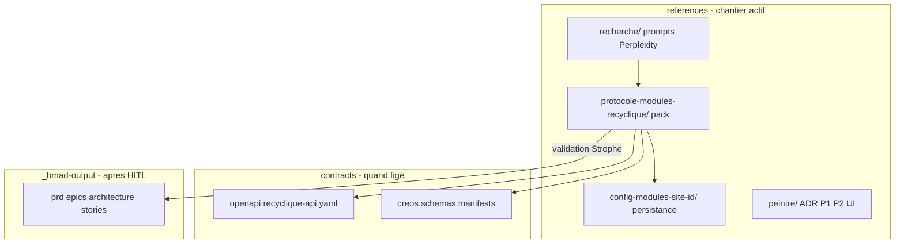

# Chantier Recyclique — Phase 0 architecte externe, puis protocole modules

## Phase 0 (prioritaire) — Dossier pour architecte senior externe

**Audience :** architecte **sans connaissance** de Recyclique.  
**But :** pack MD **condensé, hyper technique**, autonome pour études de choix (dont modularité plus tard).  
**Hors scope Phase 0 :** protocole détaillé des modules optionnels (mention légère seulement ; chantier [`references/protocole-modules-recyclique/`](references/protocole-modules-recyclique/) **après** cette passe).

### Où vivre le livrable

| Élément | Emplacement |
|---------|-------------|
| **Pack architecte** | [`references/dossier-architecte-externe-v2/`](references/dossier-architecte-externe-v2/) (nouveau) |
| **Sources à lire** | `_bmad-output/planning-artifacts/`, `references/vision-projet/`, `references/migration-paheko/`, `contracts/`, `peintre-nano/docs/`, `recyclique/`, `references/ou-on-en-est.md` |
| **Pas ici** | `doc/` (public), `_bmad-output/` (norme sprint — **sources**, pas destination du pack) |

### Adaptation du skill `bmad-document-project`

Le workflow BMAD standard ([`.cursor/skills/bmad-document-project/`](.cursor/skills/bmad-document-project/)) vise un scan brownfield générique + `project-scan-report.json` sous `{project_knowledge}` (= [`references/`](references/)).

**Adaptations obligatoires pour les workers :**

1. **Mode forcé** : `deep_dive` ciblé (pas `initial_scan` complet du repo) — pas de questions interactives type « resume / cancel » ; l’orchestrateur parent fournit le brief.
2. **Sortie** : écrire **uniquement** dans `references/dossier-architecte-externe-v2/<fichier>.md` (pas écraser `references/index.md` ni générer `project-scan-report.json` à la racine de `references/`).
3. **Style** : français, **dense** (listes, tableaux, diagrammes mermaid autorisés), termes définis à la première occurrence (Recyclique, Paheko, Peintre_nano, CREOS, ressourcerie).
4. **Pas de scan CSV 12 types** : ignorer la détection `documentation-requirements.csv` ; lire les **artefacts produit** listés dans le brief.
5. **Concision** : cible **~3–8 pages équivalent** par fichier worker ; renvois vers chemins sources, pas de copier-coller PRD entier.

### Structure cible du pack (fichiers MD)

| Fichier | Contenu |
|---------|---------|
| `index.md` | Porte d’entrée, ordre de lecture, glossaire minimal, date |
| `01-ARCH-contexte-metier-et-vision-v2.md` | Ressourcerie, pivot brownfield 1.4.4, décision directrice, périmètre v2 |
| `02-ARCH-architecture-globale-et-frontieres.md` | 4 domaines (Recyclique / Paheko / Peintre / CREOS), Pistes A/B, convergences |
| `03-ARCH-backend-recyclique-api-donnees.md` | Stack API, multisite, authz, modèle données, legacy vs v2 |
| `04-ARCH-integration-paheko-compta-sync.md` | Rôle Paheko, API-first, outbox/async, chaîne compta, limites plugins cloud |
| `05-ARCH-frontend-peintre-creos-contrats.md` | Peintre_nano runtime, manifests, `contracts/`, séparation métier/UI |
| `06-ARCH-etat-implementation-et-backlog.md` | Epics/stories (synthèse), ce qui est livré vs backlog, hypothèses post-v2 |
| `07-ARCH-todos-et-questions-architecte.md` | TODO ouverts, tensions connues, **questions pour l’architecte** (dont modularité en amont) |

### Orchestration workers (bloquant, pas background)

**5 workers** en parallèle via `Task` (`subagent_type: generalPurpose` ou `explore`), chacun avec brief = skill `bmad-document-project` adapté + **un fichier cible** + liste de sources.

| Worker | Fichier produit | Sources prioritaires |
|--------|-----------------|----------------------|
| W1 | `01-ARCH-contexte-metier-et-vision-v2.md` | `references/vision-projet/2026-03-31_decision-directrice-v2.md`, product-brief, `ou-on-en-est.md` |
| W2 | `02-ARCH-architecture-globale-et-frontieres.md` | `prd.md` § architecture, `architecture/index.md`, `project-structure-boundaries.md`, `core-architectural-decisions.md` |
| W3 | `03-ARCH-backend-recyclique-api-donnees.md` | `recyclique/`, `contracts/openapi/`, epics 1–2, `references/migration-paheko/` (partie API) |
| W4 | `04-ARCH-integration-paheko-compta-sync.md` | `migration-paheko/`, ADR outbox/async, `cash-accounting-paheko-canonical-chain.md`, PRD caisse-compta |
| W5 | `05-ARCH-frontend-peintre-creos-contrats.md` + extrait modularité **light** | `peintre-nano/docs/`, `contracts/creos/`, `references/peintre/`, PRD §4.2 (résumé 1 §) |

**Étape parent bloquante après W1–W5 :** rédiger `index.md`, `06-ARCH-etat-implementation-et-backlog.md`, `07-ARCH-todos-et-questions-architecte.md` (fusion sprint-status + hypothèses post-v2 + lacunes cartographie modules **sans** protocole).

**Exécution :** `run_in_background: false` sur tous les `Task` ; modèle par défaut (équivalent « auto »).

### Critères de succès Phase 0

L’architecte externe peut lire **`index.md` → 01 → 02 → 03/04/05 → 06 → 07** en une session et comprendre la plateforme v2 **sans ouvrir le dépôt**, puis formuler des recommandations (y compris sur le futur protocole modules).

---

## Phase 1+ — Chantier protocole modules (après Phase 0)

## Réponse directe : où faire vivre quoi ? (chantier modules)

Le dépôt distingue déjà trois couches ; le chantier doit les **respecter** et éviter de mélanger trop tôt BMAD et brouillons.

| Couche | Emplacement | Rôle pour ce chantier |
|--------|-------------|------------------------|
| **Exploration / choix / brouillons** | [`references/`](references/) | **Cœur du chantier** — recherche IA, matrices, ADR brouillon, cookbook agent |
| **Norme produit exécutable** | [`_bmad-output/planning-artifacts/`](_bmad-output/planning-artifacts/) | **Après validation HITL** — PRD, epics, ADR archi, stories (ton choix : `refs_first`) |
| **Contrats reviewables** | [`contracts/`](contracts/) | OpenAPI + schémas/manifests CREOS **une fois** le protocole figé |
| **Doc opérationnelle dev front** | [`peintre-nano/docs/`](peintre-nano/docs/) | Guide runtime Peintre (complément, pas source de vérité produit) |
| **Communication externe** | [`doc/`](doc/) | **Hors scope** — pas de matière technique modulaire ici |

**Précédent à imiter** : le pack [`references/operations-speciales-recyclique/`](references/operations-speciales-recyclique/) (PRD chantier + prompt agent + index) et le pack [`references/config-modules-site-id/`](references/config-modules-site-id/) (ADR + livrable normatif + OpenAPI brouillon).

**Proposition** : créer un dossier dédié (nom suggéré) **`references/protocole-modules-recyclique/`** — pas étendre seulement `config-modules-site-id/` (qui couvre la **persistance**), ni noyer le sujet dans `artefacts/` éparpillés.

---

## Oui — des recherches et des choix existent déjà (mais deux récits)

Il ne faut **pas** repartir de zéro ; le chantier doit **réconcilier** et **unifier**, pas redécouvrir Pluggy vs CREOS.

### Choix v0.1 (fév. 2026) — encore cités dans [`ou-on-en-est.md`](references/ou-on-en-est.md)

Source : [`references/artefacts/2026-02-24_07_design-systeme-modules.md`](references/artefacts/2026-02-24_07_design-systeme-modules.md)

- Manifeste **TOML** (`module.toml`), **`ModuleBase`**, **EventBus Redis Streams**, slots React, activation **`config.toml` `[modules] enabled`**
- Recherches : [`references/recherche/2026-02-24_frameworks-modules-python_perplexity_*`](references/recherche/), hooks Pluggy/Blinker, catalogue plugins Paheko

### Choix v2 (mars–avr. 2026) — fil conducteur actuel BMAD + impl

- **Séparation** : Recyclique = commanditaire (OpenAPI, métier, BDD) / Peintre_nano = moteur UI / **CREOS** = grammaire manifests ([`references/vision-projet/2026-03-31_decision-directrice-v2.md`](references/vision-projet/2026-03-31_decision-directrice-v2.md))
- **Modularité = chaîne complète** (7 briques PRD §4.2), pas un écran isolé
- **Preuve verticale** : Epic 4 bandeau live (stories `4-1` … `4-6b`)
- **Activation** : slice `bandeau_live_slice_enabled` aujourd’hui ; généralisation **Story 9.6** (backlog)
- **Persistance transverse** : [`references/config-modules-site-id/ADR-001-…`](references/config-modules-site-id/ADR-001-configuration-modules-json-par-site.md) — JSON **`site_id` + `module_key`**, distinct des manifests CREOS
- **UI** : recherche [`2026-03-31_brique-nano-peintre-modularite-json-ui_perplexity_reponse.md`](references/recherche/2026-03-31_brique-nano-peintre-modularite-json-ui_perplexity_reponse.md) ; ADR P1/P2 dans [`references/peintre/`](references/peintre/)
- **Post-v2 exclu du chantier immédiat** : [`post-v2-hypothesis-marketplace-modules.md`](_bmad-output/planning-artifacts/architecture/post-v2-hypothesis-marketplace-modules.md)

### Lacune que le chantier doit combler

- **Pas d’ADR de réconciliation** v0.1 ↔ v2 (TOML/ModuleBase vs CREOS/build-time + JSON serveur)
- **Pas de cookbook** « créer + brancher un module optionnel »
- **Pas de registre `module_key`** commun (hors pilote `kpi-live-banner`)
- **Taxonomie floue** : « module » = domaine Peintre, slice CREOS, package backend, ou module métier activable ?

---

## Objectif du chantier (périmètre)

Fixer un **protocole unique** documenté pour agents et devs, en quatre volets :

1. **Backend** — points d’entrée API, modèle BDD (tables dédiées vs JSON générique), enregistrement routes/services, sync Paheko, events
2. **Front** — manifests CREOS, registre widgets, **insertion dans un workflow** (ex. étape dans flow fermeture caisse), activation/désactivation
3. **Contrats** — OpenAPI, schémas JSON par `module_key`, templates manifest ; lien `data_contract.operation_id`
4. **Gouvernance** — registre des `module_key`, matrice dépendances, critères « module optionnel » vs « module obligatoire v2 »

**Exemple fil rouge** (ton cas pièces/billets) : servir de **module pilote #2** après bandeau live — flow `clôture caisse` → étape comptage → persistance Recyclique → envoi Paheko — sans implémenter tout de suite.

---

## Convention de nommage (2026-05-20)

Fichiers numérotés : `NN-CODE-slug.md`

| Code | Dossier |
|------|---------|
| **ARCH** | `references/dossier-architecte-externe-v2/` — plateforme v2 |
| **MOD** | `references/protocole-modules-recyclique/` — protocole modules |

Ex. `03-ARCH-backend-…` vs `03-MOD-protocole-backend.md`.

---

## Structure proposée du pack `references/protocole-modules-recyclique/`

| Fichier (à créer progressivement) | Rôle |
|-----------------------------------|------|
| `index.md` | Porte d’entrée agents (abstract + ordre de lecture) |
| `00-MOD-cadrage-chantier.md` | Objectifs, hors-scope, liens vers sources existantes |
| `01-MOD-matrice-choix-modularite.md` | Tableau v0.1 / v2 / abandonné / post-v2 + décision retenue |
| `02-MOD-taxonomie-types-de-modules.md` | UI slice, domaine Peintre, module métier backend, config-only, etc. |
| `03-MOD-protocole-backend.md` | Enregistrement API, BDD, events, sync — checklist |
| `04-MOD-protocole-front-creos.md` | Manifests, slots, workflows, activation — checklist |
| `05-MOD-registre-module-key.md` | Liste blanche + statut (pilote, obligatoire v2, optionnel) |
| `06-MOD-cookbook-nouveau-module-optionnel.md` | **Doc unifiée agent/dev** — pas à pas (cible du chantier) |
| `07-MOD-adr-reconciliation-v01-v02.md` | ADR : ce qui reste du design TOML, ce qui est remplacé |
| `08-MOD-exemple-pilote-comptage-pieces-billets.md` | Fiche module (workflow fermeture caisse) — sans impl |
| `prompt-agent-chantier-modules.md` | Prompt ultra-opérationnel (modèle operations-speciales) |

**Flux de travail dans le chantier** :

- Nouvelles **recherches externes** → toujours [`references/recherche/`](references/recherche/) (convention `*_prompt.md` / `*_reponse.md`) + lien depuis `00-cadrage`
- **Handoffs** ponctuels agents → [`references/artefacts/`](references/artefacts/) si temporaire, puis **fusion** dans le pack
- **Idées non matures** → [`references/idees-kanban/`](references/idees-kanban/) (`plugin-framework`, `module-store`) — le pack cite, ne duplique pas
- Mise à jour [`references/index.md`](references/index.md) + index du pack à chaque livrable stable

**Promotion BMAD (après ton HITL)** — ordre suggéré :

1. ADR architecture dans `_bmad-output/planning-artifacts/architecture/`
2. Correct-course ou addendum PRD §4.2
3. Story **9.6** + éventuel epic « protocole modules » si trop gros pour 9.6 seul
4. Fusion OpenAPI / schémas dans [`contracts/`](contracts/)

---

## Phases du chantier (ordre recommandé)

### Phase A — Inventaire et réconciliation (lecture, pas de code)

- Lire : `07` design modules, ADR-001, PRD §4.2, epics 3–4–9, gouvernance [`2026-04-02_04`](references/artefacts/2026-04-02_04_gouvernance-contractuelle-openapi-creos-contextenvelope.md), transcripts [0c9a9709…](0c9a9709-d1f8-406b-a9ea-26ff2c59a7fd), [7f711038…](7f711038-9b17-4fcc-a327-5a9a52e71817)
- Produire `01-matrice-choix` + `07-adr-reconciliation`

### Phase B — Taxonomie et registre

- Définir types de modules + critères optionnel/obligatoire
- Amorcer `05-registre-module-key` (bandeau, cashflow, réception, futur comptage pièces/billets, HelloAsso, …)

### Phase C — Protocoles back + front (brouillons)

- Rédiger `03` et `04` en s’alignant sur le **modèle Epic 4** (chaîne complète) comme template obligatoire
- Préciser relation avec [`config-modules-site-id/`](references/config-modules-site-id/) (config UI) vs **données métier** module (tables dédiées — ex. comptage caisse)

### Phase D — Cookbook unifié + pilote métier

- `06-cookbook` = livrable principal agents
- `08-exemple-pilote-comptage` = validation du protocole sur un cas réel (fermeture caisse → Paheko)

### Phase E — Validation HITL → promotion

- Revue Strophe sur le pack complet
- Ensuite seulement : correct-course BMAD + mise à jour `contracts/` + note dans [`ou-on-en-est.md`](references/ou-on-en-est.md)

---

## Ce qu’on ne fait pas dans ce chantier (hors scope explicite)

- Marketplace / modules tiers post-v2
- Implémentation du module pièces/billets (uniquement fiche + checklist)
- Réécriture `recyclique-1.4.4` ou loader TOML legacy sans décision ADR
- Publication dans `doc/` public

---

## Livrable de succès

Un agent ou un dev peut ouvrir **`references/protocole-modules-recyclique/index.md`** → suivre **`06-cookbook`** et savoir : quels fichiers créer (back, front, contrats), comment activer/désactiver par `site_id`, comment insérer une étape dans un workflow Peintre, et quand utiliser JSON config vs tables métier — **sans** parcourir 15 dossiers dispersés.
