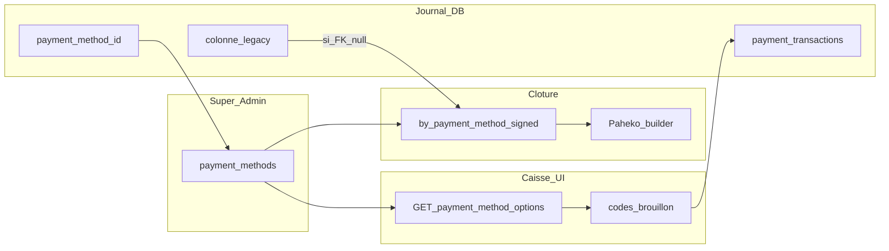

> **Cursor Plans** : ce fichier utilise l’extension **`.plan.md`** et le motif `nom_<8 hex>.plan.md` comme les autres plans du dossier `.cursor/plans/`, pour que l’UI Plans (todos, agents) le reconnaisse. Ne pas renommer en `.md` seul.

# Plan final : cohérence moyens de paiement (Super Admin → caisse → snapshot → Paheko)

## Synthèse

Le magasin configure les moyens dans l’admin expert ; la caisse doit **uniquement** proposer et enregistrer des **codes** issus de `GET /v1/sales/payment-method-options`. La clôture agrège le journal sur le **code expert** (via `payment_method_id`), pas sur la colonne legacy qui replie tout le `kind=bank` en `card`. Si l’API des options est indisponible : **message + blocage**, pas de liste de secours inventée.

## Décisions produit (verrouillées)

1. **Échec de `GET /v1/sales/payment-method-options`** : pas de liste fictive espèces/chèque/carte ; erreur visible ; encaissement (ou au minimum sélection du moyen) **bloqué** jusqu’au succès du chargement.
2. **Source de vérité des moyens payants (caisse)** : liste **active** issue de la table `payment_methods`, via `GET /v1/sales/payment-method-options` (live DB — pas le JSON de révision comptable). Pas de liste métier codée en dur dans les écrans ciblés par ce plan. *(La **révision** sert à Paheko/clôture : voir décision n°3.)*
3. **Révision comptable vs live DB** : `payment-method-options` reflète la **base courante** (actifs) ; clôture/Paheko utilisent une **révision** figée. **Tranché** dans `doc/exploitation-revision-vs-live-paiement.md` : écart court accepté ; en exploitation la révision doit couvrir les codes présents en session / ops (sinon erreurs de clôture explicites).

## Domaine : qu’est-ce qui vient de l’API, qu’est-ce qui reste « en dur »

| Sujet | Règle |
|--------|--------|
| Moyens **payants** en caisse (codes, labels, ordre, kind pour UX) | **API** `payment-method-options` |
| Mode **gratuit / don sans encaissement** | Sentinelle métier **`free`** — hors table `payment_methods` ; reste un cas explicite dans l’UI et les schémas vente |
| **Anciennes lignes** `payment_transactions` sans `payment_method_id` | **Repli serveur** sur la colonne legacy (cash/card/check/…) — brownfield, pas une liste produit |
| **Remboursements** | Enum / types legacy aujourd’hui — **hors hotfix** ; todo `followup-refund-expert-codes` |
| **Tests / seeds** | Chaînes d’exemple possibles ; pas la liste officielle du magasin |

**Critique QA** : dire « plus jamais le mot cash dans le repo » serait faux ; l’objectif est **plus de liste produit figée** pour la caisse et **plus de perte d’info** banque→carte pour la clôture.

## Contexte technique (rappel)

- Admin expert : [`peintre-nano/src/domains/admin-config/AdminAccountingPaymentMethodsWidget.tsx`](peintre-nano/src/domains/admin-config/AdminAccountingPaymentMethodsWidget.tsx), modèle [`recyclique/api/src/recyclic_api/models/payment_method.py`](recyclique/api/src/recyclic_api/models/payment_method.py).
- Caisse : hook [`use-caisse-payment-method-options.ts`](peintre-nano/src/domains/cashflow/use-caisse-payment-method-options.ts) — aujourd’hui `FALLBACK_OPTIONS` + labels en dur dans [`KioskFinalizeSaleDock.tsx`](peintre-nano/src/domains/cashflow/KioskFinalizeSaleDock.tsx).
- Bug racine : [`_kind_to_legacy_payment_method_column`](recyclique/api/src/recyclic_api/services/sale_service.py) (BANK→`card`) + agrégat sur colonne dans [`compute_payment_journal_aggregates`](recyclique/api/src/recyclic_api/services/cash_session_journal_snapshot.py) → Paheko lit [`by_payment_method_signed`](recyclique/api/src/recyclic_api/services/paheko_close_batch_builder.py).

**État cible (après Phase A)** : la clé agrégée suit le **code** joint sur `payment_method_id` ; le schéma ci-dessous côté `Snap` ne dépend plus du repli BANK→card pour les lignes avec FK.

## Objectifs produit

- Snapshot et sous-écriture Paheko « par moyen » : clés = **codes expert** (ex. `transfer` ≠ `card`) dès que `payment_method_id` est renseigné.
- UI caisse et écrans listés dans les todos : **pas** de catalogue métier hardcodé cash/chèque/carte pour remplacer l’API.

## Phases d’implémentation

### Phase A — Backend (priorité)

1. [`cash_session_journal_snapshot.py`](recyclique/api/src/recyclic_api/services/cash_session_journal_snapshot.py) : jointure `PaymentMethodDefinition` ; `by_pm_key = coalesce(code_expert_normalisé, legacy_key_si_FK_null)` ; `cash_signed_net_from_journal` via `kind == cash` (+ repli legacy `cash`).
2. Tests : [`test_story_22_6_accounting_close_snapshot.py`](recyclique/api/tests/test_story_22_6_accounting_close_snapshot.py), [`test_story_23_1_paheko_per_method_close_batch.py`](recyclique/api/tests/test_story_23_1_paheko_per_method_close_batch.py) — jeu **deux moyens bank** codes distincts.
3. Optionnel : lecture `GET /v1/sales/{id}` — clarifier `sale.payment_method` vs `payments[].payment_method_code` pour les écrans qui affichent encore l’agrégat legacy.

### Phase B — Frontend caisse et satellites

1. Supprimer l’usage de `FALLBACK_OPTIONS` comme filet ; brancher erreur + désactivation (dock / submit).
2. **Module partagé** (todo `fe-payment-method-display-module`) : une seule implémentation « code → libellé » ; repli autorisé = **code brut** ou « Libellé inconnu (…) », **pas** espèces/chèque/carte inventés.
3. Dock : consommer le module ; **`free`** traité à part (libellé UI dédié, inchangé côté métier).
4. [`cashflow-draft-store.ts`](peintre-nano/src/domains/cashflow/cashflow-draft-store.ts) : défaut = premier code des options une fois chargées ; gérer « aucun moyen actif » (message métier).
5. Correction vente, détail session caisse, wizards sociaux/spéciaux, SessionManager admin : voir todos dédiés ; **SessionManager** : ne pas casser les filtres serveur si la query attend une liste de **codes**.

### Phase C — Dette contrats / schémas

- [`sale.py` schemas](recyclique/api/src/recyclic_api/schemas/sale.py) (`PaymentBase` vs `PaymentCreate`), [`openapi.json`](recyclique/api/openapi.json) ou source YAML si généré — aligner uniquement si le contrat public change.

## Hors périmètre (cette livraison)

- Diagnostic / corps d’erreur Paheko HTTP 400.
- **Refonte complète** du flux remboursements (workflow + règles métier). En revanche le todo **`followup-refund-expert-codes`** peut couvrir une **extension minimale** (types / schéma / UI sur codes expert) sans refonte — à traiter en même temps que la correction vente **ou** laisser `cancelled` avec motif.

## Risques et mitigations (revue critique finale)

| Risque | Mitigation |
|--------|------------|
| Clé snapshot absente du JSON de la **révision** figée | Erreur clôture explicite `unknown_payment_method_code` déjà existante ; documenter côté ops : révision doit couvrir les codes présents en session. |
| Renommage `code` en base | Snapshots **déjà** clos inchangés ; nouvelles clôtures = code courant (assumé métier). |
| SQLite / PG casts enum `kind` | Réutiliser les patterns String/`native_enum=False` du projet ; lancer la suite tests API. |
| Tests peintre-nano (finalize) | Mettre à jour si le dock refuse l’action sans options chargées. |
| Double champ `payment_method` / `payment_method_code` côté API | Phase C : documenter ou enrichir une seule source d’affichage pour le front. |
| Lignes **donation_surplus** / **refund** dans `payment_transactions` | Même agrégat que les paiements vente : une fois la jointure `payment_method_id` en place, pas de traitement séparé sauf cas métier déjà gérés par `nature`. |

## Colonne legacy `payment_transactions.payment_method` (`PaymentMethodColumn`) — recommandation

**Constat** : à l’enregistrement, un code expert banque (ex. `transfer`) est encore mappé en **`card`** dans la colonne VARCHAR legacy ([`sale_service._kind_to_legacy_payment_method_column`](recyclique/api/src/recyclic_api/services/sale_service.py)), **tandis que** `payment_method_id` pointe bien vers la bonne ligne `payment_methods`.

**Reco pour cette livraison (pas de todo dédié obligatoire)** :

1. **Phase A suffit pour Paheko / snapshot** : l’agrégat doit lire le **code via la jointure sur `payment_method_id`**, pas se fier à la colonne `payment_method` pour les lignes qui ont un FK. Aucune migration SQL requise pour corriger la clôture.
2. **Ne pas toucher `PaymentMethodColumn` / la colonne dans cette story** sauf découverte de **nouvelles** lignes sans `payment_method_id` (alors corriger le chemin d’écriture, pas seulement la colonne).
3. **Phase C (optionnelle, plus tard)** : « faire porter la vérité » aussi dans la colonne VARCHAR (stocker le code expert, élargir le type, déprécier la colonne, etc.) — uniquement pour **lisibilité SQL brute**, exports, ou aligner des écrans qui lisent encore l’enum sans FK. **Ce n’est pas un prérequis** une fois l’agrégat et l’UI branchés sur `payment_method_id` / `payment_method_code` côté API.

En résumé : **on ne bloque pas la livraison sur une refonte de colonne** ; on corrige la **lecture** (agrégat + UI). La **réécriture** de la colonne legacy reste une dette **facultative** rangée en Phase C.

## Définition de fin (DoD)

- [x] Aucun écran caisse listé dans les todos ne sert une liste **métier** cash/chèque/carte en dur **à la place** de l’API ; échec API = pas de vente silencieuse avec faux moyens.
- [x] Clôture : `by_payment_method_signed` distingue deux codes bank différents sur un jeu de test réaliste.
- [x] `free` et repli legacy serveur restent compris et testés où pertinent.
- [x] **Décision produit n°3** (révision vs live) : documentée dans `doc/exploitation-revision-vs-live-paiement.md`.
- [x] Module `payment-method-display` (ou équivalent) utilisé partout où l’audit dupliquait des libellés.
- [x] Todos frontmatter passés en `completed` ou explicitement annulés avec raison.

## Fichiers pivots (index)

| Zone | Fichiers |
|------|----------|
| Agrégat | [`cash_session_journal_snapshot.py`](recyclique/api/src/recyclic_api/services/cash_session_journal_snapshot.py), [`cash_session_dual_read_service.py`](recyclique/api/src/recyclic_api/services/cash_session_dual_read_service.py) |
| Vente (écriture legacy colonne) | [`sale_service.py`](recyclique/api/src/recyclic_api/services/sale_service.py) — **hors scope** sauf Phase C volontaire (voir section *Colonne legacy*) |
| UI caisse | [`use-caisse-payment-method-options.ts`](peintre-nano/src/domains/cashflow/use-caisse-payment-method-options.ts), [`KioskFinalizeSaleDock.tsx`](peintre-nano/src/domains/cashflow/KioskFinalizeSaleDock.tsx), [`cashflow-draft-store.ts`](peintre-nano/src/domains/cashflow/cashflow-draft-store.ts), [`CashflowNominalWizard.tsx`](peintre-nano/src/domains/cashflow/CashflowNominalWizard.tsx) |
| UI autres | [`CashflowSaleCorrectionWizard.tsx`](peintre-nano/src/domains/cashflow/CashflowSaleCorrectionWizard.tsx), [`AdminCashSessionDetailWidget.tsx`](peintre-nano/src/domains/cashflow/AdminCashSessionDetailWidget.tsx), [`CashflowSocialDonWizard.tsx`](peintre-nano/src/domains/cashflow/CashflowSocialDonWizard.tsx), [`CashflowSpecialEncaissementWizard.tsx`](peintre-nano/src/domains/cashflow/CashflowSpecialEncaissementWizard.tsx), [`SessionManagerAdminWidget.tsx`](peintre-nano/src/domains/admin-config/SessionManagerAdminWidget.tsx) |
| Tests API | `test_story_22_6_*`, `test_story_23_1_*`, `test_story_22_2_dual_read_*`, `test_story_22_4_*` |
| Tests Peintre | `peintre-nano/tests/unit/*finalize*`, autres tests caisse touchant le dock |

## Checklist « audit autre agent » → absorbé dans ce plan

| Élément proposé par l’audit | Où c’est couvert |
|-----------------------------|------------------|
| Supprimer `FALLBACK_OPTIONS` / politique démo | Décision produit §1 + todo `fe-remove-hardcoded-pm` + Phase B.1 |
| `paymentMethodLabel` sans repli legacy | Phase B.2 + todo `fe-payment-method-display-module` |
| `AdminCashSessionDetailWidget` | Todo `fe-correction-admin-labels` + module libellés |
| `CashflowSaleCorrectionWizard` options fixes | Todo `fe-correction-admin-labels` |
| `SessionManagerAdminWidget` 3 cases | Todo `fe-session-manager-labels` (liste dynamique + contrat query) |
| Defaults `useState('cash')` wizards | Todo `fe-wizards-special-social` + Phase B.4 (draft) ; Phase B.5 (autres écrans) |
| `refund_payment_method` types / API | Todos `followup-refund-expert-codes` + `optional-schema-sale-pm` |
| Mocks tests variables | Todo `fe-peintre-tests-mocks` |
| Paheko / HTTP 400 | Hors périmètre (story séparée) |
| Agrégat serveur clôture | Todo `journal-aggregate-fk-code` (**non négociable** vs seul audit UI) |

## Brief pour l’agent d’exécution (à coller en tête de tâche)

1. Lire **entièrement** ce fichier : [`.cursor/plans/coherence-moyens-paiement-caisse-admin_a4b8c9d2.plan.md`](.cursor/plans/coherence-moyens-paiement-caisse-admin_a4b8c9d2.plan.md).
2. **Ordre strict** : d’abord **`journal-aggregate-fk-code`** puis **`api-tests-snapshot-paheko`** puis **`api-dual-read-tests`**. Ensuite Peintre : enchaîner **`fe-payment-method-display-module`** tôt (réutilisation dock / admin), puis **`fe-remove-hardcoded-pm`** + reste des todos YAML (l’ordre YAML n’impose pas l’ordre git : regrouper en commits logiques).
3. **Ne pas omettre** le todo serveur : sans lui, l’UI peut être parfaite et Paheko/clôture encore fausses (banque → carte).
4. **Décision § produit §3** (révision vs live) : produire une phrase dans la PR ou une mini-note doc ; si hors temps, indiquer explicitement « reporté » avec la règle provisoire choisie.
5. À la fin : cocher la **DoD** ; marquer les todos `completed` ou `cancelled` avec raison.

## Revue QA finale (checklist critique)

- **Couverture** : les todos frontmatter couvrent l’écart initial + audit (module libellés, session manager + query, mocks Peintre, permissions admin détail session).
- **Cohérence interne** : la décision « bloquer sans API » est reflétée dans Phase B et dans l’overview ; plus de duplication « todos QA » séparés — tout est dans le YAML.
- **Ordre de livraison (clarifié)** : livrer d’abord **A (serveur) + B (Peintre caisse / admin listé)** — c’est le correctif métier utile. **C (OpenAPI / schémas / dette)** ensuite, seulement si besoin : ce n’est pas une règle technique imposée par l’outil, c’est pour **ne pas retarder** le fix utile en peaufinant les contrats.
- **Point d’attention impl** : après suppression du fallback, vérifier **tous** les chemins qui ouvrent le dock finalize (tests e2e/unit, raccourcis clavier).

## Convergence audit / « autre agent » (même chantier ou pas ?)

**Verdict** : c’est **le même sujet** (une seule vérité = référentiel / API, plus de repli legacy qui ment). La liste de fichiers de l’audit **recoupe** nos todos Peintre (`FALLBACK_OPTIONS`, dock, admin session, correction, `sales-client` refund, defaults `cash`).

**Ce que l’audit ajoutait (maintenant dans les todos / phases ci-dessus)** :

- **Module partagé** → todo `fe-payment-method-display-module` + Phase B.2.
- **Révision vs live** → **Décision produit n°3** + ligne dans la checklist audit.
- **Filtres SessionManager + contrat backend** → todo `fe-session-manager-labels` explicite.
- **Mocks tests** → todo `fe-peintre-tests-mocks`.
- **Permissions admin détail session** → todo `fe-correction-admin-labels` (getSalePaymentMethodOptions vs endpoint lecture).

**Écart critique** : le plan collé depuis l’autre agent est **très orienté Peintre** et met Paheko en **phase optionnelle**. **Notre plan garde indispensable la Phase A serveur** ([`compute_payment_journal_aggregates`](recyclique/api/src/recyclic_api/services/cash_session_journal_snapshot.py) : code expert via `payment_method_id`). Sans ça, même avec tout le Peintre parfait, la **clôture / Paheko** peut encore fusionner virement et carte. **Ne pas laisser tomber A** au profit seul de l’UI.

**Qui fait quoi (reco)** :

- **Une seule file d’attente** dans le dépôt (ce fichier + todos YAML) : pas deux agents en silo sur les mêmes fichiers sans coordination.
- **Ordre fusionné** : **(1)** Phase A backend agrégat ; **(2)** module libellés + retrait fallback + dock ; **(3)** widgets admin (détail session, session manager) ; **(4)** correction + defaults wizards + remboursement/types ; **(5)** tests + OpenAPI ; **(6)** Paheko message d’erreur = story séparée si besoin.
- **Toi** : tu ne « laisses pas faire » ou « prends tout » au hasard — tu **désignes un propriétaire** (toi ou un dev) qui enchaîne ces étapes dans une ou deux PRs max pour limiter les conflits git.

---

## QA document (passage final)

- **§2 vs §3** : alignés — caisse = live `payment_methods` ; clôture = révision figée ; écart assumé ou documenté.
- **Checklist audit / phases** : références Phase B corrigées (B.4 = draft, B.5 = satellites).
- **Brief vs YAML** : ordre d’exécution Peintre clarifié (module libellés tôt ; YAML non normatif pour l’ordre git).
- **Hors périmètre remboursements** : distingué « refonte complète » vs todo optionnel extension codes.
- **Risque donation/refund** : rappel que l’agrégat unique couvre toutes les lignes journal pertinentes.
- **Colonne legacy** : section dédiée — pas de todo YAML ; Phase A = lecture correcte ; Phase C = persistance VARCHAR optionnelle.

*Dernière mise à jour : 2026-04-17 — QA doc ; renommé `.plan.md` ; fusion audit + brief exécuteur.*
