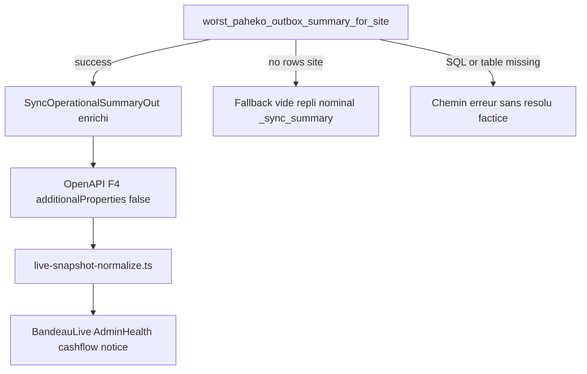

# Plan révisé — Durcissement Paheko outbox (tous les findings QA)

## Portée et branche (inchangé)

- Branche : `feat/paheko-outbox-hardening-2026-04-18` depuis `[master](.)` à jour (`git fetch`).
- Seeds : **PAHEKO-SYNC-AGR-01**, **SNAP-01**, **DEL-01**, **REL-01**, **QA-01** (mandat maximal).
- Fin : PR / branche prête ; pas de merge sans autorisation ; push selon credentials.

Référence audit : `[references/artefacts/2026-04-18_01_audit-red-team-paheko-outbox-synthese-agents.md](references/artefacts/2026-04-18_01_audit-red-team-paheko-outbox-synthese-agents.md)`.

---

## Annexe A — Synthèse des findings QA (tous intégrés)

### A1. REL-01 : quatre états explicites (finding Murphy / cohérence OpenAPI)

Ne pas réduire à « vide vs erreur SQL ». Le plan doit traiter séparément :

| État                     | Comportement attendu (à figer dans code + YAML + tests)                                                                                                                                                                                                                                                                                           |
| ------------------------ | ------------------------------------------------------------------------------------------------------------------------------------------------------------------------------------------------------------------------------------------------------------------------------------------------------------------------------------------------- |
| **Runtime forbidden**    | Déjà décrit dans `[contracts/openapi/recyclique-api.yaml](contracts/openapi/recyclique-api.yaml)` (`ExploitationLiveSnapshot`) : `sync_operational_summary` **null**, pas d’inférence silencieuse.                                                                                                                                                |
| **Vide métier**          | Aucune ligne outbox pertinente pour le site → repli `**_sync_summary`** nominal `**resolu`** (comportement actuel acceptable **pour ce cas seulement**).                                                                                                                                                                                          |
| **Agrégat indisponible** | Erreur SQL, bind absent, table absente, etc. → **ne pas** présenter `**resolu`** comme vérité ; signal honnête (ex. `sync_operational_summary` null avec sémantique documentée, et/ou champs booléens dédiés **sans** étendre `[SyncStateCore](recyclique/api/src/recyclic_api/schemas/exploitation_live_snapshot.py)` sans décision de version). |
| **Nominal**              | Agrégat calculé → `SyncOperationalSummaryOut` enrichi selon SNAP-01.                                                                                                                                                                                                                                                                              |

Implémentation : refactor de `[worst_paheko_outbox_summary_for_site](recyclique/api/src/recyclic_api/services/exploitation_live_snapshot_service.py)` pour renvoyer un discriminant ou codes internes ; `[build_exploitation_live_snapshot](recyclique/api/src/recyclic_api/services/exploitation_live_snapshot_service.py)` route chaque cas sans confusion.

### A2. SNAP-01 : deux dettes distinctes (finding contrat)

1. `**deferred_remote_retry`** : déjà présent dans OpenAPI, Pydantic `[SyncOperationalSummaryOut](recyclique/api/src/recyclic_api/schemas/exploitation_live_snapshot.py)` et `[contracts/openapi/generated/recyclique-api.ts](contracts/openapi/generated/recyclique-api.ts)`. La perte runtime vient de `[live-snapshot-normalize.ts](peintre-nano/src/domains/bandeau-live/live-snapshot-normalize.ts)` (`syncOperationalSummaryFromRaw` ne mappe que `worst_state` / `source_reachable`) — **dette normalisation**, pas « oubli OpenAPI ».
2. `**partial_success` au niveau F4** : **nouveaux champs optionnels** dans `sync_operational_summary` → évolution **mineure** du draft YAML (`[contracts/README.md](contracts/README.md)` : patch/minor pour champs optionnels ; pas de rupture si rétro-compat). `**additionalProperties: false`** sur `[ExploitationLiveSnapshot](contracts/openapi/recyclique-api.yaml)` impose YAML + Pydantic + codegen + normalize **dans le même livrable**.

**AC visuelle (reprise explicite du plan v1 § SNAP)** : lorsque `**partial_success`** est exposé et que `**worst_state`** vaut encore `**a_reessayer`** (scénario sans ligne `rejete` concurrente sur le même agrégat), **hiérarchiser** les messages dans `[cashflow-operational-sync-notice.tsx](peintre-nano/src/domains/cashflow/cashflow-operational-sync-notice.tsx)` pour ne pas sous-communiquer une livraison partielle Paheko.

### A3. Consommateurs F4 hors bandeau caisse (finding contrat)

Mettre à jour explicitement :

- `[AdminSystemHealthWidget.tsx](peintre-nano/src/domains/admin-config/AdminSystemHealthWidget.tsx)` — lit `snapshot?.sync_operational_summary` et `**deferred_remote_retry`** (~L459, ~L682).
- `[BandeauLive.tsx](peintre-nano/src/domains/bandeau-live/BandeauLive.tsx)` — `snapshot.sync_operational_summary` (~L111).
- `[cashflow-operational-sync-notice.tsx](peintre-nano/src/domains/cashflow/cashflow-operational-sync-notice.tsx)` — déjà dans le plan ; ajouter branches **partial** / **agrégat indisponible** selon nouveau schéma.

### A4. DEL-01 : règle binaire + fallback (finding Murphy)

- **Garde serveur** dans `[delete_paheko_outbox_item_failed](recyclique/api/src/recyclic_api/services/paheko_outbox_service.py)` : avant `delete`, utiliser `[close_batch_state_from_payload](recyclique/api/src/recyclic_api/schemas/paheko_outbox.py)` (pas JSON ad hoc).
- **Décision figée pour le run** : refuser DELETE si `**partial_success`** ou sous-écriture `**delivered`** (selon structure `PahekoCloseBatchStatePublic`). **Fallback si payload absent ou non parsable** : documenter une politique unique (ex. **refus prudent** avec code stable **409** + `reason_code`, ou autoriser avec audit — **une seule** ligne directrice dans OpenAPI + tests).
- Endpoint `[admin_paheko_outbox.py](recyclique/api/src/recyclic_api/api/api_v1/endpoints/admin_paheko_outbox.py)` + erreur documentée dans YAML.

### A5. AGR-01 : impact multi-écrans (finding Murphy)

Après inversion `**rejete` > `a_reessayer`** dans `[_WORST_SYNC_RANK](recyclique/api/src/recyclic_api/services/exploitation_live_snapshot_service.py)`, prévoir mise à jour des **tests** qui figent `worst_state` (backend + Peintre : `[cashflow-operational-sync-notice-6-9.test.tsx](peintre-nano/tests/unit/cashflow-operational-sync-notice-6-9.test.tsx)`, `[bandeau-live-widget.test.tsx](peintre-nano/tests/unit/bandeau-live-widget.test.tsx)`, e2e sandbox, etc.).

### A6. AC testables — correction critique (finding QA)

Pour **coexistence `rejete` + `a_reessayer`** **après** correctif AGR-01, l’attendu est `**worst_state == rejete`** (pas `a_reessayer`). Toute story / pytest doit refléter ce classement.

### A7. P2 HTTP + concurrence (finding testabilité + Murphy)

- Matrice **429 / 502 / 503 / 504** : s’aligner sur `[paheko_outbox_processor.py](recyclique/api/src/recyclic_api/services/paheko_outbox_processor.py)` (`_is_retryable_http_status`, etc.) — assertions déterministes sur `attempt_count` / `next_retry_at` / statut.
- **Concurrence** : éviter flaky SQLite ; préférer `**@pytest.mark`** + job CI **Postgres** si la suite utilise `skip_locked` — sinon documenter limite et garder test **séquentiel** déterministe.

### A8. Checklist livraison codegen / fixtures (finding contrat)

- Régénérer TS après YAML (`[contracts/README.md](contracts/README.md)` : `npm run generate` sous `contracts/openapi/`).
- Tests : `[peintre-nano/tests/contract/recyclique-openapi-governance.test.ts](peintre-nano/tests/contract/recyclique-openapi-governance.test.ts)` si pertinent pour nouveaux champs.
- Vérifier fixtures / manifests bandeau : ex. `[peintre-nano/src/fixtures/contracts-creos/page-bandeau-live-sandbox.json](peintre-nano/src/fixtures/contracts-creos/page-bandeau-live-sandbox.json)`, manifests CREOS associés (`creos/manifests/`).
- Test unitaire dédié : **normalize** préserve tous les champs du résumé sync (existants + nouveaux).

### A9. Diagramme d’états agrégat (conservation plan v1)

Le schéma ci-dessous rappelle les **trois sorties** de l’agrégat avant chaîne OpenAPI (équivalent au diagramme du plan v1) :

---

## Ordre d’implémentation (révisé — évite tests verts trompeurs)

```mermaid
flowchart LR
  backendRel[Backend REL quatre états + AGR]
  backendSnapDel[Backend SNAP + DEL]
  openapi[YAML + bump minor patch]
  codegen[npm generate TS]
  normalize[live-snapshot-normalize tous champs]
  widgets[BandeauLive AdminHealth cashflow diagnostics]
  tests[pytest + tests Peintre + fixtures]
  docs[mode emploi super-admin]
  backendRel --> backendSnapDel --> openapi --> codegen --> normalize --> widgets --> tests --> docs
```

1. Backend **REL + AGR** (fondations agrégat).
2. Backend **SNAP + DEL**.
3. **OpenAPI** + **Pydantic** + `**npm run generate`**.
4. **Normalize** puis **tous les consommateurs F4** listés en A3.
5. **Tests** P0–P2 + non-régression processor **409 succès**.
6. **Documentation** terrain.

---

## Critères d’acceptation mesurables (révisés)

- **P0 AGR** : deux lignes même `site_id`, `rejete` + `a_reessayer` → `**GET .../live-snapshot`** donne `**worst_state === "rejete"`**.
- **P0 REL** : scénarios distincts **forbidden** / **vide** / **agrégat KO** / **nominal** avec assertions sur `sync_operational_summary` et absence de `**resolu` factice** sur agrégat KO.
- **P0 SNAP** : champ(s) partial visibles dans la réponse API lorsque données en base ; bandeau et **normalize** cohérents ; `**deferred_remote_retry`** survive au parse manifeste.
- **P1 DEL** : DELETE sur `failed` + payload batch partiel livré → **409** (ou statut figé) avec **code machine** ; test dédié.
- **P2** : HTTP étendus + marqueur optionnel Postgres pour lock si applicable.

**Synthèse globale (reprise plan v1 — contrôle final)** : pytest verts sur les nouveaux cas ; tests Peintre mis à jour si snapshots ; OpenAPI et types générés alignés ; `additionalProperties: false` respecté ; aucune régression **409 processor succès**, **lift-quarantine** conditionnelle, **reject terminal**.

---

## Non-régression (inchangé + précisions)

- Processor : **409 Paheko** = chemin livré inchangé (`[_apply_http_result](recyclique/api/src/recyclic_api/services/paheko_outbox_processor.py)`).
- Lift quarantaine / reject terminal : inchangés (cf. artefact §4).

---

## Abandon / merge

- CI rouge après deux passes ciblées : stop documenté.
- Conflit YAML : résoudre puis **régénérer** `[recyclique-api.ts](contracts/openapi/generated/recyclique-api.ts)`.
- Chevauchement avec **une autre branche** touchant les mêmes fichiers : rebaser la feature sur `master` à jour après fusion de l’autre chantier, ou résoudre les conflits puis régénérer le client TS (reprise plan v1).

---

## Fichier plan dans le dépôt

Pour agents Cloud ou CI sans accès à `~/.cursor/plans`, **copier** ce plan sous le repo (ex. `.cursor/plans/` ou `[references/artefacts/](references/artefacts/)`) avec cette même annexe A.