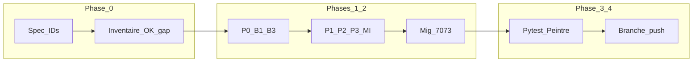

# Plan exécutable — Fermeture QA paramétrage comptable SuperAdmin

Spec canonique : `[references/migration-paheko/2026-04-18_spec-corrections-qa-parametrage-comptable-superadmin.md](references/migration-paheko/2026-04-18_spec-corrections-qa-parametrage-comptable-superadmin.md)`.

---

## A. Synthèse

**Périmètre fonctionnel :** grille **B** (bloquants), **M** (manquants), **I** (incohérences) pour l'écran Paramétrage comptable SuperAdmin (Peintre), API expert, données et mappings Paheko clôture — **sans** modifier l'architecture à quatre onglets ni le PIN step-up ni la résolution site/poste/défaut (interdits par la spec).

**Alignement spec canonique vs décisions (obligatoire pour éviter deux vérités) :** la spec du 2026-04-18 contient encore des formulations **M1** (activation automatique surplus) et **M5** (liste API exercices) qui **contredisent** les décisions verrouillées ci‑dessous. **Pendant le run :** (1) ajouter en tête de la spec (ou immédiatement après le titre) un encart daté **« Décisions produit 2026-04-18 — cette spec est surchargée pour : M1 comportement caisse hors périmètre / statu quo ; M5 Option B puis A ultérieure »** avec renvoi à ce plan ; (2) dans le tableau « Résumé des priorités » en fin de spec, ajuster la ligne **M1** (référencer référentiel moyen `donation` admin seulement, pas auto‑surplus) et **M5** (Option B ; pas de GET avant story dédiée). Mettre à jour si besoin `[references/idees-kanban/a-faire/2026-04-18_finir-ecarts-qa-parametrage-comptable-superadmin.md](references/idees-kanban/a-faire/2026-04-18_finir-ecarts-qa-parametrage-comptable-superadmin.md)` pour pointer ce plan et marquer les décisions fermées.

**État dépôt (baseline connaissance) :** une partie des corrections est déjà présente (migrations **s22_7** pour 708→7541 / 467→672 et moyens `donation`/`transfer`, widgets Peintre pour plusieurs points I*, builder clôture multi-moyens dans `[paheko_close_batch_builder.py](recyclique/api/src/recyclic_api/services/paheko_close_batch_builder.py)`). Le plan impose une **phase de recoupement** avant tout changement pour éviter les doublons.

**Précision M1 :** périmètre chantier = **référentiel moyens de paiement** (seed/migration/admin, présence du code `donation`) ; **ne pas confondre** avec le champ métier « donation » sur la vente ni avec `donation_surplus` (journal Story 22.4). **Aucun** changement `[KioskFinalizeSaleDock.tsx](peintre-nano/src/domains/cashflow/KioskFinalizeSaleDock.tsx)` / `[sale_service.py](recyclique/api/src/recyclic_api/services/sale_service.py)` sauf bug bloquant hors périmètre.

**B3 vs décision caisse :** B3 concerne **clôture Paheko / mappings** (agrégation comptable), pas la caisse kiosk — il reste **en Phase 1 P0** si l'inventaire montre un gap (textes, lien moyens de paiement).

**Décisions produit verrouillées (session utilisateur) :**

| Zone            | Décision                                                                                                                                                                                                                                                                                                                                                                                                                                                                                                                                                                                                                |
| --------------- | ----------------------------------------------------------------------------------------------------------------------------------------------------------------------------------------------------------------------------------------------------------------------------------------------------------------------------------------------------------------------------------------------------------------------------------------------------------------------------------------------------------------------------------------------------------------------------------------------------------------------- |
| **M1 / caisse** | Pas de notion « surplus » côté métier ; **don** au choix du client ; **aucune** évolution du flux ou des règles caisse pour ce chantier. Les libellés techniques (`donation_surplus`, Story 22.4) restent implémentation interne.                                                                                                                                                                                                                                                                                                                                                                                       |
| **M5**          | **Option B maintenant** : exercice Paheko saisi manuellement ; renforcer aide inline + doc. **Option A plus tard** ; **préparer le terrain** : commentaires + pointeurs vers `[references/paheko/liste-endpoints-api-paheko.md](references/paheko/liste-endpoints-api-paheko.md)` dans `[paheko_accounting_client.py](recyclique/api/src/recyclic_api/services/paheko_accounting_client.py)` et encadré du champ dans `[AdminPahekoCashSessionCloseMappingsSection.tsx](peintre-nano/src/domains/admin-config/AdminPahekoCashSessionCloseMappingsSection.tsx)` — **sans** bouton « charger les exercices » ni GET réel. |
| **I1 / 7073**   | Migration **données** : remplacer **7073** par **707** (choix **707** figé — aligné `default_sales` **707** ; pas **7070** sauf décision explicite ultérieure). Cible principale : `destination_params` JSON clé **`credit`** sur `[paheko_cash_session_close_mappings](recyclique/api/src/recyclic_api/models/paheko_cash_session_close_mapping.py)`. **Pas** de réécriture des écritures déjà dans Paheko. |

**Dépendances / risques merge :** fichiers sensibles `[paheko_close_batch_builder.py](recyclique/api/src/recyclic_api/services/paheko_close_batch_builder.py)`, `[paheko_mapping_service.py](recyclique/api/src/recyclic_api/services/paheko_mapping_service.py)`, `[sale_service.py](recyclique/api/src/recyclic_api/services/sale_service.py)` — pour ce chantier **éviter** les touchées caisse sauf constat de bug bloquant hors périmètre convenu.

---

## B. Stratégie Git

| Élément            | Valeur                                                                                                                                         |
| ------------------ | ---------------------------------------------------------------------------------------------------------------------------------------------- |
| **Branche**        | `feat/qa-compta-superadmin-20260418` (**figée**)                                                                                               |
| **Base**           | `master` à jour (`git fetch origin` ; `git checkout master` ; `git pull origin master` ; `git checkout -b feat/qa-compta-superadmin-20260418`) |
| **Merge**          | **Interdit** dans le run cloud vers `master` sans autorisation explicite utilisateur                                                           |
| **Push**           | Optionnel selon credentials ; sinon commandes exactes pour l'humain après validation locale                                                    |
| **Abandon / stop** | CI rouge sur les tests listés section E ; conflit massif sur les mêmes fichiers que travail non coordonné — résoudre ou isoler commits         |

---

## C. Matrice décisions (réponses fixées)

| Question                                        | Réponse                                                                                                                                                                                               | Source      | Impact                                                                                                                                                                                                        |
| ----------------------------------------------- | ----------------------------------------------------------------------------------------------------------------------------------------------------------------------------------------------------- | ----------- | ------------------------------------------------------------------------------------------------------------------------------------------------------------------------------------------------------------- |
| Comportement caisse vs spec M1 « auto surplus » | **Statu quo code + UX** ; pas de story « surplus automatique »                                                                                                                                        | Utilisateur | Pas de changement `[KioskFinalizeSaleDock.tsx](peintre-nano/src/domains/cashflow/KioskFinalizeSaleDock.tsx)` / `[sale_service.py](recyclique/api/src/recyclic_api/services/sale_service.py)` pour ce chantier |
| Exercice Paheko                                 | **B** doc + aide ; **A** différée ; commentaires préparation **A**                                                                                                                                    | Utilisateur | Peintre + doc ; pas de nouveau GET Paheko dans ce run                                                                                                                                                         |
| 7073                                            | **Migration données** 7073→707 sur persistance Recyclique                                                                                                                                             | Utilisateur | Nouvelle migration Alembic **après** révisions existantes ; ne pas rééditer anciennes migrations                                                                                                              |
| Champ « Compte de débit » clôture (B3)          | **Ne pas supprimer** sans refactor : `[validate_destination_params_for_transaction](recyclique/api/src/recyclic_api/services/paheko_transaction_payload_builder.py)` exige `debit`/`credit`/`id_year` | Spec + code | Clarifier libellés / aide uniquement si pas de refactor backend                                                                                                                                               |
| Branche                                         | `feat/qa-compta-superadmin-20260418`                                                                                                                                                                  | Utilisateur | Git                                                                                                                                                                                                           |

---

## D. Plan Cursor — séquence sur la branche dédiée

### Phase 0 — Inventaire vs spec (obligatoire)

1. Ouvrir la spec ; tableau priorités fin § « Résumé des priorités » ; appliquer les **modifs d'alignement** (section A « Alignement spec »).
2. Pour chaque ID **B1–B3, M1–M5, I1–I6** : grep / lecture ciblée dans les fichiers listés ci‑dessous ; produire une **table livrable** avec colonnes : **ID | OK / gap / N/A | Fichier(s) ou test | Preuve courte** (référence ligne, nom de test, ou « à implémenter »).

**Critère machine pour fin Phase 0 :** chaque ID a exactement un statut **OK**, **gap**, ou **N/A** avec justification une ligne.

**Fichiers clés (non exhaustif)**

- Peintre : `[AdminAccountingExpertShellWidget.tsx](peintre-nano/src/domains/admin-config/AdminAccountingExpertShellWidget.tsx)`, `[AdminAccountingGlobalAccountsWidget.tsx](peintre-nano/src/domains/admin-config/AdminAccountingGlobalAccountsWidget.tsx)`, `[AdminAccountingPaymentMethodsWidget.tsx](peintre-nano/src/domains/admin-config/AdminAccountingPaymentMethodsWidget.tsx)`, `[AdminPahekoCashSessionCloseMappingsSection.tsx](peintre-nano/src/domains/admin-config/AdminPahekoCashSessionCloseMappingsSection.tsx)`, clients `[admin-accounting-expert-client.ts](peintre-nano/src/api/admin-accounting-expert-client.ts)`, `[admin-paheko-mappings-client.ts](peintre-nano/src/api/admin-paheko-mappings-client.ts)`.
- API : `[admin_accounting_expert.py](recyclique/api/src/recyclic_api/api/api_v1/endpoints/admin_accounting_expert.py)`, `[accounting_expert_service.py](recyclique/api/src/recyclic_api/services/accounting_expert_service.py)`, `[accounting_expert.py` (schemas)](recyclique/api/src/recyclic_api/schemas/accounting_expert.py), `[paheko_close_batch_builder.py](recyclique/api/src/recyclic_api/services/paheko_close_batch_builder.py)`, `[paheko_mapping_service.py](recyclique/api/src/recyclic_api/services/paheko_mapping_service.py)`.
- Migrations : chaîne **s22_*** notamment `[s22_7_legacy_payment_method_lowercase.py](recyclique/api/migrations/versions/s22_7_legacy_payment_method_lowercase.py)` — **ne pas modifier** les fichiers déjà appliqués ; toute correction données = **nouvelle** révision.

### Phase 1 — P0 spec (après inventaire)

- **B1 / B2** : confirmer défauts 7541 / 672 (DB + UI) ; ajuster uniquement si gap.
- **B3** : vérifier cohérence textes + lien vers moyens de paiement ; pas de suppression du champ `debit` sans évolution `[paheko_transaction_payload_builder](recyclique/api/src/recyclic_api/services/paheko_transaction_payload_builder.py)`.

### Phase 2 — P1 / P2 / P3 restants

- **M3** : valider validation `cash_journal_code` si Paheko sortant (comportement existant `[accounting_expert_service](recyclique/api/src/recyclic_api/services/accounting_expert_service.py)`) — pas d'élargissement arbitraire sans spec.
- **M4** : confirmer encart UI + erreurs backend non silencieuses (`[paheko_mapping_service](recyclique/api/src/recyclic_api/services/paheko_mapping_service.py)`, builder).
- **M5** : implémenter **B** (textes + `[doc/modes-emploi/mode-emploi-parametrage-comptable-superadmin.md](doc/modes-emploi/mode-emploi-parametrage-comptable-superadmin.md)` si nécessaire) ; ajouter commentaires préparation **A**.
- **I1** : nouvelle migration Alembic **données** (révision après la dernière `s22_*` existante) :
  - **Cible primaire :** PostgreSQL — `UPDATE paheko_cash_session_close_mappings SET destination_params = jsonb_set(destination_params::jsonb, '{credit}', '"707"', true)` (ou équivalent ; valider cast JSON pour une valeur scalaire chaîne) **`WHERE (destination_params->>'credit') = '7073'`** ; si le type colonne est déjà `jsonb`, ajuster cast.
  - **Dry-run avant UPDATE :** dans la migration ou script commenté : `SELECT count(*) FROM paheko_cash_session_close_mappings WHERE (destination_params->>'credit') = '7073';`
  - **Variantes :** si des payloads utilisent `"7073"` ailleurs dans le JSON, étendre avec prédicat documenté (`destination_params::text LIKE '%7073%'` en dernier recours + revue humaine recommandée pour faux positifs).
  - **Dialecte :** CI pytest utilise en général PostgreSQL aligné prod ; si SQLite apparaît pour dev local, documenter dans la migration « non supporté » ou branche `op.get_bind().dialect.name`.
  - **Audit dépôt post-migration :** grep **7073** avec périmètre : `recyclique/`, `peintre-nano/`, `contracts/`, `doc/`, `references/migration-paheko/` — objectif **zéro occurrence métier** hors historique/changelog ; la spec peut encore mentionner 7073 comme **historique** tant que l'encart décisions est présent.
- **I2–I6** : traiter uniquement les **gaps** résiduels par inventaire.

### Phase 3 — Contrats et tests

- Si changement d'API : régénérer ou synchroniser OpenAPI / contrats selon conventions du dépôt (`[contracts/openapi/recyclique-api.yaml](contracts/openapi/recyclique-api.yaml)`, `[recyclique/api/openapi.json](recyclique/api/openapi.json)` si présent — **liste tous les artefacts du projet à tenir alignés**).
- **Pytest** ciblé : stories **22.x**, **23.1**, **8.x** Paheko ; après tout changement de défauts **708/467→7541/672**, **rafraîchir les assertions** dans les tests qui figent encore les anciennes valeurs.
- **Peintre** : tests unitaires sous `[peintre-nano/tests/unit/](peintre-nano/tests/unit/)` pour widgets admin ; `npm test` ou équivalent sur les fichiers touchés.
- **Critère fin Phase 3 :** CI verte locale / pipeline sur la branche (ou liste des tests exécutés et résultat si CI indisponible).

### Phase 4 — Fin

- Commits Conventional Commits atomiques si possible.
- **Livrable terminal run cloud :** branche `feat/qa-compta-superadmin-20260418` avec historique propre ; **push optionnel** ; **pas de merge** vers `master` (étape réservée à l'humain). Alternative traçable : ouvrir une **PR brouillon** avec résumé des décisions M1/M5/I1 et checklist section E.
- La phrase « sans accord » n'est pas vérifiable par machine : substituer en pratique par **« ne pas fusionner ; documenter dans message de PR »**.

### Commentaires préparation M5 (Option A plus tard) — texte minimal à coller

- Dans `[paheko_accounting_client.py](recyclique/api/src/recyclic_api/services/paheko_accounting_client.py)` : bloc commentaire — *« Extension prévue : GET liste exercices Paheko (réf. `references/paheko/liste-endpoints-api-paheko.md`). Aucun appel GET avant story dédiée ; auth identique au POST actuel. »*
- Dans `[AdminPahekoCashSessionCloseMappingsSection.tsx](peintre-nano/src/domains/admin-config/AdminPahekoCashSessionCloseMappingsSection.tsx)` au‑dessus du champ exercice — *« Saisie manuelle de l'ID exercice Paheko (Option B). Option A : alimenter depuis API Paheko — non implémenté. »*

---

## E. Checklist non-régression (IDs spec)

| ID  | Critère testable                                                                   |
| --- | ---------------------------------------------------------------------------------- |
| B1  | Défaut / aide dons **7541**                                                        |
| B2  | Défaut / aide **672** + avertissement UI                                           |
| B3  | Ventilation clôture par moyen ; UI sans ambiguïté sur le rôle du débit mapping     |
| M1  | Moyen **donation** présent en référentiel ; **pas** d'exigence nouveau flux caisse |
| M2  | Moyen **transfer** présent                                                         |
| M3  | Champs journal + préfixe ; règle si Paheko actif                                   |
| M4  | Encart + erreur si réglage absent                                                  |
| M5  | Saisie manuelle cohérente avec doc ; pas de fausse promesse liste API              |
| I1  | Plus de **7073** en config DB Recyclique post-migration                            |
| I2  | Comportement ordre moyens explicite (toast ou enregistrer)                         |
| I3  | Texte absence « Supprimer »                                                        |
| I4  | Warning débit/crédit non bloquant                                                  |
| I5  | Tooltips champs Paheko                                                             |
| I6  | Modal / message si session ouverte à la désactivation                              |

---

## F. Rapport QA du plan (peer review adversariale, 2026-04-18)

**Score confiance initial du plan : ~52 %** ; après révision du document **~78 %** (réduction principale des risques « deux vérités », migration floue, fin de workflow).

| Sévérité | Problème identifié | Réponse dans ce plan révisé |
|----------|-------------------|------------------------------|
| Critique | Spec canonique encore en contradiction avec décisions M1/M5 | Section **Alignement spec** + amendement spec + tableau priorités ; Kanban à jour |
| Critique | Migration JSON sans contrat dialecte/clé | Sous‑section **I1** avec `WHERE`, dry-run, note SQLite |
| Critique | Gate « merge sans accord » non vérifiable machine | Phase 4 : livrable = branche + PR draft ; pas de merge exécuté par l'agent |
| Warning | 707 vs 7070 | Décision **707** figée avec justification courte |
| Warning | Grep `7073` périmètre vague | Liste de chemins + exception doc historique |
| Warning | B3 vs « pas caisse » | Clarification **B3 = mappings clôture** |

**Éléments volontairement hors plan document :** exécution réelle des tests (nécessite runtime) ; validation comptable finale humaine sur migration prod.

---

