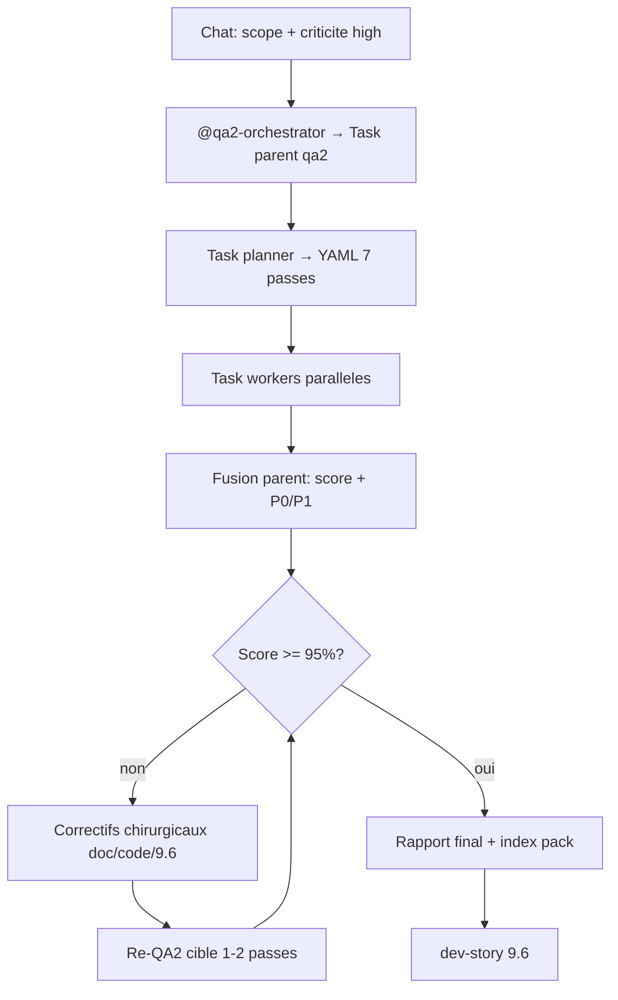

# QA2 global chantier modules v2 + boucle améliorative

## Contexte

Les QA2 précédents étaient **séparés** (pack rédaction, dossier architecte, etc.). Le livrable actuel est un **ensemble cohérent** post-HITL :

- Artefacts : [`references/artefacts/2026-05-20_03_…`](references/artefacts/2026-05-20_03_reponse-architecte-branchements-modules-v2.md) à [`06_reco`](references/artefacts/2026-05-20_06_reco-hitl-post-bouclage-modules-v2.md) + [`05` loup de mer](references/artefacts/2026-05-20_05_notes-architecte-loup-de-mer-modules-v2.md)
- Pack : [`references/protocole-modules-recyclique/`](references/protocole-modules-recyclique/) (index, `03`/`04`/`07`/`09`/`19`, cookbook `06`)
- BMAD : [`_bmad-output/planning-artifacts/architecture/2026-05-20-adr-007-…`](_bmad-output/planning-artifacts/architecture/2026-05-20-adr-007-reconciliation-modularite-v01-v2.md), seed [`9-6-config-admin-simple-modules.md`](_bmad-output/implementation-artifacts/9-6-config-admin-simple-modules.md)
- Code : `recyclique/api/src/recyclic_api/modules/module_config/`, [`test_module_config_site.py`](recyclique/api/tests/test_module_config_site.py), [`contracts/openapi/recyclique-api.yaml`](contracts/openapi/recyclique-api.yaml)

**Seuil utilisateur :** score fusionné **≥ 95 %** avant prochaine session **dev-story 9.6**.

**État déjà amorcé (session précédente / brouillon) :**

- Scores 7 passes documentés (~**88 %** avant correctifs) dans [`qa2-rapport-global-chantier-modules-2026-05-20.md`](references/protocole-modules-recyclique/qa2-rapport-global-chantier-modules-2026-05-20.md)
- **Cycle 1 doc** partiellement appliqué (C1–C5 : corruption `03` §8, ADR Accepted, `09` T-MOD-3/Q-HITL-03, piège #1 `05`, libellés `07`/`19`)
- Ce rapport **doit être validé** par un re-QA2 officiel (skill), pas seulement déclaré à 96 %

---

## Exécution QA2 (discipline skill)

**Entrée obligatoire :** `@qa2-orchestrator` + skill qa2-agent (`SKILL.md` = trigger ; parent lit [`workflow.md`](C:\Users\Strophe\.cursor\skills\qa2-agent\workflow.md)).

Le **chat courant** ne lit **pas** les `scope_paths` ; il spawne **un seul** Task parent qui :

1. Remplit le QABrief (`skill_root` qa2-agent, `heavy_refs_root` qa-agent)
2. Lance le **planificateur** (périmètre mixte / volumineux → **7 passes** recommandées)
3. Lance **un Task worker par passe** (parallèle si possible)
4. Fusionne scores, `[LOC]`, sévérités max

**Brief racine (à transmettre au Task parent) :**

| Champ | Valeur |
|-------|--------|
| `criticality` | `high` |
| `pipeline` | `full` |
| `user_intent` | QA2 global post-HITL modules v2 : cohérence doc↔ADR↔OpenAPI↔code↔seed 9.6 ; gate 95 % ; décisions HITL figées (ADR-007 Accepted, DEC-03, pas marketplace) |
| `readonly` | `true` (sauf si Strophe demande correctifs code dans la même session) |

**`scope_paths` absolus (liste minimale) :**

- `references/artefacts/2026-05-20_03_*` … `06_*`, `05_*`
- `references/protocole-modules-recyclique/index.md`, `03-MOD-*`, `04-MOD-*`, `06-MOD-*`, `07-MOD-*`, `09-MOD-*`, `19-MOD-*`, `22-MOD-*`
- `_bmad-output/planning-artifacts/architecture/2026-05-20-adr-007-*`
- `_bmad-output/implementation-artifacts/9-6-config-admin-simple-modules.md`
- `contracts/openapi/recyclique-api.yaml` (ops module-config)
- `recyclique/api/src/recyclic_api/modules/module_config/`
- `recyclique/api/tests/test_module_config_site.py`
- `references/artefacts/2026-05-20_06_reco-hitl-post-bouclage-modules-v2.md` (référence décisions)

**7 passes planner (reprise des axes séparés) :**

| id | type | mode | objectif |
|----|------|------|----------|
| pass-1 | doc | validation | Artefacts 03–06 : GO, DEC-03, ordre P0, liens |
| pass-2 | doc | validation | Pack MOD : statuts, index, crosswalk `19`, pas de stale |
| pass-3 | arch | validation | ADR-007 Accepted + miroir BMAD + `09` lacunes |
| pass-4 | arch | adversarial | Double récit v0.1/v2, triple autorité activation |
| pass-5 | prd | validation | Seed 9.6 vs `epics.md` AC, ready-for-dev |
| pass-6 | code | validation | Handler module-config, OpenAPI, tests |
| pass-7 | code | adversarial | 404 vs 403, If-Match, Cache-Control, IDOR PATCH |

**Pondération fusion (identique au brouillon) :** doc+arch 40 %, code 35 %, prd 10 %, adversarial 15 %.

---

## Boucle améliorative (jusqu’à ≥ 95 %)

### Cycle 1 — Documentation (P0 doc déjà listés)

| ID | Fichier | Action |
|----|---------|--------|
| C1 | [`03-MOD-protocole-backend.md`](references/protocole-modules-recyclique/03-MOD-protocole-backend.md) | Supprimer double `## 8` + fragment orphelin |
| C2 | [`index.md`](references/protocole-modules-recyclique/index.md), [`19-MOD-checklist`](references/protocole-modules-recyclique/19-MOD-checklist-v0-1-vs-pack.md) | ADR **Accepted** partout (plus Proposed) |
| C3 | [`09-MOD-lacunes`](references/protocole-modules-recyclique/09-MOD-lacunes-et-questions-ouvertes.md) | T-MOD-3 **livré**, Q-HITL-03 **clos** |
| C4 | [`05` loup de mer](references/artefacts/2026-05-20_05_notes-architecte-loup-de-mer-modules-v2.md) | Piège #1 : OpenAPI **fusionné** (pas « non fusionné ») |
| C5 | [`07-MOD-adr`](references/protocole-modules-recyclique/07-MOD-adr-reconciliation-v01-v02.md) | Libellés post-HITL, miroir BMAD |

**Vérification :** re-passe **pass-2** + **pass-3** uniquement (léger).

### Cycle 2 — Code (optionnel avant 9.6, si score code &lt; 90)

Issues adversarial connues (ne pas bloquer gate doc si documentées comme **P1 story 9.6 / hotfix**) :

- Membership admin hors site → **404** uniforme (pas 403)
- `If-Match` invalide → **409/422** (pas LWW silencieux)
- Tests : PATCH IDOR, 401, 403 USER, 422 payload
- `Cache-Control: private, no-store` sur GET/PATCH

**Vérification :** re-passe **pass-6** + **pass-7**.

### Cycle 3 — PRD seed 9.6 (si pass-5 &lt; 85)

Dans [`9-6-config-admin-simple-modules.md`](_bmad-output/implementation-artifacts/9-6-config-admin-simple-modules.md) :

- Cocher tâches P0 backend déjà livrées (T-MOD-3)
- Aligner AC avec epic 9 (`epics.md`)
- Mentionner migration bandeau : toggle → `module-config`
- Traçabilité PATCH (auteur/motif) en P2 explicite

**Vérification :** re-passe **pass-5** seule.

### Gate final

- Score fusionné **≥ 95 %**
- **0 P0 doc** résiduel (stale ADR, T-MOD-3 brouillon, liens morts)
- P0 code : soit **corrigés**, soit **documentés** dans rapport avec owner + story 9.6 (acceptable si doc/arch ≥ 95 %)

---

## Livrable rapport

Mettre à jour (ou remplacer le brouillon) :

[`references/protocole-modules-recyclique/qa2-rapport-global-chantier-modules-2026-05-20.md`](references/protocole-modules-recyclique/qa2-rapport-global-chantier-modules-2026-05-20.md)

Contenu minimal :

1. Tableau scores **7 passes + re-vérif cycles**
2. Synthèse P0/P1 par axe (doc / arch / code / prd)
3. Verdict gate et **prochaine session** (dev-story 9.6, ordre lecture **05 → 04 → 06**)
4. Lien depuis [`index.md`](references/protocole-modules-recyclique/index.md) pack MOD

**Ne pas commit** sauf demande explicite Strophe.

---

## Hors périmètre QA2 (rappel HITL)

- Pas de réouverture ADR-007 / DEC-03 / marketplace / 2ᵉ module comptage
- Pas de T-PEINT-1 ni marketplace Cursor

---

## Prochaine session (après GO)

1. `dev-story` **9.6** avec seed enrichi
2. Peintre `/admin/modules` + lecture `module-config`
3. T-MOD-5 (whitelist + schémas par clé)
