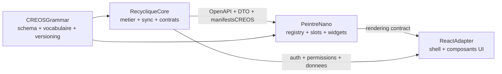

# Separation Peintre/Recyclique

## Decision retenue

La direction cible est :

- `Recyclique` devient le noyau metier et contractuel.
- `Peintre_nano` devient le moteur de composition front agnostique.
- `CREOS` devient la **grammaire commune** des manifests et declarations de modules : a l echelle nano, transport documentaire en fichiers JSON ; plus tard, meme structure reusable sur les bus JARVOS si necessaire.
- La separation doit etre **stricte des maintenant dans l architecture**.
- En revanche, **le packaging reste d abord interne** : `peintre-nano` commence comme package/workspace dans le meme depot, pour faciliter tests, deploiement et iterations.
- L extraction vers un repo dedie est preparee des la conception, mais **n est pas un prerequis immediate**.

## Position dans la hierarchie des plans

- Le **plan parent canonique** est maintenant `[.cursor/plans/cadrage-v2-global_c2cc7c6d.plan.md](.cursor/plans/cadrage-v2-global_c2cc7c6d.plan.md)`.
- Ce plan detaille uniquement le **pivot d architecture et de phasage** autour de `Peintre_nano`.
- Le sous-plan jumeau pour la grammaire documentaire minimale est `[.cursor/plans/profil-creos-minimal_6cf1006d.plan.md](.cursor/plans/profil-creos-minimal_6cf1006d.plan.md)`.
- En cas de divergence d ordre ou de priorite, **le parent fait foi**.

## Pourquoi cette option

Elle preserve les benefices que tu cherches :

- separation nette des roles des la V2 ;
- compatibilite avec une extraction future sans rearchitecture majeure ;
- moins de friction immediate sur CI, auth, releases et deploiement ;
- alignement avec le brownfield actuel, encore fortement couple entre API, auth et frontend ;
- compatibilite plus forte avec l ecosysteme JARVOS en evitant d inventer une grammaire UI locale deconnectee de `CREOS`.

Elle est aussi la plus coherente avec les documents lus :

- [references/vision-projet/2026-03-31_peintre-nano-concept-architectural.md](references/vision-projet/2026-03-31_peintre-nano-concept-architectural.md)
- [references/vision-projet/index.md](references/vision-projet/index.md)
- [.cursor/plans/cadrage-v2-global_c2cc7c6d.plan.md](.cursor/plans/cadrage-v2-global_c2cc7c6d.plan.md)
- [references/recherche/2026-02-25_affichage-dynamique-peintre-extension-points_bmad_recherche.md](references/recherche/2026-02-25_affichage-dynamique-peintre-extension-points_bmad_recherche.md)
- [references/consolidation-1.4.5/2026-03-23_audit-frontend-architecture-1.4.4.md](references/consolidation-1.4.5/2026-03-23_audit-frontend-architecture-1.4.4.md)

## Architecture cible

## Fondation CREOS et ecosysteme JARVOS

- Les declarations UI, manifests de modules, definitions de slots, widgets et compositions futures doivent etre concus comme un **profil CREOS documentaire** et non comme un JSON ad hoc.
- Le principe cle est : **la grammaire reste la meme, seul le transport change**. Nano = fichiers JSON documentaires ; mini/macro = potentiel transport bus JARVOS plus tard.
- `Peintre_nano` doit donc rester **agnostique du metier Recyclique**, mais **pas agnostique de l ontologie commune JARVOS** quand elle est necessaire pour la compatibilite des contrats.
- Les briques a garder en ligne de mire et a investiguer sans surcharger la V2 sont :
  - `CREOS` comme structure canonique des manifests ;
  - `Peintre_mini` comme futur consommateur/generateur des memes structures ;
  - `Capitaine_Balance` pour les futures gates sur actions sensibles ;
  - les references ecosysteme autour de `Ganglion`, `Aethermind`, `Atelier`, `LeFil`, `JARVOS_server`, uniquement comme contraintes de compatibilite et non comme prerequis v2.

## Ce que Recyclique doit porter

- le metier terrain, la caisse, la reception, la sync Paheko ;
- les modules metier et leurs contributions declaratives ;
- les contrats backend stables : OpenAPI, DTO, permissions, evenements utiles ;
- les manifests ou declarations CREOS qui disent **quoi afficher** et **ou cela peut se brancher**.

## Ce que Peintre_nano doit porter

- le `ModuleRegistry` ;
- le systeme de `Slot` ;
- le catalogue de widgets et leur contrat de props ;
- les mecanismes de composition et d activation/desactivation UI ;
- une interface agnostique du metier Recyclique ;
- la validation et consommation de manifests conformes au profil CREOS retenu.

## Frontieres a verrouiller avant implementation

- **API** : unifier la couche cliente autour d un contrat versionne, idealement en reduisant la coexistence client genere / services manuels.
- **Auth** : definir un adaptateur d auth clair ; Peintre ne doit pas embarquer une logique Recyclique implicite.
- **UI contracts** : declarer les slots, widgets, actions, routes symboliques et contextes de rendu, avec schemas explicites.
- **CREOS** : definir le profil documentaire retenu, le vocabulaire introduit par Peintre, les schemas JSON canoniques et la regle "meme grammaire, transport variable".
- **Modules** : formaliser comment un module metier expose ses contributions UI sans couplage dur au shell.
- **Versionnement** : preparer des contrats assez stables pour qu une extraction future devienne mecanique.
- **Gouvernance** : fixer ou vivent la source de verite des schemas, qui versionne OpenAPI vs schemas CREOS, et la politique de breaking changes.

## Gouvernance des contrats

- Les artefacts contractuels doivent etre identifies comme produits a part entiere :
  - `OpenAPI` pour les contrats backend ;
  - schemas de manifests `CREOS` / `Peintre_nano` pour les contrats UI ;
  - vocabulaire et conventions de versionnement pour permettre une extraction future.
- L objectif est d eviter :
  - une double grammaire (`REST` d un cote, JSON UI maison de l autre) ;
  - des schemas dupliques et desynchronises ;
  - une extraction vers repo separe qui casserait la compatibilite par manque de gouvernance.
- Il faudra donc produire une **source canonique** des schemas et une regle de publication/versionnement, meme si le packaging reste interne au debut.

## Phasage recommande

### Phase 1

Stabiliser la decision d architecture et les frontieres.

- Considerer comme **deja actee** dans le parent la reformulation suivante : **Peintre_nano devient un socle UI structurel, mais sa mise en oeuvre est phasee**.
- Produire une ADR ou decision directrice dediee.
- Ajouter un mini-backlog d investigation ecosysteme : `CREOS`, profil documentaire, schemas JSON, outillage de validation, et points de contact potentiels avec `Peintre_mini`.

### Phase 2

Creer `peintre-nano` comme package interne/workspace.

- Y mettre seulement le noyau transverse : registry, slots, types manifests, widgets de base, shell minimal.
- Ne pas lancer tout de suite un grand redesign ecran par ecran.

### Phase 3

Migrer progressivement Recyclique vers ces contrats.

- commencer par un ou deux cas structurants ;
- candidat naturel : les contributions UI du module `declaration eco-organismes` et un composant transverse comme le `bandeau live` ;
- garder les flux critiques existants fonctionnels pendant la transition.

### Phase 4

Evaluer l extraction future.

- ne l envisager que lorsque les contrats sont stables, valides contre les schemas retenus, et qu un second consommateur reel ou une vraie logique de publication apparait ;
- a ce moment-la, l extraction doit ressembler a un changement de packaging, pas a une redecoupe conceptuelle.

## Impact sur le cadrage v2

Le plan v2 parent a ete **rebase** dans ce sens. Ce plan en precise les consequences :

- `architecture modulaire` et `framework UI` deviennent encore plus centraux ;
- la separation Recyclique/Peintre doit etre consideree comme **prealable au rebase BMAD complet** ;
- le module `declaration eco-organismes` reste un bon premier test, mais il doit consommer le socle Peintre au lieu de fabriquer son propre mini-framework ;
- la spec multi-sites / multi-caisses reste prioritaire pour les invariants metier, mais elle doit maintenant produire aussi les contextes de rendu utiles au shell.

## Livrables a produire ensuite

- une decision d architecture Peintre/Recyclique ;
- une note de fondation `CREOS` / ecosysteme JARVOS pour Peintre_nano ;
- une carte des frontieres contractuelles ;
- un plan de migration brownfield frontend -> shell compose ;
- une mise a jour du cadrage v2 et de la session brainstorming ;
- puis seulement la relance BMAD : Brief, PRD, Architecture, Epics.

## Risques a surveiller

- sur-architecturer Peintre avant de stabiliser les contrats ;
- laisser persister trop longtemps les doubles pistes HTTP/auth ;
- deriver hors `CREOS` en inventant des manifests locaux difficiles a raccorder ensuite au reste de JARVOS ;
- dupliquer ou desynchroniser les schemas contractuels entre Recyclique, Peintre_nano et futures briques ecosysteme ;
- confondre separation d architecture et explosion prematuree en multi-repos ;
- retarder la v2 en voulant migrer tous les ecrans d un coup.