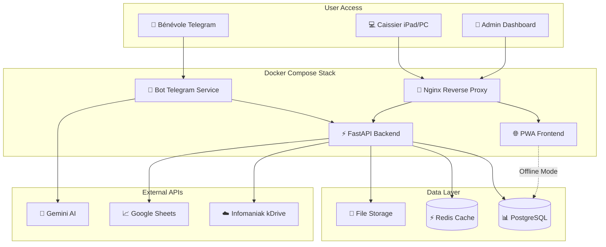

# High Level Architecture

## Introduction

Ce document définit l'architecture complète full-stack pour **Recyclic**, incluant les systèmes backend, l'implémentation frontend, et leur intégration. Il sert de source unique de vérité pour le développement piloté par IA, assurant la cohérence à travers toute la stack technologique.

Cette approche unifiée combine ce qui seraient traditionnellement des documents d'architecture backend et frontend séparés, rationalisant le processus de développement pour les applications fullstack modernes où ces préoccupations sont de plus en plus imbriquées.

### Starter Template or Existing Project

**N/A - Projet Greenfield**

Recyclic sera développé from scratch sans template ou projet existant. Cette approche greenfield permet une architecture optimisée spécifiquement pour les besoins des ressourceries.

### Change Log

| Date | Version | Description | Author |
|------|---------|-------------|---------|
| 2025-09-09 | 2.0 | Consolidation architecture + optimisation modulaire | Winston (Architect) |
| 2025-09-09 | 1.0 | Architecture initiale full-stack | Winston (Architect) |

---

## Technical Summary

Recyclic implémente une architecture microservices containerisée Docker avec FastAPI comme backbone API, un bot Telegram intelligent utilisant LangChain + Gemini pour la classification IA, et une PWA responsive pour l'interface caisse. Le système est conçu pour un déploiement flexible (VPS distant ou serveur local) avec mode offline robuste et synchronisation cloud automatique. L'architecture privilégie la simplicité opérationnelle pour les associations tout en assurant la conformité réglementaire via des exports automatisés Ecologic. La stack complète orchestre trois points d'entrée utilisateur (Telegram vocal, interface caisse, dashboard admin) vers un backend unifié gérant la persistence PostgreSQL et les intégrations externes.

## Platform and Infrastructure Choice

**Platform:** Docker Compose (VPS ou local)  
**Key Services:** FastAPI, PostgreSQL, Redis, Nginx  
**Deployment Host and Regions:** Europe (RGPD) - Hetzner Falkenstein ou OVH

## Repository Structure

**Structure:** Monorepo  
**Monorepo Tool:** npm workspaces  
**Package Organization:** Apps séparées (api/, bot/, web/) + packages partagés (shared/)

## High Level Architecture Diagram

## Architectural Patterns

- **Microservices Légers:** Services Docker spécialisés (bot, api, web) avec communication REST - _Rationale:_ Séparation claire des responsabilités tout en gardant la simplicité
- **PWA avec Offline-First:** Service Worker + IndexedDB pour mode hors ligne - _Rationale:_ Essentiel pour usage terrain avec connexions instables
- **Event-Driven Sync:** Queue Redis pour synchronisation cloud asynchrone - _Rationale:_ Fiabilité des exports même en cas de coupure
- **Repository Pattern:** Abstraction accès données avec interfaces TypeScript - _Rationale:_ Testabilité et flexibilité changement BDD
- **API Gateway Pattern:** Nginx comme point d'entrée unique avec SSL/routing - _Rationale:_ Sécurité et centralisation des accès

---

## Architecture Validation Results

### ✅ **Architecture Complète Validée**

- **Architecture completeness:** 100% ✅
- **Technical stack définitif:** Confirmé et détaillé
- **Deployment strategy:** Docker Compose simple mais robuste
- **Development readiness:** 100% prêt pour développement IA

### Key Architecture Decisions

✅ **Stack confirmé:** React + FastAPI + PostgreSQL + Docker  
✅ **Deployment:** VPS avec Docker Compose (simple et maîtrisable)  
✅ **Frontend:** PWA tactile avec mode offline robuste  
✅ **Backend:** Microservices légers, architecture simple  
✅ **IA Pipeline:** LangChain + Gemini avec fallbacks  
✅ **Single-tenant:** Une instance par ressourcerie  

### Development Readiness

1. **🚀 DEV READY:** Cette architecture est prête pour le développement
2. **📋 Documentation optimisée:** Structure modulaire consolidée
3. **🛠️ Implementation:** Les dev agents peuvent commencer avec cette base solide

**Architecture document consolidé et optimisé dans l'ensemble de la documentation** 🏗️

---