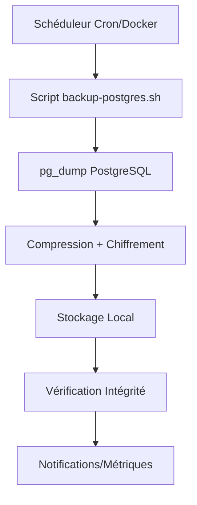

# 9. Infrastructure et Déploiement

### Infrastructure Existante

**Current Deployment:** Docker Compose local avec services isolés
**Infrastructure Tools:** Docker, docker-compose, nginx reverse proxy
**Environments:** Développement local (ports 4433/4444), staging/prod à configurer
**Current Constraints:** Bot service désactivé, migration auth en cours

### Stratégie de Déploiement Enhancement

**Deployment Approach:** Rolling deployment avec feature flags pour contrôle granular
**Infrastructure Changes:** Aucun changement d'infrastructure requis
**Pipeline Integration:** Intégration dans pipeline CI/CD existant avec tests étendus
**Rollback Strategy:** Feature flags permettent rollback immédiat sans redéploiement

### Rollback Strategy

**Rollback Method:** Feature flags + migration rollback database
**Risk Mitigation:** Tests automatisés complets avant déploiement
**Monitoring:** Métriques applicatives et erreurs utilisateur trackées
**Recovery:** Rollback automatique sur seuils d'erreur définis

---

## 9.1. Système de Sauvegarde et Récupération

### Architecture de Sauvegarde

#### Composants Principaux
- **Scripts de Sauvegarde** : Automatisation PostgreSQL avec compression et chiffrement
- **Services Docker** : Conteneurs dédiés pour l'exécution isolée des sauvegardes
- **Monitoring** : Collecte métriques et alertes temps réel
- **Récupération** : Procédures documentées pour tous les scénarios

#### Flux de Sauvegarde


### Configuration des Services

#### Service PostgreSQL Backup
```yaml
# docker-compose.backup.yml
postgres-backup:
  build:
    context: .
    dockerfile: Dockerfile.backup
    args:
      BACKUP_TIME: 2  # Heure d'exécution
  volumes:
    - ./backups:/backups
    - ./logs:/logs
  depends_on:
    postgres:
      condition: service_healthy
  profiles:
    - backup
```

#### Variables d'Environnement
```bash
# Configuration obligatoire
POSTGRES_HOST=postgres
POSTGRES_USER=recyclic
POSTGRES_PASSWORD=${POSTGRES_PASSWORD}
POSTGRES_DB=recyclic

# Configuration backup
BACKUP_COMPRESSION=true
BACKUP_ENCRYPTION=${BACKUP_ENCRYPTION:-false}
BACKUP_ENCRYPTION_KEY=${BACKUP_ENCRYPTION_KEY:-}
RETENTION_DAILY=7
RETENTION_WEEKLY=4
RETENTION_MONTHLY=12

# Notifications
NOTIFICATION_EMAIL=${NOTIFICATION_EMAIL:-}
NOTIFICATION_TELEGRAM_TOKEN=${NOTIFICATION_TELEGRAM_TOKEN:-}
NOTIFICATION_TELEGRAM_CHAT_ID=${NOTIFICATION_TELEGRAM_CHAT_ID:-}
```

### Politiques de Rétention

#### Stratégie Multi-Niveaux
- **Quotidien** : 7 jours glissants (sauvegarde automatique 02h00)
- **Hebdomadaire** : 4 semaines (créé automatiquement le dimanche)
- **Mensuel** : 12 mois (créé automatiquement le 1er du mois)

#### Algorithme de Nettoyage
```bash
# Suppression automatique des anciennes sauvegardes
find /backups -name "postgres_backup_*.dump*" -mtime +7 -delete    # Quotidien
find /backups -name "postgres_weekly_*.dump*" -mtime +28 -delete  # Hebdomadaire
find /backups -name "postgres_monthly_*.dump*" -mtime +365 -delete # Mensuel
```

### Système de Monitoring

#### Métriques Collectées
```json
{
  "basic": {
    "total_backups": 15,
    "total_size_bytes": 2147483648,
    "available_space_bytes": 10737418240
  },
  "backup": {
    "latest_backup": "postgres_backup_20250127_020000.dump.gz",
    "backup_age_hours": 2,
    "backup_size_bytes": 52428800
  },
  "retention": {
    "daily_backups_last_24h": 1,
    "weekly_backups_last_7d": 1,
    "monthly_backups_last_30d": 0,
    "old_backups_to_clean": 0
  },
  "health": {
    "health_status": "healthy",
    "health_issues_count": 0
  }
}
```

#### Seuils d'Alerte
| Métrique | Warning | Critique | Action |
|----------|---------|----------|--------|
| Âge sauvegarde | > 6h | > 25h | Notification équipe |
| Espace disque | < 5GB | < 1GB | Nettoyage urgent |
| État santé | - | unhealthy | Investigation immédiate |

### Procédures de Récupération

#### Scénarios et RTO/RPO

##### Récupération Simple (RTO: < 30min, RPO: < 1h)
**Usage** : Tests, développement, corrections mineures
**Procédure** : Restauration directe depuis dernière sauvegarde

##### Récupération Corruption Partielle (RTO: < 2h, RPO: < 1h)
**Usage** : Tables corrompues, contraintes violées
**Procédure** : Diagnostic + restauration sélective

##### Récupération Perte Complète (RTO: < 4h, RPO: < 1h)
**Usage** : Volume corrompu, crash infrastructure
**Procédure** : Reconstruction complète + restauration

##### Récupération Point-in-Time (RTO: < 4h, RPO: variable)
**Usage** : Récupération à moment précis
**Prérequis** : WAL archiving activé (extension future)

### Intégration CI/CD

#### Pipeline de Déploiement
```yaml
# .github/workflows/deploy.yml
jobs:
  backup-validation:
    runs-on: ubuntu-latest
    steps:
      - name: Validate backup system
        run: ./scripts/validate-backup-system.sh

      - name: Test recovery procedures
        run: ./scripts/test-recovery.sh

  deploy:
    needs: backup-validation
    runs-on: ubuntu-latest
    steps:
      - name: Deploy application
        run: ./scripts/deploy-prod.sh

      - name: Post-deploy backup test
        run: ./scripts/backup-postgres.sh
```

#### Tests Automatisés
- **Tests Unitaires** : Validation scripts individuels
- **Tests Intégration** : Workflow sauvegarde → vérification → alerte
- **Tests End-to-End** : Récupération complète depuis sauvegarde
- **Tests Performance** : Impact système pendant sauvegarde

### Sécurité et Conformité

#### Chiffrement des Sauvegardes
```bash
# Chiffrement AES-256
openssl enc -aes-256-cbc -salt -in backup.dump -out backup.dump.enc -k "${BACKUP_ENCRYPTION_KEY}"

# Déchiffrement
openssl enc -d -aes-256-cbc -in backup.dump.enc -out backup.dump -k "${BACKUP_ENCRYPTION_KEY}"
```

#### Accès et Permissions
- **Scripts** : Exécution limitée à utilisateur déploiement
- **Sauvegardes** : Stockage chiffré, accès restreint
- **Logs** : Audit complet des opérations sensibles

#### Conformité RGPD
- **Conservation** : Données supprimées selon politiques rétention
- **Chiffrement** : Toutes les sauvegardes chiffrées en transit et au repos
- **Accès** : Logs d'accès aux sauvegardes conservés

### Maintenance et Évolution

#### Tâches de Maintenance
- **Quotidienne** : Vérification automatique des métriques
- **Hebdomadaire** : Test des procédures de récupération
- **Mensuelle** : Revue des politiques de rétention
- **Trimestrielle** : Test de récupération complète en environnement staging

#### Métriques de Performance
- **Temps d'exécution** : Sauvegarde < 30 minutes en production
- **Taille compressée** : Ratio compression > 70%
- **Disponibilité** : Uptime système > 99.9%
- **RTO effectif** : Mesuré lors des tests de récupération

#### Plan d'Évolution
1. **Court terme** : Activation WAL archiving pour PITR
2. **Moyen terme** : Stockage cloud (AWS S3, Azure Blob)
3. **Long terme** : Orchestration Kubernetes avec backup operators

---

## Références

📖 **Guide Développeur** : [`docs/runbooks/dev-workflow-guide.md`](../../runbooks/dev-workflow-guide.md)
📖 **Guide Récupération** : [`docs/runbooks/database-recovery.md`](../../runbooks/database-recovery.md)
📖 **Scripts Infrastructure** : [`scripts/`](../../scripts/) - Tous les scripts de sauvegarde

---

*Mis à jour le 2025-01-27 | James (Dev Agent)*

