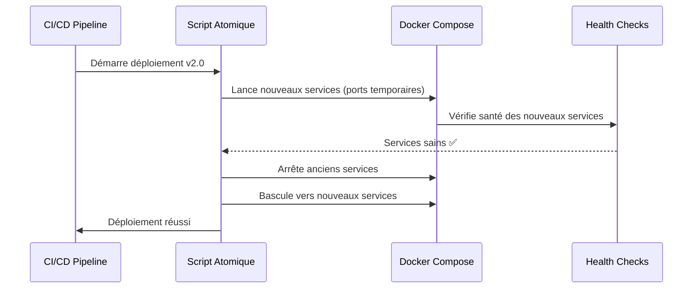
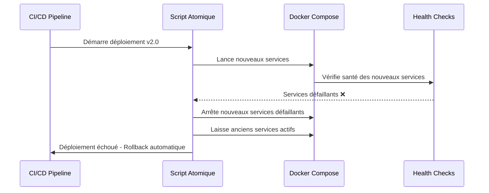

# Guide du Déploiement Atomique

## Vue d'ensemble

Le déploiement atomique de Recyclic garantit qu'aucune interruption de service ne se produit lors des mises à jour en production. Cette stratégie lance la nouvelle version des services avant d'arrêter l'ancienne, avec des vérifications de santé et un rollback automatique en cas d'échec.

## Principe de Fonctionnement

### 1. Déploiement Sans Interruption



### 2. Gestion des Échecs



## Scripts Disponibles

### 1. Script Principal : `scripts/atomic-deploy.sh`

**Usage :**
```bash
./scripts/atomic-deploy.sh <version_tag>
```

**Exemple :**
```bash
./scripts/atomic-deploy.sh abc1234
```

**Fonctionnalités :**
- Déploiement sans interruption de service
- Vérification des healthchecks avant basculement
- Rollback automatique en cas d'échec
- Nettoyage des anciennes images
- Logs détaillés avec couleurs

### 2. Script de Test : `scripts/test-atomic-deploy.sh`

**Usage :**
```bash
# Tests complets
./scripts/test-atomic-deploy.sh

# Test de déploiement réussi uniquement
./scripts/test-atomic-deploy.sh --success

# Test de déploiement échoué uniquement
./scripts/test-atomic-deploy.sh --failure
```

**Fonctionnalités :**
- Simulation de déploiements réussis et échoués
- Validation du comportement de rollback
- Tests d'intégration complets
- Nettoyage automatique des environnements de test

## Configuration

### Variables d'Environnement

| Variable | Défaut | Description |
|----------|--------|-------------|
| `DEPLOY_TIMEOUT` | 120 | Timeout en secondes pour le déploiement |
| `HEALTH_CHECK_INTERVAL` | 5 | Intervalle entre les vérifications de santé |

### Prérequis

- Docker et Docker Compose installés
- `jq` installé pour le parsing JSON
- Fichier `.env.production` configuré
- Fichier `docker-compose.yml` présent

## Workflow GitHub Actions

Le workflow de déploiement a été modifié pour utiliser le script atomique :

```yaml
- name: Deploy to production
  uses: appleboy/ssh-action@v1.0.3
  with:
    script: |
      # Use atomic deployment script
      echo "Executing atomic deployment..."
      chmod +x scripts/atomic-deploy.sh
      ./scripts/atomic-deploy.sh ${{ steps.vars.outputs.tag }}
```

## Avantages du Déploiement Atomique

### ✅ Avantages

1. **Zéro Interruption de Service** : Les utilisateurs ne subissent aucune coupure
2. **Rollback Automatique** : En cas d'échec, retour automatique à la version précédente
3. **Validation Robuste** : Vérification des healthchecks avant basculement
4. **Logs Détaillés** : Suivi complet du processus de déploiement
5. **Nettoyage Automatique** : Suppression des anciennes images et fichiers temporaires

### ⚠️ Considérations

1. **Ressources Temporaires** : Les nouveaux services utilisent des ports temporaires
2. **Durée de Déploiement** : Le processus prend plus de temps qu'un déploiement simple
3. **Complexité** : Plus de scripts à maintenir et tester

## Monitoring et Dépannage

### Logs du Déploiement

Le script génère des logs colorés pour faciliter le suivi :

- 🔵 **Info** : Informations générales
- 🟢 **Succès** : Opérations réussies
- 🟡 **Avertissement** : Situations à surveiller
- 🔴 **Erreur** : Problèmes nécessitant une intervention

### Vérification de l'État des Services

```bash
# Vérifier l'état des services
docker-compose ps

# Vérifier les healthchecks
docker-compose ps --format json | jq '.[] | {name: .Name, health: .Health}'
```

### Rollback Manuel

En cas de problème après déploiement :

```bash
# Utiliser le script de rollback existant
./scripts/rollback.sh

# Ou rollback vers une version spécifique
./scripts/rollback.sh abc1234
```

## Tests et Validation

### Tests Unitaires

```bash
# Exécuter les tests unitaires
python -m pytest tests/test_atomic_deploy_simple.py -v
```

### Tests d'Intégration

```bash
# Tests complets du déploiement atomique
./scripts/test-atomic-deploy.sh
```

### Validation Manuelle

1. **Déploiement Réussi** : Vérifier que les services sont sains
2. **Déploiement Échoué** : Vérifier que l'ancienne version reste active
3. **Rollback** : Vérifier que le rollback fonctionne correctement

## Maintenance

### Mise à Jour du Script

1. Modifier le script `atomic-deploy.sh`
2. Tester avec `test-atomic-deploy.sh`
3. Valider avec les tests unitaires
4. Déployer via le workflow GitHub Actions

### Surveillance Continue

- Monitorer les logs de déploiement
- Vérifier les métriques de performance
- Surveiller les erreurs de rollback
- Maintenir les tests à jour

## Conclusion

Le déploiement atomique de Recyclic garantit une disponibilité maximale du service tout en permettant des mises à jour sûres et contrôlées. Cette approche élimine les risques d'interruption de service et fournit un mécanisme de rollback automatique robuste.
