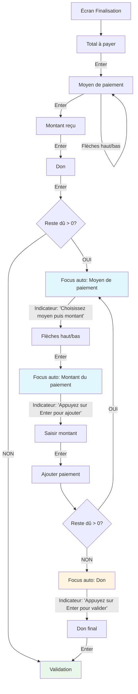

# Spécification Front-End : Workflow Clavier - Paiements Multiples

**Date:** 2025-01-27  
**Auteur:** Sally (UX Expert)  
**Contexte:** Story B52-P1 - Régression UX après ajout paiements multiples  
**Statut:** Draft - En attente de validation

---

## 0. Résumé Exécutif - Workflow Simplifié

**Question clé : "Le don est-il dans la boucle des paiements multiples ?"**

**Réponse : NON ❌** - Le don n'est **PAS** dans la boucle des paiements multiples.

### Workflow Simplifié (Exemple Concret)

**Scénario :** Client paie 50€, moitié espèces (25€), moitié chèque (25€)

1. **Premier paiement (avec don) :**
   - Total : `50` → `Enter`
   - Moyen : Espèces → `Enter`
   - Montant : `25` → `Enter`
   - **Don : `0` → `Enter`** ← Don demandé UNE SEULE FOIS ici

2. **Boucle paiements multiples (SANS don) :**
   - ✅ **Indicateur :** "Choisissez le moyen de paiement puis saisissez le montant - Reste: 25.00 €"
   - Focus auto sur "Moyen de paiement" (dans la section paiements multiples)
   - Moyen : Chèque (`Flèches haut/bas`) → `Enter`
   - ✅ **Focus auto sur "Montant du paiement"**
   - ✅ **Indicateur :** "Appuyez sur Enter pour ajouter ce paiement"
   - Montant : `25` → `Enter` ← Ajoute automatiquement
   - ✅ **Feedback :** "✓ Paiement ajouté: 25.00 € (Chèque) - Reste: 0.00 €"

3. **Don final (UNE SEULE FOIS, à la fin) :**
   - ✅ **Indicateur :** "Total couvert - Appuyez sur Enter pour valider"
   - Focus auto sur "Don"
   - Don : `0` → `Enter` ← Validation

**Résultat :** ✅ Tout au clavier, indicateurs visuels clairs, aucune souris

---

## 1. Contexte & Problème Identifié

### 1.1 Situation Actuelle

L'écran de finalisation de vente (`FinalizationScreen.tsx`) a été amélioré dans la story B49-P5 avec un workflow clavier fluide permettant de tout faire au clavier sans souris :

**Workflow B49-P5 (avant paiements multiples) :**
1. Total à payer → `Enter` → Moyen de paiement
2. Moyen de paiement → `Flèches haut/bas` → `Enter` → Montant reçu
3. Montant reçu → `Enter` → Don
4. Don → `Enter` → Validation directe

### 1.2 Régression Introduite (B52-P1)

Avec l'ajout des paiements multiples, une nouvelle section a été ajoutée :
- **Section "Ajouter un autre paiement"** (lignes 885-936)
- **Bouton "+ Ajouter"** qui nécessite un **clic souris**
- Le workflow clavier ne gère plus cette nouvelle section

**Problème :** Quand un reste dû existe, l'utilisateur doit **abandonner le clavier** et utiliser la souris pour cliquer sur "+ Ajouter", ce qui casse complètement la fluidité du workflow.

### 1.3 Impact Utilisateur

- ❌ Perte de fluidité : passage obligatoire clavier → souris → clavier
- ❌ Ralentissement du processus d'encaissement
- ❌ Frustration pour les caissiers qui travaillent principalement au clavier
- ❌ Incohérence avec le reste de l'interface qui fonctionne au clavier

---

## 2. Analyse de l'État Actuel

### 2.1 Structure Actuelle du Code

**Gestionnaires clavier existants :**
- `handleTotalKeyDown` (ligne 486) : Total → Moyen paiement
- `handlePaymentKeyDown` (ligne 506) : Moyen paiement → Montant reçu
- `handleAmountReceivedKeyDown` (ligne 496) : Montant reçu → Don
- `handleDonationKeyDown` (ligne 553) : Don → Validation

**Section paiements multiples (lignes 794-936) :**
- Affichage liste des paiements ajoutés (lignes 795-883)
- Section "Ajouter un autre paiement" avec champ de saisie et bouton (lignes 885-936)
- **Aucun gestionnaire clavier** pour cette section

### 2.2 États Possibles de l'Interface

1. **Aucun paiement ajouté** (`payments.length === 0`)
   - Workflow classique B49-P5 fonctionne
   - Section paiements multiples invisible

2. **Paiements ajoutés, reste dû > 0** (`payments.length > 0 && remainingAmount > 0`)
   - Section "Ajouter un autre paiement" visible
   - **PROBLÈME :** Nécessite clic souris sur "+ Ajouter"

3. **Paiements ajoutés, reste dû = 0** (`payments.length > 0 && remainingAmount <= 0`)
   - Section "Ajouter un autre paiement" invisible
   - Validation possible

---

## 3. Scénarios d'Utilisation

### 3.1 Scénario 1 : Paiement Unique (Cas Simple)

**Contexte :** Client paie 20€ en espèces, donne 25€

**Workflow actuel (fonctionne) :**
1. Total à payer : `20` → `Enter`
2. Moyen paiement : `Flèches` → Espèces → `Enter`
3. Montant reçu : `25` → `Enter`
4. Don : `0` → `Enter`
5. ✅ Validation automatique

**Résultat :** ✅ Fonctionne parfaitement

---

### 3.2 Scénario 2 : Paiement Multiple Simple (Cas Régressé)

**Contexte :** Client paie 50€, moitié espèces (25€), moitié chèque (25€)

**Workflow actuel (cassé) :**
1. Total à payer : `50` → `Enter`
2. Moyen paiement : `Flèches` → Espèces → `Enter`
3. Montant reçu : `25` → `Enter`
4. Don : `0` → `Enter`
5. ❌ **Reste dû : 25€** → Section "Ajouter un autre paiement" apparaît
6. ❌ **OBLIGÉ DE PRENDRE LA SOURIS** pour cliquer sur "+ Ajouter"
7. Moyen paiement : Chèque (souris)
8. Montant : `25` (clavier)
9. Clic souris sur "+ Ajouter"
10. ✅ Validation possible

**Problème :** 3 interruptions clavier/souris (étapes 6, 7, 9)

---

### 3.3 Scénario 3 : Paiement Multiple avec Reste

**Contexte :** Client paie 30€, donne 20€ en espèces, 15€ en chèque (total 35€, reste 5€)

**Workflow actuel (cassé) :**
1. Total : `30` → `Enter`
2. Moyen : Espèces → `Enter`
3. Montant : `20` → `Enter`
4. Don : `0` → `Enter`
5. ❌ Reste dû : 10€ → Souris pour "+ Ajouter"
6. Moyen : Chèque (souris)
7. Montant : `15` (clavier)
8. Clic souris "+ Ajouter"
9. ✅ Reste dû : 0€ → Validation possible

**Problème :** Interruptions multiples

---

### 3.4 Scénario 4 : Paiement Insuffisant puis Complément

**Contexte :** Client paie 2€ en espèces, donne 1€ (insuffisant), puis ajoute chèque

**Workflow actuel (cassé) :**
1. Total : `2` → `Enter`
2. Moyen : Espèces → `Enter`
3. Montant : `1` → `Enter`
4. Don : `0` → `Enter`
5. ❌ Reste dû : 1€ → Souris pour "+ Ajouter"
6. Moyen : Chèque (souris)
7. Montant : `1` (clavier)
8. Clic souris "+ Ajouter"
9. ✅ Validation

**Question clé :** Que se passe-t-il si on appuie sur `Enter` au lieu de cliquer "+ Ajouter" ?

---

## 4. Propositions de Solutions

### 4.1 Solution A : Workflow Clavier Intégré (RECOMMANDÉE)

**Principe :** Intégrer la section paiements multiples dans le workflow clavier existant

**Nouveau workflow :**

1. **Premier paiement (workflow classique) :**
   - Total → `Enter` → Moyen paiement
   - Moyen paiement → `Flèches` → `Enter` → Montant reçu
   - Montant reçu → `Enter` → Don
   - Don → `Enter` → **Si reste dû > 0 : Focus automatique sur champ "Montant du paiement"**

2. **Paiements supplémentaires :**
   - Montant du paiement → `Enter` → **Ajoute automatiquement le paiement**
   - Si reste dû > 0 : Focus reste sur "Montant du paiement" (boucle)
   - Si reste dû = 0 : Focus passe sur "Don" → `Enter` → Validation

3. **Navigation entre champs :**
   - `Tab` : Navigation séquentielle normale
   - `Enter` : Action contextuelle (ajouter paiement si possible, sinon validation)
   - `+` (touche plus) : Forcer ajout paiement même si montant = 0

**Avantages :**
- ✅ Workflow 100% clavier
- ✅ Pas de changement majeur de l'UI
- ✅ Comportement intuitif

**Inconvénients :**
- ⚠️ Nécessite gestion intelligente du focus
- ⚠️ Comportement contextuel peut être moins évident

---

### 4.2 Solution B : Touche "+" Dédiée

**Principe :** Utiliser la touche "+" (ou "=" en AZERTY) pour ajouter un paiement

**Nouveau workflow :**

1. **Premier paiement (workflow classique inchangé)**
2. **Ajout paiement :**
   - Saisir montant dans "Montant du paiement"
   - `+` (ou `=`) → Ajoute le paiement
   - Si reste dû > 0 : Focus reste sur "Montant du paiement"
   - Si reste dû = 0 : Focus passe sur "Don"

**Avantages :**
- ✅ Comportement explicite et prévisible
- ✅ Touche "+" intuitive pour "ajouter"

**Inconvénients :**
- ⚠️ Nécessite explication/training
- ⚠️ Touche "+" peut être moins accessible selon clavier

---

### 4.3 Solution C : Enter Contextuel avec Indicateur Visuel

**Principe :** `Enter` fait l'action la plus logique selon le contexte, avec indicateur visuel

**Nouveau workflow :**

1. **Premier paiement (workflow classique)**
2. **Quand reste dû > 0 :**
   - Focus automatique sur "Montant du paiement"
   - Indicateur visuel : "Appuyez sur Enter pour ajouter ce paiement"
   - `Enter` → Ajoute paiement
   - Si reste dû > 0 : Focus reste sur "Montant du paiement"
   - Si reste dû = 0 : Focus passe sur "Don" + message "Appuyez sur Enter pour valider"

**Avantages :**
- ✅ Feedback visuel clair
- ✅ Workflow guidé

**Inconvénients :**
- ⚠️ Nécessite indicateurs visuels (peut encombrer l'UI)
- ⚠️ Plus complexe à implémenter

---

### 4.4 Solution D : Mode "Paiement Multiple" Explicite

**Principe :** Toggle ou mode dédié pour activer paiements multiples

**Nouveau workflow :**

1. **Activation mode multiple :**
   - `Ctrl+M` ou bouton "Mode paiements multiples"
   - Change l'interface pour mode séquentiel

2. **Workflow en mode multiple :**
   - Chaque `Enter` ajoute un paiement
   - Focus reste sur les champs de paiement
   - `Enter` sur "Don" final → Validation

**Avantages :**
- ✅ Séparation claire des modes
- ✅ Pas d'ambiguïté

**Inconvénients :**
- ❌ Nécessite activation explicite (friction)
- ❌ Moins fluide pour cas simples

---

## 5. Recommandation : Solution A + B (Hybride) avec Indicateurs Visuels

### 5.1 Workflow Proposé - Diagramme de Flux



### 5.2 Workflow Détaillé avec Indicateurs Visuels

**IMPORTANT : Le "Don" n'est PAS dans la boucle des paiements multiples.**

#### Phase 1 : Premier Paiement (Workflow Classique)

1. **Total à payer** → `Enter` → **Moyen de paiement**
2. **Moyen de paiement** → `Flèches haut/bas` → `Enter` → **Montant reçu**
3. **Montant reçu** → `Enter` → **Don** (pour ce premier paiement)
4. **Don** → `Enter` → **Décision : Reste dû > 0 ?**

#### Phase 2A : Si Reste Dû > 0 (Boucle Paiements Multiples)

**Le "Don" est sorti de la boucle** - on ne le demande plus pour chaque paiement supplémentaire.

5. **Focus automatique sur "Moyen de paiement"** (dans la section paiements multiples)
   - **Indicateur visuel affiché :** 
     ```
     💡 Choisissez le moyen de paiement puis saisissez le montant
     Reste à payer: X.XX €
     ```
6. **Moyen de paiement** → `Flèches haut/bas` pour choisir → `Enter` → **Focus auto sur "Montant du paiement"**
   - **Indicateur visuel mis à jour :**
     ```
     💡 Appuyez sur Enter pour ajouter ce paiement
     Reste à payer: X.XX €
     ```
7. **Saisir montant** → `Enter` → **Paiement ajouté automatiquement**
8. **Si reste dû > 0 :** Focus retourne sur "Moyen de paiement" → **Retour à l'étape 5** (boucle)
9. **Si reste dû = 0 :** Focus passe sur "Don" → **Phase 2B**

#### Phase 2B : Don Final (Une Seule Fois)

9. **Focus automatique sur "Don"**
   - **Indicateur visuel affiché :**
     ```
     ✅ Total couvert
     💡 Appuyez sur Enter pour valider la vente
     ```
10. **Saisir don** (optionnel) → `Enter` → **Validation**

#### Phase 3 : Validation

11. **Vente enregistrée** ✅

### 5.3 Navigation Avancée

- **`Tab`** : Navigation séquentielle normale entre tous les champs
- **`Shift+Tab`** : Navigation inverse
- **`+` (ou `=`) :** Force l'ajout du paiement même si montant = 0 ou invalide
- **`Flèches haut/bas`** : Navigation dans le select "Moyen de paiement"

### 5.2 Gestion des Cas Limites

**Cas 1 : Montant insuffisant**
- Si montant saisi < reste dû : `Enter` ajoute quand même (montant limité au reste dû)
- Message visuel : "Montant limité à X€ (reste dû)"

**Cas 2 : Montant > reste dû**
- Si montant saisi > reste dû : `Enter` ajoute avec montant = reste dû
- Message visuel : "Montant ajusté à X€ (reste dû)"

**Cas 3 : Montant = 0**
- `Enter` ne fait rien (ou focus sur moyen de paiement)
- `+` force l'ajout avec montant = 0 (utile pour "gratuit")

**Cas 4 : Changement de moyen de paiement**
- `Tab` pour naviguer vers "Moyen de paiement"
- `Flèches haut/bas` pour changer
- `Enter` pour valider et revenir à "Montant du paiement"

---

## 6. Spécifications Techniques

### 6.1 Nouveaux Gestionnaires Clavier

```typescript
// Nouveau gestionnaire pour le champ "Montant du paiement"
const handleCurrentPaymentAmountKeyDown = (e: React.KeyboardEvent<HTMLInputElement>) => {
  if (e.key === 'Enter') {
    e.preventDefault();
    // Si montant valide et reste dû > 0, ajouter le paiement
    if (currentPaymentAmount && parseFloat(currentPaymentAmount) > 0 && remainingAmount > 0) {
      handleAddPayment();
      // Si reste dû > 0, retourner au focus sur "Moyen de paiement" (boucle)
      // Sinon, passer au focus sur Don
      if (remainingAmount <= 0) {
        donationRef.current?.focus();
      } else {
        // Focus retourne sur "Moyen de paiement" pour le prochain paiement
        paymentSelectRef.current?.focus();
      }
    }
  } else if (e.key === '+' || e.key === '=') {
    e.preventDefault();
    // Force l'ajout même si montant = 0
    handleAddPayment();
    // Même logique de focus après ajout
    if (remainingAmount <= 0) {
      donationRef.current?.focus();
    } else {
      paymentSelectRef.current?.focus();
    }
  }
};

// Nouveau gestionnaire pour le "Moyen de paiement" dans la section paiements multiples
const handlePaymentMethodInLoopKeyDown = (e: React.KeyboardEvent<HTMLSelectElement>) => {
  if (e.key === 'Enter') {
    e.preventDefault();
    e.stopPropagation();
    // Valider la valeur en attente si elle existe
    if (pendingPaymentMethod !== null) {
      setPaymentMethod(pendingPaymentMethod);
      setPendingPaymentMethod(null);
    }
    // Enter sur "Moyen de paiement" → Focus "Montant du paiement"
    if (currentPaymentAmountRef.current) {
      currentPaymentAmountRef.current.focus();
    }
  } else if (e.key === 'ArrowUp' || e.key === 'ArrowDown') {
    e.preventDefault();
    e.stopPropagation();
    // Navigation flèches haut/bas - même logique que le premier paiement
    const currentMethod = pendingPaymentMethod !== null ? pendingPaymentMethod : effectivePaymentMethod;
    if (e.key === 'ArrowUp') {
      if (currentMethod === 'free') {
        setPendingPaymentMethod('check');
      } else if (currentMethod === 'check') {
        setPendingPaymentMethod('cash');
      } else if (currentMethod === 'cash') {
        setPendingPaymentMethod('free');
      }
    } else if (e.key === 'ArrowDown') {
      if (currentMethod === 'cash') {
        setPendingPaymentMethod('check');
      } else if (currentMethod === 'check') {
        setPendingPaymentMethod('free');
      } else if (currentMethod === 'free') {
        setPendingPaymentMethod('cash');
      }
    }
    requestAnimationFrame(() => {
      if (paymentSelectRef.current) {
        paymentSelectRef.current.focus();
      }
    });
  }
};

// Modification de handleDonationKeyDown
const handleDonationKeyDown = (e: React.KeyboardEvent<HTMLInputElement>) => {
  if (e.key === 'Enter') {
    e.preventDefault();
    // Si reste dû > 0, ne pas valider, mais focus sur "Montant du paiement"
    if (remainingAmount > 0) {
      // Focus sur le champ "Montant du paiement"
      currentPaymentAmountRef.current?.focus();
    } else if (canConfirm) {
      // Validation directe
      handleSubmit(e as any);
    }
  }
};
```

### 6.2 Modifications du Focus Auto

```typescript
// Modification de l'effet de focus auto après ajout d'un paiement
useEffect(() => {
  if (payments.length > 0 && remainingAmount > 0) {
    // Focus automatique sur "Moyen de paiement" après ajout (pour boucle cohérente)
    const focusTimeout = setTimeout(() => {
      paymentSelectRef.current?.focus();
    }, 100);
    return () => clearTimeout(focusTimeout);
  }
}, [payments, remainingAmount]);

// Focus auto sur "Moyen de paiement" quand on entre dans la boucle (après premier paiement)
useEffect(() => {
  if (payments.length === 0 && remainingAmount > 0) {
    // On vient de finir le premier paiement, entrer dans la boucle
    const focusTimeout = setTimeout(() => {
      paymentSelectRef.current?.focus();
    }, 150);
    return () => clearTimeout(focusTimeout);
  }
}, [payments.length, remainingAmount]);
```

### 6.3 Indicateurs Visuels (OBLIGATOIRES)

**Principe :** Toujours afficher un indicateur visuel clair pour guider l'utilisateur.

#### Indicateur 1 : Quand Focus sur "Moyen de paiement" (Reste dû > 0, Boucle)

**Emplacement :** Sous le select "Moyen de paiement" (dans la section paiements multiples)

**Contenu :**
```tsx
<div style={{
  marginTop: '0.5rem',
  padding: '0.75rem',
  background: '#e1f5ff',
  border: '1px solid #2c5530',
  borderRadius: '4px',
  fontSize: '0.9rem'
}}>
  💡 <strong>Choisissez le moyen de paiement puis saisissez le montant</strong><br/>
  Reste à payer: {remainingAmount.toFixed(2)} €<br/>
  <span style={{ fontSize: '0.85rem', color: '#666', marginTop: '0.25rem', display: 'block' }}>
    (Flèches haut/bas pour changer, Enter pour valider)
  </span>
</div>
```

**Conditions d'affichage :**
- Focus sur "Moyen de paiement" (dans section paiements multiples)
- `remainingAmount > 0`
- `payments.length > 0` (au moins un paiement déjà ajouté)

#### Indicateur 1B : Quand Focus sur "Montant du paiement" (Reste dû > 0, Après choix moyen)

**Emplacement :** Sous le champ "Montant du paiement"

**Contenu :**
```tsx
<div style={{
  marginTop: '0.5rem',
  padding: '0.75rem',
  background: '#e1f5ff',
  border: '1px solid #2c5530',
  borderRadius: '4px',
  fontSize: '0.9rem'
}}>
  💡 <strong>Appuyez sur Enter pour ajouter ce paiement</strong><br/>
  Reste à payer: {remainingAmount.toFixed(2)} €
  {currentPaymentAmount && parseFloat(currentPaymentAmount) > 0 && (
    <span style={{ display: 'block', marginTop: '0.25rem', color: '#666' }}>
      (Raccourci: + pour forcer l'ajout)
    </span>
  )}
</div>
```

**Conditions d'affichage :**
- Focus sur "Montant du paiement"
- `remainingAmount > 0`
- Section "Ajouter un autre paiement" visible

#### Indicateur 2 : Quand Focus sur "Don" (Reste dû = 0)

**Emplacement :** Sous le champ "Don"

**Contenu :**
```tsx
<div style={{
  marginTop: '0.5rem',
  padding: '0.75rem',
  background: '#e8f5e9',
  border: '1px solid #4caf50',
  borderRadius: '4px',
  fontSize: '0.9rem'
}}>
  ✅ <strong>Total couvert</strong><br/>
  💡 <strong>Appuyez sur Enter pour valider la vente</strong>
</div>
```

**Conditions d'affichage :**
- Focus sur "Don"
- `remainingAmount <= 0`
- `payments.length > 0` (au moins un paiement ajouté)

#### Indicateur 3 : Quand Focus sur "Don" (Paiement Unique, Pas de Reste)

**Emplacement :** Sous le champ "Don"

**Contenu :**
```tsx
<div style={{
  marginTop: '0.5rem',
  padding: '0.75rem',
  background: '#e8f5e9',
  border: '1px solid #4caf50',
  borderRadius: '4px',
  fontSize: '0.9rem'
}}>
  💡 <strong>Appuyez sur Enter pour valider la vente</strong>
</div>
```

**Conditions d'affichage :**
- Focus sur "Don"
- `payments.length === 0` (paiement unique)
- `canConfirm === true`

#### Indicateur 4 : Feedback après Ajout Paiement

**Emplacement :** Temporaire, en haut de la section paiements multiples

**Contenu :**
```tsx
{showPaymentAddedFeedback && (
  <div style={{
    padding: '0.5rem',
    background: '#4caf50',
    color: 'white',
    borderRadius: '4px',
    marginBottom: '0.5rem',
    fontSize: '0.875rem',
    textAlign: 'center'
  }}>
    ✓ Paiement ajouté: {lastAddedPaymentAmount} € ({lastAddedPaymentMethod})
    {remainingAmount > 0 && ` - Reste: ${remainingAmount.toFixed(2)} €`}
  </div>
)}
```

**Conditions d'affichage :**
- Immédiatement après `handleAddPayment()`
- Affiché pendant 2 secondes, puis disparaît

---

## 7. Scénarios de Test

### 7.1 Test 1 : Paiement Unique (Régression)

**Objectif :** Vérifier que le workflow simple fonctionne toujours

**Steps :**
1. Ouvrir écran finalisation
2. Total : `20` → `Enter`
3. Moyen : Espèces → `Enter`
4. Montant : `25` → `Enter`
5. Don : `0` → `Enter`

**Résultat attendu :** ✅ Validation automatique (comportement inchangé)

---

### 7.2 Test 2 : Paiement Multiple Simple

**Objectif :** Vérifier le workflow clavier pour paiements multiples

**Steps :**
1. Total : `50` → `Enter`
2. Moyen : Espèces → `Enter`
3. Montant : `25` → `Enter`
4. Don : `0` → `Enter` (don pour le premier paiement uniquement)
5. **✅ Indicateur visible :** "Choisissez le moyen de paiement puis saisissez le montant - Reste: 25.00 €"
6. **Focus auto sur "Moyen de paiement"** (section paiements multiples)
7. Moyen : Chèque (`Flèches haut/bas`) → `Enter`
8. **✅ Focus auto sur "Montant du paiement"**
9. **✅ Indicateur visible :** "Appuyez sur Enter pour ajouter ce paiement - Reste: 25.00 €"
10. Montant : `25` → `Enter`
11. **✅ Feedback visible :** "✓ Paiement ajouté: 25.00 € (Chèque) - Reste: 0.00 €"
12. **✅ Indicateur visible :** "Total couvert - Appuyez sur Enter pour valider"
13. **Focus auto sur "Don"** → `Enter`
14. ✅ Validation

**Résultat attendu :** ✅ Tout au clavier, indicateurs visuels clairs, aucune souris nécessaire, workflow cohérent (Moyen → Montant)

---

### 7.3 Test 3 : Paiement Multiple avec Reste

**Objectif :** Vérifier gestion du reste et boucle de paiements

**Steps :**
1. Total : `30` → `Enter`
2. Moyen : Espèces → `Enter`
3. Montant : `20` → `Enter`
4. Don : `0` → `Enter`
5. **Focus auto sur "Moyen de paiement"** (section paiements multiples)
6. Moyen : Chèque (`Flèches haut/bas`) → `Enter`
7. **Focus auto sur "Montant du paiement"**
8. Montant : `15` → `Enter`
9. **Paiement ajouté, reste dû = 0**
10. **Focus auto sur "Don"** → `Enter`
11. ✅ Validation

**Résultat attendu :** ✅ Gestion correcte du reste, focus intelligent, workflow cohérent (Moyen → Montant)

---

### 7.4 Test 4 : Touche "+" pour Forcer Ajout

**Objectif :** Vérifier la touche "+" pour forcer l'ajout

**Steps :**
1. Total : `10` → `Enter`
2. Moyen : Espèces → `Enter`
3. Montant : `5` → `Enter`
4. Don : `0` → `Enter`
5. Focus sur "Montant du paiement"
6. Montant : `0` → `+`
7. **Paiement ajouté avec montant = 0**

**Résultat attendu :** ✅ Touche "+" force l'ajout même avec montant = 0

---

## 8. Plan d'Implémentation

### Phase 1 : Modifications Core (Priorité Haute)
- [ ] Ajouter `currentPaymentAmountRef` pour le champ "Montant du paiement"
- [ ] Implémenter `handleCurrentPaymentAmountKeyDown`
- [ ] Implémenter `handlePaymentMethodInLoopKeyDown` (nouveau gestionnaire pour moyen de paiement dans la boucle)
- [ ] Modifier `handleDonationKeyDown` pour gérer le reste dû
- [ ] Modifier effet de focus auto : après ajout paiement → Focus sur "Moyen de paiement" (pas Montant)
- [ ] Ajouter effet de focus auto : entrée dans boucle → Focus sur "Moyen de paiement"
- [ ] **Ajouter indicateurs visuels (OBLIGATOIRE)** :
  - [ ] Indicateur "Choisissez le moyen puis le montant" (focus sur Moyen, reste > 0, boucle)
  - [ ] Indicateur "Appuyez sur Enter pour ajouter" (focus sur Montant, reste > 0)
  - [ ] Indicateur "Total couvert - Appuyez sur Enter pour valider" (focus sur Don, reste = 0)
  - [ ] Feedback temporaire après ajout paiement (2 secondes)

### Phase 2 : Améliorations UX (Priorité Moyenne)
- [ ] Gérer cas limites (montant insuffisant, montant > reste dû)
- [ ] Améliorer messages d'erreur/feedback
- [ ] Support touche "+" et "=" (AZERTY/QWERTY)
- [ ] Animation douce pour les indicateurs (fade in/out)

### Phase 3 : Tests & Validation (Priorité Haute)
- [ ] Tests unitaires pour nouveaux gestionnaires clavier
- [ ] Tests d'intégration pour workflow complet
- [ ] Tests E2E avec scénarios réels
- [ ] Validation avec utilisateurs (caissiers)

---

## 9. Questions Ouvertes

1. **Touche "+" vs "=" :** Faut-il supporter les deux (AZERTY/QWERTY) ou seulement "+" ?
   - **Recommandation :** Supporter les deux (`e.key === '+' || e.key === '='`)
2. **Indicateurs visuels :** ✅ **RÉSOLU** - Indicateurs visuels obligatoires (voir section 6.3)
3. **Validation automatique :** Quand reste dû = 0, faut-il valider automatiquement ou attendre Enter sur "Don" ?
   - **Recommandation :** Attendre Enter sur "Don" pour permettre de saisir un don final
4. **Suppression paiement :** Faut-il un raccourci clavier pour supprimer un paiement (ex: `Delete` sur un paiement) ?
   - **Recommandation :** Pour l'instant, garder le bouton souris. Si besoin, ajouter `Delete` sur un paiement sélectionné (Phase 2)

---

## 10. Conclusion

La régression UX introduite par B52-P1 est **critique** car elle casse complètement la fluidité du workflow clavier. La **Solution A + B (Hybride)** proposée permet de :

- ✅ Restaurer la fluidité clavier complète
- ✅ Maintenir la compatibilité avec le workflow existant
- ✅ Gérer tous les cas d'usage (paiement unique, multiple, avec reste)
- ✅ Offrir des raccourcis intuitifs (`Enter`, `+`)

**Prochaine étape :** Validation de cette spécification avec l'équipe et les utilisateurs (caissiers) avant implémentation.

---

**Document créé par :** Sally (UX Expert)  
**Date :** 2025-01-27  
**Version :** 1.0

