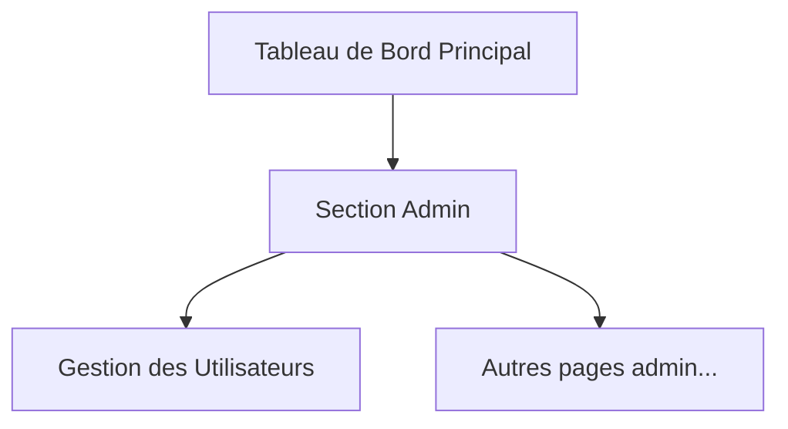

# Périmètre FINAL de l'Interface de Gestion des Utilisateurs (Story 5.4)

| Catégorie  | Fonctionnalité                                                                                 | Statut              |
| ---------- | ---------------------------------------------------------------------------------------------- | ------------------- |
| **IN**     | Afficher la liste des utilisateurs (Nom, Nom d'utilisateur, Rôle, Statut, Date de création)    | ✅ Dans le périmètre |
| **IN**     | Filtrer la liste par Rôle et par Statut                                                        | ✅ Dans le périmètre |
| **IN**     | Modifier le rôle d'un utilisateur                                                              | ✅ Dans le périmètre |
| **IN**     | Modifier le **statut** d'un utilisateur (Actif/Inactif)                                        | ✅ Dans le périmètre |
| **IN**     | Modifier les informations de profil (ex: Nom, Nom d'utilisateur) - **Implique un dev backend** | ✅ Dans le périmètre |
| **IN**     | Afficher une notification de succès après une modification                                     | ✅ Dans le périmètre |
| **OUT**    | Suppression définitive d'un utilisateur                                                        | ❌ Hors périmètre    |
| **OUT**    | Voir l'historique des changements de rôle                                                      | ❌ Hors périmètre    |
| **FUTURE** | Exporter la liste des utilisateurs (CSV, etc.)                                                 | 💡 Pour plus tard   |
| **FUTURE** | Recherche par nom ou nom d'utilisateur                                                         | 💡 Pour plus tard   |
| **FUTURE** | Pagination du tableau                                                                          | 💡 Pour plus tard   |
| **FUTURE** | Actions en masse (ex: changer le rôle de plusieurs utilisateurs)                               | 💡 Pour plus tard   |
| **FUTURE** | Créer un nouvel utilisateur                                                                    | 💡 Pour plus tard   |




 ``` mermaid
  graph TD
      A[Début] --> B{Accède à la page /admin/users};
      B --> C{Localise l'utilisateur dans le tableau};
      C --> D{Clique sur l'action 'Modifier le rôle'};
      D --> E[Un menu déroulant avec les rôles s'affiche];
      E --> F{Sélectionne le nouveau rôle};
      F --> G[Confirme la sélection];
      G --> H{Appel API pour mettre à jour le rôle};
      H -- Succès --> I[Notification de succès affichée];
      I --> J[Le tableau se met à jour avec le nouveau rôle];
      J --> K[Fin];
      H -- Échec --> L[Notification d'erreur affichée];
      L --> K[Fin];
  ```
