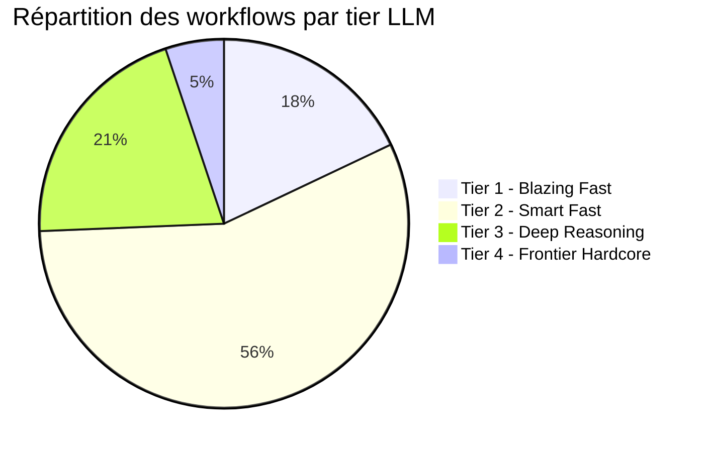

# Rapport BMAD : Puissance LLM requise par agent et workflow

**Date** : 2026-03-16  
**Projet** : JARVOS_recyclique (RecyClique)  
**Usage** : Source de vérité pour dimensionnement des modèles LLM par agent et workflow BMAD ; conçu pour alimenter Notebook LM (génération de visuels, synthèses, présentations).

---

## Contexte et objectif du document

Ce rapport cartographie **tous les agents** (BMAD BMM + agents Cursor du projet) et **tous les workflows** du framework BMAD vers **quatre tiers de puissance LLM**, définis selon les benchmarks et offres du marché (mars 2026). Il permet de :

- Choisir le bon modèle par type de tâche (vitesse vs raisonnement).
- Réduire les coûts en évitant d’utiliser un modèle « frontier » pour des tâches simples.
- Configurer les agents Cursor (champ `model` dans le frontmatter) pour appliquer ces recommandations.

Les données sont structurées pour permettre la génération de visuels (graphiques en secteurs, tableaux de bord, cartes agents/tiers, flux par phase).

---

## 1. Les quatre tiers LLM (définition)

### Tier 1 — Blazing Fast (vitesse max, puissance minimale)

| Critère | Valeur |
|--------|--------|
| **Modèles typiques** | Gemini Flash Lite, GPT-4o Mini, Claude Haiku 4.5 |
| **Latence** | TTFT < 700 ms, débit > 200 tok/s |
| **SWE-bench (codage)** | ~72–73 % |
| **Usage recommandé** | Routage, classification, opérations fichiers, génération de texte simple, orchestration sans raisonnement profond |

### Tier 2 — Smart Fast (équilibre vitesse / intelligence)

| Critère | Valeur |
|--------|--------|
| **Modèles typiques** | Gemini 3 Flash, Claude Sonnet 4.6 (mode standard) |
| **Latence** | TTFT ~1–2 s, débit ~100–200 tok/s |
| **SWE-bench** | 78–80 % |
| **Usage recommandé** | Génération de code, analyse structurée, stories, specs UX, tests, documentation technique |

### Tier 3 — Deep Reasoning (intelligence élevée, raisonnement)

| Critère | Valeur |
|--------|--------|
| **Modèles typiques** | Claude Sonnet 4.6 (extended thinking), GPT-5.2 (reasoning mode) |
| **Latence** | Variable (temps de « thinking ») |
| **SWE-bench** | 80 %+ |
| **Usage recommandé** | Décisions d’architecture, revues adversariales, validation croisée, PRD complexes, orchestration multi-étapes |

### Tier 4 — Frontier Hardcore (puissance maximale)

| Critère | Valeur |
|--------|--------|
| **Modèles typiques** | Claude Opus 4.5, GPT-5.2 (full reasoning) |
| **SWE-bench** | 80,9 % (Opus), 100 % AIME (GPT-5.2) |
| **Usage recommandé** | Validation de livrables critiques avec un **LLM différent** de celui qui a produit (recommandation BMAD) ; audits sécurité ; raisonnement mathématique / logique avancé |

---

## 2. Cartographie des agents BMAD (module BMM)

Chaque agent BMAD est associé à un tier en fonction du type de travail qu’il effectue.

| Agent | Persona | Tier | Justification |
|-------|---------|------|---------------|
| **bmad-master** | BMad Master | Tier 1 | Routage pur, chargement de ressources ; aucune génération de contenu |
| **analyst** | Mary | Tier 2 | Recherche marché/domaine, SWOT ; raisonnement structuré mais pas profond |
| **architect** | Winston | Tier 3 | ADRs, trade-offs techniques, décisions d’architecture ; raisonnement critique |
| **dev** | Amelia | Tier 2 | Implémentation de code suivant des specs détaillées, TDD |
| **pm** | John | Tier 2–3 | PRD = Tier 3 (création) ; Edit/Validate = Tier 2 ; Epics = Tier 2 |
| **qa** | Quinn | Tier 2 | Génération de tests API/E2E ; patterns standards |
| **sm** | Bob | Tier 2 | Sprint planning, création de stories ; structuration |
| **ux-designer** | Sally | Tier 2 | Specs UX, user flows ; conception structurée |
| **tech-writer** | Paige | Tier 1–2 | Documentation = Tier 1 ; diagrammes Mermaid complexes = Tier 2 |
| **quick-flow-solo-dev** | Barry | Tier 2 | Quick specs + implémentation légère |

**Résumé par tier (agents BMAD)** : Tier 1 = 1 agent ; Tier 2 = 7 agents (dont 1 en Tier 1–2) ; Tier 3 = 1 agent ; Tier 2–3 = 1 agent.

---

## 3. Cartographie des agents Cursor (subagents du projet)

Les agents définis dans `.cursor/agents/` sont utilisés pour l’orchestration BMAD Autopilot et les spécialistes projet.

| Agent Cursor | Tier | Justification |
|--------------|------|---------------|
| **bmad-orchestrator** | Tier 3 | Orchestration multi-phases, état partagé, escalades HITL, décisions de routage complexes |
| **bmad-sm** | Tier 2 | Création et validation de stories ; travail structuré |
| **bmad-dev** | Tier 2 | Implémentation de stories ; suit les specs, génère du code |
| **bmad-revisor** | Tier 2 | Relecture structurée, vérification de complétude |
| **bmad-qa** | Tier 3 | Review adversarial ; doit trouver des failles ; raisonnement critique |
| **depot-specialist** | Tier 1 | Classification de fichiers, opérations de déplacement ; pas de raisonnement profond |
| **git-specialist** | Tier 1 | Commandes Git standards ; workflow procéduralisé |
| **browser-views-audit-temp** | Tier 2 | Comparaison visuelle, captures d’écran, rapport structuré |

**Résumé par tier (agents Cursor)** : Tier 1 = 2 ; Tier 2 = 5 ; Tier 3 = 2.

---

## 4. Cartographie des workflows par phase

Chaque workflow BMAD est associé à un agent et à un tier. Les phases correspondent au flux BMM (Analysis → Planning → Solutioning → Implementation).

### Phase 1 — Analysis

| Workflow | Code | Agent | Tier |
|----------|------|-------|------|
| Brainstorm Project | BP | analyst (Mary) | Tier 2 |
| Market Research | MR | analyst | Tier 2 |
| Domain Research | DR | analyst | Tier 2 |
| Technical Research | TR | analyst | Tier 2 |
| Create Brief | CB | analyst | Tier 2 |

**Total Phase 1** : 5 workflows ; tous Tier 2.

### Phase 2 — Planning

| Workflow | Code | Agent | Tier |
|----------|------|-------|------|
| Create PRD | CP | pm (John) | Tier 3 |
| Validate PRD | VP | pm | Tier 3 (idéalement Tier 4 avec LLM différent) |
| Edit PRD | EP | pm | Tier 2 |
| Create UX | CU | ux-designer (Sally) | Tier 2 |

**Total Phase 2** : 4 workflows ; Tier 2 = 2, Tier 3 = 2 (dont 1 recommandé Tier 4).

### Phase 3 — Solutioning

| Workflow | Code | Agent | Tier |
|----------|------|-------|------|
| Create Architecture | CA | architect (Winston) | Tier 3 |
| Create Epics and Stories | CE | pm | Tier 2 |
| Check Implementation Readiness | IR | architect | Tier 3 (idéalement Tier 4, validation croisée) |

**Total Phase 3** : 3 workflows ; Tier 2 = 1, Tier 3 = 2 (dont 1 recommandé Tier 4).

### Phase 4 — Implementation

| Workflow | Code | Agent | Tier |
|----------|------|-------|------|
| Sprint Planning | SP | sm (Bob) | Tier 2 |
| Sprint Status | SS | sm | Tier 1 |
| Create Story | CS | sm | Tier 2 |
| Validate Story | VS | sm | Tier 2 |
| Dev Story | DS | dev (Amelia) | Tier 2 |
| QA Automation | QA | qa (Quinn) | Tier 2 |
| Code Review | CR | dev | Tier 3 |
| Retrospective | ER | sm | Tier 2 |

**Total Phase 4** : 8 workflows ; Tier 1 = 1, Tier 2 = 6, Tier 3 = 1.

### Workflows « Anytime » (hors phase)

| Workflow | Code | Agent | Tier |
|----------|------|-------|------|
| Document Project | DP | analyst | Tier 2 |
| Generate Project Context | GPC | analyst | Tier 2 |
| Quick Spec | QS | quick-flow-solo-dev (Barry) | Tier 2 |
| Quick Dev | QD | quick-flow-solo-dev | Tier 2 |
| Correct Course | CC | sm | Tier 3 |
| Write Document | WD | tech-writer (Paige) | Tier 1–2 |
| Mermaid Generate | MG | tech-writer | Tier 2 |
| Validate Document | VD | tech-writer | Tier 2 |
| Explain Concept | EC | tech-writer | Tier 1 |

**Total Anytime** : 9 workflows ; Tier 1 = 1, Tier 1–2 = 1, Tier 2 = 6, Tier 3 = 1.

### Core Tasks (hors BMM)

| Task | Code | Tier |
|------|------|------|
| Help | BH | Tier 1 |
| Index Docs | ID | Tier 1 |
| Shard Document | SD | Tier 1 |
| Editorial Review — Prose | EP | Tier 2 |
| Editorial Review — Structure | ES | Tier 2 |
| Adversarial Review (General) | AR | Tier 3 |
| Brainstorming | BSP | Tier 2 |
| Party Mode | PM | Tier 2–3 |

**Total Core** : 8 tâches ; Tier 1 = 3, Tier 2 = 3, Tier 2–3 = 1, Tier 3 = 1.

---

## 5. Synthèse : distribution par tier (chiffres pour visuels)

### Comptage des workflows et tâches par tier

Pour les visuels (camemberts, barres), on compte chaque workflow ou tâche une fois, en attribuant les cas « Tier 2–3 » ou « Tier 1–2 » au tier principal (Tier 2 ou Tier 1 selon le contexte). Version simplifiée :

| Tier | Nombre d’entrées (workflows + core tasks) | Pourcentage arrondi |
|------|-------------------------------------------|----------------------|
| **Tier 1 — Blazing Fast** | 7 | 18 % |
| **Tier 2 — Smart Fast** | 22 | 56 % |
| **Tier 3 — Deep Reasoning** | 8 | 21 % |
| **Tier 4 — Frontier Hardcore** | 2 (recommandés, pas toujours disponibles) | 5 % |

**Total** : 39 entrées (workflows BMM + core tasks).

### Représentation Mermaid (camembert)

### Observations clés

- **Environ 56 %** des workflows/tâches fonctionnent en **Tier 2** — c’est le cœur de la productivité BMAD (code, specs, stories, docs).
- **Environ 20 %** nécessitent du **Tier 3** — workflows critiques : architecture, PRD, code review adversarial, orchestration, Correct Course.
- **Environ 18 %** peuvent tourner en **Tier 1** — tâches procédurales : routage, Git, fichiers, help, index, shard.
- **2 cas** justifient le **Tier 4** : Validate PRD et Implementation Readiness, avec un **LLM différent** de celui qui a produit le livrable (recommandation BMAD).

### Impact coût et performance (ordre de grandeur)

En utilisant le bon tier par workflow au lieu de tout faire en Tier 3+ :

- **Économie potentielle** : 60–70 % sur le budget tokens global.
- **Gain de vitesse** : 2–4× sur les tâches Tier 1 (latence réduite).
- **Qualité** : les workflows critiques (Tier 3/4) conservent la puissance nécessaire.

---

## 6. Recommandations pratiques pour le projet RecyClique

### Par type d’agent Cursor

| Tier | Modèle Cursor équivalent | Agents concernés |
|------|---------------------------|-------------------|
| Tier 1 | Modèle « fast » | depot-specialist, git-specialist ; commandes help, index-docs, shard-doc |
| Tier 2 | Modèle par défaut | bmad-dev, bmad-sm, bmad-revisor, browser-views-audit-temp ; majorité des workflows |
| Tier 3 | Modèle « haute capacité » | bmad-orchestrator, bmad-qa ; architecture, PRD, code review |
| Tier 4 | LLM externe différent | Validate PRD, Implementation Readiness — utiliser un autre fournisseur (ex. si Cursor = Claude, valider avec GPT-5.2 ou inverse) |

### Quand lancer quel modèle

- **Orchestrateur BMAD Autopilot** : s’assurer que le modèle principal Cursor est un Tier 3 (ex. Claude Sonnet extended thinking, ou le plus puissant du plan).
- **Code review adversarial** : idem, Tier 3.
- **Ventilation dépôt, Git** : modèle fast suffit (déjà configuré via `model: fast` dans les agents).
- **Avant tout run** : consulter d’abord le conseiller global user-level pour obtenir la recommandation de tier / modèle du run (et, si besoin, du lot de sous-agents), puis valider explicitement avant lancement. Éviter les micro-pauses dans chaque sous-agent.

---

## 7. Configuration appliquée dans les agents Cursor

### Champ `model` dans le frontmatter (Cursor)

Les fichiers `.cursor/agents/*.md` acceptent dans le YAML :

| Valeur | Effet |
|--------|--------|
| `model: fast` | Force le modèle rapide (équivalent Tier 1), quel que soit le modèle principal |
| `model: inherit` | Hérite du modèle sélectionné dans l’interface Cursor |
| `model: <model-id>` | Modèle spécifique par identifiant (nécessite Max Mode) |

**Prérequis** : `model: fast` est actif en toutes circonstances. Pour un `model-id` spécifique, Max Mode doit être activé (Paramètres → Model Picker).

### État après application (2026-03-16)

| Agent | Champ `model` | Tier cible |
|-------|----------------|------------|
| bmad-orchestrator | `inherit` | Tier 3 |
| bmad-qa | `inherit` | Tier 3 |
| bmad-dev | `inherit` | Tier 2 |
| bmad-sm | `inherit` | Tier 2 |
| bmad-revisor | `inherit` | Tier 2 |
| browser-views-audit-temp | `inherit` | Tier 2 |
| **depot-specialist** | **`fast`** | Tier 1 |
| **git-specialist** | **`fast`** | Tier 1 |

Historique projet : **depot-specialist** et **git-specialist** ont reçu `model: fast`. **browser-views-audit-temp** a reçu `model: inherit` pour alignement explicite avec les autres agents Tier 2. La recommandation de modèle et la validation humaine ont ensuite été déplacées vers un **conseiller global user-level** appelé en entrée du run, afin d'éviter une pause répétée dans chaque sous-agent.

### Note Tier 3 et Tier 4

- **Tier 3** (orchestrator, bmad-qa) : restent en `inherit` ; le modèle utilisé est celui choisi par l’utilisateur dans Cursor. Recommandation : sélectionner un modèle « haute capacité » avant de lancer l’orchestrateur ou un code review.
- **Tier 4** (Validate PRD, Implementation Readiness) : Cursor ne permet pas de forcer un modèle différent du plan ; pour une vraie validation croisée, utiliser un LLM externe (API ou autre interface).

---

## 8. Idées de visuels pour Notebook LM

Ce document peut servir à générer notamment :

1. **Camembert** : répartition des 39 workflows/tâches par tier (Tier 1 / 2 / 3 / 4).
2. **Barres horizontales** : nombre de workflows par phase (Analysis, Planning, Solutioning, Implementation, Anytime, Core) avec couleurs par tier.
3. **Matrice agents × tiers** : lignes = agents (BMAD + Cursor), colonnes = Tier 1 à 4 ; cases colorées selon l’affectation.
4. **Flux par phase** : chaîne Analysis → Planning → Solutioning → Implementation avec indication du tier dominant par phase.
5. **Tableau de bord coût** : ordre de grandeur d’économie (60–70 %) et gain de vitesse (2–4×) quand on applique les tiers.
6. **Cartographie « qui fait quoi »** : un schéma par agent (icône/nom) avec son tier et 2–3 exemples de workflows.

---

*Rapport généré le 2026-03-16. Projet JARVOS_recyclique. Framework BMAD. Source : _bmad/core, _bmad/bmm, _bmad/_config, .cursor/agents.*
