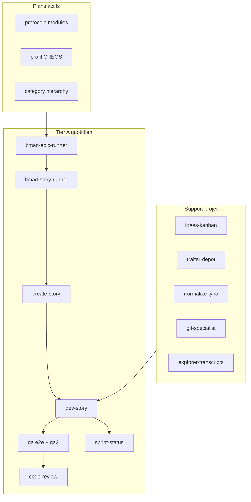

# Recommandations outillage Cursor / BMAD — JARVOS Recyclique

**Date :** 2026-05-20  
**Périmètre :** outillage **local** Cursor (skills managed `~/.cursor/skills-cursor`, skills globaux, `.cursor/skills` projet), agents, workflows BMAD, MCP.

> **Marketplace officiel** [cursor.com/marketplace](https://cursor.com/marketplace) (plugins / automations / canvas tiers) : voir le document dédié **[2026-05-20_02_marketplace-cursor-com-evaluation-jarvos.md](2026-05-20_02_marketplace-cursor-com-evaluation-jarvos.md)** — ce fichier **01** ne couvrait pas initialement ce périmètre.  
**Méthode :** exploration déléguée (Task `llm=auto`) + QA2 à chaque étape (inventaire, évaluation, cohérence livrable).  
**Seuil de rétention :** utilité projet **≥ 85 %** (recherche web ou lecture `SKILL.md` si service inconnu).

---

## 1. Contexte projet et BMAD (rappel)

| Élément | État |
|--------|------|
| Ligne directrice | Évolution **incrémentale** depuis `recyclique-1.4.4` stabilisé — pas de refonte « from scratch » comme plan conducteur |
| BMAD | Module **BMM 6.2.1** (`_bmad/bmm/config.yaml`) ; sorties actives sous `_bmad-output/` |
| Pilotage fin | `_bmad-output/implementation-artifacts/sprint-status.yaml` + `_bmad-output/planning-artifacts/epics.md` |
| Exécution v2 | `_bmad-output/planning-artifacts/guide-pilotage-v2.md` |
| Backlog epics (2026-04-23) | **9, 10, 12, 20, 21** en `backlog` — aucune story `in-progress` |
| Orchestration maison | `@bmad-epic-runner` → Task `@bmad-story-runner` (CS→VS→DS→gates→QA→CR) — **pas headless** (`references/automatisation-bmad/`) |
| Porte d'entrée agent vierge | `references/artefacts/2026-03-31_06_porte-entree-agent-bmad-vierge.md` |

**Cycle story type :** `bmad-create-story` → `bmad-dev-story` → `bmad-qa-generate-e2e-tests` → `bmad-code-review` → mise à jour `sprint-status.yaml` (merge Git = humain).

---

## 2. Inventaire par catégorie (corrigé post-QA2)

Comptages validés sur disque (2026-05-20). Racine projet : `JARVOS_recyclique/`.

| Catégorie | Nombre | Emplacement | Note |
|-----------|--------|-------------|------|
| Skills Cursor managed | **13** sur disque (+ `cursor-blame` manifest-only, absent) | `%USERPROFILE%\.cursor\skills-cursor\` | Sync via `.sync-manifest.json` |
| Skills utilisateur globaux | **8** (7 actifs + 1 archive transcription) | `%USERPROFILE%\.cursor\skills\` | QA2, long-run, tier-advisor, etc. |
| Skills projet | **47** = **44 BMAD** + **3 Recyclique** | `.cursor/skills/` | Miroir `_bmad` + overlay **`bmad-epic-runner`** (présent seulement dans `.cursor/`, absent de `_bmad` source) |
| Agents projet | **5** | `.cursor/agents/` | depot, git, qa2-orchestrator, epic/story runners |
| Agents BMAD source | **10** personas top-level | `_bmad/bmm/agents/` + `bmad-master` | 16 fichiers `agents/**/*.md` si sous-agents inclus |
| Commands slash | **3** | `.cursor/commands/` | revision, revisions-et-rapport, session-migration-paheko |
| Rules | **8** | `.cursor/rules/*.mdc` | Toujours actives en session |
| Plans | **8** | `.cursor/plans/` | 3 actifs recommandés, 5 historiques / livrés |
| Hooks | **4** | `.cursor/hooks.json` + scripts | Diagnostic + log réponses |
| Workflows BMAD (runtime) | **23** | `.cursor/skills/**/workflow.md` | 25 sous `_bmad` (doublons `core/workflows/*`) |
| Serveurs MCP | **3–4** | Cache projet + session | browser souvent actif en session, pas toujours dans le cache disque |

**Skills Recyclique (hors préfixe `bmad-`) :** `explorer-transcripts-cursor`, `idees-kanban`, `traiter-depot`, `jarvos-session-memory`.

---

## 3. Boîte à outils recommandée (≥ 85 %)

Organisation en **trois tiers** pour éviter la surcharge (recommandation QA2 finale).

### Tier A — Quotidien (≥ 90 % ou chemin critique)

| Outil | Score | Usage JARVOS |
|-------|------:|--------------|
| `normalize-typographic-chars` | 96 | Après édition `references/` / `_bmad-output/` si apostrophe typo casse `search_replace` |
| `idees-kanban` | 96 | Notes STT, transitions, archivage — **ne pas** éditer `idees-kanban/index.md` à la main |
| `bmad-create-story` | 96 | Promouvoir une story des epics 9–21 |
| `bmad-dev-story` | 96 | Implémentation sur branche `epic/NN` (API, Peintre, contrats) |
| `bmad-story-runner` (agent) | 95 | Enchaînement story sans diluer le chat parent |
| `bmad-sprint-status` | 94 | Vérité fine avant reprise ; croiser `ou-on-en-est.md` |
| `bmad-epic-runner` (skill + agent) | 94 | Prochaine story d'un epic backlog → délégation Story Runner |
| `traiter-depot` + `@depot-specialist` | 91–92 | Ventiler `references/_depot/` en contexte isolé |
| `qa2-agent` + `@qa2-orchestrator` | 92–93 | QA multi-passes livrables lourds (contrats, doc, Peintre) |
| `bmad-qa-generate-e2e-tests` | 93 | Gates pytest / trace `test-summary.md` |
| `bmad-code-review` | 91 | Avant merge epic ; contexte frais |
| `long-run-orchestrator` | 91 | Plans multi-vagues (`.cursor/plans/*.plan.md`) + sync disque + QA2 par vague |
| `explorer-transcripts-cursor` | 91 | Reprise contexte chats Cursor perdus |
| `jarvos-session-memory` | 90 | Porte d'entrée `jarvos-agentique/`, triage session, registre patterns (HITL) |
| `revisions-et-rapport` (command) | 91 | Clôture plan : QA + rapport copiable |
| `bmad-index-docs` | 90 | Mise à jour `references/*/index.md` après nouveau fichier |
| `user-llm-tier-advisor` | 90 | Choisir tier/modèle **avant** chaque Task subagent |
| `revision` (command) | 90 | Contrôle cohérence chemins/refs après livrable agent |

### Tier B — Standard (85–89 %)

| Outil | Score | Usage JARVOS |
|-------|------:|--------------|
| `bmad-correct-course` | 89 | Écart PRD / archi / sprint (gel epic, addendum) |
| `@git-specialist` | 89 | Staging, commit Conventional Commits — **pas** de push sans validation |
| `bmad-review-edge-case-hunter` | 88 | OpenAPI, authz, outbox Paheko, widgets CREOS (périmètre ciblé) |
| `bmad-review-adversarial-general` | 86 | Specs / PRD / packs `references/` |
| `cursor-ide-browser` (MCP) | 86 | Smoke UI `peintre-nano/` après dev-story |
| `subagent shell` (skill managed) | 86 | pytest, scripts Windows sur `recyclique/` |
| `create-rule` (skill managed) | 85 | Nouvelle convention `.cursor/rules/` — **événement rare** (8 rules déjà actives) |
| `qa-agent` | 87 | QA une passe sur petit diff / extrait |
| `bmad-document-project` | 87 | Brownfield / condensés (dossier architecte v2) |
| `bmad-help` | 87 | « Que faire ensuite ? » entre deux epics |

### Tier C — À la demande (80–84 %, déclencheur explicite)

| Outil | Score | Déclencheur |
|-------|------:|-------------|
| `bmad-retrospective` | 83 | **Fin d'epic** quand toutes les stories sont `done` |
| `split-to-prs` | 84 | **Avant merge** d'une branche `epic/NN` volumineuse |
| `bmad-check-implementation-readiness` | 81 | Nouveau pivot produit / reprise planning lourde |
| `bmad-distillator` | 83 | Compression docs massifs (audit, handoff) |

### Plans actifs (reprise travail)

| Plan | Score | Lien backlog |
|------|------:|--------------|
| `chantier_protocole_modules_fe3bc68e.plan.md` | 93 | Phase 1 post-HITL architecte → protocole modules, Epic **9** |
| `profil-creos-minimal_6cf1006d.plan.md` | 87 | Epic **10**, manifests Peintre ↔ Recyclique |
| `category-hierarchy-picker-widget.plan.md` | 88 | Epic **12**, widget catégories caisse/réception |

**Plans à traiter comme archives (ne pas ré-exécuter) :** `paheko_outbox_hardening_v2` (livré 2026-04-18), `qa-compta-superadmin-20260418` (PR #1 mergée), `cadrage-v2-global`, `separation-peintre-recyclique`, `coherence-moyens-paiement-caisse-admin` (todos `completed`) — marquer en tête de fichier `STATUT: DONE` si relance accidentelle.

---

## 4. Recommandations pour améliorer le travail sur le projet

### 4.1 Routine session (ordre suggéré)

1. Lire `references/ou-on-en-est.md` + clé `last_updated` de `sprint-status.yaml`.
2. Choisir un epic backlog (**9, 10, 12, 20 ou 21**) ; pack lecture si epics 6–10 : `references/artefacts/2026-04-08_02_pack-lecture-epics-6-10-et-corpus-captures.md`.
3. `@bmad-epic-runner` avec `epic-id` explicite → laisser Story Runner gérer **une story**.
4. Gates : pytest / lint / build (PowerShell) ; **QA2** sur livrables doc/contrats (score cible ≥ 90 sur chantiers sensibles).
5. `@git-specialist` pour commit ; merge = validation humaine.
6. `bmad-index-docs` + `normalize-typographic-chars` si édition `references/`.
7. Journal : `ou-on-en-est.md` + cases `guide-pilotage-v2.md` aux jalons.

### 4.2 Améliorations outillage (actions concrètes)

| # | Action | Pourquoi |
|---|--------|----------|
| 1 | **Archiver visuellement** les 5 plans livrés/obsolètes (statut DONE en ligne 1) | Évite re-lancement par todos `pending` stale |
| 2 | **Règle session type** dans un artefact court ou rule : « epic → epic-runner → story-runner → qa2 → git » | Réduit improvisation et contournement `bmad-quick-dev` (72 %) |
| 3 | **Avant chaque Task** : `@user-llm-tier-advisor` ou brief tier dans le prompt Task | Coût/latence maîtrisés sur explore vs impl vs review |
| 4 | **QA2 systématique** sur : story file, OpenAPI diff, pack `references/artefacts/`, merge epic | Déjà pratique projet ; formaliser comme gate entre DS et CR |
| 5 | **Protocole modules** : finir plan `chantier_protocole_modules` (HITL) **avant** create-story massif Epic 9 | Aligné dossier architecte v2 et backlog |
| 6 | **Indexer transcripts** (`explorer-transcripts-cursor`) après grosses sessions BMAD | Compense absence de mémoire inter-sessions Cursor |
| 7 | **Ne pas installer / activer** : SDK agents headless, `cursor-blame` (Enterprise), vault Aethermind | Contradictoire ou hors périmètre solo |
| 8 | **Consolider MCP navigateur** : privilégier `cursor-ide-browser` ; `user-chrome-devtools` en secours seulement | Évite duplication (84 % vs 86 %) |
| 9 | **Rétrospective** à la clôture de chaque epic backlog 9–21 | Pattern Epics 25/26 ; skill à 83 % mais process important |
| 10 | **Sync BMAD** : après upgrade installateur, vérifier que `bmad-epic-runner` (projet-only) n'est pas écrasé | Overlay non présent dans `_bmad/` source |

### 4.3 Ce qui ne rapporte pas assez (écartés < 85 %)

**Ne pas investir maintenant :**

- **Planning from scratch :** `bmad-create-prd`, `create-epics`, `create-architecture`, `create-ux`, `validate-prd` (chaîne v2 figée).
- **Multi-agent dialogue :** `bmad-party-mode`, personas analyst/PM/UX en session (solo → bruit).
- **Headless / CI agents :** skill `sdk` Cursor (35 %) vs cadre §15 `automatisation-bmad`.
- **Enterprise attribution :** `cursor-blame` (manifest, absent disque ; recherche : feature Cursor 2.4+ liée PR/issues — peu utile solo).
- **Vault mémoire :** `vault-memory-ops` (pas de vault dans ce workspace).
- **Canvas React chat :** `canvas` (78 %) — livrables projet = markdown + code repo.
- **Session migration Paheko** (command 74 %) — charger `references/migration-paheko/index.md` à la place.
- **MCP** `user-astrology`, `cursor-app-control`.

### 4.4 Pont mémoire session (`jarvos-session-memory`)

Le skill projet **`.cursor/skills/jarvos-session-memory/`** complète `explorer-transcripts-cursor` (index UUID parents hors dépôt) en appliquant la porte d'entrée normative [`references/jarvos-agentique/00-porte-entree-contexte.md`](../jarvos-agentique/00-porte-entree-contexte.md) selon les quatre types de session, en corrélant les journaux **`log/cursor-agent/`** alimentés par les hooks orchestrateur (`.cursor/hooks.json` : `beforeSubmitPrompt`, `afterAgentResponse` → `log_after_agent_orchestrator.py`) avec les scripts sandbox `jarvos-memoire-sessions/dev/triage_session.py` et `export_transcript_md.py`, et en soumettant toute évolution du [`registre-patterns.md`](../jarvos-agentique/registre-patterns.md) au **HITL** humain. Pack et ordre de démarrage : handoff **[`2026-05-21_07_contexte-chantier-memoire-jarvos.md`](2026-05-21_07_contexte-chantier-memoire-jarvos.md)**.

---

## 5. Cartographie rapide marketplace → projet

---

## 6. Traces QA2 (synthèse)

| Étape | Objet | Score QA | Points saillants |
|-------|--------|----------|------------------|
| 1 | Inventaire catégories | **76/100** | Corriger 48→47 skills projet ; distinguer overlay `bmad-epic-runner` vs 3 skills Recyclique ; préciser racine comptage workflows/MCP |
| 2 | Évaluation utilité ≥ 85 % | **86/100** | Cohérent avec contraintes projet ; tiering A/B/C ; compléter noyau documenté |
| 3 | Cohérence livrable | **86/100** → **88/100** après corrections tiers/plans | **GO** diffusion |

---

## 7. Références

- `references/index.md` — point d'entrée
- `references/automatisation-bmad/index.md` — orchestration BMAD
- `references/automatisation-bmad/epic-story-runner-spec.md` — contrat runners
- `%USERPROFILE%\.cursor\skills-cursor\.cursor-managed-skills-manifest.json` — ids marketplace managed
- Agent transcripts : inventaire délégué 2026-05-20 (IDs internes : inventaire `9189af5b`, BMAD `5b4b59af`, utilité `0c3779fe`, QA2 `e1ceba02` / `82d94732`)

---

*Document généré pour améliorer le travail outillé sur JARVOS Recyclique — à croiser avec `references/ou-on-en-est.md` avant chaque reprise epic.*
