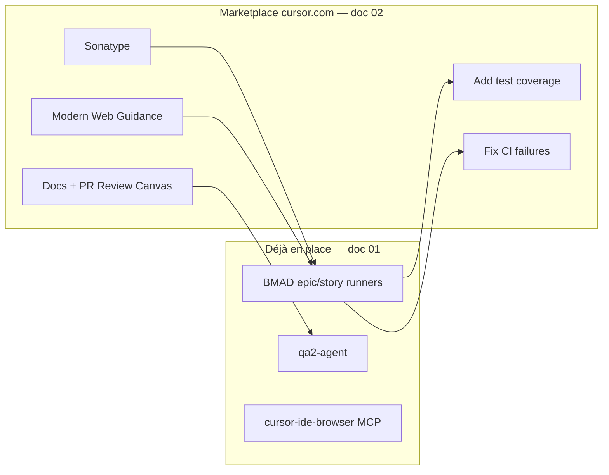

# Marketplace officiel Cursor — évaluation JARVOS Recyclique

**Date :** 2026-05-20  
**Source :** [https://cursor.com/marketplace](https://cursor.com/marketplace) (plugins, automations, canvas — **pas** le dossier local `~/.cursor/skills`).  
**Complète :** [2026-05-20_01_recommandations-outillage-cursor-bmad-jarvos.md](2026-05-20_01_recommandations-outillage-cursor-bmad-jarvos.md) (outillage local BMAD / skills / agents).

**Méthode :** inventaire page marketplace + évaluation utilité ≥ 85 % (recherche web si service inconnu) + QA2.

---

## 1. Clarification : deux « marketplaces » différentes

| Périmètre | Où | Contenu typique |
|-----------|-----|-----------------|
| **Marketplace Cursor.com** | [cursor.com/marketplace](https://cursor.com/marketplace) | Plugins MCP/skills tiers, **automations** cloud, **canvas** |
| **Skills managed Cursor IDE** | `%USERPROFILE%\.cursor\skills-cursor\` | `babysit`, `canvas`, `create-skill`, `sdk`, etc. (sync IDE) |
| **Projet JARVOS** | `.cursor/skills/` | BMAD 6.2.1 + 3 skills Recyclique |

Le document **01** couvrait surtout les deux dernières lignes. **Ce document 02** couvre la première.

---

## 2. Structure du marketplace officiel (page 2026-05-20)

Types d’extensions :

| Type | Rôle | Exemples visibles |
|------|------|-------------------|
| **Plugin** (MCP +/− skills) | Connecter un service ou injecter des skills | Sonatype, Modern Web Guidance, Stripe |
| **Automation** | Tâches planifiées / déclenchées (cloud Cursor) | Add test coverage, Fix CI failures |
| **Canvas** | Rendu interactif dans Cursor | PR Review Canvas, Docs Canvas |

Sections de la page (avec items **masqués** derrière « View N more ») :

| Section | Visibles nommés | Masqués (estim.) |
|---------|-----------------|------------------|
| Featured Plugins | 4 | — |
| Featured Automations | 4 | — |
| Recently Added | 6 | +6 |
| Infrastructure | 6 | +26 |
| Data & Analytics | 6 | +20 |
| Productivity | 6 | +17 |
| Payments | 6 | — |
| Agent Orchestration | 6 | +14 |
| Canvas | 2 | — |
| All Plugins | 6 | +19 |
| All Automations | 22 | — |

**~92 extensions** ne sont pas nommées sur la page d’accueil — évaluation individuelle impossible sans ouvrir chaque section.

---

## 3. Retenus ≥ 85 % (marketplace cursor.com)

### Plugins & Canvas

| Item | Type | Score | Usage JARVOS |
|------|------|------:|--------------|
| **Modern Web Guidance** | Plugin Skills | 92 % | Peintre/React : APIs web modernes, perf, éviter patterns legacy (Chrome team) |
| **Sonatype** | Plugin MCP + Skills | 90 % | CVE et versions sûres sur deps Python (`recyclique/`) + JS (`peintre-nano/`) avant merge epic |
| **Docs Canvas** | Canvas | 90 % | Naviguer `references/dossier-architecte-externe-v2/` et runbooks |
| **PR Review Canvas** | Canvas | 88 % | Diffs epic API + Peintre par zones de risque |
| **Cursor SDK** | Plugin Skills | 88 % | Scripts/CI légers `@cursor/sdk` — **pas** pour remplacer le cycle BMAD headless |

### Automations

| Item | Score | Usage JARVOS |
|------|------:|--------------|
| **Add test coverage** | 92 % | Complète `bmad-qa-generate-e2e-tests` sur branches epic à risque |
| **Fix CI failures** | 90 % | GitHub Actions déjà en place (`alembic-check`, API, peintre-nano) |
| **Generate docs** | 88 % | Doc dev + `references/` après stories epics 9–21 |
| **Remediate dependency vulnerabilities** | 88 % | PRs upgrade deps (pairé avec Sonatype) |
| **Monitor engineering invariants** | 86 % | Alerte si pytest / OpenAPI / conventions régressent |
| **Find critical bugs** | 85 % | Régressions logiques sur commits récents |

---

## 4. Écartés notables (< 85 %) — pourquoi

| Item | Score | Raison courte |
|------|------:|---------------|
| Datadog, Grafana Cloud | 18–22 % | Pas d’observabilité cloud prod sur ce setup solo |
| Slack (+ automations Slack) | 15–22 % | Pas de workflow ops Slack comme colonne vertébrale |
| **Linear** (+ Triage Linear) | 10–12 % | Backlog = `epics.md` + `sprint-status.yaml` (BMAD) |
| Figma | 28 % | UI dans le repo, pas chaîne Figma→code |
| Stripe, Shopify, Payments | 5–18 % | Compta Paheko ; pas e-commerce / crypto |
| Merge, Atlan, Tabnine | 8–42 % | Enterprise multi-outils / data catalog — solo mono-repo |
| Orchestrate (cloud agents) | 70 % | Chevauche `long-run-orchestrator` + politique **pas headless** BMAD |
| Subtext | 72 % | Recouvre `cursor-ide-browser` + pytest |
| Aikido | 84 % | SAST utile si compte ; juste sous seuil |
| Find vulnerabilities (automation) | 83 % | PR security — honorable mention |

---

## 5. Top 10 — ordre d’installation recommandé

Depuis [cursor.com/marketplace](https://cursor.com/marketplace) :

| # | Extension | Priorité |
|---|-----------|----------|
| 1 | **Sonatype** | Sécurité deps brownfield |
| 2 | **Modern Web Guidance** | Qualité frontend Peintre |
| 3 | **Add test coverage** (automation) | Gates pytest BMAD |
| 4 | **Fix CI failures** (automation) | CI GitHub déjà active |
| 5 | **Generate docs** (automation) | Sync `references/` |
| 6 | **Docs Canvas** | Lecture pack architecte v2 |
| 7 | **PR Review Canvas** | Revues epic volumineuses |
| 8 | **Remediate dependency vulnerabilities** | Boucle avec Sonatype |
| 9 | **Monitor engineering invariants** | Garde-fou conventions |
| 10 | **Cursor SDK** (plugin marketplace) | Automations scriptées contrôlées |

**11e optionnel (85 %) :** **Find critical bugs** — analyse commits récents API/Peintre si pas de revue manuelle avant merge.

**Honorable mentions (83–84 %) :** Aikido, Find vulnerabilities, Scan codebase — si compte sécurité disponible.

---

## 6. Complémentarité avec l’outillage local (doc 01)

- **Ne pas remplacer** : `@bmad-epic-runner`, `qa2-orchestrator`, `idees-kanban`.
- **Renforcer** : qualité web (Peintre), sécurité deps, CI/docs, revue visuelle PR.

---

## 7. Suite : explorer les « View N more »

Pour les **~92 items masqués**, réappliquer la même grille sur chaque section dépliée :

**Prioriser si nom contient :** GitHub, Docker, PostgreSQL, Sentry, security, npm/pip.  
**Écarter par défaut :** Databricks, Salesforce, Jira enterprise, cloud cost, payments SaaS.

---

## 8. Action proposée

1. Installer depuis le marketplace les **Top 10** ci-dessus (compte Cursor + éventuelles clés API Sonatype/Aikido).
2. Configurer **Monitor engineering invariants** sur invariants projet (pytest, `contracts/`, règles `.cursor/rules/`).
3. Ne pas activer Linear/Slack/Datadog tant que la stack ops ne les utilise pas.

---

*Source page : [Cursor Marketplace](https://cursor.com/marketplace) — snapshot 2026-05-20.*
