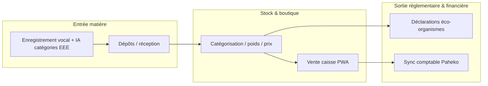
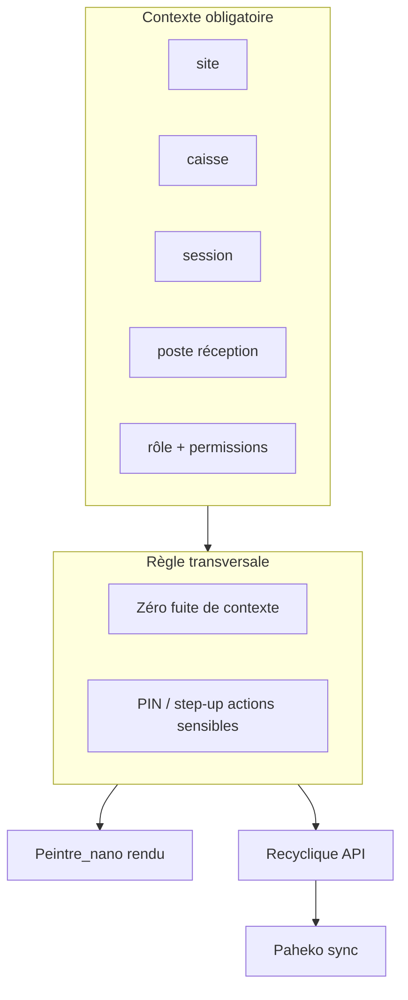
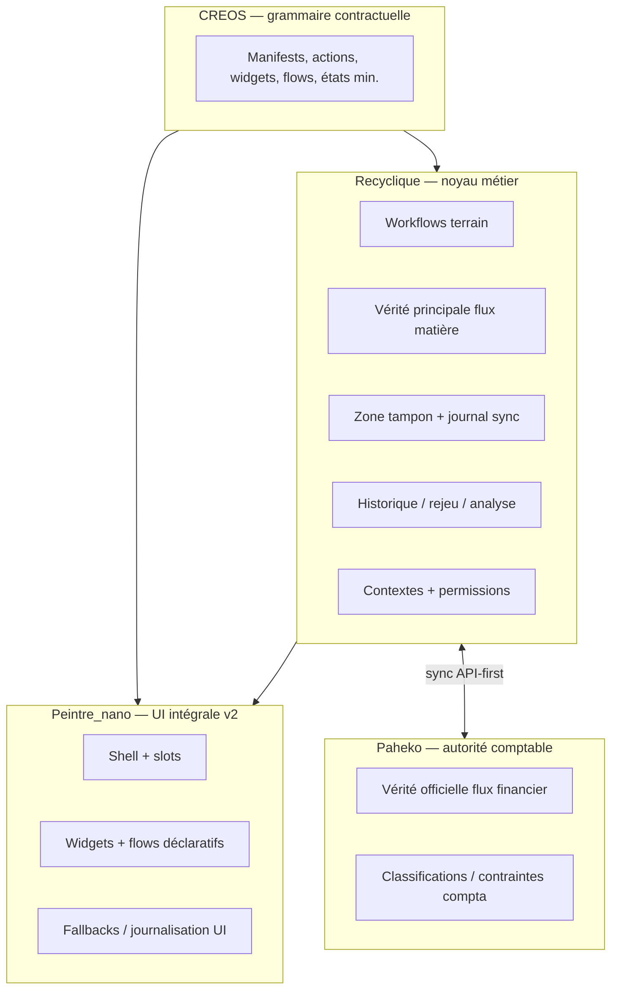

# Contexte métier et vision v2 — JARVOS Recyclique

**Public :** architecte externe sans connaissance préalable de Recyclique  
**Date de rédaction :** 2026-05-20  
**Sources de cadrage :** `references/vision-projet/2026-03-31_decision-directrice-v2.md`, `_bmad-output/planning-artifacts/product-brief-JARVOS_recyclique-2026-03-31.md`, début de `references/ou-on-en-est.md`, extrait de `references/vision-projet/2026-03-31_peintre-nano-concept-architectural.md`

**Statut du document :** synthèse technique autonome ; ne remplace pas PRD, architecture détaillée ni contrats OpenAPI/CREOS.

---

## 1. Objet de ce document

Ce fichier pose le **cadre métier et la vision produit v2** pour une lecture architecturale froide : domaine, acteurs, pivot technique, invariants, répartition des responsabilités entre composants, et critères de réussite. Il évite le détail d’implémentation (stories, sprint, chemins de fichiers du mono-repo) sauf lorsque cela clarifie une contrainte structurelle.

**Hors périmètre explicite ici :** protocole modules détaillé (TOML, EventBus, lifecycle `ModuleBase`) — voir §8 en une phrase ; spécifications de sync Paheko (matrice API/plugin/SQL) — gates PRD ; catalogue exhaustif des epics BMAD.

---

## 2. Contexte métier : ressourcerie et Recyclique

### 2.1 Qu’est-ce qu’une ressourcerie ?

Une **ressourcerie** est une structure associative de **réemploi** (France : ~150+ structures). Elle collecte des objets (dons, dépôts), les trie, les valorise en boutique, et assure une **traçabilité réglementaire** — notamment pour les **EEE** (équipements électriques et électroniques) et les obligations envers les **éco-organismes** (Ecologic, Ecomaison, etc.).

| Dimension | Réalité terrain | Conséquence pour le SI |
|-----------|-----------------|------------------------|
| Mission sociale | Accueil, insertion, réemploi | L’outil doit **libérer du temps admin** (objectif historique : passer de ~3 h/j à < 1 h/j de saisie/reporting) |
| Opérateurs hétérogènes | Bénévoles et salariés, littératie numérique variable | UI **prévisible**, gros raccourcis, peu de pièges ; **PIN** et rôles simples |
| Conformité | Exports Ecologic, déclarations éco-organismes (souvent semi-manuelles côté portails partenaires) | Données **structurées**, historisées, réconciliables ; pas de « Excel parallèle » |
| Multi-sites | Plusieurs magasins / entrepôts / postes | **Contexte** (`site`, `caisse`, `session`, `poste`) non négociable |
| Modèle économique associatif | Budget limité, souvent pas d’ERP GDR (>200 €/mois) | **Open source**, déploiement maîtrisé (VPS ou offre cloud budget) |

### 2.2 Recyclique dans ce paysage

**Recyclique** (orthographe produit ; ancien nom **Recyclic**) est une **plateforme open source de gestion pour ressourceries**. Elle couvre le flux opérationnel complet :



**En une phrase produit :** digitaliser le quotidien — moins de papier et d’Excel, plus de conformité et de temps pour la mission — via caisse, réception, traçabilité et exports vers partenaires réglementaires.

**Positionnement technique historique (v1.x / brownfield `recyclique-1.4.4`) :**

| Couche | Technologie typique |
|--------|---------------------|
| API métier | FastAPI (Python), PostgreSQL |
| Front terrain | React / Vite / TypeScript, PWA (offline partiel caisse) |
| Orchestration | Docker Compose, Redis (files, bus) |
| Référence terrain | Code figé sous `recyclique-1.4.4/` dans le mono-repo JARVOS |

La v2 **ne abandonne pas** ce métier : elle le **ré-exprime** dans une architecture modulaire, avec UI intégralement composée et comptabilité externalisée sur **Paheko**.

---

## 3. Pivot stratégique : brownfield `recyclique-1.4.4` vs v2 incrémentale

### 3.1 Chronologie du pivot (2026-03-31)

Jusqu’au **31 mars 2026**, une chaîne BMAD (brief, PRD, architecture, epics) pouvait encore porter un récit de **refonte large**. Le **pivot officiel** fige une autre ligne :

| Avant pivot | Après pivot (ligne active) |
|-------------|----------------------------|
| « Refonte complète » comme plan directeur possible | **Évolution brownfield** depuis `recyclique-1.4.4` stabilisé |
| Artefacts BMAD anciens comme vérité unique | Réinitialisation `_bmad-output/planning-artifacts/` et `implementation-artifacts/` ; archive `_bmad-output/archive/2026-03-31_pivot-brownfield-recyclique-1.4.4/` |
| Richesse UI / admin en gate de sortie | **Socle fiable d’abord** : terrain, compta, résilience, modularité prouvée |

**Lecture pour l’architecte :** la v2 n’est **pas** un greenfield parallèle. C’est une **migration contrôlée** : repartir quasi à l’identique sur les logiques critiques (`cashflow`, `reception flow`), importer avec discipline (copy + consolidate + contrôle sécurité), puis durcir contrats, contextes et UI déclarative.

### 3.2 Ce que brownfield impose

| Contrainte | Implication architecture |
|------------|-------------------------|
| Données et habitudes terrain existantes | Schéma et historique **évolutifs**, pas tabula rasa ; référence dumps/schemas documentés |
| Fragilité code 1.4.4 reconnue | Pas de « lift-and-shift » aveugle ; audits backend/API/données **avant** extension |
| UX v1.0 (ligne archivée) | Même écrans que 1.4.4 possible en phase initiale ; v2 cible **Peintre_nano** pour toute UI |
| Paheko déjà en production chez pilotes | **API-first** ; plugin minimal seulement si nécessaire ; **pas** d’écriture SQL transactionnelle comme chemin nominal |
| Double vérité financière / matière | Articulation explicite Recyclique ↔ Paheko (zone tampon, sync, réconciliation) |

### 3.3 Ce que brownfield n’interdit pas

- Refonte **ciblée** des écrans les plus faibles (au cas par cas).
- Nouveau moteur UI (**Peintre_nano**) et grammaire **CREOS** même si le métier reprend les flows 1.4.4.
- Modules métier nouveaux (**eco-organismes** comme premier grand module **après** preuve de chaîne modulaire).

### 3.4 État d’exécution (repère, non exhaustif)

> **Statuts epics :** [06-ARCH-etat-implementation-et-backlog.md](06-ARCH-etat-implementation-et-backlog.md) — **source prioritaire** ; la liste datée ci-dessous est un repère historique uniquement.

Au **23 avril 2026** (journal `references/ou-on-en-est.md`) : mono-repo actif (`recyclique/`, `peintre-nano/`, `contracts/`, référence `recyclique-1.4.4/`) ; pilotage BMAD par `sprint-status.yaml` ; nombreux epics **done**, cinq epics encore **backlog** (9, 10, 12, 20, 21). Ce document **ne fige pas** la priorisation sprint — il fige la **vision** et les **invariants** issus du cadrage du 31 mars.

---

## 4. Acteurs, rôles et surfaces d’usage

### 4.1 Typologie des utilisateurs

| Acteur | Rôle produit | Besoins architecturaux clés |
|--------|--------------|----------------------------|
| **Bénévole** | Opérations courantes limitées (caisse simple, réception, dépôts) | Auth légère (**PIN** kiosque), rotation rapide, **zéro fuite de contexte** entre postes ; chronométrage présence si intégration compta temps bénévole |
| **Opérateur terrain** | Caisse, réception, clôture, manipulations rapides, opérations spéciales | Contexte **site / caisse / session / poste** stable ; raccourcis clavier ; flows **cashflow** et **reception flow** robustes ; mode dégradé explicite |
| **Responsable de ressourcerie** | Supervision locale, réconciliation, pilotage modules | Lecture historique exploitable ; config admin **simple** (activation modules, ordre blocs) ; pas de mappings sensibles |
| **Comptabilité / admin** | Vérité comptable dans **Paheko**, contrôle écarts sync | API-first, traçabilité sync/outbox, politique **terrain d’abord**, blocage sélectif sur actions finales critiques |
| **Super-admin / expert** | Mappings sensibles, paramétrages structurés, audit | Fichiers TOML/YAML/JSON ou équivalent **tracé** ; pas d’UI riche requise en v2 ; forte journalisation |

**Note de vocabulaire :** en terrain, « opérateur » désigne souvent le salarié ou le bénévole **habilité caisse/réception** ; le brief distingue **opérateurs terrain** (parcours critiques) et **bénévoles** (parcours plus restreints, PIN). L’architecture doit supporter **RBAC + contexte** sans conflit entre session caisse et session utilisateur globale.

### 4.2 Modèle d’autorisation (esquisse v2)



**Invariant :** le **contexte est plus fondamental que l’écran**. Ambiguïté → rechargement, recalcul, mode restreint ou blocage ; **la sécurité gagne sur la fluidité**.

Granularité cible (à formaliser en spec multi-contextes, gate PRD) : `ressourcerie → site → caisse → session → poste`, avec mapping vers entités Paheko.

### 4.3 Parcours métier prioritaires (preuves v2)

| Parcours | Rôle dans la validation v2 |
|----------|----------------------------|
| **bandeau live** | Preuve **légère mais complète** de la chaîne modulaire bout en bout |
| **cashflow** | Preuve terrain critique — caisse, sessions, flux financier terrain |
| **reception flow** | Preuve terrain critique — flux matière, dépôts |
| **eco-organismes** | Premier **grand module métier** ; ne doit pas inventer le socle |
| **adhérents** (minimum) | Preuve métier complémentaire (vie associative, HelloAsso) |

---

## 5. Vision v2 : arbitrages et architecture cible

### 5.1 Décision centrale (stable sauf audit contraire)

La v2 est une **évolution brownfield production-ready** :

- **Vendable / installable** (open source reproductible).
- **Exploitable en production** par de vraies ressourceries.
- **Assez propre** pour dynamique communautaire sans dette stratégique majeure immédiate après sortie.

**Quatre qualités non négociables** (ordre de priorité produit) :

1. **Fiabilité terrain**
2. **Justesse comptable**
3. **Résilience** (réseau, sync, modes dégradés)
4. **Modularité réelle de bout en bout**

Le succès **ne se mesure pas d’abord** à la richesse UI ou à un moteur surdimensionné.

### 5.2 Répartition des rôles système



| Composant | Responsabilité | Ne fait pas |
|-----------|----------------|-------------|
| **Recyclique** | Métier vivant, contrats backend, permissions, résilience, sync, vérité **matière**, historique exploitable | Comptabilité officielle finale |
| **Paheko** | Vérité comptable **financière**, classifications sur leur périmètre | Remplacer le métier terrain (caisse, réception, EEE source) |
| **Peintre_nano** | **100 %** de l’UI v2 : shell, slots, registre modules, widgets, flows, raccourcis, fallbacks runtime | Logique métier, décisions comptables |
| **CREOS** | Grammaire commune minimale (manifests UI, actions, widgets, flows, états) | Transport métier hors contrats déclarés |
| **Adaptateur canal** (ex. React) | Rendu concret des widgets, responsive | Orchestration ni règles métier |

**AuthZ :** authentification, permissions et contextes restent sous **autorité Recyclique**, consommés par Peintre_nano.

### 5.3 Double flux : financier et matière

| Flux | Vérité principale | Rôle de l’autre système |
|------|------------------|-------------------------|
| **Financier** | **Paheko** (compta officielle) | Recyclique = terrain + zone tampon + synchronisation ; règle produit : **terrain d’abord**, sync reportable, **blocage sélectif** sur actions finales critiques |
| **Matière** | **Recyclique** | Paheko non substitut pour traçabilité dépôts / EEE / déclarations |

**Conséquences v2 :** réconciliation, historique corrélé, déclarations éco-organismes, analytics futures — sans **confondre** les deux flux dans un même modèle naïf.

### 5.4 Vision v2 en bullets techniques (12 points)

1. **Brownfield strict** : socle métier et données issus de `recyclique-1.4.4` ; refonte from scratch **exclue** comme stratégie directrice.
2. **UI 100 % Peintre_nano** avec **profil minimal** initial (shell, slots, widgets, actions/raccourcis déclaratifs, flows simples, fallbacks, droits/contextes) — pas d’éditeur convivial de flows ni personnalisation riche en gate v2.
3. **CREOS minimal figé tôt** : objets contractuels pour manifests, widgets, actions, flows, états ; gouvernance OpenAPI ↔ CREOS ↔ `ContextEnvelope` (gate explicite).
4. **Modularité = chaîne complète** : contrat métier + récepteur backend + contrat UI + runtime front + permissions/contexte + fallback/audit — sinon ce n’est **pas** un module.
5. **Contexte avant écran** : `site`, `caisse`, `session`, `poste`, `role`, `permissions`, `PIN`/step-up ; **zéro fuite de contexte** invariant transversal.
6. **Flows critiques prouvés** : `cashflow`, `reception flow` avant d’étendre ; `bandeau live` comme preuve modulaire minimale — si échec, **corriger la chaîne** avant tout module métier lourd.
7. **Sync Paheko API-first** : outbox/idempotence/retry/quarantaine/réconciliation à formaliser (gate PRD) ; pas de SQL transactionnel nominal vers Paheko.
8. **Donnée exploitable by design** : exécution + historicisation + rejeu + analyse ; historique actuel = **minimum**, pas cible suffisante.
9. **Contrats invalides** : fallback visible ou blocage selon criticité ; journalisation ; retour opérateur exploitable ; matrice fallback/blocage/retry à expliciter pour flows sensibles.
10. **Capacités cœur v2** : sync Paheko ; module **eco-organismes** ; gestion minimum bénévoles/adhésions ; **HelloAsso** ; architecture modulaire déployable.
11. **Config admin simple** ≠ back-office : activation/désactivation modules, ordre blocs, variantes simples, aide raccourcis — mappings sensibles réservés **super-admin** (fichiers structurés, traçabilité forte).
12. **Hors périmètre gate v2** : édition admin riche, pilotage agentique riche, analytics avancées, éditeur de flows convivial — ouvertures volontaires post-socle.

### 5.5 Stack et décisions figées (Peintre — repère)

Pour éviter une lecture « concept vs code » divergente :

| Sujet | Décision (post 2026-04-01) |
|-------|----------------------------|
| CSS / composants | **CSS Modules** + `tokens.css` + **Mantine v8** ; pas de Tailwind en prod Peintre |
| Config admin simple (prod) | Persistance **PostgreSQL**, pas JSON disque |
| Transport CREOS nano | Fichiers JSON (manifests) ; bus Redis à l’échelle mini (hors scope immédiat v2) |

### 5.6 Séquence de validation (préférence forte, pas dogme)

```text
1. Audit backend / API / données
2. Rétro-ingénierie Paheko sur données réelles
3. Spec multi-sites / multi-caisses / postes réception
4. Figer CREOS minimal + contrats UI minimaux
5. Runtime minimal Peintre_nano
6. Preuve chaîne : bandeau live
7. Preuves terrain : cashflow, reception flow
8. Premier grand module : eco-organismes
9. Parallèle : adherents, config admin simple, autres modules
```

Si un **audit réel** contredit une étape, arbitrage explicite — pas d’ajustement silencieux du schéma à la réalité.

### 5.7 Critères de succès (lecture architecte)

| Jalon | Indicateurs structurants |
|-------|--------------------------|
| **Beta interne** | Terrain fiable ; sync/réconciliation documentées sur parcours prioritaires ; bandeau live OK ; cashflow + reception flow OK ; **aucune fuite de contexte critique** |
| **V2 vendable** | Compta « propre » (politique réconciliation explicite) ; modularité prouvée (bandeau live + eco-organismes + complément adherents) ; install OSS documentée ; config admin minimale réelle |

### 5.8 Risques systémiques à surveiller

| Risque | Mitigation architecturale |
|--------|---------------------------|
| Modularité cosmétique (écran sans chaîne) | Gate **bandeau live** + checklist contrats par module |
| Sur-ingénierie Peintre/CREOS | Profil **minimal** figé ; ADR P1/P2 ; retarder éditeur flows / IA riche |
| Fuite de contexte multi-caisses | Spec multi-contextes + tests AR sur `site`/`caisse`/`session`/`poste` |
| Confusion vérité terrain / compta | Double flux documenté ; outbox et autorité de résolution d’écarts |
| Récits historiques contradictoires dans le dépôt | **Foi** au pivot 2026-03-31 (`decision-directrice-v2` + brief 2026-03-31) pour arbitrages centraux |

### 5.9 Questions résiduelles (gates avant architecture « figée »)

1. **Contrat sync Recyclique / Paheko** : API vs plugin minimal vs SQL hors flux ; idempotence, retry, quarantaine, réconciliation, autorité en écart persistant.
2. **Spec multi-contextes** : isolation, mapping entités Paheko, comportement contexte incomplet.
3. **Gouvernance contractuelle** : source canonique schémas, versionnement, breaking changes OpenAPI ↔ CREOS.

---

## 6. Glossaire (une ligne)

| Terme | Définition |
|-------|------------|
| **Recyclique** | Plateforme open source de gestion pour ressourceries (caisse, réception, traçabilité EEE, sync compta) ; noyau métier et vérité **matière** en v2. |
| **Paheko** | Logiciel associatif de comptabilité/gestion ; **autorité comptable officielle** du flux **financier** pour Recyclique (intégration API-first). |
| **Peintre_nano** | Moteur de composition d’UI v2 (shell, slots, widgets, flows déclaratifs) ; ne porte pas le métier ni la compta. |
| **CREOS** | Grammaire contractuelle minimale (Command, Rule, Event, Object, State) pour manifests et déclarations UI partagées Recyclique ↔ Peintre_nano. |

**Entrées proches :** **JARVOS** = écosystème plus large ; **Recyclic / RecyClique** = nom produit (variantes orthographiques) ; **EEE** = équipements électriques/électroniques ; **éco-organismes** = filières réglementées (déclarations structurées depuis Recyclique).

---

## 7. Cartographie documentaire pour la suite

| Besoin architecte | Où approfondir (dans le dépôt JARVOS) |
|-------------------|--------------------------------------|
| Décision pivot v2 | `references/vision-projet/2026-03-31_decision-directrice-v2.md` |
| Brief produit v2 | `_bmad-output/planning-artifacts/product-brief-JARVOS_recyclique-2026-03-31.md` |
| Concept Peintre | `references/vision-projet/2026-03-31_peintre-nano-concept-architectural.md` |
| État exécution | `references/ou-on-en-est.md`, `_bmad-output/planning-artifacts/guide-pilotage-v2.md` |
| Brownfield 1.4.4 | `references/ancien-repo/`, code `recyclique-1.4.4/` |
| Contrats | `contracts/`, artefacts specs multi-contextes (2026-04-02) |

---

## 8. Protocole modules (rappel une phrase)

Le framework modules (manifests **TOML**, `ModuleBase`, **EventBus Redis Streams**, slots React, monorepo) est **arbitré** pour le produit ; la v2 exige que chaque capacité affichée honore la **chaîne complète** module (backend + UI + contexte), pas seulement un point d’extension isolé — le détail TOML/slots n’est pas du ressort de ce document.

---

## 9. Synthèse pour lecture en 30 secondes

Recyclique sert des **ressourceries** (réemploi, conformité EEE, caisse et réception). La **v2** conserve le brownfield **`recyclique-1.4.4`** tout en séparant clairement **métier + matière + sync** (Recyclique), **compta officielle** (Paheko), **UI intégrale déclarative** (Peintre_nano) et **contrats UI** (CREOS). Les acteurs vont du **bénévole PIN** au **super-admin** expert ; l’architecture doit garantir **contexte, modularité prouvée et zéro fuite** avant toute richesse fonctionnelle ou analytique.

---

*Fin du document — fichier autonome pour dossier architecte externe v2.*
