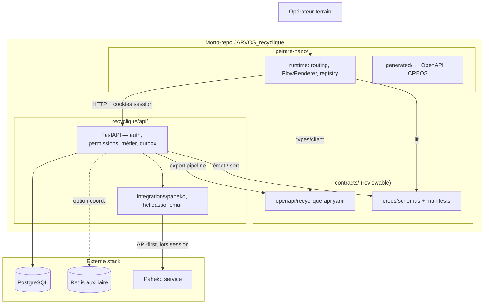

# Architecture globale et frontières — Recyclique v2

**Audience :** architecte externe (lecture autonome).  
**Date :** 2026-05-20  
**Sources normatives :** `_bmad-output/planning-artifacts/prd.md` (§3–5, §4.2, §8), `_bmad-output/planning-artifacts/architecture/` (`core-architectural-decisions.md`, `project-structure-boundaries.md`, `navigation-structure-contract.md`), `references/artefacts/2026-04-02_04_gouvernance-contractuelle-openapi-creos-contextenvelope.md` (§0–2).

**Hors scope :** protocole opérationnel « comment ajouter un module » (cookbook) — seul le **critère** de modularité §4.2 est rappelé.

---

## 1. Quatre acteurs et leurs rôles

| Acteur | Nature | Autorité principale |
|--------|--------|---------------------|
| **Recyclique** | Backend métier brownfield (`recyclique/api/`, package `recyclic_api`) | Terrain, contextes, permissions calculées, sync, audit, **commanditaire** de la structure informationnelle (navigation, pages) |
| **Paheko** | ERP comptable externe (service stack, code ref. hors cœur) | **Vérité comptable finale** du flux financier |
| **Peintre_nano** | Moteur UI / composition (`peintre-nano/`) | Rendu, slots, flows, validation runtime des contrats — **agnostique métier** |
| **CREOS** | Grammaire contractuelle (schémas + manifests JSON) | Pont déclaratif UI ↔ API — **pas** une seconde vérité métier |

**Adaptateur React** (canal web) : sous-ensemble de Peintre_nano — rendu concret shell/widgets ; aucune logique métier remontée.



**Flux de données nominal (lecture gauche → droite) :**

1. Recyclique persiste le métier et calcule le **ContextEnvelope**.
2. Les artefacts **reviewables** vivent sous `contracts/` (OpenAPI + CREOS).
3. Peintre_nano charge manifests + types générés, filtre par contexte, rend.
4. Les mutations repartent vers Recyclique ; la sync comptable part vers Paheko **via le backend uniquement**.

---

## 2. Double flux métier (financier / matière)

| Flux | Vérité finale | Zone tampon / opérationnel |
|------|---------------|----------------------------|
| **Financier** | Paheko (écritures, contraintes comptables) | Recyclique : saisie caisse, journal paiements, **snapshot de session figé**, lot sync **corrigeable** (outbox PostgreSQL, at-least-once, idempotence) |
| **Matière** | Recyclique (réception, traçabilité terrain) | Paheko non autorité sur le flux matière |

**Principe produit verrouillé :** *terrain d'abord* — un problème de sync Paheko **ne bloque pas** le terrain par défaut ; blocage **sélectif** sur actions critiques finales si la garantie comptable l'exige.

**Chemin async Paheko (état canonique) :** outbox **transactionnelle durable PostgreSQL** ; formulation « file Redis » (PRD vision kiosque) = **non canonique** tant qu'ADR sync explicite — Redis = coordination technique optionnelle, jamais autorité durable.

---

## 3. Pistes A / B et convergences

Décision d'exécution (architecture + décision directrice) : développement **parallèle** frontend et backend, relié par **jalons produit**, pas par un calendrier « phases moteur Peintre » (celui-ci décrit la maturité du moteur sur plusieurs versions produit).

### 3.1 Piste A — Peintre_nano (frontend / moteur UI)

| Élément | Contenu |
|---------|---------|
| **Autonomie** | Avance sans backend réel : mocks, stubs, fixtures, `ContextEnvelope` **côté UI** (provider, `MAX_CONTEXT_AGE_MS`) |
| **Livrables intermédiaires** | Validation schémas CREOS, `FlowRenderer`, feature toggles, registre widgets, raccourcis déclaratifs |
| **Contrainte** | Hooks domaine sur mocks jusqu'à **Convergence 1** ; pas d'invention de routes/permissions/pages métier (F11 artefact gouvernance) |

### 3.2 Piste B — Recyclique API (backend / contrats)

| Élément | Contenu |
|---------|---------|
| **Autonomie** | Audit brownfield, stabilisation données, endpoints v2, permissions par endpoint |
| **Livrable contractuel** | `contracts/openapi/recyclique-api.yaml` avec **`operationId` stables** ; `ContextEnvelope` dans schémas OpenAPI (pas de fichier source parallèle) |
| **Writer** | Code FastAPI = **seule** source exécutable ; YAML = miroir **reviewable** produit par pipeline (interdit double édition manuelle) |

### 3.3 Points de convergence

| Jalon | Objectif | Critère de succès |
|-------|----------|-------------------|
| **Convergence 1 — contrat d'interface** | OpenAPI draft + spec ContextEnvelope backend | Frontend **génère les types**, branche client réel ; **composants widgets inchangés** |
| **Convergence 2 — bandeau live** | Preuve bout-en-bout | Backend + manifest + rendu + fallback — **gate produit** : stories **4.6 + 4.6b** + validation humaine (correct course 2026-04-07). **Slot cible** : `shell.bandeau.live` ; **pilote** : sandbox Epic 4 — preuve = chaîne bout-en-bout, pas égalité stricte des slots |
| **Convergence 3 — flows terrain critiques** | Caisse + réception données réelles | Raccourcis, widgets `critical: true`, blocage `DATA_STALE`, visibilité sync comptable |

Après Convergence 2 validée, les pistes peuvent **re-diverger** (enrichissement flows UI vs sync/intégrations backend).

**Liaison manifest ↔ API :** `data_contract.operation_id` (CREOS) **doit** résoudre vers un `operationId` OpenAPI pour tout artefact **reviewable** sous `contracts/`.

---

## 4. Hiérarchie de vérité (AR39)

Ordre strict — du plus autoritaire au moins normatif pour la **sémantique métier** :

```text
OpenAPI  >  ContextEnvelope  >  NavigationManifest  >  PageManifest  >  UserRuntimePrefs
```

| Niveau | Décide quoi | Propriétaire | Emplacement canonique |
|--------|-------------|--------------|------------------------|
| **OpenAPI** | Opérations HTTP, DTO, erreurs métier, schéma **canonique** ContextEnvelope, enums stables | Recyclique (writer Piste B) | `contracts/openapi/recyclique-api.yaml` (+ `generated/` pour diff CI) |
| **ContextEnvelope** | Instance runtime : site, caisse, session, poste, permissions effectives, fraîcheur | Recyclique calcule ; Peintre **projette** (TTL, jamais réécriture sécurité) | Schémas dans OpenAPI ; pas de 2ᵉ source fichier |
| **NavigationManifest** | Arborescence routes, navigation, raccourcis **structurels** | Produit / commanditaire (= Recyclique pour l'app) | **Source reviewable** : `contracts/creos/manifests/` (déjà peuplé : navigation transverse, bandeau live, réception, etc.) ; `peintre-nano/public/manifests/` et fixtures = **démo / dev**, non normatif |
| **PageManifest** | Template, zones, widgets, actions déclaratives d'un écran | Idem | Idem |
| **UserRuntimePrefs** | Densité, variantes UI, onboarding local | Utilisateur / poste | Stockage local Peintre — **ne contredit jamais** les niveaux amont |

**Règle d'or :** aucun artefact aval ne crée route métier, permission ou page **absentes** des contrats amont.

**Chaîne OpenAPI (état repo 2026-05-20) :**

```text
Writer reviewable (humain/CI) : contracts/openapi/recyclique-api.yaml
Codegen consommateur : npm depuis ce YAML → contracts/openapi/generated/recyclique-api.ts
Export FastAPI (dérivé, risque de dérive) : recyclique/api/openapi.json
```

`peintre-nano/src/generated/openapi/` = **placeholder** (`.gitkeep`) — ne pas confondre avec le codegen canonique. Voir `contracts/README.md` et ch. 05 §4.

**CREOS vs OpenAPI :** surfaces **distinctes** ; enums / `operationId` / clés permission **descendent** du backend (ou paquet généré partagé) — pas de recopie locale divergente.

**Périmètre reviewable vs démo :**

| Périmètre | `operation_id` |
|-----------|----------------|
| Fichiers sous `contracts/` (promus officiels) | Obligatoirement présent dans `recyclique-api.yaml` |
| Fixtures / démos Epic 3 (`peintre-nano/src/fixtures/`) | Peut référencer ops futures si **explicitement non normatif** ; promotion §1 bis artefact gouvernance avant prod |

**Baseline 1.4.4 :** n'est **pas** le writer OpenAPI v2.

---

## 5. Frontières — qui décide quoi

### 5.1 Matrice de décision

| Sujet | Décideur | Peintre_nano | Recyclique | Paheko | Contrats |
|-------|----------|--------------|------------|--------|----------|
| Règles métier caisse/réception | Recyclique | Affiche | Calcule, persiste | Reçoit lots compta | OpenAPI |
| Écritures comptables finales | Paheko | — | Prépare snapshot + lot | Valide / refuse | ADR chaîne compta |
| Permissions effectives | Recyclique | Filtre UI | Calcule (additif v2) | — | ContextEnvelope + OpenAPI |
| PIN opérateur caisse | Recyclique serveur | Demande step-up | Hash, JWT, rate limit | — | §11.2 PRD |
| PIN kiosque PWA | **ADR requise** (cible) | Comportement local borné | Souveraineté en ligne | — | Non canonique |
| Structure navigation / pages | Recyclique (commanditaire) | Valide, fusionne, rejette collisions | Émet manifests | — | Navigation/PageManifest |
| Composition écran (slots/widgets) | Contrat PageManifest | Rend | Émet | — | CREOS + manifests |
| Overrides admin modules (ordre, toggles) | Recyclique + ADR P2 | Applique | PostgreSQL (surcharges) | — | Manifests build + DB |
| Schémas widgets / `data_contract` | CREOS schemas | Valide forme | Tags / ops alignés OpenAPI | — | `contracts/creos/schemas/` |
| Sync async Paheko | Architecture + Recyclique | Affiche états | Outbox PG, quarantaine | API-first | ADR async + canonical chain |
| Intégrations HelloAsso / email | Recyclique | — | `integrations/*` | Plugin Paheko si gap API | Stories / études |
| Stack CSS Peintre (P1/P2) | ADR Peintre | Implémente | — | — | ADR prime sur PRD pour P1/P2 seuls |

### 5.2 Interdictions structurelles

- **Frontend → Paheko direct** : interdit ; tout passage par `recyclique/.../integrations/paheko/`.
- **Peintre → inventer métier** : pas de route, permission ou page hors manifests commanditaires (runtime borné : valider, fusionner, filtrer, rejeter, fallback).
- **Double vérité manifests** : `contracts/creos/` = source reviewable ; `recyclique/.../manifests/` = cache/assemblage runtime **dérivé** — pas d'édition manuelle comme source.
- **Redis comme file métier Paheko** : interdit sans ADR ; autorité durable = PostgreSQL.
- **`references/paheko/`** : documentation / source ref. — **aucun import runtime**.

### 5.3 Sécurité et données périmées

- Blocage UI (`critical: true` + stale) : **nécessaire, non suffisant**.
- Mutations sensibles (paiement, clôture, écritures) : **revalidation backend** obligatoire — refus si contexte incohérent **indépendamment** de l'UI.
- **Zero fuite de contexte** (§4.4 PRD) : invariant transversal ; vues globales admin = sélection explicite + traçabilité.

### 5.4 Modularité de bout en bout (§4.2 PRD — rappel)

Un module n'est **modulaire** que si la chaîne complète existe :

```text
(1) contrat métier  →  (2) récepteur backend  →  (3) manifest CREOS
  →  (4) rendu Peintre  →  (5) permissions/contexte  →  (6) fallback + audit
```

Mock balisé acceptable en construction ; **pas** comme état final. Le chantier « protocole modules » documentera l'opérationnel ; ce document ne le détaille pas.

---

## 6. Mono-repo — organisation et frontières de dépôt

```text
JARVOS_recyclique/
├── contracts/          # vérité contractuelle reviewable (OpenAPI + CREOS)
├── recyclique/
│   └── api/            # backend canonique (pyproject, recyclic_api, alembic, tests)
├── peintre-nano/       # frontend v2 + runtime composition (extractible plus tard)
├── frontend-legacy/    # extinction progressive (comparaison / écrans non migrés)
├── infra/              # docker compose, images (recyclique, peintre, paheko, postgres, redis)
├── references/         # docs projet, Paheko ref., vision — pas runtime v2
├── recyclique-1.4.4/   # legacy exclu des cibles PG17 / writer OpenAPI v2
└── _bmad-output/       # PRD, architecture BMAD, epics — sources planning, pas contrats CI
```

| Bloc | Rôle dans le mono-repo | CI / build |
|------|------------------------|------------|
| **contracts/** | Gate drift OpenAPI + validation JSON CREOS ; promotion manifests Epic 4+ | **Cible Epic 10** : `ci-contracts.yml` (non présent au 2026-05-20) |
| **recyclique/api/** | API REST, outbox, intégrations ; export OpenAPI dérivé | **Cible Epic 10** : `ci-recyclique.yml` ; **existant** : `alembic-check.yml` |
| **peintre-nano/** | App React/Vite, codegen consommateur, tests contrat/e2e | **Cible Epic 10** : `ci-peintre-nano.yml` |
| **tests/** (racine) | Tests transverses contrats, intégration, e2e | **Cible Epic 10** : `ci-e2e.yml` |

**Décision structurante Peintre :** `peintre-nano/` = frontend Recyclique v2 **entier** (routing interne, pas package séparé) ; conçu **extractible** vers repo dédié sans refactor massif.

**Stack Docker dev (story 10.6b) :** `docker-compose.yml` racine — service `frontend` → `peintre-nano/` ; `frontend-legacy` optionnel ; même API backend.

**Coexistence old/new front :** même origine logique ; routage maître côté Peintre/proxy ; routes v2 **obligatoirement** via Peintre_nano ; critères d'extinction `frontend-legacy` à formaliser en stories.

---

## 7. Précédence documentaire (lecture architecte)

Ordre global du dépôt (PRD) — à réconcilier avec ce pack :

```text
(1) references/vision-projet/2026-03-31_decision-directrice-v2.md
(2) _bmad-output/planning-artifacts/prd.md
(3) PRD spécialisés + architecture BMAD active
(4) epics.md / stories
```

**Tensions connues (tableau gouvernance PRD) :** PRD vision kiosque 2026-04-19 = cible **non canonique** sur PIN kiosque, Redis Paheko, permissions multisite — jusqu'à ADR / absorption explicite.

**Gel exécution (2026-04-19) :** correct course pause backlog — priorité socle PRD / brownfield ; n'altère pas la hiérarchie normative ci-dessus.

---

## 8. Références directes

| Sujet | Chemin |
|-------|--------|
| PRD rôles système | `_bmad-output/planning-artifacts/prd.md` §3 |
| Modularité §4.2 | `_bmad-output/planning-artifacts/prd.md` §4.2 |
| Profil CREOS minimal | `_bmad-output/planning-artifacts/prd.md` §8 |
| Décisions cœur | `_bmad-output/planning-artifacts/architecture/core-architectural-decisions.md` |
| Structure & Pistes A/B | `_bmad-output/planning-artifacts/architecture/project-structure-boundaries.md` |
| Index architecture | `_bmad-output/planning-artifacts/architecture/index.md` |
| Gouvernance contrats | `references/artefacts/2026-04-02_04_gouvernance-contractuelle-openapi-creos-contextenvelope.md` |
| Contrat navigation | `_bmad-output/planning-artifacts/architecture/navigation-structure-contract.md` |
| README contrats | `contracts/README.md` |

**Suite de lecture pack architecte :** `03-ARCH-backend-recyclique-api-donnees.md`, `04-ARCH-integration-paheko-compta-sync.md`, `05-ARCH-frontend-peintre-creos-contrats.md`.
