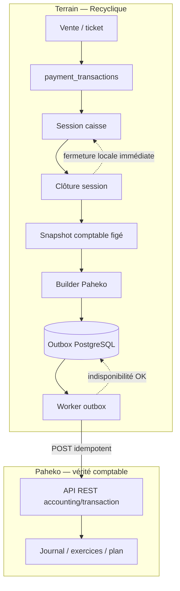

# Intégration Paheko — comptabilité et synchronisation

**Pack :** dossier architecte externe v2  
**Date :** 2026-05-20  
**Audience :** architecte sans connaissance préalable de Recyclique  
**Hors scope :** protocole modules UI (CREOS, manifests, registre module-key)

---

## 1. Rôle de Paheko dans l’écosystème

**Paheko** est l’ERP associatif (membres, comptabilité, caisse native, stock, etc.) hébergé par l’association. Dans l’architecture cible Recyclique × Paheko :

| Domaine | Autorité |
|---------|----------|
| Opérations terrain (ventes, sessions, paiements, tags métier) | **Recyclique** |
| Calcul comptable local, snapshot de clôture, construction des écritures | **Recyclique** |
| Transport résilient, idempotence, retries, quarantaine | **Recyclique** (outbox PostgreSQL) |
| **Vérité comptable finale** (écritures, exercices, plan comptable, exports légaux) | **Paheko** |
| Fiches membres « officielles » côté gestion associative | **Paheko** (via API) |

Recyclique n’est pas un second logiciel comptable : c’est un **middleware métier ressourcerie** qui prépare des lots comptables déterministes et les pousse vers Paheko. Tout écart, reprise ou audit de sync se réconcilie contre l’état durable en base Recyclique (outbox), pas contre une file éphémère.

**Frontière navigateur :** le frontend **ne contacte jamais** Paheko directement — uniquement l'API Recyclique (`/v1/admin/paheko-outbox/*`, `/v1/admin/paheko-mappings/*`, clôture caisse via API Recyclique). Credentials Paheko restent **côté serveur** uniquement.

**Principe terrain d'abord :** la caisse et la clôture de session doivent réussir si Paheko est **indisponible** (réseau) : succès local + outbox `pending`/`a_reessayer`, sync découplée.

**Blocage sélectif (story 8.6)** : si mapping clôture absent/désactivé ou outbox de la session en **quarantaine**, l'action critique **A1** (clôture + handoff outbox) est refusée **avant** clôture — HTTP **409** `PAHEKO_SYNC_FINAL_ACTION_REFUSED` — ce n'est pas un simple retard de sync post-clôture.

---

## 2. Posture API-first vs plugins cloud Paheko

### 2.1 Décision d’intégration

L’intégration retenue est **API REST Paheko** (HTTP Basic, chemins du type `/api/accounting/transaction`, `/api/user/new`, etc.). Recyclique appelle Paheko comme **service back-end**, sans dépendre de l’UI Paheko pour le parcours caisse terrain.

### 2.2 Limitation des plugins « cloud only »

Paheko propose des **extensions** (PHP / Brindille), dont certaines — ex. **HelloAsso** — sont réservées à l’**offre cloud Paheko**. En déploiement **local / auto-hébergé** (cas fréquent des associations équipées par Recyclique), ces plugins ne sont en général **pas** utilisables comme raccourci d’intégration.

**Conséquence architecturale :** toute orchestration HelloAsso ↔ membres ↔ compta passe par **Recyclique + API Paheko**, pas par le plugin HelloAsso de Paheko. Même logique pour d’autres connecteurs cloud : si l’extension n’est pas disponible sur l’instance, Recyclique doit porter le pont.

### 2.3 Ce que l’API couvre vs ce qui reste dans Paheko

| Recyclique via API | Reste dans Paheko (UI ou modules natifs) |
|--------------------|------------------------------------------|
| Création d’écritures (`POST /api/accounting/transaction`) | Clôture caisse **native** Paheko (autre produit / autre filière) |
| Création / import membres | Paramétrage plan comptable, exercices, journaux |
| Lecture ponctuelle (SQL contrôlé, exports) selon version | Validation expert-comptable, rapports légaux finaux |
| — | Modules stock, caisse POS Paheko si l’asso les utilise en parallèle |

Recyclique **ne remplace pas** l’administration comptable Paheko ; il **alimente** le journal via des écritures construites et idempotentes.

---

## 3. Chaîne comptable canonique (autorité des données)

La chaîne normative (delta architecture BMAD, alignée PRD caisse-compta v2) fixe **cinq étapes** ; les Epics historiques 6 (caisse terrain) et 8 (outbox / sync) restent les fondations, cette chaîne est la **couche comptable intermédiaire** explicite :

```text
1. Référentiel des moyens de paiement
2. Journal détaillé des transactions de paiement  ← source de vérité locale des paiements
3. Snapshot comptable figé de session
4. Entry builder Paheko
5. Outbox Paheko (PostgreSQL durable)
```

**Règles clés :**

- Le champ legacy `sales.payment_method` est un **artefact brownfield** : plus d’autorité pour clôture, export ni sync Paheko.
- Cas spéciaux (don en surplus, gratuité, remboursement, remboursement N-1 clos) ne sont pas de simples variantes d’un champ paiement unique.
- Une session **clôturée** ne doit plus être recalculée silencieusement : le snapshot fige contexte (`site`, `caisse`, `session`), totaux, **révision** des mappings comptables (`accounting_config_revision_id`), `correlation_id` de batch.
- **Séparation stricte :** le calcul métier/comptable local et le snapshot sont Recyclique ; le builder transforme le snapshot en sous-écritures Paheko ; l’outbox ne « réinvente » pas la compta.

**Autorité `accounting_period_closed` :** pour un remboursement sur exercice antérieur clos, Recyclique ne doit **pas deviner**. Source = Paheko (si reachable) ou représentation locale versionnée et rafraîchie ; sinon **blocage** ou traitement expert tracé — jamais de supposition silencieuse.

---

## 4. Flux caisse → Recyclique → Paheko

### 4.1 Vue d’ensemble



### 4.2 Cycle de vie d’une session (synthèse)

| Phase | Recyclique | Paheko |
|-------|------------|--------|
| Vente | `sales`, `sale_items`, lignes `payment_transactions` (mixte, don séparé, gratuité sans encaissement) | — |
| Clôture | Interdiction si tickets `held` ; agrégats depuis `payment_transactions` ; écart espèces ; **snapshot figé** ; création batch outbox ; fermeture session locale | — |
| Sync async | Worker : N POST HTTP selon sous-écritures ; états par sous-écriture ; quarantaine / reprise | Écritures dans l’exercice configuré (`id_year`) |
| Supervision | Back-office : statut sync, succès partiel, rejeu idempotent | Consultation / correction expert dans Paheko si besoin |

**Granularité :** comptabilisation **par session clôturée**, pas ticket par ticket (aligné logique session Paheko et PRD v2).

### 4.3 Contrat HTTP Paheko (batch de session)

Pour une session clôturée, le builder produit **jusqu’à trois sous-écritures équilibrées** (stratégie B retenue) :

| # | Contenu | Mode API |
|---|---------|----------|
| 1 | Ventes + dons | **Un seul** `POST` `type: ADVANCED` avec tableau `lines` (une ligne débit par moyen de paiement sur compte `paheko_debit_account` de la révision snapshot + crédits ventes/dons) — pas une succession de POST par moyen pour ce bloc |
| 2 | Remboursements exercice courant | `POST` `type: REVENUE`, JSON simplifié (paire debit/credit + `amount`) |
| 3 | Remboursements exercice antérieur clos | Idem sous-écriture 2, compte type `672` (configurable, validation expert-comptable) |

**Idempotence sous-écriture 1 :** `kind` `sales_donations_per_pm_v1` + sous-clé dédiée (ancien mode agrégé mono-ligne retiré).

**Unité outbox :** 1 **batch idempotent par session**, N sous-écritures, 1 `correlation_id` commun, index stable par sous-écriture ; persistance des IDs distants Paheko multiples et état **succès partiel** explicite.

---

## 5. Outbox, asynchrone, idempotence (ADR 2026-04-20)

### 5.1 Décision canonique

| Élément | Choix |
|---------|--------|
| File durable | **Outbox transactionnelle PostgreSQL** (même transaction que le métier de clôture) |
| Sémantique livraison | **At-least-once** + handlers **idempotents** |
| Redis | **Auxiliaire uniquement** (buffer, dispatch, rate limit) — jamais source de vérité ni autorité d’état (AR12) |
| Option rejetée | Redis comme file durable principale (double-write, perte de corrélation) |

### 5.2 Comportement opérationnel

- **Clôture** : succès local + item outbox ; transmission Paheko **découplée**.
- **Retry** : backoff + limite → **quarantaine** (état durable opérable, pas un simple log).
- **Idempotence** : `idempotency_key` en outbox + en-tête HTTP `Idempotency-Key` côté client Paheko (`paheko_accounting_client.py`). **Garantie effective = applicative Recyclique** (skip `delivered`/`skipped_zero`, sous-clés batch) ; le probe Epic 8 montre que Paheko **ne déduplique pas** un second `POST` avec la même clé — risque résiduel **at-least-once** si crash après HTTP 200 et avant persistance d'état. Voir `references/artefacts/2026-04-10_01_sync-paheko-exploitabilite-terrain-epic8-squelette.md`.
- **Mapping obligatoire** (Epic 25.9) : pas de succès outbox sans résolution mapping clôture valide (`PahekoCashSessionCloseMapping`, `/v1/admin/paheko-mappings/*`) — détail ch. 03 §6.4.
- **Observabilité minimale** : taille backlog, âge du plus ancien pending, taux succès/échec, quarantaine, déduplications ; logs avec `correlation_id`, `idempotency_key`, contexte site/caisse/session.
- **Runbooks** : backlog qui monte, Paheko down, message poison, succès partiel batch session, reprise quarantaine.

La chaîne canonique **n’est pas modifiée** par l’ADR async : l’outbox reste l’étape 5 du pipeline référentiel → journal → snapshot → builder → outbox.

### 5.3 Migration brownfield compta (rappel)

| Phase | Action |
|-------|--------|
| A — Préparation | Référentiel moyens de paiement ; enrichir journal ; compat legacy ; backfill minimal |
| B — Double lecture | Ancien vs canonique ; comparer agrégats clôture |
| C — Bascule | Autorité exclusive snapshot + batch outbox ; tracabilité transition |

---

## 6. Opérations spéciales de caisse

**Périmètre :** annulation, remboursement (standard, autre moyen, N-1 clos), décaissement, mouvement interne, échange, tags métier (gratuité sociale, etc.). PRD et ADR opérations spéciales (2026-04-18) imposent :

- **Un seul rail Paheko** : toute opération avec flux financier repasse par référentiel → journal → snapshot → builder → outbox. **Pas** d’export API ad hoc hors snapshot + builder.
- **Matière / finance / mixte** : mouvements stock sans cash ; cash sans stock ; échange avec différence → sous-flux vente/remboursement existants, pas un troisième moteur comptable.
- **`free`** : vente à 0 €, **pas** un moyen de paiement ni un canal de remboursement.
- **Remboursement expert sans ticket** : parcours distinct (permissions, PIN, motifs, audit) — ne pas confondre avec remboursement standard lié à une vente.
- **Visibilité sync** : toute opération financière terrain/supervision expose un état cohérent outbox (y compris partiel / quarantaine).

Les opérations spéciales **enrichissent** le journal et le snapshot de session ; elles ne créent pas une deuxième chaîne comptable.

---

## 7. HelloAsso — positionnement (hors caisse session)

**Flux recommandé :** `HelloAsso → Recyclique → Paheko`.

| Brique | Rôle |
|--------|------|
| HelloAsso | Paiement en ligne (adhésions, dons, crowdfunding, billetterie), OAuth2, webhooks `Order.*`, Checkout API |
| Recyclique | UI utilisateur, orchestration, réconciliation (`metadata` checkout intent), modèles internes (`ha_order_id`, `paheko_user_id`, etc.) |
| Paheko | Membres (`user/new`, `user/import`) ; écritures optionnelles (`accounting/transaction`) |

**Différences avec la caisse :**

- Pas de **snapshot de session caisse** : chaque commande HelloAsso est un flux **événementiel** (webhook + validation API) avec sa propre logique de compta (écriture banque / cotisation / don selon cas).
- **Déduplication membres :** conflit Paheko 409 sur **nom**, pas email — Recyclique doit chercher par email ou réutiliser `paheko_user_id` stocké avant `user/new`.
- **Limites PRD caisse** (ventilation par famille comptable, clôture session) **ne s’appliquent pas tel quel** ; la spec HelloAsso définit des cas d’usage séparés (phases 1–3 possibles dans le brouillon d’arbitrage).

**Positionnement produit :** module futur / Epic distinct ; **ne pas** mélanger la outbox « batch session caisse » avec les jobs HelloAsso sans modèle d’idempotence et de corrélation dédié.

---

## 8. Limites et périmètre explicites (PRD caisse-compta v2)

| Sujet | Limite |
|-------|--------|
| Ventilation ventes par famille comptable | **Hors périmètre** version courante |
| Compte vente par défaut | `7070` ; changement via SuperAdmin |
| Exercice Paheko | Saisie manuelle `id_year` (option liste API = extension future) |
| UX caisse | Langage métier ; comptes visibles admin / cas spéciaux uniquement |
| Dépendance réseau | Caisse **indépendante** de Paheko en temps réel |
| Stratégie écriture | **B** (plusieurs sous-écritures par session) — stratégie A (une seule transaction) historique, **non** cible backlog |

Phasage produit (rappel) : (1) socle compta fiable + multi-lignes ; (2) remboursements ; (3) détection auto exercice clos ; (4) durcissement outbox / alertes.

---

## 9. Ce que Recyclique ne doit pas dupliquer

| Ne pas dupliquer dans Recyclique | Raison |
|----------------------------------|--------|
| Plan comptable, journaux, exercices, clôtures d’exercice | Autorité Paheko + expert-comptable |
| Journal comptable « officiel » exportable | Les écritures validées vivent dans Paheko |
| Logique plugin HelloAsso / autres extensions cloud Paheko | Non disponible ou non souhaité en local ; API + middleware Recyclique |
| Deuxième file durable (Redis comme vérité sync) | AR11/AR12 ; atomicité outbox SQL |
| Second rail comptable (fichiers, scripts, POST hors outbox) | Perte idempotence / corrélation (ADR opérations spéciales) |
| Caisse POS Paheko en parallèle comme source des ventes Recyclique | Deux vérités terrain ; Recyclique est la caisse métier ressourcerie |
| Recalcul comptable après clôture sans nouvelle session / procédure expert | Snapshot figé ; intégrité batch |
| « Deviner » exercice clos pour remboursement N-1 | Risque légal / comptable ; blocage ou expert |
| Agrégation comptable ticket par ticket vers Paheko | Décision produit : **session** uniquement |
| UI admin Paheko (param compta, exercices) | Recyclique expose paramétrage **embarqué** (SuperAdmin) mappé vers révision snapshot, pas un clone ERP |

Recyclique **doit** porter : règles métier ressourcerie, journal paiements, snapshot, mapping vers comptes Paheko (révision versionnée), builder déterministe, outbox, supervision sync, audit des événements sensibles.

---

## 10. Sources normatives (lecture approfondie)

| Document | Chemin |
|----------|--------|
| Chaîne comptable canonique | `_bmad-output/planning-artifacts/architecture/cash-accounting-paheko-canonical-chain.md` |
| ADR async outbox / Redis | `_bmad-output/planning-artifacts/architecture/2026-04-20-adr-async-paheko-outbox-durable-redis-auxiliaire-ou-trajectoire-hybride.md` |
| ADR opérations spéciales | `_bmad-output/planning-artifacts/architecture/2026-04-18-adr-operations-speciales-caisse-paheko-v1.md` |
| PRD caisse × compta (limites, phasage) | `references/migration-paheko/2026-04-15_prd-recyclique-caisse-compta-paheko.md` |
| Index migration Paheko | `references/migration-paheko/index.md` |
| Spec HelloAsso ↔ Recyclique ↔ Paheko | `references/migration-paheko/2026-04-12_specification-integration-helloasso-recyclique-paheko.md` |
| Opérations spéciales (PRD terrain) | `references/operations-speciales-recyclique/` |

**Invariants à ne pas rouvrir sans correct course :** outbox PostgreSQL canonique ; batch par session ; at-least-once + idempotence ; Paheko = vérité comptable finale ; API-first sans plugin cloud obligatoire.
