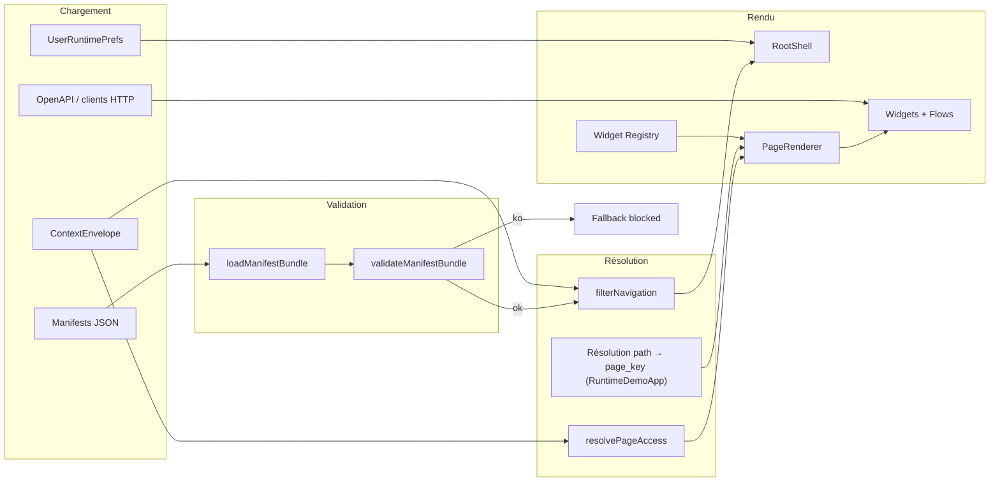

# 05 — Frontend : Peintre_nano, CREOS et contrats

**Audience :** architecte externe (lecture autonome).  
**Date de synthèse :** 2026-05-20.  
**Sources :** `peintre-nano/docs/01–03`, `contracts/README.md`, `contracts/creos/schemas/README.md`, ADR P1/P2 (`references/peintre/2026-04-01_adr-p1-p2-stack-css-et-config-admin.md`), PRD canonique §4.2 et §12.2.

---

## 1. Rôle de Peintre_nano

**Peintre_nano** est le **moteur de composition UI** côté client de Recyclique v2. Il assemble :

- un **shell** applicatif (navigation, layouts globaux, providers) ;
- un **registre** de widgets React ;
- des **layouts** et **slots** nommés ;
- des **manifests** CREOS (navigation, pages, catalogue widgets) ;
- des **flows** et états de données branchés sur **OpenAPI**.

### Ce qu’il est

| Attribut | Description |
|----------|-------------|
| Runtime React | Rendu d’une UI **déclarative** (JSON reviewable + conventions TypeScript) |
| Point d’assemblage | Shell ↔ widgets ↔ manifests ↔ contrats HTTP |
| Socle extractible | Frontières code prêtes pour un futur repo autonome (hypothèse, pas livré) |
| Agnosticisme métier | Ne décide pas permissions, règles comptables ni schémas backend |

### Ce qu’il n’est pas

- Backend Recyclique, writer OpenAPI, ni autorité sur `ContextEnvelope` / permissions.
- Vision long terme **Peintre** (nano / mini / macro) en entier — seule l’échelle **nano** est implémentée.
- Second Recyclique codé dans la façade UI.

**Garde-fou normatif :**

> Peintre_nano **rend** ce que l’application commanditaire déclare et autorise ; il **n’invente pas** la structure métier.

---

## 2. CREOS : grammaire de composition

**CREOS** (*Contract-driven Runtime for Exploitation UI Surface*) désigne la famille d’artefacts **déclaratifs** qui structurent l’UI sans dupliquer la vérité métier.

### Artefacts principaux

| Artefact | Rôle |
|----------|------|
| **NavigationManifest** | Entrées de menu / routes (`path`, `page_key`, visibilité par permissions et contexte) |
| **PageManifest** | Composition d’une page : `slots[]` avec `slot_id`, `widget_type`, `widget_props` |
| **Catalogue widgets** | Déclarations de type (`widget-declaration`) : identité, `data_contract` optionnel |
| **Slots** | Zones nommées dans une page ; le runtime mappe slot → composant enregistré |
| **Widgets** | Composants React + contrat de données (`operation_id` ↔ OpenAPI) |
| **Flows** | Parcours UI (étapes, transitions) ; actions sensibles restent côté Recyclique |

### Hiérarchie de vérité (lecture des données)

Ordre d’interprétation cible (AR39 / gouvernance contractuelle) :

1. **OpenAPI** — opérations, schémas, `operationId` stables  
2. **ContextEnvelope** — site, permissions effectives, périmètre actif (`GET /v1/users/me/context`)  
3. **NavigationManifest** — structure navigable filtrée par enveloppe  
4. **PageManifest** — composition de la page courante  
5. **UserRuntimePrefs** — préférences UI locales **non métier** (densité, presets d’affichage)

Le frontend peut **filtrer, masquer, formater** ; il ne doit pas **recalculer une autorisation métier** ni **redéfinir des schémas** backend.

### Schémas JSON formels

Emplacement : `contracts/creos/schemas/`

| Fichier | Objet |
|---------|--------|
| `widget-declaration.schema.json` | Catalogue / déclaration widget (≠ ligne de slot dans un `PageManifest`) |
| `widget-data-states.schema.json` | Codes `DATA_*` CREOS (distinct du type TS `WidgetDataState`) |

**CI cible (Epic 10) :** chaque `data_contract.operation_id` des manifests **reviewables** doit exister comme `operationId` dans `contracts/openapi/recyclique-api.yaml`.

---

## 3. Pipeline runtime Peintre_nano

### Vue d’ensemble



### Étapes détaillées

| # | Étape | Implémentation (indicatif) | Sévérité si échec |
|---|--------|---------------------------|-------------------|
| 1 | Bootstrap | `src/main.tsx` → `App.tsx` → shell (`RuntimeDemoApp` / `LiveAuthShell`) | — |
| 2 | Chargement manifests | `fetch` / bundle statique → `loadManifestBundle` | `blocked` |
| 3 | Parse + normalisation | `parseNavigationManifestJson`, `parsePageManifestJson` (snake_case → camelCase) | `blocked` |
| 4 | Validation lot | Cohérence nav/pages, allowlist `widget_type` | `blocked` |
| 5 | Contexte | Enveloppe fraîche ; filtrage nav (`filterNavigation` — `filter-navigation-for-context.ts`) | nav vide → `info` |
| 6 | Accès page | `resolvePageAccess` (permissions, `requires_site`, staleness) | `blocked` |
| 7 | Résolution route | `path` → `page_key` ; alias runtime app (ex. `/cash-register/sale` → même manifeste que `/caisse`) | documenté, pas second manifeste |
| 8 | Rendu | Shell → slots → `resolveWidget` → composant | widget inconnu → `degraded` |

**Points d'entrée code :** `src/runtime/`, `src/registry/`, `src/app/`, `src/domains/`. **Bootstrap :** `App.tsx` → optionnel `LiveAuthShell` (`VITE_LIVE_AUTH`) enveloppant `RuntimeDemoApp` — voir `App.tsx`. **CREOS** : uniquement `contracts/openapi/recyclique-api.yaml`, pas `openapi.json` FastAPI (ch. 02–03).

**Invariants runtime :**

- un seul pipeline de rendu ;
- domaines branchés par **registre + slots + contrats**, pas par imports opportunistes dans le shell ;
- mode dégradé explicite (`reportRuntimeFallback`) ;
- **aucun import** depuis `references/` dans le bundle Vite.

---

## 4. `contracts/` vs `peintre-nano/public/manifests`

Le monorepo sépare **contrats reviewables** (writer Recyclique, CI, promotion) et **copies de démo / dev** consommées par Vite.

| Zone | Chemin | Rôle |
|------|--------|------|
| OpenAPI canonique | `contracts/openapi/recyclique-api.yaml` | API v2, `operationId`, codegen → `openapi/generated/recyclique-api.ts` |
| Schémas CREOS | `contracts/creos/schemas/` | JSON Schema catalogue / états données |
| Manifests **reviewables** | `contracts/creos/manifests/` | Navigation transverse, pages admin, **pilote bandeau live**, lots Epic 4+ |
| Cache runtime backend | `recyclique/.../manifests/` (assemblage dérivé) | **Non** source reviewable — pas d'édition manuelle comme vérité |
| Manifests **démo / dev** | `peintre-nano/public/manifests/` | Servis par le dev server ; copie ou variante locale |
| Fixtures tests | `peintre-nano/src/fixtures/manifests/` | Tests unitaires / contract sans réseau |

**Règle opérationnelle :**

- **Writer canonique** des manifests métier reviewables : **Recyclique** (équipe produit/back), sous `contracts/creos/manifests/`.
- **Peintre_nano** **consomme** (fetch, import bundle `runtime-demo-manifest.ts`, ou copie synchronisée) — il ne doit pas devenir une deuxième source de vérité.
- Promotion démo → reviewable : procédure documentée dans la gouvernance contractuelle (pivot `references/artefacts/2026-04-02_04_gouvernance-contractuelle-openapi-creos-contextenvelope.md`).

**Lien widget ↔ API :** dans le catalogue, `data_contract.operation_id` référence un `operationId` OpenAPI (ex. bandeau live → `recyclique_exploitation_getLiveSnapshot`, `GET /v2/exploitation/live-snapshot`).

---

## 5. Stack présentation et config admin (ADR P1 / P2)

### P1 — CSS et composants (fermé)

Décision : **CSS Modules** + **design tokens** (`tokens.css`, variables CSS) + **Mantine v8** comme bibliothèque de composants riches.

- Le **DSL / manifests CREOS** ne mentionnent jamais Mantine ni des classes utilitaires.
- Chaque widget : React + `.module.css` scoped ; spacing/couleurs via `var(--token)`.
- Mantine consommé comme widgets intégrables au registre, pas comme socle de composition.

**Interdit :** Tailwind, CSS-in-JS runtime, `utilities.css` global, valeurs magiques hors tokens.

### P2 — Config admin dynamique (fermé)

| Couche | Stockage | Contenu |
|--------|----------|---------|
| Défauts build | Manifests CREOS (fichiers versionnés) | Structure modules, ordre de blocs, variantes par défaut |
| Surcharges runtime | **PostgreSQL** (table clé/valeur typée) | Modules actifs/inactifs, ordre, feature toggles, variantes simples |

- Pas de JSON sur disque en production pour la config dynamique.
- Pas de variables d’environnement pour de la config métier changeante.
- Traçabilité (auteur, date, motif) via SQL.
- Fusion à la lecture : **manifests = primaire**, **PG = surcharges** avec précédence documentée dans le pipeline admin.

---

## 6. Modularité v2 : chaîne complète et pilote « bandeau live »

### 6.1 Chaîne produit (PRD §4.2)

Un module n’est **modulaire** que si la chaîne **métier + UI** existe de bout en bout :

| # | Brique | Porteur |
|---|--------|---------|
| 1 | Contrat métier (schéma, règles) | OpenAPI + domaine Recyclique |
| 2 | Récepteur backend | Handlers / services API |
| 3 | Contrat UI | Manifest CREOS (`NavigationManifest`, `PageManifest`, catalogue) |
| 4 | Runtime frontend | Peintre_nano (chargement → rendu) |
| 5 | Permissions et contexte | Recyclique → `ContextEnvelope` |
| 6 | Fallback, audit, feedback | Runtime (`reportRuntimeFallback`) + logs / UX explicite |

En construction, un **mock balisé** est toléré ; pas en état final.

### 6.2 Chaîne technique de preuve (PRD §12.2, étape 7)

Jalon **bloquant** avant les gros modules métier (`eco-organismes`, etc.) :

```text
backend (OpenAPI + impl)
  → manifest CREOS reviewable
  → registre widget Peintre
  → slot PageManifest
  → rendu React
  → fallback / blocage observable
```

**Règle produit :** si le pilote **bandeau live** ne prouve pas cette chaîne, **corriger la chaîne** avant d'étendre le périmètre UI.

**Réconciliation ch. 02 :** le gate Convergence 2 vise le slot architecture `shell.bandeau.live` ; le pilote Epic 4 actuel utilise une page sandbox (`page-bandeau-live-sandbox`, slots `header`/`main`/`aside`). Le critère « done » = chaîne OpenAPI + manifest reviewable + registre + rendu + fallback — **pas** l'égalité stricte des noms de slots.

### 6.3 Pilote « bandeau live » (Epic 4)

Slice minimal **reviewable** sous `contracts/creos/manifests/` :

| Fichier (exemples) | Rôle |
|--------------------|------|
| `widgets-catalog-bandeau-live.json` | Type `bandeau-live`, `data_contract.operation_id` = `recyclique_exploitation_getLiveSnapshot` |
| `page-bandeau-live-sandbox.json` | Page `bandeau-live-sandbox`, slots `header` / `main` / `aside` |
| `navigation-bandeau-live-slice.json` | Entrée nav dédiée slice Epic 4 |

**Ce que le pilote démontre :**

- une opération OpenAPI réelle alimente un widget déclaré CREOS ;
- le runtime charge, valide et rend sans convention locale non versionnée ;
- les écarts (snapshot mock en sandbox, polling, KPI dashboard avec `use_live_source`) sont **bornés et testés**, pas des raccourcis cachés dans le shell.

**Hors périmètre de ce document :** protocole détaillé « comment créer un nouveau module » (chantier `references/protocole-modules-recyclique/` — phase ultérieure, post-validation architecte).

---

## 7. Frontières et écarts assumés (lecture architecte)

| Sujet | État |
|-------|------|
| Routes legacy vs CREOS | Alias runtime (ex. `/cash-register/sale` → même `page_key` `cashflow-nominal`) ; écarts `/` vs `/dashboard` documentés |
| Double emplacement manifests | Acceptable si **promotion** et **CI** distinguent reviewable vs démo |
| Extraction Peintre autonome | Frontières OK dans le code ; packaging et publication de contrats restent à traiter |
| PWA / kiosque offline | Cible PRD complémentaire ; gate readiness **NON PRÊTE** — ne pas supposer livré |
| Config admin UI | Pages `/admin/*` en croissance (manifests transverse) ; fusion PG à industrialiser |

### 7.4 Gardien du seuil — conscience d'affichage (v2, bypass autorisé)

**Décision produit (2026-05-20) :** Peintre porte une **couche de conscience** de l'affichage courant. Un agent IA peut raisonner sur la page **comme l'utilisateur** (attentes métier, ergonomie, densité, ordre des actions, cohérence avec le contexte `ContextEnvelope`).

| Rôle | Description |
|------|-------------|
| **Gardien du seuil** | Intercepte toute **proposition de changement d'affichage** : insertion dynamique de widget, mise à jour de slot/props, nouvelle étape de flow, patch manifeste ou rendu proposé par un **module** ou un **agent**. |
| **Décision** | **Accepter** la proposition telle quelle, ou **repenser** la mise en page puis **demander l'exécution** via des outils (liste à définir : ajuster CREOS reviewable, `widget_props`, ordre d'étape, `reportRuntimeFallback`, etc.). |
| **v2** | Présent **dès cette version** sous forme de **réceptacles et branchements** (hooks runtime, contrat d'événement, feature flag, stub agent) même si le chemin nominal reste en **bypass** (module → runtime direct). |

**Branchements cibles (à figer HITL) :** après résolution `PageManifest` / avant montage widget ; après merge activation `module_key` ; entrée/sortie d'étape `FlowRenderer` ; canal optionnel pour agents Cursor branchés sur Peintre.

**Suivi :** lacune pack **L-16** · TODO **T-PEINT-1** · idée Kanban [`references/idees-kanban/a-creuser/2026-05-20_peintre-gardeien-seuil-conscience-affichage.md`](../idees-kanban/a-creuser/2026-05-20_peintre-gardeien-seuil-conscience-affichage.md) · [`04-MOD-protocole-front-creos.md`](../protocole-modules-recyclique/04-MOD-protocole-front-creos.md) §17.

---

## 8. Références dans le dépôt

| Besoin | Chemin |
|--------|--------|
| Périmètre Peintre_nano | `peintre-nano/docs/01-perimetre-et-positionnement.md` |
| Runtime | `peintre-nano/docs/02-architecture-runtime.md` |
| CREOS + données | `peintre-nano/docs/03-contrats-creos-et-donnees.md` |
| Contrats racine | `contracts/README.md` |
| Gouvernance | `references/artefacts/2026-04-02_04_gouvernance-contractuelle-openapi-creos-contextenvelope.md` |
| ADR stack + config | `references/peintre/2026-04-01_adr-p1-p2-stack-css-et-config-admin.md` |
| Modularité PRD | `_bmad-output/planning-artifacts/prd.md` §4.2, §12.2, §13–14 |

---

*Chapitre 05 — pack dossier architecte externe v2. Prochaine lecture recommandée : `06-ARCH-etat-implementation-et-backlog.md` (synthèse livraison) ou `02-ARCH-architecture-globale-et-frontieres.md` (frontières système).*
