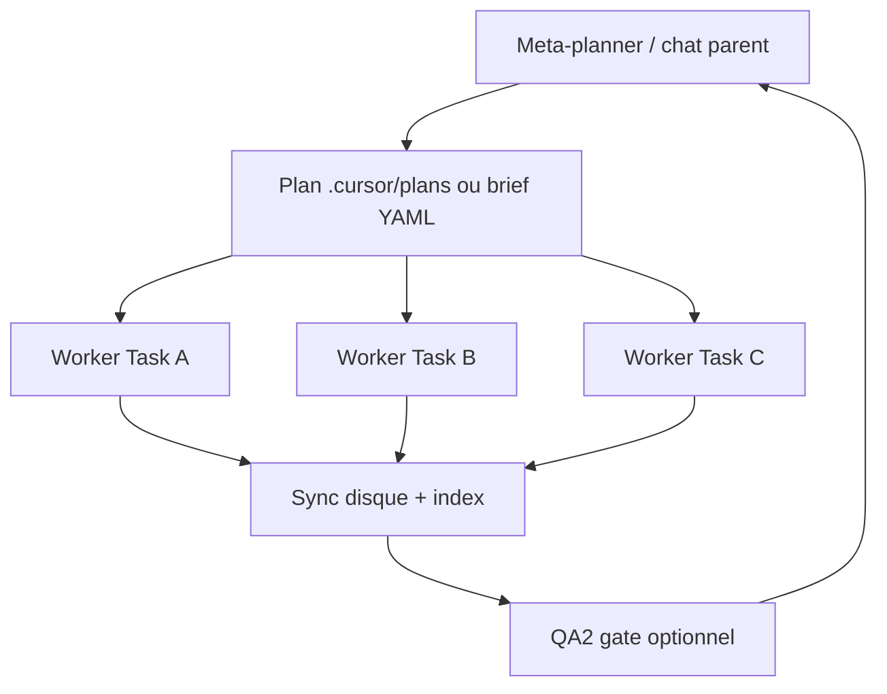

# Porte d'entree contexte — SOURCE NORMATIVE

**Statut :** normatif pour les agents Cursor sur **JARVOS_recyclique**.  
**Date :** 2026-05-21 (Phase 0.B, plan memoire v2.3).  
**Hub :** [`index.md`](index.md)

**Regle d'or :** noter la **date systeme** en tete de session ; appliquer la **matrice §4** selon le type de session declare ; ne jamais charger `references/` en entier.

---

## 1. Vision — Ombre, Archi, Arbitre

Trois **postures** complementaires (detail : [`roles-ombre-archi-arbitre.md`](roles-ombre-archi-arbitre.md)) :

| Posture | Mission | Livrable type |
|---------|---------|---------------|
| **Ombre** | Explorer, cartographier, indexer sans prescrire | Inventaires, index transcripts, listes de gaps |
| **Archi** | Structurer, trancher, aligner contrats et protocoles | ADR, protocoles, dossiers architecte, matrice modularite |
| **Arbitre** | Borner le scope, valider HITL, escalader l'humain | QCM HITL, NEEDS_HITL, reco post-bouclage, gates score |

Une session peut **dominer** une posture ; les autres restent en **garde-fou** (ex. dev-story = Archi + Arbitre sur les gates, Ombre minimale).

---

## 2. Types de session (4)

| Type | Intent | Orchestration typique | Posture dominante |
|------|--------|----------------------|-------------------|
| **`bmad-dev-story`** | Implementer ou valider **une story** BMAD (CS→VS→DS→gates→QA→CR) | `@bmad-story-runner` ou skill `bmad-dev-story` ; brief YAML | Archi + Arbitre |
| **`jarvos-discovery`** | Comprendre un domaine, cartographier sources, preparer un chantier doc | Workers paralleles lecture ; **pas** de code produit sauf demande | Ombre |
| **`orchestration-graph`** | Plan multi-livrables en **une** session parent (vagues A→B→C) | `long-run-orchestrator` + `.cursor/plans/*.plan.md` + Task workers | Ombre → Archi |
| **`mixte`** | Enchainement discovery courte puis story ou QA2 | Parent declare la **phase courante** dans le prompt | Variable — requalifier a chaque gate |

**Declaration obligatoire** en debut de prompt utilisateur ou brief Task :  
`Type de session : <bmad-dev-story | jarvos-discovery | orchestration-graph | mixte>`.

---

## 3. Graphe d'orchestration (meta-planner → plan → workers)

Discipline **documentee** (pas de runner headless). S'applique surtout a `orchestration-graph` et `mixte`.



| Noeud | Responsabilite | Ne fait pas |
|-------|----------------|-------------|
| **Meta-planner** | Choisir vagues, gates, chemins absolus, anti-dilution spawn | Rediger seul des livrables volumineux |
| **Plan** | Fichier `.cursor/plans/*.plan.md` ou brief ; todos + chemins autorises | Remplacer `sprint-status.yaml` pour l'etat story |
| **Workers** | Lire **leur** scope ; ecrire fichiers autorises | Charger tout `references/` |

**Sync :** pour plans multi-vagues, fichier `{chantier_root}/00_SYNC_STATUS.md` (skill `long-run-orchestrator`).  
**BMAD story :** graphe interne CS→VS→DS→GATE→QA→CR — voir [`../automatisation-bmad/epic-story-runner-spec.md`](../automatisation-bmad/epic-story-runner-spec.md).

**Plans indexes :** [`plans-index.md`](plans-index.md).

---

## 4. MATRICE — portes d'entree (charger | ne pas charger)

| Ressource | `bmad-dev-story` | `jarvos-discovery` | `orchestration-graph` | `mixte` |
|-----------|------------------|--------------------|-----------------------|---------|
| **`references/index.md`** | Oui (abstract) | **Oui** (carte) | Oui (abstract) | Oui |
| **Rule `projet-jarvos-contexte`** (`.cursor/rules/projet-jarvos-contexte.mdc`) | Implicite (alwaysApply) | Implicite | Implicite | Implicite |
| **`references/ou-on-en-est.md`** | Oui | Oui | Oui | Oui |
| **Ce fichier `00-porte-entree-contexte.md`** | Oui | **Oui** | Oui | Oui |
| **`jarvos-agentique/index.md`** | Si besoin privacy/promotion | Optionnel | Optionnel | Optionnel |
| **Artefact BMAD `2026-03-31_06_porte-entree-agent-bmad-vierge.md`** | Si agent **vierge** sans story file | Non (sauf brainstorm BMAD pur) | Non | Phase discovery : oui ; phase story : oui |
| **Story `.md` + `sprint-status.yaml`** | **Oui** (cible) | Non | Non | Phase story : oui |
| **`guide-pilotage-v2.md`** | Si epic / multi-surface | Non | Si plan le cite | Si pertinent |
| **`automatisation-bmad/`** | Si orchestration Epic/Story | Non | Si plan BMAD | Si phase BMAD |
| **Pack cible (`protocole-modules-recyclique/`, etc.)** | Si story le dit | **Oui** (perimetre discovery) | Selon `scope_paths` plan | Selon phase |
| **`_bmad-output/archive/`** (ancien PRD) | Non sauf correct course | Matiere seulement | Non sauf plan | Non par defaut |
| **Transcripts JSONL integraux** | **Non** | **Non** | **Non** | **Non** |
| **Index transcript / UUID** (`12-MOD-index-transcripts`, `registre-patterns`) | Si reprise session | Oui | Si plan le cite | Discovery : oui |
| **`references/ecosysteme/`** | Non sauf demande | Non sauf demande explicite | Non sauf demande | Non sauf demande |
| **`references/_depot/`** | Non | Non | Non | Non (→ `@depot-specialist`) |

**Ordre de chargement recommande (tous types sauf story ciblee) :**

1. Date systeme + type de session (§2)  
2. `references/index.md` (abstract uniquement)  
3. `references/ou-on-en-est.md`  
4. Ce fichier (§4 selon type)  
5. Index du sous-dossier cible (`references/<dossier>/index.md`)  
6. Fichiers listes dans le brief / plan / story — **pas** de crawl opportuniste

---

## 5. Rappels transverses

- **STT / noms projet :** rule `stt-et-orthographe-projet.mdc` (RecyClique, Paheko).  
- **Idees Kanban :** skill `idees-kanban` — ne pas editer `idees-kanban/index.md` a la main.  
- **Git :** `@git-specialist` ou `references/procedure-git-cursor.md` — pas de push sans validation humaine.  
- **QA2 livrable lourd :** `@qa2-orchestrator` — parent ne pre-lit pas tout le corpus a la place des workers.

---

## 6. Prompt court (a coller)

```
Workspace : JARVOS_recyclique.
Type de session : <bmad-dev-story | jarvos-discovery | orchestration-graph | mixte>.
Charge normative : references/jarvos-agentique/00-porte-entree-contexte.md (matrice §4).
Puis references/index.md + references/ou-on-en-est.md.
Ne charge pas references/ en entier. Pas de transcript JSONL dans le depot.
Posture : preciser Ombre / Archi / Arbitre dominante si mixte.
```

---

_Remplace progressivement l'usage exclusif de `references/artefacts/2026-03-31_06_porte-entree-agent-bmad-vierge.md` pour les sessions typées ci-dessus ; conserver l'artefact 06 pour brainstorming BMAD vierge non couvert par la matrice._
