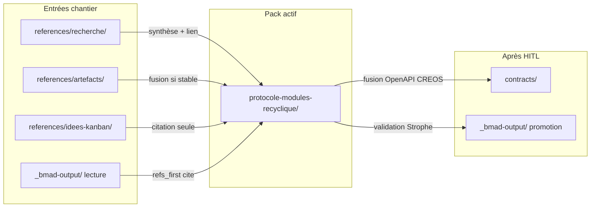

# 00 — Cadrage du chantier protocole modules Recyclique

**Date :** 2026-05-20  
**Statut :** document de cadrage (Phase 0 amorçage du pack)  
**Audience :** agents Cursor, développeurs, architecte interne — **après** lecture du dossier [`references/dossier-architecte-externe-v2/`](../dossier-architecte-externe-v2/) (ch. 05–07 recommandés).  
**Plan de rédaction :** [`00-MOD-plan-redaction-modules.md`](00-MOD-plan-redaction-modules.md)  
**Chantier parent :** [`.cursor/plans/chantier_protocole_modules_fe3bc68e.plan.md`](../../.cursor/plans/chantier_protocole_modules_fe3bc68e.plan.md)

---

## 1. Pourquoi ce chantier existe

Recyclique v2 a **prouvé** une chaîne modulaire bout en bout sur le pilote **bandeau live** (Epic 4, stories `4-1` … `4-6b`). En parallèle, le dépôt conserve un **double récit** : design v0.1 (fév. 2026, `module.toml`, `ModuleBase`, EventBus Redis) et fil conducteur v2 (mars–avr. 2026, CREOS build-time, JSON `site_id` + `module_key`, séparation Recyclique / Peintre / Paheko).

**État pack (2026-05-20) :** protocole documenté **livré** sous `references/protocole-modules-recyclique/` (brouillon normatif — validation HITL contenu en cours via [`09-MOD-lacunes-et-questions-ouvertes.md`](09-MOD-lacunes-et-questions-ouvertes.md)). La chaîne modulaire Epic 4 est **prouvée** en implémentation ; ce pack la formalise pour agents et développeurs.

**Lacunes résiduelles** (hors rédaction du pack — constat dossier architecte + [`06-ARCH-etat-implementation-et-backlog.md`](../dossier-architecte-externe-v2/06-ARCH-etat-implementation-et-backlog.md)) :

| Lacune | Impact |
|--------|--------|
| ~~ADR-007 Proposed~~ | **Clos** — ADR-007 **Accepted** (HITL 2026-05-20) + miroir BMAD |
| Promotion BMAD / fusion `contracts/` | **T-MOD-3 clos** — `module-config` dans `recyclique-api.yaml` ; addendum PRD §4.2 et schémas CREOS restent **post-HITL** |
| Story **9.6** (config admin généralisée) | Toggle transitoire Epic 4.5 pas encore remplacé par modèle `module_key` générique |
| Pilote #2 comptage (Epic 6+) | Fiche [`08-MOD-exemple-pilote-comptage-pieces-billets.md`](08-MOD-exemple-pilote-comptage-pieces-billets.md) livrée ; **implémentation** métier hors pack |

Ce chantier **ne remplace pas** le PRD ni les epics BMAD : il **cite** `_bmad-output/` en stratégie **`refs_first`** (ne pas promouvoir avant validation HITL Strophe).

**Phase 0 terminée :** le pack [`dossier-architecte-externe-v2/`](../dossier-architecte-externe-v2/) donne le contexte plateforme à un architecte externe ; le protocole modules y est mentionné **sans** le détailler — c’est l’objet de **ce** chantier.

---

## 2. Objectif et périmètre IN

### 2.1 Objectif unique

Fixer un **protocole documenté unique** pour agents et développeurs, couvrant **quatre volets** :

1. **Backend** — points d’entrée API, modèle BDD (tables dédiées vs JSON générique), enregistrement routes/services, sync Paheko (chaîne outbox), events.
2. **Front** — manifests CREOS, registre widgets, **insertion dans un workflow** (slice transverse *ou* étape de flow), activation/désactivation par site.
3. **Contrats** — OpenAPI, schémas JSON par `module_key`, templates manifest ; lien `data_contract.operation_id` et gouvernance ContextEnvelope.
4. **Gouvernance** — registre des `module_key`, matrice dépendances, critères **module optionnel** vs **module obligatoire v2**.
5. **Gardien du seuil (Peintre)** — réceptacles runtime pour **conscience d'affichage** et validation ergonomique avant rendu dynamique (**T-PEINT-1**, **L-16**) — présents en v2 même si bypass ; détail [`04`](04-MOD-protocole-front-creos.md) §17.

### 2.2 Fil rouge métier (sans implémentation)

Le pack valide le protocole sur **deux pilotes documentaires** :

| Pilote | Rôle | Référence |
|--------|------|-----------|
| **#1 Bandeau live** | Template obligatoire de la **chaîne complète** PRD §4.2 (7 briques) | Epic 4 ; `references/config-modules-site-id/schemas/kpi-live-banner.v1.json` |
| **#2 Comptage pièces/billets** | Validation **workflow step** (clôture caisse) + données métier + Paheko | Fiche [`08-MOD-exemple-pilote-comptage-pieces-billets.md`](08-MOD-exemple-pilote-comptage-pieces-billets.md) (livrée) ; questions [`07-ARCH-todos-et-questions-architecte.md`](../dossier-architecte-externe-v2/07-ARCH-todos-et-questions-architecte.md) |

### 2.3 Livrables du pack (structure cible)

Ordre de **lecture** pour un consommateur du pack (pas l’ordre de rédaction — voir §6) :

| Fichier | Rôle |
|---------|------|
| [`index.md`](index.md) | Porte d’entrée, glossaire minimal, ordre de lecture |
| **`00-MOD-cadrage-chantier.md`** | **Ce document** — périmètre, flux, succès, liens |
| `01-MOD-matrice-choix-modularite.md` | v0.1 / v2 / abandonné / post-v2 par brique |
| `07-MOD-adr-reconciliation-v01-v02.md` | ADR brouillon TOML → CREOS + JSON serveur |
| `02-MOD-taxonomie-types-de-modules.md` | Types (slice, domaine, backend, config-only, workflow step) |
| `05-MOD-registre-module-key.md` | Liste blanche, statut, dépendances |
| `03-MOD-protocole-backend.md` | Checklist back |
| `04-MOD-protocole-front-creos.md` | Checklist front |
| `06-MOD-cookbook-nouveau-module-optionnel.md` | **Livrable principal** agents/dev |
| `08-MOD-exemple-pilote-comptage-pieces-billets.md` | Fiche pilote #2 sans code |
| `09-MOD-lacunes-et-questions-ouvertes.md` | HITL, TODO T-MOD-* |
| `prompt-agent-chantier-modules.md` | *(Optionnel)* prompt opérationnel |

Meta : [`00-MOD-plan-redaction-modules.md`](00-MOD-plan-redaction-modules.md) (planificateur, hors norme consommateur).

### 2.4 Précédents à imiter (qualité de pack)

| Pack existant | Ce qu’on en reprend |
|---------------|---------------------|
| [`references/operations-speciales-recyclique/`](../operations-speciales-recyclique/) | PRD chantier + prompt agent ultra-opérationnel + index |
| [`references/config-modules-site-id/`](../config-modules-site-id/) | ADR + livrable normatif **QA2** + OpenAPI brouillon |

Le chantier modules **complète** `config-modules-site-id` (persistance config UI) ; il ne l’absorbe pas.

---

## 3. Hors-scope explicite

Les éléments suivants sont **interdits** dans le contenu normatif du pack (citation autorisée en § post-v2 uniquement) :

| Hors-scope | Motif |
|------------|--------|
| **Marketplace / modules tiers post-v2** | Hypothèse produit isolée — [`post-v2-hypothesis-marketplace-modules.md`](../../_bmad-output/planning-artifacts/architecture/post-v2-hypothesis-marketplace-modules.md) ; pas de procédure d’installation tierce |
| **Implémentation** du module comptage pièces/billets | Fiche + checklist dans `08-*` seulement |
| **Réécriture** `recyclique-1.4.4` ou loader TOML legacy | Sans décision ADR `07-adr-reconciliation` |
| **Publication** dans [`doc/`](../../doc/) | Communication externe, pas matière technique modulaire |
| **Promotion BMAD** (PRD, epics, ADR archi canonique, fusion `contracts/`) | **Après** validation HITL Strophe |
| **Peintre autonome / apps contributrices post-v2** | [`post-v2-hypothesis-peintre-autonome-applications-contributrices.md`](../../_bmad-output/planning-artifacts/architecture/post-v2-hypothesis-peintre-autonome-applications-contributrices.md) |

**Distinction importante :** le chantier documente **comment** brancher un module optionnel v2 ; il ne conçoit pas l’économie d’un store de modules ni la signature de bundles tiers.

---

## 4. Double récit v0.1 ↔ v2 (cadrage, pas arbitrage final)

Le pack **Phase A** doit trancher via `01-matrice` + `07-adr`. En attendant, le cadrage retient :

| Dimension | v0.1 (fév. 2026) | v2 (fil conducteur) |
|-----------|------------------|---------------------|
| Manifeste | `module.toml` (TOML) | Manifests **CREOS** (JSON), build-time → `contracts/creos/` |
| Activation | `config.toml` `[modules] enabled` | Transitoire `bandeau_live_slice_enabled` → **Story 9.6** + JSON `site_id`/`module_key` (ADR-001) |
| Contrat code | `ModuleBase`, slots React monorepo | Chaîne PRD §4.2 ; Peintre_nano + `data_contract.operation_id` |
| Hooks | EventBus Redis Streams (design) | Outbox Paheko, jobs métier — pas de bus générique documenté v2 |
| Source design | [`2026-02-24_07_design-systeme-modules.md`](../artefacts/2026-02-24_07_design-systeme-modules.md) | [`2026-03-31_decision-directrice-v2.md`](../vision-projet/2026-03-31_decision-directrice-v2.md), PRD §4.2 |

**Règle de travail :** ne pas redécouvrir Pluggy vs CREOS ; **réconcilier** et **unifier** les choix déjà posés.

---

## 5. Flux de travail : recherche et artefacts → pack

### 5.1 Règles par type de source

| Type | Emplacement canonique | Règle pour ce chantier |
|------|----------------------|-------------------------|
| **Recherche externe** (Perplexity, etc.) | [`references/recherche/`](../recherche/) — convention `YYYY-MM-DD_titre_[IA]_prompt.md` / `_reponse.md` | Toujours créer ici ; **résumer** dans le pack + lien ; ne pas dupliquer les réponses intégrales |
| **Handoffs / brouillons agents** | [`references/artefacts/`](../artefacts/) | Temporaire ; **fusionner** dans le pack quand stable ; sinon lien depuis `09-lacunes` |
| **Idées immatures** | [`references/idees-kanban/`](../idees-kanban/) | **Citer**, ne pas dupliquer (ex. plugin-framework, module-store) |
| **Norme produit / stories** | `_bmad-output/planning-artifacts/`, `_bmad-output/implementation-artifacts/` | **Lecture seule** — alignement des protocoles, pas recopie |
| **Config modules transverse** | [`references/config-modules-site-id/`](../config-modules-site-id/) | Référence normative persistance JSON ; le pack définit **quand** config vs tables métier |
| **Contrats reviewables** | [`contracts/`](../../contracts/) | Cible **post-HITL** ; brouillons restent dans `config-modules-site-id/openapi-module-config.yaml` jusqu’à fusion |

### 5.2 Cycle de mise à jour

1. Nouvelle enquête → `recherche/` + entrée dans [`references/recherche/index.md`](../recherche/index.md) si fichier stable.
2. Synthèse dans le fichier pack concerné (`01`, `03`, `04`, …).
3. À chaque livrable stable du pack → MAJ [`index.md`](index.md) du pack + pointeur dans [`references/index.md`](../index.md) et [`references/ou-on-en-est.md`](../ou-on-en-est.md) (**sans** déplacer les stories BMAD).
4. Après HITL → promotion ordonnée (§7).

---

## 6. Phases du chantier (ordre de rédaction)

Aligné sur le plan Cursor et [`00-MOD-plan-redaction-modules.md`](00-MOD-plan-redaction-modules.md) :

| Phase | Fichiers | Vérification |
|-------|----------|--------------|
| **0 — Amorçage** | `index.md`, **`00-MOD-cadrage-chantier.md`** | Hors-scope marketplace explicite ; tableau sources voisines |
| **A — Réconciliation** | `01-matrice`, `07-adr` | Chaque ligne v0.1 : conservé / remplacé / abandonné / post-v2 |
| **B — Taxonomie & registre** | `02-taxonomie`, `05-registre` | Placeholders : `kpi-live-banner`, cashflow, réception, comptage-pieces-billets, helloasso, eco-organismes |
| **C — Protocoles** | `03-protocole-backend`, `04-protocole-front-creos` | Checklists traçables vers stories `4-1`…`4-6b`, `3-3` |
| **D — Cookbook & pilote** | `06-cookbook`, `08-exemple-pilote` | Lecture de `06` seule suffit pour dériver une checklist |
| **E — Clôture** | `09-lacunes`, prompt optionnel, MAJ index | HITL Strophe |

**Modèle obligatoire** pour les protocoles Phase C : chaîne Epic 4 (backend → contrat → manifest → runtime → fallback → toggle admin).

---

## 7. Stratégie `refs_first` et promotion différée

| Règle | Application |
|-------|-------------|
| **Citer, ne pas promouvoir** | Chemins relatifs vers `_bmad-output/` ; aucune copie intégrale PRD/epics/stories dans le pack |
| **Vérité produit en lecture** | PRD §4.2, epics (3, 4, 9.6), stories `1-4`, `3-3`, `4-1`…`4-6b` = alignement, pas réécriture normative |
| **État projet** | `ou-on-en-est.md` + `references/index.md` = pointeurs vers ce pack |
| **Contrats** | Fusion `contracts/openapi/recyclique-api.yaml` + schémas CREOS **après** HITL |

**Ordre de promotion suggéré** (post-HITL) :

1. ADR architecture dans `_bmad-output/planning-artifacts/architecture/`
2. Correct-course ou addendum PRD §4.2
3. Story **9.6** (config admin généralisée) et/ou epic dédié si trop large
4. Fusion OpenAPI / schémas dans `contracts/`

---

## 8. Tableau des sources voisines (ne pas fusionner dans ce pack)

| Zone | Chemin | Rôle pour le chantier | Relation au pack |
|------|--------|----------------------|------------------|
| **Config modules site** | [`references/config-modules-site-id/`](../config-modules-site-id/) | ADR-001, JSON `site_id` + `module_key`, `openapi-module-config.yaml`, `schemas/` (pilote bandeau), **livrable normatif QA2** | Couche **persistance config UI** ; le pack définit protocole complet + règle config vs BDD métier |
| **Recherche IA** | [`references/recherche/`](../recherche/) | Prompts/réponses datés ; modularité Python, UI JSON Peintre | Entrée brute → synthèse pack ; fichiers clés : `2026-02-24_frameworks-modules-python_perplexity_*`, `2026-03-31_brique-nano-peintre-modularite-json-ui_perplexity_reponse.md` |
| **Idées kanban** | [`references/idees-kanban/`](../idees-kanban/) | Idées non matures | Citation uniquement : `plugin-framework-recyclic`, `module-store-recyclic`, `ia-llm-modules-intelligents`, `module-correspondance-paheko` |
| **Contrats reviewables** | [`contracts/`](../../contracts/) | `openapi/recyclique-api.yaml`, `creos/manifests/`, `creos/schemas/` | **Destination** post-HITL ; gouvernance : [`2026-04-02_04_gouvernance-contractuelle-openapi-creos-contextenvelope.md`](../artefacts/2026-04-02_04_gouvernance-contractuelle-openapi-creos-contextenvelope.md) |
| **Dossier architecte v2** | [`references/dossier-architecte-externe-v2/`](../dossier-architecte-externe-v2/) | Contexte plateforme, backlog, questions T-MOD/T-MET | **Prérequis lecture** ; ch. 05–07 |
| **Peintre / ADR UI** | [`references/peintre/`](../peintre/) | ADR P1/P2 stack CSS et config admin | Alignement `04-protocole-front` |
| **Vision & décision v2** | [`references/vision-projet/2026-03-31_decision-directrice-v2.md`](../vision-projet/2026-03-31_decision-directrice-v2.md) | Séparation Recyclique / Paheko / Peintre / CREOS | Fil conducteur v2 |
| **Design modules v0.1** | [`references/artefacts/2026-02-24_07_design-systeme-modules.md`](../artefacts/2026-02-24_07_design-systeme-modules.md) | TOML, ModuleBase, EventBus | Entrée réconciliation Phase A |
| **État d’avancement** | [`references/ou-on-en-est.md`](../ou-on-en-est.md) | Journal projet, choix v0.1 cités | Pointeur chantier à maintenir |
| **BMAD planning** | `_bmad-output/planning-artifacts/prd.md`, `epics.md`, `architecture/` | Norme produit exécutable | Lecture ; promotion différée |
| **BMAD impl** | `_bmad-output/implementation-artifacts/sprint-status.yaml`, stories `4-*`, `3-3`, `1-4` | Preuve et backlog | Instantané à recouper (YAML `last_updated` vs date pack) |
| **Operations spéciales** | [`references/operations-speciales-recyclique/`](../operations-speciales-recyclique/) | Modèle de prompt agent | Structure pour `prompt-agent-chantier-modules.md` |
| **doc/ public** | [`doc/`](../../doc/) | Communication externe | **Hors scope** |

---

## 9. Critères de succès

### 9.1 Succès du chantier documentaire (livrable final)

Un **agent** ou un **développeur** peut :

1. Ouvrir [`index.md`](index.md) du pack.
2. Suivre [`06-MOD-cookbook-nouveau-module-optionnel.md`](06-MOD-cookbook-nouveau-module-optionnel.md) — **livré** (brouillon normatif ; arbitrages contenu → [`09-lacunes`](09-MOD-lacunes-et-questions-ouvertes.md)).
3. Savoir **sans parcourir 15 dossiers dispersés** :
   - quels fichiers créer (back, front, contrats) ;
   - comment activer/désactiver par `site_id` ;
   - comment insérer une **étape** dans un workflow Peintre (vs slice transverse) ;
   - quand utiliser JSON config ([`config-modules-site-id`](../config-modules-site-id/)) vs **tables métier** dédiées ;
   - quand emprunter la **chaîne outbox Paheko** pour un module à impact compta.

### 9.2 Succès par phase (contrôles internes)

| Phase | Critère vérifiable |
|-------|-------------------|
| A | Matrice + ADR : chaque brique v0.1 a un statut explicite |
| B | Registre : au minimum les clés listées §6 + statut pilote/obligatoire/optionnel/post-v2 |
| C | Checklists `03`/`04` : traçabilité vers stories Epic 4 (et `3-3` pour registre widgets) |
| D | `08` valide le protocole sur workflow clôture caisse (questions architecte § cas fil rouge) |
| E | `09` liste lacunes + TODO T-MOD-* ; HITL documenté |

### 9.3 QA2 et qualité normative

Les livrables à fort enjeu (registre, protocoles, cookbook) doivent être rédigés pour supporter une **revue QA2** sur le modèle du pack [`config-modules-site-id/livrable-normatif-architecture.md`](../config-modules-site-id/livrable-normatif-architecture.md) :

- intention produit et périmètre testables ;
- reject-early, tenant `site_id`, ACL, limites explicites ;
- critères de recette et risques résiduels nommés.

Le cadrage **n’exécute pas** QA2 : il impose que les fichiers `03`, `04`, `05`, `06` soient structurés pour une passe QA2 **avant** promotion `contracts/` et BMAD.

### 9.4 Ce qui est déjà prouvé (ne pas re-prouver dans le chantier)

| Élément | État (cf. dossier architecte ch. 06) |
|---------|--------------------------------------|
| Chaîne modulaire PRD §4.2 | **Prouvée** — Epic 4 done |
| Registre `module_key` + API config | **Normatif** dans `config-modules-site-id`, pas fusionné OpenAPI canonique |
| Cookbook | **Livré** — [`06-MOD-cookbook-nouveau-module-optionnel.md`](06-MOD-cookbook-nouveau-module-optionnel.md) |
| Story 9.6, Epic 10 (CI CREOS), Epics 9/12/20/21 | **Backlog** — cités, pas implémentés par ce chantier |

---

## 10. Liens canoniques (lecture minimale)

### 10.1 Entrée projet

| Document | Usage |
|----------|--------|
| [`references/index.md`](../index.md) | Point d’entrée global |
| [`references/INSTRUCTIONS-PROJET.md`](../INSTRUCTIONS-PROJET.md) | Conventions nommage, index |
| [`references/ou-on-en-est.md`](../ou-on-en-est.md) | État courant ; choix v0.1 |

### 10.2 Norme produit (lecture, `refs_first`)

| Document | Usage |
|----------|--------|
| `_bmad-output/planning-artifacts/prd.md` | §4.2 chaîne 7 briques, §7 modules obligatoires v2 |
| `_bmad-output/planning-artifacts/epics.md` | Epic 3 (Peintre), Epic 4 (preuve), Story 9.6, Epic 6 (clôture caisse) |
| `_bmad-output/implementation-artifacts/sprint-status.yaml` | Statut epics/stories — **vérifier fraîcheur** avant décision |

### 10.2 bis — Epic 4 : stories pilote bandeau live (sprint done)

**Statut sprint (instantané pack) :** `epic-4` **done** — date de référence **2026-04-23** (recouper `sprint-status.yaml` et [`ou-on-en-est.md`](../ou-on-en-est.md) avant implémentation ou promotion BMAD).

| Story | Fichier `_bmad-output/implementation-artifacts/` |
|-------|---------------------------------------------------|
| **4-1** | `4-1-publier-le-contrat-et-les-manifests-minimaux-du-module-bandeau-live.md` |
| **4-2** | `4-2-implementer-le-widget-bandeau-live-dans-le-registre-peintre-nano.md` |
| **4-3** | `4-3-brancher-la-source-backend-reelle-et-les-cas-douverture-decalee.md` |
| **4-4** | `4-4-rendre-visibles-les-fallbacks-et-rejets-du-slice-bandeau-live.md` |
| **4-5** | `4-5-ajouter-un-toggle-admin-minimal-borne-au-module-bandeau-live.md` |
| **4-6** | `4-6-valider-la-chaine-complete-backend-contrat-manifest-runtime-rendu-fallback.md` |
| **4-6b** | `4-6b-raccorder-le-slice-bandeau-live-dans-lapplication-peintre-nano-reellement-servie.md` |

Traçabilité checklists pack : [`03-MOD-protocole-backend.md`](03-MOD-protocole-backend.md) §3 · [`04-MOD-protocole-front-creos.md`](04-MOD-protocole-front-creos.md) · [`06-MOD-cookbook-nouveau-module-optionnel.md`](06-MOD-cookbook-nouveau-module-optionnel.md).

### 10.3 Questions et TODO issus de la revue architecte

Extrait aligné [`07-ARCH-todos-et-questions-architecte.md`](../dossier-architecte-externe-v2/07-ARCH-todos-et-questions-architecte.md) :

| ID | Sujet | Destination pack |
|----|--------|------------------|
| T-MOD-1 | Protocole modules unifié | Ce dossier (`06-cookbook` principal) |
| T-MOD-2 | ADR réconciliation v0.1 ↔ v2 | `07-MOD-adr-reconciliation-v01-v02.md` |
| T-MOD-3 | Fusion OpenAPI `module-config/{module_key}` | Post-HITL → `contracts/` |
| T-MOD-4 | Story 9.6 config admin | Backlog BMAD — cité dans `05` / `03` |
| T-MOD-5 | Registre `module_key` commun | `05-MOD-registre-module-key.md` |
| T-MET-1 | Module comptage pièces/billets | `08-MOD-exemple-pilote-comptage-pieces-billets.md` |

**Tensions à trancher dans le pack** (pas dans ce seul fichier) : config UI vs données métier ; slice header vs workflow step ; convention routes backend ; obligation chaîne outbox Paheko.

---

## 11. Séparation des couches dépôt (rappel)

| Couche | Emplacement | Rôle chantier |
|--------|-------------|---------------|
| Exploration / choix | `references/` (**ce pack**) | Cœur actif |
| Norme produit exécutable | `_bmad-output/` | Source lecture ; promotion post-HITL |
| Contrats reviewables | `contracts/` | Fusion post-HITL |
| Doc runtime Peintre | `peintre-nano/docs/` | Complément technique, pas vérité produit |
| Communication externe | `doc/` | Hors scope |

---

## 12. Enrichissement v2 du pack (post-QA2 96 %)

| Indicateur | Valeur |
|------------|--------|
| **QA2 pack (cycle 3)** | **96 %** — **GO** ([`qa2-rapport-final.md`](qa2-rapport-final.md)) |
| **Enrichissement v1** | Fichiers **`10`–`21`** livrés (synthèses, crosswalk, gouvernance, index code pilote #1) |
| **Plan v2** | [`00-MOD-plan-enrichissement-v2-2026-05-20.md`](00-MOD-plan-enrichissement-v2-2026-05-20.md) — patches ciblés sur `00`–`08`, hub `06`/`09`, **sans** réécriture du protocole `01`–`09` |
| **Pont architecte** | [`22-MOD-dossier-architecte-pont-t-mod.md`](22-MOD-dossier-architecte-pont-t-mod.md) — tableau exécutable **T-MOD-1…5** / **T-MET-1** → fichiers pack + prochaine action HITL / BMAD |

**Artefacts mai 2026 (hors pack, lecture session) :**

| Fichier | Rôle pour le chantier modules |
|---------|-------------------------------|
| [`references/artefacts/2026-05-20_01_recommandations-outillage-cursor-bmad-jarvos.md`](../artefacts/2026-05-20_01_recommandations-outillage-cursor-bmad-jarvos.md) | Outillage Cursor / BMAD / agents — tiers A/B/C |
| [`references/artefacts/2026-05-20_02_marketplace-cursor-com-evaluation-jarvos.md`](../artefacts/2026-05-20_02_marketplace-cursor-com-evaluation-jarvos.md) | Marketplace Cursor — horizon **post-v2** (ne pas confondre avec modules Recyclique v2) |
| [`17-MOD-outillage-cursor-modules-2026-05-20.md`](17-MOD-outillage-cursor-modules-2026-05-20.md) | Synthèse outillage dans le pack |

**Lecture enrichie recommandée :** [`index.md`](index.md) (bloc hub `10`–`22`) → [`10-MOD-cartographie-sources-modules.md`](10-MOD-cartographie-sources-modules.md) → pont **`22`** si session architecte / HITL T-MOD.

---

## 13. Suite du chantier (pack livré — maintenance)

Le pack consommateur (`index` → `09`, `prompt`, hub `10`–`22`) est **livrée** au 2026-05-20. Les actions ci-dessous concernent la **maintenance**, l’**enrichissement v2** (§12) et la **promotion post-HITL**, pas la rédaction initiale Phase A→E.

| Priorité | Action | Responsable |
|----------|--------|-------------|
| 1 | **HITL Strophe** : trancher les questions de [`09-MOD-lacunes-et-questions-ouvertes.md`](09-MOD-lacunes-et-questions-ouvertes.md) (T-MOD-*, tensions T-1…T-7) | Strophe |
| 2 | **Re-QA2** sur le pack après corrections résiduelles (cible ≥ 95 %) | Agent QA / architecte |
| 3 | **Promotion différée** : ADR archi → PRD §4.2 → Story 9.6 → fusion `contracts/` (ordre §7) | Post-validation HITL uniquement |
| 4 | **Pointeurs** : maintenir [`references/index.md`](../index.md) et [`ou-on-en-est.md`](../ou-on-en-est.md) si le pack ou le registre `05` évolue | À chaque livrable stable |

**Implémentation d’un nouveau module** (hors rédaction du pack) : suivre [`06-cookbook`](06-MOD-cookbook-nouveau-module-optionnel.md) et le [`prompt-agent`](prompt-agent-chantier-modules.md) — phases **A→D = exécution module**, distinctes des phases **A→E = rédaction documentaire** du plan [`00-MOD-plan-redaction-modules.md`](00-MOD-plan-redaction-modules.md).

---

_Retour plan : [`00-MOD-plan-redaction-modules.md`](00-MOD-plan-redaction-modules.md) — Porte d’entrée pack : [`index.md`](index.md)_
