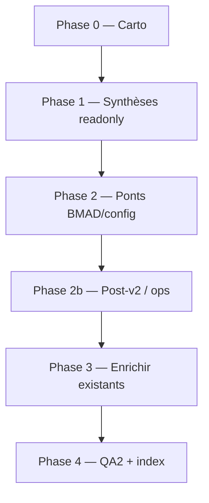

---
meta:
  role: planificateur-enrichissement
  date: 2026-05-20
  parent_plan: .cursor/plans/chantier_protocole_modules_fe3bc68e.plan.md
  pack_etat: qa2_96pct_go
  prerequis: references/dossier-architecte-externe-v2/ (ch. 05–07)
  orchestration: parent invoque Task (1 worker / fichier) — ne pas inliner rédaction longue
  regles:
    - refs_first: citer _bmad-output/, ne pas promouvoir
    - pas_dupliquer_cookbook_06: nouveaux docs renvoient vers 06 pour pas-à-pas
    - ignorer: normalize_typographic_backup_*
    - francais_chemins_relatifs_repo
---

# Plan d'enrichissement — pack protocole modules Recyclique

**Objectif :** combler les écarts documentaires entre le pack livré (QA2 **96 %**) et les sources projet listées — **sans** réécrire `01`–`09` from scratch.

**Meta existant :** [`00-MOD-plan-redaction-modules.md`](00-MOD-plan-redaction-modules.md) (chantier initial clos). **Ce fichier** = Phase enrichissement pour workers Phase 3.

---

## audit

### État pack (2026-05-20)

| Zone | Couverture actuelle | Écart concret |
|------|---------------------|---------------|
| Protocole opérationnel | `03`–`06` + `05` registre | OK pour slice Epic 4 ; **workflow step** + **multi-magasins** → ligne `10-cartographie` + `22` (hors L-xx) |
| Réconciliation v0.1↔v2 | `01` + `07` (**Proposed**) | **L-03** : ADR non promu BMAD ; checklist [`2026-02-26_03_checklist-v0.1-architecture.md`](../artefacts/2026-02-26_03_checklist-v0.1-architecture.md) (TOML/ModuleBase) **sans crosswalk** pack |
| Config `site_id` / `module_key` | Citations ADR-001 + brouillon OpenAPI | **L-04** : `grep contracts/openapi/recyclique-api.yaml` → **0** route `module-config` ; seul toggle `bandeau-live-slice` (**L-08**) |
| Schémas JSON | 1 schéma publié (`kpi-live-banner`) | **L-06** : placeholders PRD §7 sans `schemas/*.json` ni fiches stub |
| Recherches Perplexity/BMAD | Indexés dans `index.md` § liens | **Pas de synthèse** exploitable → agents relisent 8+ fichiers `references/recherche/` |
| Transcripts Cursor | Absents du pack | Décisions terrain (bandeau imbriqué, commit config-modules, HelloAsso optionnel, reset vision modules) **non indexées** |
| Idées Kanban | Citation §9 uniquement | **L-15** : `plugin-framework`, `module-store`, `ui-modulaire` sans pont vers `01`/`07`/`post-v2` |
| Marketplace / outillage mai 2026 | Hors-scope index | **L-14** + artefacts [`2026-05-20_01_*`](../artefacts/2026-05-20_01_recommandations-outillage-cursor-bmad-jarvos.md), [`2026-05-20_02_*`](../artefacts/2026-05-20_02_marketplace-cursor-com-evaluation-jarvos.md) **non intégrés** |
| BMAD Story **9.6** | Mention `09` / `05` | `sprint-status.yaml` : `9-6-livrer-la-config-admin-simple-pour-modules-et-reglages-simples: backlog` — **pas de matrice gaps** dédiée pack |
| CI CREOS Epic 10 | Renvoi `04` | **L-11** : pas de fiche « ce que le pack exige avant merge manifest » |
| Code / contrats reviewables | Epic 4 ancré | `contracts/README.md` ne mentionne pas `module-config` ; `peintre-nano/.../bandeau-live/README.md` peu lié depuis `04` |
| QA2 résiduel P2 | [`qa2-rapport-final.md`](qa2-rapport-final.md) | `index` : statut `07` vs **Proposed** ; double encart Epic 4 ; `prompt-agent` sans cases `06`/`09` |

### Lacunes pack ↔ sources (mapping L-03…L-15)

| ID | Écart source manquante dans pack | Source(s) à ingérer |
|----|----------------------------------|---------------------|
| **L-03** | ADR-007 pas gelé ; risque TOML | `07-adr`, `2026-02-24_07_design-systeme-modules.md`, `vision-projet/2026-03-31_decision-directrice-v2.md` |
| **L-04** | API config absente OpenAPI canonique | `config-modules-site-id/openapi-module-config.yaml`, `contracts/openapi/recyclique-api.yaml` |
| **L-05** | Whitelist serveur = 1 clé active | `05-registre`, stories `4-5`, epic 9 |
| **L-06** | Schémas JSON réservés | `config-modules-site-id/schemas/`, PRD §7, `epics.md` |
| **L-07** | Précédence config non tabulée | ADR-001, ADR P2 [`references/peintre/`](../peintre/), `03` §8 D.3.5 |
| **L-08** | Double chemin activation bandeau | stories `4-5`, epic 9.6, artefact signaux bandeau |
| **L-09** | Pattern package back unique | `03`, design v0.1 §7, recherche Pluggy |
| **L-10** | Slice vs workflow step | `08`, `04` §9, dossier archi `05` §6 |
| **L-11** | CI manifests | `epics.md` Epic 10, `contracts/creos/`, gouvernance `2026-04-02_04_*` |
| **L-12** | Libellé transport Paheko | `migration-paheko/`, ADR-007, PRD §5.1 |
| **L-13** | Tests inter-modules | recherche hooks Redis, post-socle |
| **L-14** | Marketplace post-v2 | `post-v2-hypothesis-marketplace-modules.md`, artefact `2026-05-20_02_*` |
| **L-15** | Plugin framework | `idees-kanban/.../plugin-framework-recyclic.md`, recherche `frameworks-modules-python_*` |

### Transcripts obligatoires (décisions non capturées)

| UUID | Titre court (citation) | Apport enrichissement |
|------|------------------------|------------------------|
| [Bandeau live legacy → modules Peintre](0c9a9709-d1f8-406b-a9ea-26ff2c59a7fd) | Mutualisation KPI caisse/réception ; modules imbriqués header ; mock → données réelles |
| [Commit pack config-modules](7f711038-9b17-4fcc-a327-5a9a52e71817) | Naissance `references/config-modules-site-id/` + redirect QA2 ; liens index |
| [HelloAsso module optionnel](557456c1-20f8-4b56-b55f-233b00fec22a) | Module tiers sans plugin Paheko cloud ; pattern `module_key` + epic 9 |
| [Modules prévus vs livrés](2075d9e8-6eb4-4ac9-999b-a685ca1ad5a8) | Écart vision v0.1 (TOML/ModuleBase) vs réalité v2 — alimente `01`/`07` |
| [Brainstorming CREOS v2](242de5e4-0344-4a77-8453-fbde98f78a8a) | Rôles 4 domaines, modularité, packaging Peintre — alignement `00-cadrage` |

---

## nouveaux_fichiers

| chemin | objectif_1_ligne | sources_principales | dependances_pack |
|--------|------------------|---------------------|------------------|
| `10-MOD-cartographie-sources-modules.md` | Tableau unique : source → fichier(s) pack → statut couverture / gap | Plan chantier ; `index.md` ; liste sources § mission parent ; `dossier-architecte-externe-v2/index.md` | `index.md` |
| `11-MOD-synthese-recherches-modularite.md` | Distillat Perplexity/BMAD (frameworks Python, Pluggy, nano Peintre, extension points) → décisions v2 | `recherche/2026-02-24_frameworks-modules-python_perplexity_*` ; `pluggy-vs-alternatives-hooks_*` ; `2026-02-25_affichage-dynamique-peintre-extension-points_bmad_recherche.md` ; `2026-03-31_brique-nano-peintre-modularite-json-ui_perplexity_reponse.md` ; `recherche/index.md` | `01-matrice`, `07-adr` |
| `12-MOD-index-transcripts-modularite.md` | Index transcripts (uuid, titre, date, thèmes, liens pack) | 5 UUID § audit ; skill `explorer-transcripts-cursor` | `index.md`, `00-cadrage` |
| `13-MOD-idees-kanban-modules-liens.md` | Pont idées → statut v2 / post-v2 / hors scope (sans duplication fiches) | `idees-kanban/` : `plugin-framework-recyclic`, `module-store-recyclic`, `module-correspondance-paheko`, `ui-modulaire-configurable`, `ia-llm-modules-intelligents` | `09` §9, `01` |
| `14-MOD-marketplace-post-v2-fiche-citation.md` | Fiche citation : interfaces à ne pas figer + lien Cursor marketplace mai 2026 | `post-v2-hypothesis-marketplace-modules.md` ; `2026-05-20_02_marketplace-cursor-com-evaluation-jarvos.md` | `post-v2-hypothesis` (pas `09` §3 — L-14 clôturé en Phase 3 terminal) |
| `15-MOD-matrice-gaps-bmad-story-9-6.md` | Tableau : **L-ID** \| lacune \| story/epic \| critère clôture \| owner (≥1 ligne par L-03…L-15) | `sprint-status.yaml` (9-6 backlog) ; `epics.md` Epic 3,4,9,10 ; stories `4-1`…`4-6b`, `3-3`, `1-4` ; `09` §3 §6 | `18-crosswalk` (brouillon), `05-registre`, `09` |
| `16-MOD-lien-operations-speciales-pattern.md` | Modèle procédural ops spéciales appliqué aux modules (renvoi `06`, pas duplicate) | `operations-speciales-recyclique/2026-04-18_prompt-ultra-operationnel-operations-speciales-recyclique_v1-1.md` ; `06` § format | `06-cookbook`, `prompt-agent` |
| `17-MOD-outillage-cursor-modules-2026-05-20.md` | Synthèse outillage BMAD/agents utile au chantier modules | `2026-05-20_01_recommandations-outillage-cursor-bmad-jarvos.md` ; `prompt-agent-chantier-modules.md` | `00-cadrage` § agents |
| `18-MOD-config-modules-crosswalk.md` | **Owner** écarts OpenAPI / grep L-04/L-06 — pont pack ↔ ADR-001 ↔ brouillon ↔ `contracts/` | `config-modules-site-id/` (index, ADR-001, schemas, openapi-module-config.yaml) ; `artefacts/qa2-livrable-architecture-config-modules-json-site-id.md` ; grep `recyclique-api.yaml` | `05-registre`, `03-protocole-backend` |
| `19-MOD-checklist-v0-1-vs-pack.md` | Crosswalk items v0.1 (TOML, slots) → statut abandonné/remplacé (L-03) | `2026-02-26_03_checklist-v0.1-architecture.md` ; `2026-02-24_07_design-systeme-modules.md` | `01`, `07-adr` |
| `20-MOD-peintre-code-refs-bandeau-live.md` | **Owner** liens code reviewables Peintre (pas normatif OpenAPI) | `peintre-nano/src/domains/bandeau-live/README.md` ; `contracts/creos/manifests/` ; stories 4-x | `18-crosswalk`, `04-protocole-front-creos`, `08` |
| `21-MOD-gouvernance-contrats-modules.md` | **Owner** promotion manifests/OpenAPI (renvoi `18`, pas re-grep L-04) | `2026-04-02_04_gouvernance-contractuelle-openapi-creos-contextenvelope.md` ; `contracts/README.md` ; story `1-4` | `18-crosswalk`, `04`, `06` phase contrats |
| `22-MOD-dossier-architecte-pont-t-mod.md` | Exécutable : T-MOD-1…5 / T-MET-1 → fichier pack + prochaine action HITL | `dossier-architecte-externe-v2/05`, `06`, `07` | `09` §6 |

**Total : 13** fichiers (fourchette 8–15 respectée).

---

## fichiers_a_enrichir

| chemin_existant | section_ou_patch (1 ligne) |
|-----------------|----------------------------|
| `index.md` | Ajouter lien `00-MOD-plan-enrichissement-modules.md` ; corriger statut `07-adr` (**Proposed**) ; fusionner double encart Epic 4 ; bloc **Lecture enrichie** : synthèses `10`–`22` après protocoles `01`–`05`, **avant** `06` (cookbook reste fil principal) |
| `00-MOD-cadrage-chantier.md` | § phase enrichissement post-QA2 ; pointer artefacts mai 2026 + transcripts §12 |
| `01-MOD-matrice-choix-modularite.md` | § « recherche » : colonne reco Perplexity vs décision v2 (→ `11-synthese`) |
| `02-MOD-taxonomie-types-de-modules.md` | §5.1 : lien explicite `transverse-compta` + sync Paheko (P2 QA2) |
| `03-MOD-protocole-backend.md` | §8 D.3.5 tableau précédence (Q-HITL-03, L-07) ; §7 libellé outbox vs Redis (L-12) ; § convention routes/services module optionnel (L-09) ; chemins stories 4-4/4-6 complets |
| `04-MOD-protocole-front-creos.md` | §15 liens MD `peintre-nano/...` ; § CI Epic 10 exigences (L-11) ; note modules imbriqués [transcript 0c9a9709](0c9a9709-d1f8-406b-a9ea-26ff2c59a7fd) |
| `05-MOD-registre-module-key.md` | § whitelist / promotion clés réservées → actif (L-05) ; § schémas réservés stub + promotion **actif** ; migration toggle 4.5 (L-08) |
| `06-MOD-cookbook-nouveau-module-optionnel.md` | §0 : liens vers `10`–`22` (carto/synthèse) — **pas** dupliquer étapes |
| `07-MOD-adr-reconciliation-v01-v02.md` | § promotion → `_bmad-output/planning-artifacts/architecture/` ; annexe TOML backend-only (Q-HITL-07) |
| `08-MOD-exemple-pilote-comptage-pieces-billets.md` | § recette HITL Q-HITL-09–12 ; liens Epic 6 `epics.md` + migration-paheko |
| `09-MOD-lacunes-et-questions-ouvertes.md` | §3 MAJ post-enrichissement ; liens nouveaux fichiers `10`–`22` ; clôture L-xx si couvert |
| `prompt-agent-chantier-modules.md` | Phase E.8–E.9 : validation `06` + `09` ; charger `00-plan-enrichissement` |
| `qa2-rapport-final.md` | § critères cycle 4 (si enrichissement) : score cible ≥97 %, axes nouveaux fichiers |
| `00-MOD-plan-redaction-modules.md` | Note : chantier rédaction clos → voir plan enrichissement |
| `references/index.md` | Pointeur pack + sous-fichiers `10`–`22` (hors `idees-kanban/index` auto) |
| `references/config-modules-site-id/index.md` | Lien retour protocole pack + `18-config-modules-crosswalk` |
| `references/recherche/index.md` | Ligne « synthèse pack modules » → `11-MOD-synthese-recherches-modularite.md` |
| `references/artefacts/index.md` | Entrées mai 2026 + crosswalk QA2 config-modules |
| `dossier-architecte-externe-v2/07-ARCH-todos-et-questions-architecte.md` | Pointeur T-MOD-* → pack `22-dossier-architecte-pont` (1 paragraphe) |

**Total : 18** lignes enrichissement ciblé.

---

## ordre_redaction

| Vague | Workers Task (1 fichier / worker) | Dépendances | Livrable vérif |
|-------|-----------------------------------|-------------|----------------|
| **0 — Cartographie** | `10-MOD-cartographie-sources-modules.md` | Aucune | Table ≥40 sources ; **chaque L-03…L-15 ≥1 ligne** ; 0 lien mort |
| **1 — Synthèses** | `11-MOD-synthese-recherches-modularite.md` ∥ `12-MOD-index-transcripts-modularite.md` ∥ `13-MOD-idees-kanban-modules-liens.md` | Phase 0 | Chaque synthèse ≤5 pages ; **readonly** — reco normative = « proposition → Phase 3 » |
| **2 — Ponts normatifs** | `18-MOD-config-modules-crosswalk.md` → `15-MOD-matrice-gaps-bmad-story-9-6.md` → `19-MOD-checklist-v0-1-vs-pack.md` → `21-MOD-gouvernance-contrats-modules.md` | Phase 1 | Matrice 9.6 + écarts OpenAPI documentés (L-04, L-06) |
| **2b — Post-v2 / ops** | `14-MOD-marketplace-post-v2-fiche-citation.md` ∥ `16-MOD-lien-operations-speciales-pattern.md` ∥ `17-MOD-outillage-cursor-modules-2026-05-20.md` ∥ `20-MOD-peintre-code-refs-bandeau-live.md` ∥ `22-MOD-dossier-architecte-pont-t-mod.md` | **Phase 2 complète** (gate G2) | Hors-scope marketplace explicite ; renvoi `06` ; `14` sans citation `09` §3 |
| **3 — Enrichissement pack** | Lots A/B/C/D ci-dessous ; **`09-lacunes` en dernier** | Phases **2 + 2b** (gate G3) | Pas de copie intégrale cookbook ; lacunes L-03…L-15 référencées |
| **4 — Clôture** | MAJ `references/index.md`, `config-modules-site-id/index.md`, `recherche/index.md` ; QA2 cycle 4 optionnel | Phase 3 | **GO enrichissement** ≥ **95 %** ; stretch **97 %** si cycle 4 |

**Gates parent (obligatoires)**

| Gate | Condition avant suite |
|------|---------------------|
| **G2** | Fichiers `18`, `15`, `19`, `21` livrés avant tout worker **2b** ou patch `03`/`05`/`04` |
| **G3** | Fichiers `10`–`22` existants + liens relatifs OK avant premier patch `01`–`08` |
| **G4** | `12-index-transcripts` : skill `explorer-transcripts-cursor` **ou** extraits embarqués ; sinon report daté dans `09` |

**Phase 3 — lots (1 worker / fichier sauf indication)**

| Lot | Fichiers | Prérequis |
|-----|----------|-----------|
| **A** | `index.md`, `00-MOD-cadrage-chantier.md`, `prompt-agent-chantier-modules.md` | G3 |
| **B** | `03-MOD-protocole-backend.md`, `04-MOD-protocole-front-creos.md`, `05-MOD-registre-module-key.md` | `18`, `21` |
| **C** | `01-MOD-matrice-choix-modularite.md`, `02-MOD-taxonomie-types-de-modules.md`, `07-MOD-adr-reconciliation-v01-v02.md`, `08-MOD-exemple-pilote-comptage-pieces-billets.md` | `11`, `19` |
| **D** | `qa2-rapport-final.md`, `00-MOD-plan-redaction-modules.md`, index transverses (`references/*`) | Lots A–C |
| **Terminal** | `09-MOD-lacunes-et-questions-ouvertes.md` | Tous lots + `10`–`22` |

**Parallélisation recommandée parent :** max 4 workers Phase 1 ; **pas** de Phase 3 avant G2+G3 ; `09` strictement terminal.

---

## criteres_succes

| ID | Critère | Vérification |
|----|---------|--------------|
| CS-01 | **GO enrichissement** ≥ **95 %** ; stretch **97 %** si cycle 4 QA2 exécuté | `qa2-rapport-final.md` cycle 4 (optionnel) |
| CS-02 | **Aucune** duplication du pas-à-pas `06` dans `10`–`22` | Grep : pas de phases A→D recopiées hors renvoi |
| CS-03 | Stratégie **`refs_first`** respectée | 0 copie intégrale PRD/epics/stories ; chemins `_bmad-output/` cités |
| CS-04 | Écarts **L-03 à L-15** : colonne **L-ID** dans `15` + carto `10` | Revue `09` §3 ; patches `03`/`05` citent L-09/L-05 |
| CS-05 | OpenAPI canonique : écart **documenté** (pas contourné) | `18-crosswalk` confirme absence `module-config` dans `recyclique-api.yaml` + plan fusion T-MOD-3 |
| CS-06 | 5 transcripts cités avec [titre](uuid) | `12-index-transcripts` |
| CS-07 | Recherches Perplexity : **1** point d'entrée (`11-synthese`) | `recherche/index.md` lien |
| CS-08 | Kanban modules : citation sans duplication | `13-idees-kanban` ≤2 pages |
| CS-09 | Marketplace / plugins : **citation post-v2** uniquement | `14-marketplace` + `index` hors-scope inchangé |
| CS-10 | Story **9.6** : matrice gaps + backlog sprint cité | `15-matrice` + `sprint-status.yaml` |
| CS-11 | Cookbook reste **livrable principal** | `index` ordre lecture : `06` après protocoles |
| CS-12 | P2 QA2 cycle 3 traités ou reportés datés | `index` statut ADR ; `prompt` E.8–E.9 |

---

## orchestration_parent (rappel)

- **Ne pas** exécuter QA fichier par fichier dans ce planificateur.
- Brief worker type : chemin cible + sources § tableau + lacunes L-xx + « renvoyer vers `06` si procédure » + **lot Phase 3** (A/B/C/D/terminal).
- Respecter **G2, G3, G4** ; Phase 1 = distillat readonly ; owners **18** / **21** / **20** sans re-grep hors `18`.
- Modèle worker : défaut ; readonly pour `10` si cartographie seule.

---

_Retour : [`index.md`](index.md) · Rédaction initiale : [`00-MOD-plan-redaction-modules.md`](00-MOD-plan-redaction-modules.md)_
