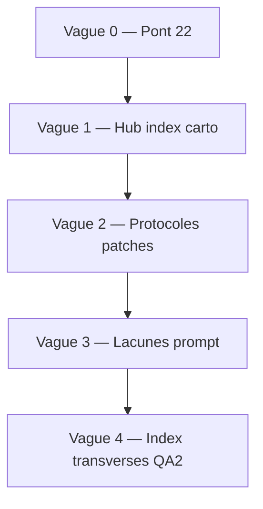

---
meta:
  role: planificateur-enrichissement-v2
  date: 2026-05-20
  parent_plan: .cursor/plans/chantier_protocole_modules_fe3bc68e.plan.md
  plan_v1: references/protocole-modules-recyclique/00-MOD-plan-enrichissement-modules.md
  pack_etat: qa2_96pct_go_enrichissement_v1_livre
  prerequis: references/dossier-architecte-externe-v2/ (ch. 05–07)
  orchestration: parent invoque Task (1 worker / fichier) — ne pas inliner rédaction longue
  regles:
    - refs_first: citer _bmad-output/, ne pas promouvoir
    - pas_dupliquer_cookbook_06: nouveaux docs et patches renvoient vers 06 pour pas-à-pas
    - ignorer: normalize_typographic_backup_*
    - francais_chemins_relatifs_repo
audit_resume:
  fichiers_pack: 28
  create: 1
  enrich: 14
  enrich_mineur: 6
  skip: 11
  fichier_22_absent: true
  lacunes_L_doc_ouvertes: [L-03, L-04, L-05, L-06, L-07, L-08, L-09, L-10, L-11, L-12, L-13]
  lacunes_L_doc_cloturees: [L-14, L-15]
  axes_qa2_p2_residuels: 8
---

# Plan d'enrichissement v2 — pack protocole modules Recyclique

**Objectif v2 :** clôturer la **cohérence transversale** du pack après enrichissement v1 (QA2 **96 %**, fichiers `10`–`21` livrés) — **créer** le pont architecte manquant (`22`), corriger les **P2** QA2 cycle 3, synchroniser index/cartographie/TODO obsolètes, et **ne pas** réécrire le protocole `01`–`09`.

**Référence v1 :** [`00-MOD-plan-enrichissement-modules.md`](00-MOD-plan-enrichissement-modules.md) (audit initial + ordre v1).

---

## Synthèse audit (2026-05-20)

| Indicateur | Valeur |
|------------|--------|
| **QA2 pack** | **96 %** GO ([`qa2-rapport-final.md`](qa2-rapport-final.md) cycle 3) |
| **Fichiers `10`–`21`** | **Présents** (synthèses, ponts, crosswalk, gouvernance) |
| **`22-MOD-dossier-architecte-pont-t-mod.md`** | **Absent** (référencé dans `10`, plan v1, `00-plan-enrichissement-modules`) |
| **Cookbook `06`** | Livré — **sans** liens vers hub `10`–`22` (grep 0) |
| **`index.md`** | Ponts partiels (`13`–`17`, `20`, `21`) — **manque** `10`–`12`, `18`, `19`, `22` |
| **`dossier-architecte-externe-v2/07`** | T-MOD-1 encore « à créer » — **obsolète** |
| **`10-cartographie`** | Section « prévu » **non synchronisée** (11–18 marqués prévus alors que livrés) |
| **`15-matrice`** | Mentionne `18` « planifié » — **obsolète** (`18` livré) |

**Lacunes L-03…L-15 :** la majorité reste **ouverte côté implémentation / HITL / BMAD** ; le pack v2 vise la **traçabilité documentaire** (pas fermer L-04 par écriture seule dans OpenAPI).

---

## `files[]` — inventaire worker

Légende `statut_initial` : **`done`** = satisfaisant, pas de worker sauf lien retour ; **`done_partial`** = contenu OK, patch ciblé ; **`needs_patch`** = enrichissement requis ; **`missing`** = à créer.

| path | action | statut_initial | objectif | owner | lacunes_L |
|------|--------|----------------|----------|-------|-----------|
| `22-MOD-dossier-architecte-pont-t-mod.md` | **create** | **missing** | Tableau exécutable T-MOD-1…5 / T-MET-1 → fichier pack + prochaine action HITL / BMAD | **W1** | L-03, L-04, L-10 |
| `index.md` | enrich | **needs_patch** | Bloc **Lecture enrichie** complet (`10`–`22`) ; statut `07` = **Proposed** ; fusionner double encart Epic 4 | **W2** | — |
| `10-MOD-cartographie-sources-modules.md` | enrich | **needs_patch** | MAJ statuts `couvert` ; § fichiers prévus → **livrés** ; ligne `22` **gap** jusqu'à W1 | **W2** | L-03…L-15 |
| `06-MOD-cookbook-nouveau-module-optionnel.md` | enrich | **needs_patch** | §0 hub : liens `10`–`22` (carto, synthèse, transcripts, crosswalk) — **sans** dupliquer phases | **W3** | — |
| `09-MOD-lacunes-et-questions-ouvertes.md` | enrich | **needs_patch** | §3 liens `22` ; §6 T-MOD ↔ `22` ; renforcer pont T-3 → `06` (P2 QA2) | **W3** | L-03…L-13 |
| `15-MOD-matrice-gaps-bmad-story-9-6.md` | enrich | **needs_patch** | Remplacer « `18` planifié » par lien `18` livré ; colonne **pack v2** / `22` | **W3** | L-03…L-15 |
| `prompt-agent-chantier-modules.md` | enrich | **needs_patch** | Phases E.8–E.9 : validation `06` + `09` ; charger `00-plan-enrichissement-v2-2026-05-20` | **W3** | — |
| `00-MOD-cadrage-chantier.md` | enrich | **done_partial** | § phase **enrichissement v2** post-QA2 96 % ; pointer `22` + artefacts mai 2026 | **W4** | — |
| `01-MOD-matrice-choix-modularite.md` | enrich | **done_partial** | § recherche : renvoi [`11-synthese`](11-MOD-synthese-recherches-modularite.md) ; TOML backend-only → `07`/`19` | **W4** | L-03, L-15 |
| `02-MOD-taxonomie-types-de-modules.md` | enrich | **done_partial** | §5.1 : lien `transverse-compta` + sync Paheko (P2 QA2) | **W4** | L-10, L-12 |
| `03-MOD-protocole-backend.md` | enrich | **done_partial** | §8 D.3.5 tableau précédence (L-07) ; §7 libellé outbox (L-12) ; §6 L-09 ; chemins stories 4-4/4-6 complets | **W4** | L-07, L-09, L-12 |
| `04-MOD-protocole-front-creos.md` | enrich | **done_partial** | §15 liens MD Peintre ; § CI Epic 10 (L-11) ; note modules imbriqués [0c9a9709](0c9a9709-d1f8-406b-a9ea-26ff2c59a7fd) | **W4** | L-10, L-11 |
| `05-MOD-registre-module-key.md` | enrich | **done_partial** | § whitelist / schémas réservés ; migration toggle 4.5 (L-05, L-06, L-08) | **W4** | L-04, L-05, L-06, L-08 |
| `07-MOD-adr-reconciliation-v01-v02.md` | enrich | **done_partial** | § promotion `_bmad-output/` (refs_first) ; annexe TOML backend-only (Q-HITL-07) | **W4** | L-03 |
| `08-MOD-exemple-pilote-comptage-pieces-billets.md` | enrich | **done_partial** | § recette HITL Q-HITL-09–12 ; liens Epic 6 + `migration-paheko/` | **W4** | L-10 |
| `references/dossier-architecte-externe-v2/07-ARCH-todos-et-questions-architecte.md` | enrich | **needs_patch** | MAJ tableau T-MOD-* (pack **livré**) ; pointeur `22` (1 §) | **W1** | — |
| `references/index.md` | enrich | **needs_patch** | Pointeur sous-fichiers `10`–`22` + plan v2 | **W5** | — |
| `references/recherche/index.md` | enrich | **needs_patch** | Ligne synthèse pack → `11-MOD-synthese-recherches-modularite.md` | **W5** | L-15 |
| `references/artefacts/index.md` | enrich_mineur | **done_partial** | Entrées `2026-05-20_01_*`, `2026-05-20_02_*` si absentes | **W5** | L-14 |
| `11-MOD-synthese-recherches-modularite.md` | skip | **done** | Distillat livré — lien retour depuis `01`/`index` seulement | — | L-09, L-15 |
| `12-MOD-index-transcripts-modularite.md` | skip | **done** | 5 UUID indexés | — | — |
| `13-MOD-idees-kanban-modules-liens.md` | skip | **done** | Pont kanban livré | — | L-15 |
| `14-MOD-marketplace-post-v2-fiche-citation.md` | skip | **done** | L-14 clôturé doc | — | L-14 |
| `16-MOD-lien-operations-speciales-pattern.md` | skip | **done** | Pattern ops spéciales | — | — |
| `17-MOD-outillage-cursor-modules-2026-05-20.md` | skip | **done** | Outillage mai 2026 | — | — |
| `18-MOD-config-modules-crosswalk.md` | skip | **done** | Owner L-04/L-06 — grep documenté | — | L-04, L-06 |
| `19-MOD-checklist-v0-1-vs-pack.md` | skip | **done** | Crosswalk v0.1 | — | L-03 |
| `20-MOD-peintre-code-refs-bandeau-live.md` | enrich_mineur | **done_partial** | Vérifier liens MD relatifs post-patch `04` | **W4** | — |
| `21-MOD-gouvernance-contrats-modules.md` | skip | **done** | Owner L-11 | — | L-11 |
| `00-MOD-plan-enrichissement-modules.md` | skip | **done** | Meta v1 — ne pas réécrire | — | — |
| `00-MOD-plan-redaction-modules.md` | enrich_mineur | **done** | Note : voir plan v2 enrichissement | **W5** | — |
| `qa2-rapport-final.md` | enrich_mineur | **done_partial** | § cycle 4 optionnel (cible 97 %) si exécuté | **W5** | — |
| `references/config-modules-site-id/index.md` | skip | **done** | Lien `18` déjà présent | — | L-04, L-06 |

**Comptage actions :** **create 1** · **enrich 14** · **enrich_mineur 6** · **skip 11** (9 fichiers pack noyau + `00-plan-enrichissement-modules` + `config-modules-site-id/index`).

> **Gates v1 vs v2** : en v1, **G2** = ponts OpenAPI (`18`, `15`, `19`, `21`) — **déjà livrés**. En v2, **G2** = création **`22`** + MAJ `dossier-architecte-externe-v2/07`. En v1, **G3** = fichiers `10`–`22` existants ; en v2, **G3** = synchronisation statuts index/cartographie.

---

## `files[]` — détail sources par worker (extraits)

### W1 — `22-MOD-dossier-architecte-pont-t-mod.md` (create)

```yaml
path: references/protocole-modules-recyclique/22-MOD-dossier-architecte-pont-t-mod.md
action: create
statut_initial: missing
objectif: "Pont exécutable dossier architecte ↔ pack : chaque T-MOD/T-MET → fichier pack, statut, prochaine action HITL ou BMAD (refs_first)."
owner: W1
lacunes_L: [L-03, L-04, L-10]
sources:
  - references/dossier-architecte-externe-v2/05-ARCH-frontend-peintre-creos-contrats.md
  - references/dossier-architecte-externe-v2/06-ARCH-etat-implementation-et-backlog.md
  - references/dossier-architecte-externe-v2/07-ARCH-todos-et-questions-architecte.md
  - references/protocole-modules-recyclique/09-MOD-lacunes-et-questions-ouvertes.md
  - references/protocole-modules-recyclique/15-MOD-matrice-gaps-bmad-story-9-6.md
  - references/protocole-modules-recyclique/06-MOD-cookbook-nouveau-module-optionnel.md
  - _bmad-output/implementation-artifacts/sprint-status.yaml
```

**Contenu minimal attendu :** tableau `| ID | Question dossier archi | Fichier pack | Statut doc | Prochaine action | Owner humain |` — **pas** de procédure (renvoi `06`).

### W2 — Index + cartographie

```yaml
paths:
  - references/protocole-modules-recyclique/index.md
  - references/protocole-modules-recyclique/10-MOD-cartographie-sources-modules.md
owner: W2
sources:
  - references/protocole-modules-recyclique/qa2-rapport-final.md
  - references/protocole-modules-recyclique/00-MOD-plan-enrichissement-v2-2026-05-20.md
  - references/protocole-modules-recyclique/index.md
```

### W3 — Hub procédural + lacunes + prompt

```yaml
paths:
  - references/protocole-modules-recyclique/06-MOD-cookbook-nouveau-module-optionnel.md
  - references/protocole-modules-recyclique/09-MOD-lacunes-et-questions-ouvertes.md
  - references/protocole-modules-recyclique/15-MOD-matrice-gaps-bmad-story-9-6.md
  - references/protocole-modules-recyclique/prompt-agent-chantier-modules.md
owner: W3
lacunes_L: [L-03, L-04, L-05, L-06, L-07, L-08, L-09, L-10, L-11, L-12, L-13]
sources:
  - references/protocole-modules-recyclique/22-MOD-dossier-architecte-pont-t-mod.md  # après W1
  - references/protocole-modules-recyclique/18-MOD-config-modules-crosswalk.md
  - references/protocole-modules-recyclique/12-MOD-index-transcripts-modularite.md
```

### W4 — Patches protocole `01`–`08` + `20`

```yaml
paths:
  - references/protocole-modules-recyclique/00-MOD-cadrage-chantier.md
  - references/protocole-modules-recyclique/01-MOD-matrice-choix-modularite.md
  - references/protocole-modules-recyclique/02-MOD-taxonomie-types-de-modules.md
  - references/protocole-modules-recyclique/03-MOD-protocole-backend.md
  - references/protocole-modules-recyclique/04-MOD-protocole-front-creos.md
  - references/protocole-modules-recyclique/05-MOD-registre-module-key.md
  - references/protocole-modules-recyclique/07-MOD-adr-reconciliation-v01-v02.md
  - references/protocole-modules-recyclique/08-MOD-exemple-pilote-comptage-pieces-billets.md
  - references/protocole-modules-recyclique/20-MOD-peintre-code-refs-bandeau-live.md
owner: W4
sources:
  - references/protocole-modules-recyclique/11-MOD-synthese-recherches-modularite.md
  - references/protocole-modules-recyclique/19-MOD-checklist-v0-1-vs-pack.md
  - references/protocole-modules-recyclique/21-MOD-gouvernance-contrats-modules.md
  - references/dossier-architecte-externe-v2/05-ARCH-frontend-peintre-creos-contrats.md
  - references/migration-paheko/index.md
  - _bmad-output/planning-artifacts/epics.md
  - _bmad-output/implementation-artifacts/4-4-*.md
  - _bmad-output/implementation-artifacts/4-6-*.md
  - references/artefacts/2026-04-02_07_signaux-exploitation-bandeau-live-premiers-slices.md
```

### W5 — Index transverses + clôture meta

```yaml
paths:
  - references/index.md
  - references/recherche/index.md
  - references/artefacts/index.md
  - references/protocole-modules-recyclique/00-MOD-plan-redaction-modules.md
  - references/protocole-modules-recyclique/qa2-rapport-final.md
owner: W5
sources:
  - references/protocole-modules-recyclique/index.md
  - references/artefacts/2026-05-20_01_recommandations-outillage-cursor-bmad-jarvos.md
  - references/artefacts/2026-05-20_02_marketplace-cursor-com-evaluation-jarvos.md
```

---

## Lacunes L-03…L-15 — statut post-v1 (cible v2)

| L-ID | Statut doc pack v1 | Action v2 | Fermeture réelle |
|------|-------------------|-----------|------------------|
| **L-03** | `07` + `19` livrés ; **Proposed** | Patch `07`/`01`/`09`/`22` ; HITL | **Accepted** ADR + promotion `_bmad-output/` |
| **L-04** | `18` documente grep 0 | `22` T-MOD-3 ; pas re-grep hors `18` | Fusion `contracts/openapi/recyclique-api.yaml` |
| **L-05** | `05` + `15` | Patch `05` whitelist | Impl. backend + Story **9.6** |
| **L-06** | `18` + `05` | Idem | `config-modules-site-id/schemas/*.json` |
| **L-07** | `03` §8 partiel | Patch tableau précédence `03` | Q-HITL-03 + **9.6** |
| **L-08** | `05` § migration | Patch `05` | **9.6** remplace toggle 4.5 |
| **L-09** | `11` + `03` | Patch `03` §6 | Validation HITL convention package |
| **L-10** | `08` + `02` + `04` | Patch `02`/`04`/`08`/`22` T-MET-1 | Validation architecte Q-HITL-09–11 |
| **L-11** | `21` livré | Lien `04` § CI | Epic **10** pipeline |
| **L-12** | `03` §7 ambigu | Patch libellé outbox `03` | ADR sync / Q-HITL-04 |
| **L-13** | `09` mention | Renvoi tests dans `09` §3 | Stories post-socle / **9.8** |
| **L-14** | **`14` clôturé doc** | **skip** | Décision marketplace post-v2 |
| **L-15** | **`13` + `11` clôturés doc** | **skip** | Pas framework TOML v2 |

---

## `ordre_redaction` — vagues (max 4 parallèles)



| Vague | Parallèle max | Workers | Fichiers |
|-------|---------------|---------|----------|
| **0** | 1 | **W1** | `22` **create** + patch `dossier-architecte-externe-v2/07` |
| **1** | 2 | **W2** | `index.md`, `10-MOD-cartographie-sources-modules.md` |
| **2a** | 3 | **W4** | `03-protocole-backend`, `04-protocole-front-creos`, `05-registre-module-key` |
| **2b** | 4 | **W4** | `00-cadrage-chantier`, `01-matrice`, `02-taxonomie`, `07-adr`, `08-exemple-pilote`, `20-peintre-code-refs` |
| **3** | 3 | **W3** | `06`, `09`, `15`, `prompt-agent` — **après G2** |
| **4** | 2 | **W5** | `references/index.md`, `recherche/index.md`, `artefacts/index.md`, meta plans, QA2 cycle 4 **optionnel** |

**Règle :** `09-lacunes` en **dernier** de la vague 3 (après `22` + patches `01`–`08`).

---

## `gates`

| Gate | Condition |
|------|-----------|
| **G2** | `22-MOD-dossier-architecte-pont-t-mod.md` livré + `07-todos` architecte MAJ T-MOD statuts |
| **G3** | `index` + `10-cartographie` synchronisés (0 « prévu » pour fichiers déjà sur disque) |
| **G4** | Patches `01`–`08` livrés avant merge `06`/`09` |
| **G5** (optionnel) | QA2 cycle 4 ≥ **97 %** — corriger 8 P2 [`qa2-rapport-final.md`](qa2-rapport-final.md) |

---

## `hors_scope`

- **Promotion BMAD** : copie PRD/epics/ADR vers `_bmad-output/planning-artifacts/` (citation uniquement).
- **Fusion OpenAPI** `module-config` dans `contracts/` (T-MOD-3 = impl, pas doc pack).
- **Implémentation** module comptage, Story **9.6**, Epic **10** CI.
- **Marketplace** procédure d'installation (citation `14` / post-v2 uniquement).
- **Réécriture** du pas-à-pas `06-cookbook` (phases A→D).
- **Dossiers** `normalize_typographic_backup_*`.
- **Nouvelles recherches** Perplexity (→ `references/recherche/` + lien depuis `11`, pas nouveau fichier pack sauf mise à jour `11`).

---

## Travail futur — post-pack / brainstorming 2026-05-20

| ID | Sujet | Action |
|----|--------|--------|
| **T-PEINT-1** | **Gardien du seuil** — conscience d'affichage Peintre | Cadrer hooks runtime, bypass v2, outils agent (**Q-HITL-16**) ; idée Kanban `2026-05-20_peintre-gardeien-seuil-conscience-affichage.md` · lacune **L-16** · [`04`](04-MOD-protocole-front-creos.md) §17 |

---

## Fichiers déjà satisfaisants (`skip`)

Ne pas réassigner de worker sauf lien entrant depuis `index` / `06` :

- `11-MOD-synthese-recherches-modularite.md`
- `12-MOD-index-transcripts-modularite.md`
- `13-MOD-idees-kanban-modules-liens.md`
- `14-MOD-marketplace-post-v2-fiche-citation.md`
- `16-MOD-lien-operations-speciales-pattern.md`
- `17-MOD-outillage-cursor-modules-2026-05-20.md`
- `18-MOD-config-modules-crosswalk.md`
- `19-MOD-checklist-v0-1-vs-pack.md`
- `21-MOD-gouvernance-contrats-modules.md`
- `00-MOD-plan-enrichissement-modules.md` (historique v1)

---

## Critères de succès v2

| ID | Critère | Vérification |
|----|---------|--------------|
| CS-v2-01 | Fichier **`22`** présent et lié depuis `index`, `09`, `10`, `07` architecte | 0 lien mort vers `22` |
| CS-v2-02 | **`06` §0** liste hub `10`–`22` sans recopier phases A→D | Grep : pas de duplicate cookbook |
| CS-v2-03 | **`10-cartographie`** : 0 entrée « prévu » pour fichier existant | Revue tableau § prévus |
| CS-v2-04 | P2 QA2 cycle 3 **traités ou report daté** dans `09` | `index` statut ADR ; prompt E.8–E.9 |
| CS-v2-05 | Chaque **L-03…L-13** a colonne dans `15` + ligne `22` ou `09` | Matrice à jour |
| CS-v2-06 | **`refs_first`** : 0 copie intégrale BMAD | Spot-check workers |
| CS-v2-07 | Stretch : QA2 cycle 4 ≥ **97 %** | `qa2-rapport-final.md` |

---

## Orchestration parent (rappel)

- Brief worker : `path` + `sources[]` + `lacunes_L` + « procédure → `06` » + gate applicable.
- **Ne pas** lancer W3 avant **G2** ; **ne pas** patcher `09` avant **G4**.
- Modèle : défaut ; lecture seule pour cartographie si audit seul.

---

_Retour pack : [`index.md`](index.md) · Plan v1 : [`00-MOD-plan-enrichissement-modules.md`](00-MOD-plan-enrichissement-modules.md) · QA2 : [`qa2-rapport-final.md`](qa2-rapport-final.md)_
