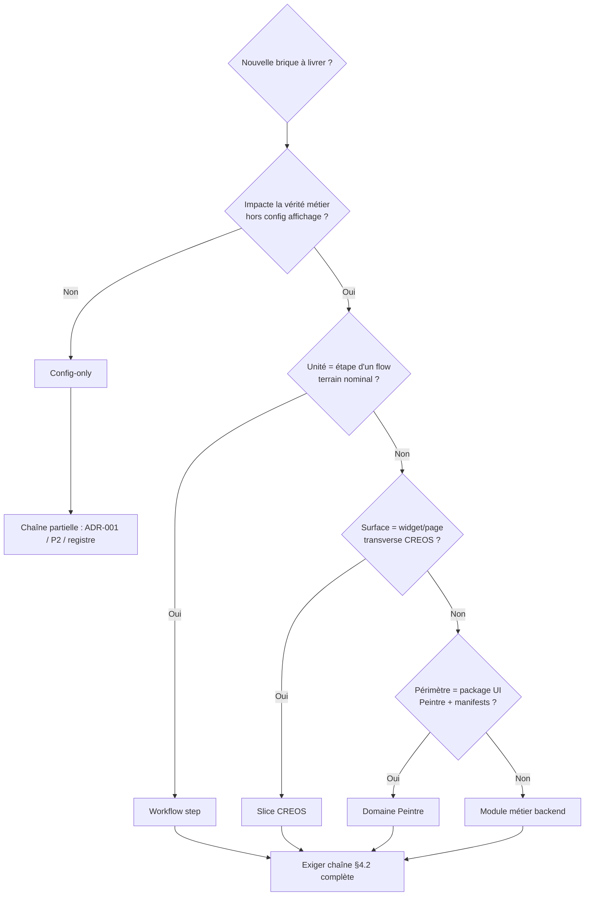
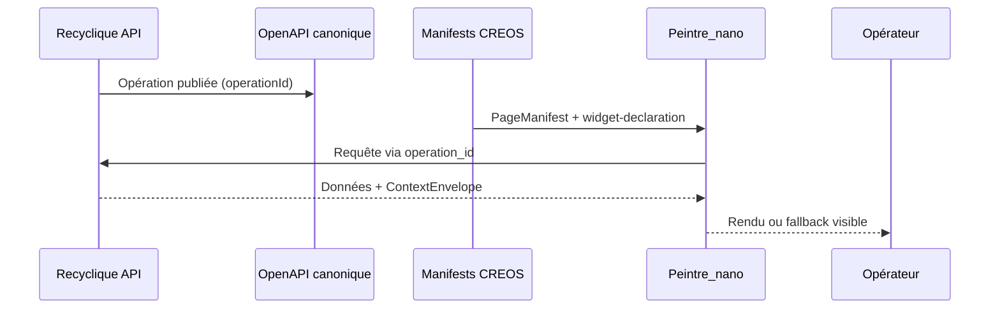
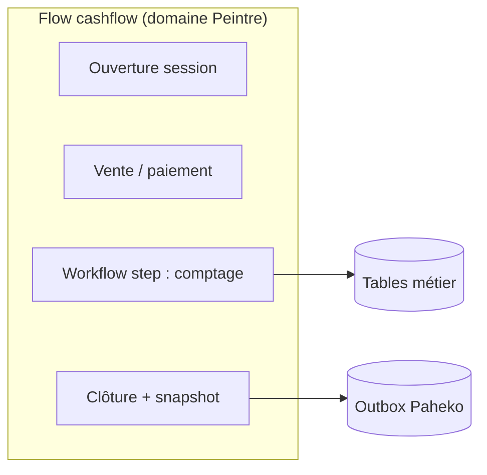
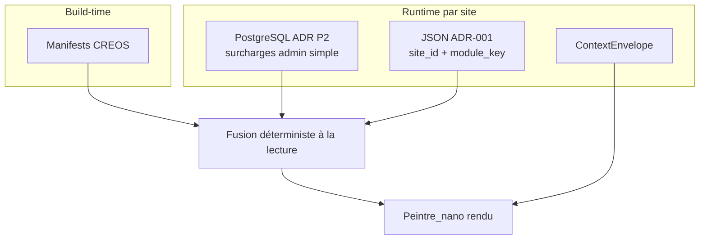

# 02 — Taxonomie des types de modules — Recyclique v2

**Statut :** brouillon normatif du pack `references/protocole-modules-recyclique/`  
**Date :** 2026-05-20  
**Audience :** architecte, agents BMAD, développeurs — lecture autonome après [`07-MOD-adr-reconciliation-v01-v02.md`](07-MOD-adr-reconciliation-v01-v02.md)  
**Objectif :** classer les **formes** qu’un « module » peut prendre en v2 (slice CREOS, domaine Peintre, module métier backend, config-only, workflow step), et poser les **critères obligatoire / optionnel** du périmètre produit sans recopier le PRD.

**Prérequis pack :** [`01-MOD-matrice-choix-modularite.md`](01-MOD-matrice-choix-modularite.md), [`07-MOD-adr-reconciliation-v01-v02.md`](07-MOD-adr-reconciliation-v01-v02.md).

---

## 1. Comment lire ce document

### 1.1 Règle `refs_first`

| Règle | Application |
|-------|-------------|
| **Vérité produit** | `_bmad-output/planning-artifacts/prd.md` §4.2, §7 ; `_bmad-output/planning-artifacts/epics.md` (Epic 3, 4, Story 9.6) — **cité, non recopié**. |
| **Réconciliation v0.1 ↔ v2** | [`07-MOD-adr-reconciliation-v01-v02.md`](07-MOD-adr-reconciliation-v01-v02.md) — un « module » v2 ≠ `ModuleBase` + `module.toml`. |
| **Runtime et contrats** | [`references/dossier-architecte-externe-v2/05-ARCH-frontend-peintre-creos-contrats.md`](../dossier-architecte-externe-v2/05-ARCH-frontend-peintre-creos-contrats.md) ; [`references/artefacts/2026-04-02_04_gouvernance-contractuelle-openapi-creos-contextenvelope.md`](../artefacts/2026-04-02_04_gouvernance-contractuelle-openapi-creos-contextenvelope.md). |
| **État d’implémentation** | [`references/dossier-architecte-externe-v2/06-ARCH-etat-implementation-et-backlog.md`](../dossier-architecte-externe-v2/06-ARCH-etat-implementation-et-backlog.md) — instantané au moment de la lecture. |

Ce document **nomme et discrimine** ; les checklists opérationnelles viennent dans `03-MOD-protocole-backend.md`, `04-MOD-protocole-front-creos.md`, `05-MOD-registre-module-key.md` et `06-MOD-cookbook-nouveau-module-optionnel.md`.

### 1.2 Définition opérationnelle de « module » en v2

Au sens **PRD §4.2**, une brique n’est un module **modulaire** que si la **chaîne complète** existe (contrat métier → récepteur backend → contrat UI CREOS → runtime Peintre → permissions/contexte → fallback/audit). Le **type taxonomique** (ci-dessous) indique **quels artefacts** et **quelle profondeur** de chaîne sont attendus — pas si la chaîne est suffisante à elle seule.

**Mock explicite :** toléré en construction ; **interdit** comme état final d’un livrable v2 « obligatoire » (PRD §4.2).

---

## 2. Synthèse exécutive

| Type taxonomique | Rôle principal | `module_key` typique | Chaîne §4.2 | Pilote pack |
|------------------|----------------|----------------------|-------------|-------------|
| **Slice CREOS** | Widget / page transverse, preuve modulaire | Oui (ex. `kpi-live-banner`) | **Complète** (référence) | **#1** bandeau live |
| **Domaine Peintre** | Regroupement code + manifests d’un périmètre UI | Souvent plusieurs clés | Complète par slice/flow | Epic 3 socle, Epic 5 transverse |
| **Module métier backend** | Domaine Recyclique (API, SQL, sync) | Par capacité / slice | Back + contrats ; UI via CREOS | Epics 6–9, 8 Paheko |
| **Config-only** | Activation / préférences UI sans nouveau métier | Oui | Partielle (pas de nouveau récepteur métier) | Story **9.6**, ADR-001 |
| **Workflow step** | Étape d’un flow terrain (wizard / tabbed) | Par flow + étape | Complète + **tables métier** | **#2** comptage pièces/billets |

**Lecture produit (PRD §7.1) :** le tableau des modules **obligatoires v2** (cashflow, reception, bandeau live, eco-organismes, adhérents, sync Paheko, HelloAsso, config admin simple) mélange plusieurs types — la section §5 déplie ce tableau en critères d’acceptation par type.

---

## 3. Arbre de classification

**Règle rapide :** en cas de doute entre **slice** et **workflow step**, poser la question « l’opérateur parcourt-il un **flow** avec étapes séquentielles et persistance métier d’étape ? » — si oui → **workflow step** (pilote #2) ; si non → **slice** (pilote #1).

---

## 4. Types normatifs (détail)

### 4.1 Slice CREOS

**Définition.** Brique UI **verticale minimale** : un ou plusieurs artefacts CREOS reviewables (`NavigationManifest`, `PageManifest`, entrée catalogue `widget-declaration`) + opération(s) OpenAPI + widget enregistré dans Peintre_nano. Le slice **ne porte pas** un domaine métier complet (caisse, réception) ; il **prouve** ou **étend** la chaîne modulaire sur un périmètre borné.

**Sources :** PRD §4.2, §12.2 (jalon bandeau live) ; Epic 4 ; dossier architecte ch. 05 §6.3 ; artefact signaux bandeau live.

| Attribut | Attendu |
|----------|---------|
| **Contrat métier** | Schémas OpenAPI dédiés (ex. `GET /v2/exploitation/live-snapshot`) |
| **Contrat UI** | Manifests sous `contracts/creos/manifests/` (promotion reviewable, gouvernance §1 bis) |
| **Runtime** | `widget_type` stable, `data_contract.operation_id` résoluble dans `recyclique-api.yaml` |
| **Activation** | `module_key` + toggle admin (transitoire Epic 4.5) → cible Story 9.6 + ADR-001 |
| **Persistance valeurs** | JSON `site_id` + `module_key` si préférences (ex. rafraîchissement) — **pas** tables métier lourdes |
| **Criticité fallback** | Souvent **non critique** (isolation d’erreur, reste de page intact — FR61/FR62) |

**Exemple canonique v2 :** `bandeau live` / `kpi-live-banner` — template Epic 4 (`4-1` … `4-6b`).

**Ce qu’un slice n’est pas :**

- Un **flow cashflow** entier (→ domaine + workflow steps).
- Un **connecteur Paheko** seul (→ module métier backend + sync).
- Une **page admin** sans `operation_id` reviewable (→ dette ou config-only selon périmètre).

---

### 4.2 Domaine Peintre

**Définition.** **Regroupement structurel** côté frontend : répertoire `src/domains/<nom>/`, manifests CREOS associés, widgets et éventuellement flows d’un **périmètre navigationnel** (ex. `cashflow`, `reception`, `admin`, `exploitation`). Le domaine est une **organisation du code et des contrats UI**, pas une unité d’activation unique.

**Sources :** Epic 3 (socle, registre, slots) ; Epic 5 (recomposition transverse) ; PRD FR10 (« toute l’UI v2 passe par Peintre_nano ») ; dossier architecte ch. 05 §1–3.

| Attribut | Attendu |
|----------|---------|
| **Frontière** | Pas de logique métier « autoritaire » dans le shell ; hooks consomment OpenAPI + `ContextEnvelope` |
| **Composition** | `NavigationManifest` + `PageManifest` + registre widgets ; alias routes documentés (brownfield) |
| **Plusieurs `module_key`** | Un domaine peut exposer plusieurs slices ou sous-modules activables séparément |
| **Relation slice** | Un domaine **héberge** des slices ; le slice est la **unité de preuve** modulaire |

**Distinction domaine vs module métier backend :**

| Question | Domaine Peintre | Module métier backend |
|----------|-----------------|------------------------|
| Où vit la règle métier ? | Recyclique (API) | Recyclique (services, SQL) |
| Où vit la composition UI ? | Peintre + CREOS | Manifests CREOS consommés par Peintre |
| Unité de déploiement | Bundle front unique | API + migrations + éventuellement manifests |

**Exemples :** package `domains/cashflow/` (Epic 6), `domains/reception/` (Epic 7), zone admin transverse (Epics 15–17, 20–21).

---

### 4.3 Module métier backend

**Définition.** Capacité **Recyclique** : routes FastAPI, persistance, règles domaine, events/outbox, sync Paheko le cas échéant. L’UI associée est **toujours** déclarée en CREOS ; le backend **ne** publie **pas** d’extensions React via Python (réconciliation ADR-007).

**Sources :** PRD §5 (double flux), §7.1 ; epics 6–9, 8 ; dossier architecte ch. 03.

| Attribut | Attendu |
|----------|---------|
| **Contrat métier** | OpenAPI + spec domaine (ex. caisse/compta, réception, eco-organismes) |
| **Récepteur** | Handlers, services, jobs ; **outbox** pour impact Paheko (pas EventBus générique v2) |
| **Données** | Tables SQL métier quand contraintes, audit, jointures — **pas** tout dans JSON ADR-001 |
| **UI** | Flows/widgets CREOS ; `data_contract.critical: true` sur widgets sensibles (Epic 6) |
| **Sync** | Chaîne snapshot session → lot Paheko ; états `a_reessayer`, quarantaine, etc. (PRD §5.1) |

**Sous-familles utiles (non exclusives) :**

| Sous-famille | Exemple PRD §7.1 | Type UI dominant |
|--------------|------------------|------------------|
| Flow terrain critique | `cashflow`, `reception flow` | Workflow step(s) + domaine Peintre |
| Grand module métier | `declaration eco-organismes` | Domaine + multiples slices/pages |
| Connecteur | `HelloAsso`, sync Paheko | Backend + slices admin / supervision |
| Infrastructure transverse | Auth, contexte, permissions | Epic 1–2 — **hors** `module_key` optionnel |

**Obligatoire v2 :** voir §5 — le statut « obligatoire » impose un **minimum utilisable**, pas l’automatisation maximale quand le PRD renvoie à une étude (cas HelloAsso).

---

### 4.4 Config-only

**Définition.** Brique dont la valeur ajoutée est **piloter l’affichage ou l’activation** (ordre, variantes simples, toggles) **sans** nouveau récepteur métier ni nouvelle vérité comptable/matérielle. Les **défauts structurels** restent dans les manifests **build-time** ; les **surcharges** suivent ADR P2 (PostgreSQL) et/ou ADR-001 (JSON par `site_id`).

**Sources :** PRD §7.1 « Configuration admin simple » ; Story 9.6 ; ADR-001 ; ADR P2 (`references/peintre/2026-04-01_adr-p1-p2-stack-css-et-config-admin.md`).

| Attribut | Attendu |
|----------|---------|
| **Chaîne §4.2** | Pas de nouvelle opération métier obligatoire ; consommation des manifests existants |
| **Persistance** | PG (P2) pour surcharges admin simple ; JSON ADR-001 pour documents versionnés par `module_key` |
| **Hors périmètre** | Moyens de paiement, comptes de clôture, mappings comptables sensibles (PRD §7.1 clarification) |
| **Traçabilité** | Auteur, date, motif sur changements sensibles (Story 9.6, décision directrice) |

**Distinction config-only vs slice :**

| Critère | Config-only | Slice CREOS |
|---------|-------------|-------------|
| Nouveau widget type | Non (réordonne / active l’existant) | Oui (catalogue + registre) |
| Nouvelle opération OpenAPI | Non | Oui (souvent) |
| Preuve modulaire Epic 4 | Non (generalise Epic 4.5) | Oui (pilote #1) |

**Transition v2 :** le toggle `bandeau_live_slice_enabled` (Epic 4.5) est **config-only transitoire** ; la cible est Story **9.6** + registre `module_key` générique ([`07-adr`](07-MOD-adr-reconciliation-v01-v02.md) §4).

---

### 4.5 Workflow step

**Définition.** **Étape** d’un parcours CREOS (`wizard`, `tabbed`, flow nommé type `cashflow`, `reception`) : enchaînement d’écrans, validations, actions déclaratives, avec **persistance métier** propre à l’étape (saisies, snapshots, transitions). Ce n’est **pas** un simple widget dans un slot de dashboard.

**Sources :** PRD §7.1 (flows simples, cashflow prioritaire) ; Epic 6–7 ; glossaire pack `index.md` (pilote #2) ; question T-MET-1 dossier architecte ch. 07.

| Attribut | Attendu |
|----------|---------|
| **Contrat UI** | Définition flow CREOS + `PageManifest` par étape ; `FlowRenderer` |
| **Contrat métier** | OpenAPI par action d’étape (validation, enregistrement, clôture) |
| **Persistance** | **Tables SQL métier** pour données d’étape — **ne pas** tout modéliser en JSON ADR-001 ([`07-adr`](07-MOD-adr-reconciliation-v01-v02.md) §7) |
| **Sync Paheko** | Si l’étape impacte la compta : outbox / lot session — chaîne Epic 8 |
| **Criticité** | Souvent **critique** : blocage si `DATA_STALE` ou contrat invalide (PRD §4.3, Epic 6) |

**Exemple pilote #2 :** comptage pièces/billets en clôture caisse — étape dans le flow cashflow, données terrain + projection Paheko (fiche `08-MOD-exemple-pilote-comptage-pieces-billets.md`).

**Distinction workflow step vs slice :**

| Critère | Workflow step | Slice CREOS |
|---------|---------------|-------------|
| Parcours séquentiel terrain | Oui | Non (affichage transverse) |
| Tables métier dédiées | Souvent oui | Rare (préférences JSON) |
| Preuve Epic 4 | Non (Epic 6+) | Oui (#1) |

---

## 5. Critères obligatoire / optionnel — périmètre v2 (PRD §7)

Le PRD §7.1 liste des **capacités** et **modules** au statut **Obligatoire** pour la v2 vendable. Ce statut signifie : livrer le **minimum v2** décrit (parcours utilisables, reprises manuelles encadrées), **sans** exiger l’automatisation maximale lorsque le PRD renvoie à une étude d’architecture (HelloAsso).

### 5.1 Tableau produit → type taxonomique

| Entrée PRD §7.1 | Type(s) dominant(s) | Epic(s) | Notes d’acceptation |
|----------------|----------------------|---------|---------------------|
| **Bandeau live** | Slice CREOS | 4 | Chaîne complète **prouvée** avant extension (gate Convergence 2) |
| **Cashflow (caisse)** | Domaine Peintre + workflow steps + module métier backend | 6 | Flow terrain critique ; widgets `critical: true` |
| **Reception flow** | Idem | 7 | Flux matière ; même discipline contrats |
| **Synchronisation Paheko** | **transverse-compta** + module métier backend (sync) | 8 (+ 22.x relais) | `module_key` **`synchronisation-paheko`** ([`05-registre`](05-MOD-registre-module-key.md) §3) — **hors** `GET/PATCH module-config` nominal ; outbox, lots session, quarantaine ([`03-MOD-protocole-backend.md`](03-MOD-protocole-backend.md) §10) ; pas slice UI seul |
| **Declaration eco-organismes** | Module métier backend + domaine Peintre | 9 | Premier **grand** module métier post-preuve |
| **Adherents / vie associative minimale** | Module métier backend + slices UI | 9 | Complémentaire, évite biais mono-module |
| **Integration HelloAsso** | Module métier backend (connecteur) | 9 | Minimum v2 + étude voies API vs plugin Paheko |
| **Config admin simple** | Config-only | 9.6 | PG P2 + fusion manifests ; borne au périmètre « simple » |

**FR38 (epics.md) :** les modules obligatoires sont **répartis** entre Epic 4 (bandeau seul pour la preuve chaîne), Epics 6–9 (métier), Epic 10 (readiness/CI) — ne pas exiger que Epic 4 couvre tout FR38.

**Sync Paheko (type registre `transverse-compta`) :** la capacité **Synchronisation Paheko** (PRD §7.1) n’est **pas** un slice CREOS ni un document JSON `module_key` classique. Elle porte la **chaîne comptable** (snapshot session → builder → outbox — Epic 8, `_bmad-output/planning-artifacts/epics.md`) documentée dans [`references/dossier-architecte-externe-v2/04-ARCH-integration-paheko-compta-sync.md`](../dossier-architecte-externe-v2/04-ARCH-integration-paheko-compta-sync.md) et [`references/migration-paheko/2026-04-15_prd-recyclique-caisse-compta-paheko.md`](../migration-paheko/2026-04-15_prd-recyclique-caisse-compta-paheko.md). Les **workflow steps** caisse (ex. comptage clôture, pilote #2) **consomment** cette chaîne à la clôture — ils ne la remplacent pas.

### 5.2 Matrice obligation × profondeur de chaîne

| Type | Obligatoire en v2 ? | Profondeur chaîne §4.2 exigée |
|------|---------------------|-------------------------------|
| Socle Peintre (Epic 3) | Oui (capacité plateforme) | Runtime + manifests minimaux ; mocks OK jusqu’à Convergence 1 |
| Slice CREOS (bandeau) | Oui | **Complète**, sans mock final |
| Domaine + flows cashflow/reception | Oui | Complète sur parcours nominaux |
| Module métier sync Paheko | Oui | Back + contrats ; UI supervision |
| Config admin simple | Oui | Partielle + traçabilité |
| Modules **optionnels** post-socle | Non (v2) | Selon [`05-registre-module-key`](05-MOD-registre-module-key.md) — hors ce document |

### 5.3 Optionnel / post-v2 (ne pas confondre)

| Sujet | Traitement |
|-------|------------|
| Marketplace / modules tiers | Post-v2 — `post-v2-hypothesis-marketplace-modules.md` (citation uniquement) |
| Chargement dynamique manifests hors build | Hors scope v2 (AR38, PRD §7.1) |
| Éditeur convivial de flows | Hors périmètre initial PRD §7.2 |
| `module.toml` / `ModuleBase` | Abandonné comme norme — [`07-adr`](07-MOD-adr-reconciliation-v01-v02.md) |

---

## 6. Dimensions transverses (tous types)

### 6.1 `module_key` et registre

Identifiant stable **serveur** (liste blanche, NFKC) aligné CREOS et ADR-001. Un même **domaine Peintre** peut porter **plusieurs** clés ; un **workflow step** peut partager la clé du flow parent ou une clé d’étape selon le registre (`05-registre`).

| Type | `module_key` typique |
|------|---------------------|
| Slice CREOS | Une clé par slice (ex. `kpi-live-banner`) |
| Config-only | Clé panneau ou feature (ex. ordre modules shell) |
| Workflow step | Clé flow ou sous-clé étape (à figer au registre) |
| Module métier backend | Clés par capacité activable côté UI |

#### 6.1.1 Correspondance type registre (`05` §2.4) ↔ taxonomie ↔ `module_key`

| Type registre (`05`) | Type taxonomique (`02` §4) | `module_key` (exemples) | Notes |
|----------------------|----------------------------|-------------------------|--------|
| **slice-transverse** | Slice CREOS | `kpi-live-banner` | Seul schéma config **publié** dans `config-modules-site-id/schemas/` |
| **domaine-parcours** | Domaine Peintre + workflow steps | `cashflow`, `reception` | Clés **réservées** ; activation permissions + CREOS tant que non promues |
| **workflow-step** | Workflow step | `comptage-pieces-billets` | Données métier en **tables SQL** — fiche [`08-exemple-pilote-*`](08-MOD-exemple-pilote-comptage-pieces-billets.md) |
| **module-metier** | Module métier backend | `eco-organismes`, `adherents` | Mappings / vie asso — schémas config à définir |
| **connecteur** | Module métier backend (connecteur) | `helloasso` | Secrets **hors** payload JSON générique |
| **transverse-compta** | Module métier backend (sync) | `synchronisation-paheko` | Contrat sync/outbox ; **hors** `GET/PATCH module-config` nominal |
| **config-plateforme** | Config-only | `config-admin-simple` | Story **9.6** ; merge PG P2 + manifests build |

### 6.2 Hiérarchie de vérité (AR39)

Pour **tous** les types avec surface UI :

`OpenAPI` > `ContextEnvelope` > `NavigationManifest` > `PageManifest` > `UserRuntimePrefs`

Référence : [`2026-04-02_04_gouvernance-contractuelle-openapi-creos-contextenvelope.md`](../artefacts/2026-04-02_04_gouvernance-contractuelle-openapi-creos-contextenvelope.md) §1.

### 6.3 Activation et persistance (synthèse)

| Nature de donnée | Stockage | Types concernés |
|------------------|----------|-----------------|
| Structure UI (menu, slots, widgets) | Manifests CREOS build | Tous avec UI |
| Préférences module / activation UI | JSON ADR-001 et/ou PG P2 | Slice, config-only |
| Données métier d’étape | SQL | Workflow step, module métier backend |
| Permissions effectives | `ContextEnvelope` (backend) | Tous |

**Précédence PG vs JSON vs `sites.configuration` :** ouverte — [`09-lacunes`](09-MOD-lacunes-et-questions-ouvertes.md) / ADR complémentaire.

### 6.4 Chaîne sept briques par type (rappel PRD §4.2)

| # | Brique | Slice | Domaine | Back métier | Config-only | Workflow step |
|---|--------|-------|---------|-------------|-------------|---------------|
| 1 | Contrat métier | ● | ● | ●● | ○ | ●● |
| 2 | Récepteur backend | ● | ○ | ●● | ○ | ●● |
| 3 | Contrat UI CREOS | ● | ● | ● | ○ | ●● |
| 4 | Runtime Peintre | ● | ● | ● | ● | ●● |
| 5 | Permissions / contexte | ● | ● | ● | ● | ●● |
| 6 | Fallback / audit | ● | ● | ● | ○ | ●● |

Légende : ●● = cœur du type ; ● = requis ; ○ = léger ou indirect.

---

## 7. Pilotes du pack et leçons

| Pilote | Type | Ce qu’il valide | Ce qu’il ne valide pas |
|--------|------|-----------------|------------------------|
| **#1 Bandeau live** | Slice CREOS | Chaîne Epic 4 complète, `operation_id`, fallbacks, toggle transitoire | Workflow step, tables métier clôture |
| **#2 Comptage pièces/billets** | Workflow step (+ back) | Persistance SQL, flow cashflow, Paheko | Suffisance du seul modèle slice |

**État (dossier architecte ch. 06) :** chaîne modulaire **prouvée** sur #1 (Epic 4 done) ; cookbook et registre `module_key` **à industrialiser** ; #2 documenté dans `08-exemple-pilote-*`, implémentation hors pack.

**Question ouverte (ch. 07 T-MOD) :** le pilote #1 est-il un template **suffisant** pour les grands modules ? Réponse de ce document : **oui pour slices et preuve chaîne** ; **non** pour workflow steps et données métier — exiger le complément #2 avant de généraliser un « module » uniquement sur le patron bandeau.

---

## 8. Anti-patterns (par type)

| Anti-pattern | Type concerné | Correction |
|--------------|---------------|------------|
| Fichier `module.toml` comme manifeste UI | Tous | CREOS + [`07-adr`](07-MOD-adr-reconciliation-v01-v02.md) |
| `register_ui_extensions()` Python → React | Slice, domaine | Manifests build-time uniquement |
| Comptage clôture stocké en JSON ADR-001 | Workflow step | Tables métier + spec domaine |
| Slice sans `operation_id` reviewable | Slice | Promotion manifest + YAML OpenAPI |
| Flow terrain codé en dur hors CREOS | Workflow step, domaine | `PageManifest` + flow CREOS |
| Config admin qui modifie comptes de clôture | Config-only | Super-admin / paramétrage sensible (PRD) |
| `localStorage` vérité activation | Config-only | Serveur ADR-001 / P2 |
| Module « livré » avec mock non balisé | Tous obligatoires | Chaîne réelle ou mock **explicite** temporaire |

---

## 9. Choisir le type — checklist décisionnelle

1. **Nouvelle opération OpenAPI métier ?** → inclure **module métier backend** (au moins en partie).
2. **Nouveau `widget_type` + page transverse ?** → **slice CREOS** ; vérifier registre + Epic 4-like.
3. **Étape dans un parcours caisse/réception existant ?** → **workflow step** ; vérifier tables SQL et Epic 6/7.
4. **Uniquement activer/réordonner l’existant ?** → **config-only** ; Story 9.6 / ADR P2.
5. **Réorganisation front large (navigation admin, dashboard) ?** → **domaine Peintre** ; découper en slices livrables incrémentales.

**Séquence produit recommandée (décision directrice, ch. 01) :** bandeau live (slice) → flows critiques (workflow steps + domaines) → premier grand module métier (eco-organismes). Si le slice #1 échoue, **ne pas** masquer l’échec en classant le livrable comme « domaine » ou « config-only ».

---

## 10. Liens avec le reste du pack

| Document | Relation |
|----------|----------|
| [`01-MOD-matrice-choix-modularite.md`](01-MOD-matrice-choix-modularite.md) | v0.1 ↔ v2 par **dimension technique** |
| [`07-MOD-adr-reconciliation-v01-v02.md`](07-MOD-adr-reconciliation-v01-v02.md) | Décisions structurantes TOML / CREOS / JSON |
| [`05-MOD-registre-module-key.md`](05-MOD-registre-module-key.md) | Liste blanche, statut obligatoire/optionnel par clé |
| [`03-MOD-protocole-backend.md`](03-MOD-protocole-backend.md) | Checklist selon type back |
| [`04-MOD-protocole-front-creos.md`](04-MOD-protocole-front-creos.md) | Checklist slice / domaine / workflow step |
| [`06-MOD-cookbook-nouveau-module-optionnel.md`](06-MOD-cookbook-nouveau-module-optionnel.md) | Pas à pas unifié |
| [`08-MOD-exemple-pilote-comptage-pieces-billets.md`](08-MOD-exemple-pilote-comptage-pieces-billets.md) | Illustration workflow step #2 |

---

## 11. Index des sources citées

| Chemin | Usage |
|--------|--------|
| `_bmad-output/planning-artifacts/prd.md` | §4.2 chaîne modulaire ; §7.1 modules obligatoires ; §7.2 hors scope |
| `_bmad-output/planning-artifacts/epics.md` | Epic 3, 4, 6–9 ; Story 9.6 ; FR38 |
| [`references/dossier-architecte-externe-v2/05-ARCH-frontend-peintre-creos-contrats.md`](../dossier-architecte-externe-v2/05-ARCH-frontend-peintre-creos-contrats.md) | Peintre, CREOS, pilote bandeau §6 |
| [`references/dossier-architecte-externe-v2/06-ARCH-etat-implementation-et-backlog.md`](../dossier-architecte-externe-v2/06-ARCH-etat-implementation-et-backlog.md) | Prouvé vs déclaré |
| [`references/artefacts/2026-04-02_04_gouvernance-contractuelle-openapi-creos-contextenvelope.md`](../artefacts/2026-04-02_04_gouvernance-contractuelle-openapi-creos-contextenvelope.md) | AR39, promotion manifests |
| [`references/config-modules-site-id/ADR-001-configuration-modules-json-par-site.md`](../config-modules-site-id/ADR-001-configuration-modules-json-par-site.md) | JSON `site_id` / `module_key` |
| [`references/artefacts/2026-04-02_07_signaux-exploitation-bandeau-live-premiers-slices.md`](../artefacts/2026-04-02_07_signaux-exploitation-bandeau-live-premiers-slices.md) | Métier slice #1 |
| [`references/protocole-modules-recyclique/07-MOD-adr-reconciliation-v01-v02.md`](07-MOD-adr-reconciliation-v01-v02.md) | Classification config vs métier |

---

## 12. Critère de complétude de cette taxonomie

- [x] Cinq types normatifs définis avec critères de discrimination et contre-exemples.
- [x] Tableau PRD §7.1 déplié en types et epics sans recopie intégrale du PRD.
- [x] Distinction pilote #1 (slice) / #2 (workflow step) explicite.
- [x] Schémas mermaid : arbre de classification, séquence slice, flow cashflow, activation/persistance.
- [x] Renvois `refs_first` vers BMAD et dossier architecte uniquement.

**Prochaine étape pack :** [`05-MOD-registre-module-key.md`](05-MOD-registre-module-key.md) — instancier chaque entrée obligatoire/optionnelle avec `module_key`, schéma JSON et dépendances.

---

_Document du pack protocole modules — brouillon 2026-05-20. Promotion BMAD après validation HITL uniquement._
