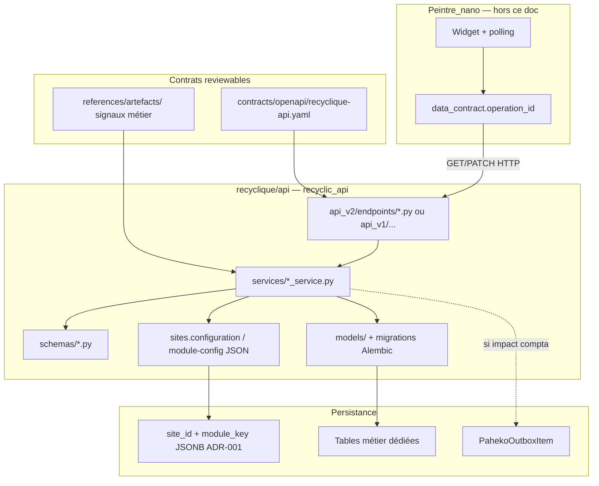
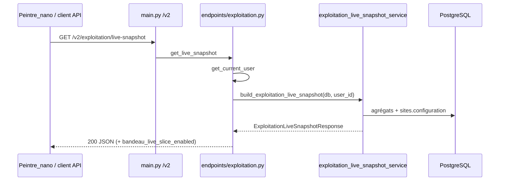
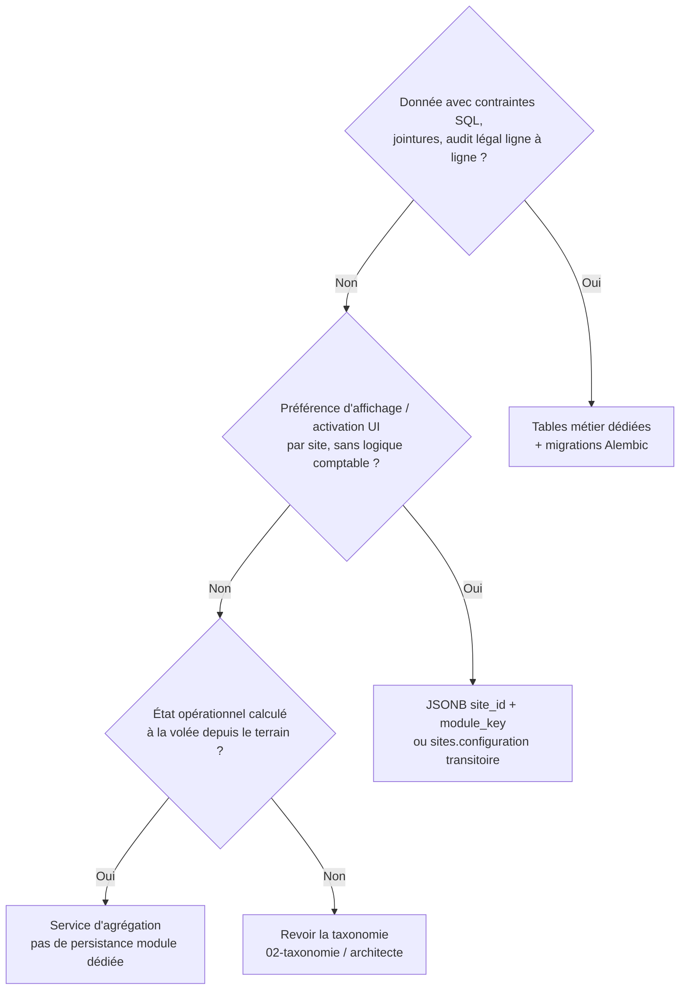
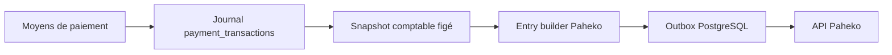

# 03 — Protocole backend — modules Recyclique v2

**Statut :** brouillon normatif du pack `references/protocole-modules-recyclique/`  
**Date :** 2026-05-20  
**Audience :** développeurs backend, agents BMAD, architecte  
**Modèle de référence :** Epic 4 — chaîne `bandeau live` (stories **4-1**, **4-3**, **4-5** ; compléments **4-4**, **4-6**, **4-6b** côté front/E2E)

**Prérequis pack (lecture croisée) :**

| Document | Rôle |
|----------|------|
| [`01-MOD-matrice-choix-modularite.md`](01-MOD-matrice-choix-modularite.md) | Décisions v0.1 ↔ v2 (TOML, `ModuleBase`, EventBus → patterns v2) |
| [`07-MOD-adr-reconciliation-v01-v02.md`](07-MOD-adr-reconciliation-v01-v02.md) | ADR-007 **Accepted** : remplace loader TOML et bus générique module |
| [`02-MOD-taxonomie-types-de-modules.md`](02-MOD-taxonomie-types-de-modules.md) | Brouillon normatif livré — classifier slice / domaine / workflow / config-only |
| [`05-MOD-registre-module-key.md`](05-MOD-registre-module-key.md) | Brouillon normatif livré — liste blanche `module_key`, schémas JSON, ops OpenAPI |

**Stratégie `refs_first` :** ce protocole **cite** `_bmad-output/` et le code brownfield ; il **ne remplace pas** le PRD, les epics ni les stories d’implémentation. Toute promotion vers `contracts/` ou ADR BMAD canonique reste **post-HITL** (Strophe).

---

## 1. Rôle du backend dans la chaîne modulaire

### 1.1 Les six briques backend (PRD §4.2)

Un module n’est **modulaire** que si la chaîne complète existe. Côté **Recyclique API**, les briques concernées sont :

| # | Brique (PRD §4.2) | Livrable backend typique | Story pilote |
|---|-------------------|--------------------------|--------------|
| 1 | Contrat métier (schéma, règles) | Schémas Pydantic + OpenAPI + doc signaux métier | **4-1** |
| 2 | Récepteur backend | Routes FastAPI, service domaine, tests pytest | **4-3** |
| 5 | Permissions et contexte | `get_current_user`, `ContextEnvelope`, garde `site_id` | Epic **1–2** (prérequis) |
| 6 | Fallback, audit, feedback | Codes HTTP stables, logs structurés, corrélation | **4-3**, **4-5** |

Les briques **3–4** (manifest CREOS, runtime Peintre) relèvent du [protocole front](04-MOD-protocole-front-creos.md) ; le backend **alimente** la brique 2 via des **`operationId`** stables référencés dans le catalogue widget CREOS.

**Source normative :** [`_bmad-output/planning-artifacts/prd.md`](../../_bmad-output/planning-artifacts/prd.md) §4.2, §5.1 (double flux financier), §14.2 (versionnement contrats).

### 1.2 Ce que le backend v2 **n’est pas**

| Approche v0.1 (abandonnée comme norme v2) | Remplacement v2 |
|-------------------------------------------|-----------------|
| `module.toml` + `ModuleBase.register_routes()` | Router FastAPI par **domaine** + inclusion explicite dans `api_v1` / `api_v2` |
| `config.toml` `[modules] enabled` | Feature flag / JSON `site_id` + `module_key` (ADR-001) ; transitoire : clé dans `sites.configuration` (**4-5**) |
| `EventBus` Redis Streams générique | Événements **métier nommés** + **outbox Paheko** pour la compta (cf. §7) |

Détail réconciliation : [`07-MOD-adr-reconciliation-v01-v02.md`](07-MOD-adr-reconciliation-v01-v02.md).

### 1.3 Périmètre de ce protocole

**Inclus :** checklists numérotées pour ajouter ou étendre un **module métier backend** (routes, persistance, activation, events, sync Paheko, enregistrement dans le package `recyclic_api`).

**Exclus :** manifests CREOS, registre widgets, rendu Peintre (→ `04-MOD-protocole-front-creos.md`) ; cookbook pas à pas unifié (→ `06-MOD-cookbook-nouveau-module-optionnel.md`).

---

## 2. Vue d’ensemble — flux backend d’un module (modèle Epic 4)

**Lecture :** le pilote **bandeau live** n’écrit **pas** dans l’outbox ; il prouve la **couche exploitation** (lecture agrégats + toggle admin). Un module **comptage clôture** (pilote #2) rejoindra la branche pointillée outbox.

---

## 3. Matrice de traçabilité — stories Epic 4 → checklists

| Story | Fichier impl (`refs_first`) | Sections checklist |
|-------|----------------------------|-------------------|
| **4-1** | `_bmad-output/implementation-artifacts/4-1-publier-le-contrat-et-les-manifests-minimaux-du-module-bandeau-live.md` | §4 (contrats), §10.1 |
| **4-2** | `_bmad-output/implementation-artifacts/4-2-implementer-le-widget-bandeau-live-dans-le-registre-peintre-nano.md` | Front : [`04-MOD-protocole-front-creos.md`](04-MOD-protocole-front-creos.md) §6.3, §14 — registre widget Peintre (pas de route back dédiée pilote) |
| **4-3** | `_bmad-output/implementation-artifacts/4-3-brancher-la-source-backend-reelle-et-les-cas-douverture-decalee.md` | §5 (service), §6 (routes), §9 (observabilité), §10.2 |
| **4-5** | `_bmad-output/implementation-artifacts/4-5-ajouter-un-toggle-admin-minimal-borne-au-module-bandeau-live.md` | §8 (feature flags), §10.3 |
| **4-4** | [`4-4-rendre-visibles-les-fallbacks-et-rejets-du-slice-bandeau-live.md`](../../_bmad-output/implementation-artifacts/4-4-rendre-visibles-les-fallbacks-et-rejets-du-slice-bandeau-live.md) | §9.3 (codes erreur — front principal ; contrat HTTP ici) |
| **4-6** | [`4-6-valider-la-chaine-complete-backend-contrat-manifest-runtime-rendu-fallback.md`](../../_bmad-output/implementation-artifacts/4-6-valider-la-chaine-complete-backend-contrat-manifest-runtime-rendu-fallback.md) | §11 (recette chaîne) |
| **4-6b** | [`4-6b-raccorder-le-slice-bandeau-live-dans-lapplication-peintre-nano-reellement-servie.md`](../../_bmad-output/implementation-artifacts/4-6b-raccorder-le-slice-bandeau-live-dans-lapplication-peintre-nano-reellement-servie.md) | §11 (app servie — renvoi [`04-MOD-protocole-front-creos.md`](04-MOD-protocole-front-creos.md) §11) |

**Epic produit :** [`_bmad-output/planning-artifacts/epics.md`](../../_bmad-output/planning-artifacts/epics.md) — Epic 4, FR17–FR19, FR58, UX-DR15, AR44.

---

## 4. Checklist A — Contrat métier et OpenAPI (story 4-1)

**Objectif :** publier un **ancrage reviewable** avant d’écrire la logique métier lourde. Un module sans `operationId` stable n’est pas branchable proprement dans CREOS (`data_contract.operation_id`).

### A.1 Spécification métier et signaux

| ID | Critère | Preuve / référence |
|----|---------|-------------------|
| **A.1.1** | Documenter les **champs** exposés, les règles de **null / dégradation**, et les cas **nominal / échec** (pas seulement le happy path). | Ex. [`references/artefacts/2026-04-02_07_signaux-exploitation-bandeau-live-premiers-slices.md`](../artefacts/2026-04-02_07_signaux-exploitation-bandeau-live-premiers-slices.md) |
| **A.1.2** | Le backend **calcule** les états métier (ex. `effective_open_state`, ouvertures décalées) — le front **n’invente pas** ces règles (UX-DR15). | Story **4-3** AC1–AC2 |
| **A.1.3** | Périmètre **borné** : pas d’absorption dashboard, admin généralisé ou réglages transverses dans le même contrat. | Story **4-1** AC2 |

### A.2 OpenAPI

| ID | Critère | Preuve / référence |
|----|---------|-------------------|
| **A.2.1** | Ajouter ou finaliser l’opération dans `contracts/openapi/recyclique-api.yaml` avec un **`operationId` unique** (convention `recyclique_<domaine>_<verbe>`). | Ex. `recyclique_exploitation_getLiveSnapshot` |
| **A.2.2** | Schémas de réponse **versionnés** (`ExploitationLiveSnapshot`, erreurs `RecycliqueApiError`) alignés Epic 2.6 / 2.7. | `contracts/openapi/recyclique-api.yaml` |
| **A.2.3** | Documenter **`X-Correlation-ID`** (ou équivalent projet) sur les flux live / polling. | Story **4-1** AC4 ; **4-3** AC4 |
| **A.2.4** | Réponses **401 / 403 / 503** (et autres pertinentes) **documentées** — pas d’échec silencieux côté contrat. | Gouvernance B4 : [`references/artefacts/2026-04-02_04_gouvernance-contractuelle-openapi-creos-contextenvelope.md`](../artefacts/2026-04-02_04_gouvernance-contractuelle-openapi-creos-contextenvelope.md) |
| **A.2.5** | Exécuter `npm run generate` dans `contracts/openapi/` et committer `generated/recyclique-api.ts` si le YAML change. | [`contracts/README.md`](../../contracts/README.md) |

### A.3 Alignement CREOS (liaison front — contrôle backend)

| ID | Critère | Preuve / référence |
|----|---------|-------------------|
| **A.3.1** | Le catalogue widget sous `contracts/creos/manifests/` référence **`data_contract.operation_id`** **identique** à l’`operationId` OpenAPI (caractère pour caractère). | `widgets-catalog-bandeau-live.json` |
| **A.3.2** | `endpoint_hint` et tag OpenAPI cohérents (ex. `GET /v2/exploitation/live-snapshot`). | Story **4-1** tâches |

**Gate 4-1 :** les tests `peintre-nano/tests/contract/creos-bandeau-live-manifests-4-1.test.ts` et la revue humaine des manifests **doivent passer** avant de déclarer le contrat « publié ».

---

## 5. Checklist B — Service domaine et règles métier (story 4-3)

**Objectif :** implémenter le **récepteur backend** : agrégation, calcul d’état, dégradation explicite, **zéro fuite de contexte** (PRD §4.4).

### B.1 Structure code

| ID | Critère | Emplacement type (pilote) |
|----|---------|---------------------------|
| **B.1.1** | Logique métier dans un **service** dédié (`*_service.py`), pas dans le handler route seul (éviter routes « grasses » — audit brownfield F4). | `recyclic_api/services/exploitation_live_snapshot_service.py` |
| **B.1.2** | Schémas Pydantic v2 sous `recyclic_api/schemas/`, alignés OpenAPI. | `schemas/exploitation_live_snapshot.py` |
| **B.1.3** | Handler **mince** : auth, injection `Session`, appel service, mapping HTTP. | `api/api_v2/endpoints/exploitation.py` |

### B.2 Contexte, site et permissions

| ID | Critère | Preuve / référence |
|----|---------|-------------------|
| **B.2.1** | Résoudre `site_id` (et contexte caisse / session si pertinent) **côté serveur** à partir de l’utilisateur / session — **jamais** faire confiance à un `site_id` client seul pour le périmètre tenant. | [`references/config-modules-site-id/livrable-normatif-architecture.md`](../config-modules-site-id/livrable-normatif-architecture.md) §3.2 |
| **B.2.2** | Vérifier **membership** et permissions avant travail lourd (reject-early après auth). | ADR-001 ; spec multi-contextes Epic 1.3 |
| **B.2.3** | Réponses **personnalisées** : en-têtes cache adaptés (`private` / `no-store`) si données tenant. | Livrable normatif §3.6 |

### B.3 Vérité métier et dégradation

| ID | Critère | Preuve / référence |
|----|---------|-------------------|
| **B.3.1** | Exposer les états **delayed_open**, **delayed_close**, **unknown**, **not_applicable** quand le domaine l’exige — pas de réduction à un booléen « ouvert ». | Story **4-3** AC2 ; schéma `ExploitationLiveSnapshot` |
| **B.3.2** | Snapshot **dégradé** : champs absents / `null` → sémantique documentée ; pas de certitude inventée. | Story **4-3** AC3 ; artefact signaux §6 |
| **B.3.3** | Si agrégation externe impossible : **503** avec message stable, pas de 200 trompeur. | `exploitation.py` → `HTTP_503` |

### B.4 Tests backend

| ID | Critère | Preuve / référence |
|----|---------|-------------------|
| **B.4.1** | Tests pytest : nominal, dégradé, **401/403**, corrélation `X-Correlation-ID`. | `recyclique/api/tests/test_exploitation_live_snapshot.py` |
| **B.4.2** | Tests **IDOR** : utilisateur sans membership sur le site → échec systématique. | Livrable normatif critère #2 |
| **B.4.3** | Pas de régression sur les gates métier voisins (ex. réception live stats si le service partage des agrégats). | Story **4-3** Dev Agent Record |

---

## 6. Checklist C — Routes et enregistrement dans le package (pas de `ModuleBase`)

**Objectif :** brancher le module dans l’application FastAPI **sans** loader TOML ni registry magique.

### C.1 Choix de surface API

| ID | Critère | Guidance |
|----|---------|----------|
| **C.1.1** | Préférer **`/v2/<domaine>/...`** pour les **nouveaux slices** modulaires qui ne cassent pas le brownfield `/v1`. | Epic 2.7 → pattern `api_v2` |
| **C.1.2** | Étendre `/v1` seulement si le module **s’insère** dans un agrégateur existant (ex. `/admin`, `/cash-sessions`) et que la rétrocompatibilité l’exige. | [`references/dossier-architecte-externe-v2/03-ARCH-backend-recyclique-api-donnees.md`](../dossier-architecte-externe-v2/03-ARCH-backend-recyclique-api-donnees.md) §4 |
| **C.1.3** | **Un `operationId` par opération** ; pas de duplication ni renommage sans PR conjointe manifests + codegen (règle B4). | [`contracts/README.md`](../../contracts/README.md) |

### C.2 Enregistrement du router (checklist « package »)

| ID | Action | Fichier |
|----|--------|---------|
| **C.2.1** | Créer `APIRouter()` dans `api/api_v2/endpoints/<domaine>.py` (ou module v1 cible). | `exploitation.py` |
| **C.2.2** | Déclarer `openapi_extra={"operationId": "..."}` sur chaque route (alignement codegen / gouvernance). | Idem |
| **C.2.3** | Importer le router dans `api/api_v2/api.py` et `include_router(..., prefix="/<domaine>", tags=[...])`. | `api_v2/api.py` |
| **C.2.4** | Vérifier le montage global dans `main.py` : `app.include_router(api_v2_router, prefix="/v2")`. | `recyclic_api/main.py` |
| **C.2.5** | Documenter le **tag OpenAPI** et la **matrice auth** (cookie session, Bearer, rôles). | OpenAPI + README `recyclique/api/` |

### C.3 Endpoints génériques config module (cible ADR-001)

Pour les **préférences UI** (rafraîchissement, affichage par flux), privilégier à terme l’API générique — **pas** une route par champ :

| ID | Critère | Référence |
|----|---------|-----------|
| **C.3.1** | Brouillon : `GET/PATCH /v1/sites/{site_id}/module-config/{module_key}` avec liste blanche serveur. | [`references/config-modules-site-id/openapi-module-config.yaml`](../config-modules-site-id/openapi-module-config.yaml) |
| **C.3.2** | Valider le `payload` contre le JSON Schema du module (ex. `kpi-live-banner.v1.json`). | [`schemas/kpi-live-banner.v1.json`](../config-modules-site-id/schemas/kpi-live-banner.v1.json) |
| **C.3.3** | Fusionner dans `recyclique-api.yaml` **après** HITL — jusqu’alors, ne pas multiplier les PATCH ad hoc par module. | Story **9.6** / AR45 |

### C.4 — Convention d'enregistrement d'un module optionnel (back) — clôt L-09

> **Source normative :** [`references/artefacts/2026-05-20_04_reponse-architecte-bouclage-modules-v2.md`](../artefacts/2026-05-20_04_reponse-architecte-bouclage-modules-v2.md) §B.1 (bouclage architecte 2026-05-20). Complément non normatif : [`2026-05-20_05_notes-architecte-loup-de-mer-modules-v2.md`](../artefacts/2026-05-20_05_notes-architecte-loup-de-mer-modules-v2.md).

Toute brique backend d'un module optionnel suit **un seul** patron (pas de framework loader, cf. ADR-007) :

1. **Package** dédié sous `recyclic_api/modules/<module_key_snake>/` (routes, services, schemas, tests co-localisés) ; un package = un `module_key`.
2. **Router** : un `APIRouter` par module, inclus **explicitement** dans l'app au `lifespan`/bootstrap — **jamais** de `register_routes(app)` générique hérité d'un `ModuleBase`.
3. **Prefix** : routes sous `/v1/...` ou `/v2/...` selon maturité ; tag OpenAPI **aligné** sur le `module_key` (ex. tag `exploitation` pour `kpi-live-banner`).
4. **`operationId`** : préfixé par domaine, stable, unique, présent dans `contracts/openapi/recyclique-api.yaml` (B4 ; renommage = même PR YAML + CREOS + tests).
5. **Feature flag / activation** : lecture via `module_key` JSON scopé `site_id` (ADR-001, §D.3.5) ; `module_key` absent/désactivé → routes répondent en skip gracieux ou 404 homogène, **pas** de route fantôme.
6. **`module_key`** : entrée préalable dans [`05-MOD-registre-module-key.md`](05-MOD-registre-module-key.md) §3 (whitelist back) ; clé inconnue → 404/403 anti-énumération.
7. **Services async** : workers outbox / jobs **nommés** par module ; **pas** de subscription générique à un EventBus (Redis = auxiliaire only, AR12).
8. **Tables vs JSON** : données à contrainte SQL/audit/jointure → tables + Alembic ; flags d'activation → JSON `module_key` (arbre [`06-MOD-cookbook-nouveau-module-optionnel.md`](06-MOD-cookbook-nouveau-module-optionnel.md) §0.2).
9. **Tests** : pytest co-localisés — nominal + 401/403 + module on/off + skip + IDOR `site_id`.
10. **Anti-patterns rejetés** : `module.toml`/`ModuleBase`/`config.toml [modules]`/`ModuleRegistry.load_from_config`/second pattern d'enregistrement parallèle.

**Exemple complet de référence :** bandeau live (`kpi-live-banner`, Epic 4 `4-1`…`4-6b`) — package, router, tag `exploitation`, `operationId` `recyclique_exploitation_getLiveSnapshot`, flag `bandeau_live_slice_enabled` (transitoire → 9.6). Détail code : [`20-MOD-peintre-code-refs-bandeau-live.md`](20-MOD-peintre-code-refs-bandeau-live.md).

**Note brownfield :** le pilote bandeau peut encore résider sous `recyclic_api/api/api_v2/endpoints/` + `services/` tant que la migration vers `recyclic_api/modules/<module_key_snake>/` n'est pas story-ifiée ; toute **nouvelle** brique module suit le patron ci-dessus.

**Critère de clôture L-09 :** **OK documentaire** (2026-05-20) — validation HITL protocole unique (**Q-HITL-06**) reste requise avant promotion BMAD. Pas à pas : [`06-MOD-cookbook-nouveau-module-optionnel.md`](06-MOD-cookbook-nouveau-module-optionnel.md) (phases back).

Sources pack : `11-MOD` §6.1, `15-MOD` (L-09), `20-MOD`.

---

## 7. Checklist D — Persistance : tables métier vs JSON config

**Objectif :** choisir la **bonne couche** — éviter le god-namespace `module_key` (ADR-001, livrable normatif §2.3).

### D.1 Arbre de décision

### D.2 Tableau des magasins (brownfield)

| Magasin | Exemple pilote | Usage module |
|---------|----------------|--------------|
| **`sites.configuration`** (JSON colonne) | `bandeau_live_slice_enabled` (**4-5**) | Toggle **transitoire** Epic 4 ; **pas** cible long terme |
| **API module-config** (cible) | `module_key=kpi-live-banner`, payload `show_on_caisse`, `refresh_interval_seconds` | Préférences **UI** versionnées |
| **Tables métier** | `payment_transactions`, snapshot clôture, comptage pièces | Modules **workflow / compta** (pilote #2) |
| **`admin_settings`** | Secrets, paramètres chiffrés | **Hors** JSON module générique |
| **`settings` / org** | Défauts globaux | Précédence à **documenter** (merge) |

**Référence normative :** [`references/config-modules-site-id/livrable-normatif-architecture.md`](../config-modules-site-id/livrable-normatif-architecture.md) ; [`ADR-001`](../config-modules-site-id/ADR-001-configuration-modules-json-par-site.md).

### D.3 Checklist persistance

| ID | Critère | Story / source |
|----|---------|----------------|
| **D.3.1** | Toute nouvelle table → révision **Alembic** versionnée ; pas de DDL ad hoc prod. | `recyclique/api/migrations/` |
| **D.3.2** | JSON config : `schema_version` + `payload` ; validation **reject-early** (taille, profondeur, puis auth, puis schéma). | Livrable normatif §3.1 |
| **D.3.3** | Concurrence PATCH : **ETag** / version → **409** documenté. | Livrable normatif §3.8 |
| **D.3.4** | Ne pas stocker de **secrets** en clair dans le JSON module générique. | Livrable normatif §3.5 |
| **D.3.5** | **Précédence** d'activation module (DEC-03) — JSON `module_key` fait foi. | Tableau ci-dessous ; lacune **L-07** **OK** doc (2026-05-20) |

### D.3.5 — Précédence d'activation d'un module (DEC-03)

> **Source normative :** [`references/artefacts/2026-05-20_04_reponse-architecte-bouclage-modules-v2.md`](../artefacts/2026-05-20_04_reponse-architecte-bouclage-modules-v2.md) §C (DEC-03). Renvoi registre : [`05-MOD-registre-module-key.md`](05-MOD-registre-module-key.md) §5 (note DEC-03).

L'activation/désactivation d'un module optionnel par site est tranchée par **une seule** autorité : le document **JSON `module_key`** scopé `site_id` (ADR-001).

| Rang | Source | Rôle | Règle |
|------|--------|------|-------|
| **1 (fait foi)** | JSON `module_key` (ADR-001, ETag/409) | Activation on/off + flags du module | **Autorité** ; lue par back (feature flag §6 C.4) et front (activation, jamais `localStorage`) |
| **2** | `sites.configuration` (PG) | Config site héritée legacy | **Subordonnée** : ne **réactive jamais** un `module_key` à `false` ; sert au fallback de paramètres non-module |
| **3** | Story 9.6 (merge admin) | Surface d'édition UI du JSON `module_key` | **N'introduit pas** de 4e autorité : écrit le JSON rang 1, déprécie le toggle `bandeau_live_slice_enabled` |

**Conséquence :** en cas de divergence `sites.configuration` vs JSON `module_key`, **le JSON gagne** (Q-HITL-03 close, DEC-03). Le toggle transitoire `bandeau_live_slice_enabled` ([`18-MOD-config-modules-crosswalk.md`](18-MOD-config-modules-crosswalk.md) §4) est de la dette migrée par 9.6, **pas** une autorité concurrente.

**Hors ce tableau (ne pas confondre) :**

- **Données métier** (KPIs snapshot, comptage clôture, tickets) : tables / services dédiés (§7 D.1) — jamais résolues par le merge d'activation.
- **Surcharges PostgreSQL admin** (ADR P2, Story **9.6**) : surface d'édition et merge manifests ↔ JSON — **pas** une 4e autorité d'activation parallèle au JSON rang 1.
- **Défauts manifests CREOS** build : structure slots / widget ; pas toggle métier d'activation.
- **Secrets** : `admin_settings` chiffrés — **hors** JSON `module_key` générique (livrable §3.5).

**Clôture L-07 :** **OK documentaire** (2026-05-20, DEC-03). Impl. Story **9.6** pour UI merge et dépréciation toggle (**L-08** Gap planifié).

Sources : ADR-001, `18-MOD` §4–§5, `05-MOD` §5.

---

## 8. Checklist E — Feature flags et activation (story 4-5 → 9.6)

**Objectif :** permettre **d’activer / désactiver** un module par site **sans** simuler l’état côté navigateur seul.

### E.1 États et source de vérité

| ID | Critère | Implémentation pilote |
|----|---------|----------------------|
| **E.1.1** | L’état « module coupé » est **lisible** par le client via un signal **backend-autoritaire** (champ snapshot, endpoint dédié, ou module-config GET). | `bandeau_live_slice_enabled` dans `GET .../live-snapshot` |
| **E.1.2** | L’écriture du toggle est **bornée** : rôles `ADMIN` / `SUPER_ADMIN`, site affecté, pas de UI « réglages généraux ». | `PATCH /v2/exploitation/bandeau-live-slice` |
| **E.1.3** | **Traçabilité** : log structuré minimal (qui, quand, site, ancien/nouvel état) ; audit DB si schéma aligné (Epic 9.6). | Story **4-5** AC3 |
| **E.1.4** | Documenter la **dette** : mécanisme **transitoire** remplacé par Story **9.6** + `module_key` générique. | Story **4-5** AC4 |

### E.2 Registre serveur `module_key` (cible)

| ID | Critère | Référence |
|----|---------|-----------|
| **E.2.1** | Tout `module_key` accepté en lecture/écriture figure dans la **liste blanche** serveur alignée CREOS. | ADR-001 ; [`05-MOD-registre-module-key.md`](05-MOD-registre-module-key.md) §3 |
| **E.2.2** | États registre : **actif**, **déprécié**, **alias_de** ; normalisation NFKC / casse fixe. | Livrable normatif §2.2 |
| **E.2.3** | Pas de déploiement UI « packaging » sans politique serveur équivalente. | Livrable normatif §2.2 |

### E.3 Matrice rôle × module × site

| ID | Critère |
|----|---------|
| **E.3.1** | Refus par défaut : lecture config autorisée ⊂ écriture ; super-admin ≠ opérateur site (tests substitution `site_id`). |
| **E.3.2** | Erreurs homogènes (404 vs 403) selon politique anti-énumération — **fixée** par implémentation. |

**Migration attendue :** `bandeau_live_slice_enabled` → document `module_key=kpi-live-banner` (schéma v1) ; le toggle PATCH dédié **4-5** n’est **pas** le modèle pour les modules suivants.

---

## 9. Checklist F — Événements et async (hors EventBus v0.1)

**Objectif :** nommer les **canaux réels** v2 — ne pas réintroduire un bus générique non documenté.

> **Libellé transport Paheko (lacune L-12, Q-HITL-04) :** le **canal nominal** pour la compta est l’**outbox PostgreSQL durable** (`PahekoOutboxItem`, processor relançable) — **pas** un « EventBus Redis Streams » générique type v0.1. Redis reste **auxiliaire** (cache, présence, éventuelle file **après** ADR sync) ; le choix SQL vs couche Redis pour le **transport** final est **hors** ce protocole → ADR [`2026-04-20-adr-async-paheko-outbox-durable-redis-auxiliaire-ou-trajectoire-hybride.md`](../../_bmad-output/planning-artifacts/architecture/2026-04-20-adr-async-paheko-outbox-durable-redis-auxiliaire-ou-trajectoire-hybride.md). Harmonisation recherche ↔ pack : [`11-MOD-synthese-recherches-modularite.md`](11-MOD-synthese-recherches-modularite.md) §7.

### F.1 Typologie

| Type | Quand l’utiliser | Canal nominal v2 |
|------|------------------|------------------|
| **Événement métier interne** | Notification in-process ou job léger (email, métriques) | Handler service, tâche planifiée lifespan |
| **Intégration comptable** | Clôture, remboursement, opérations spéciales | **Outbox PostgreSQL** (vérité durable) → processor Paheko — **pas** `bus.emit` universel |
| **Cache / présence** | Activité en ligne, ping | **Redis** (auxiliaire — pas vérité compta) |
| **Bus universel `events:*`** (v0.1) | Design abandonné comme norme module | **Non normé** v2 — ne pas réintroduire dans stories pilotes |

### F.2 Checklist events pour un nouveau module

| ID | Critère |
|----|---------|
| **F.2.1** | Lister les **événements métier** émis (nom, payload, idempotence) dans la spec du module — pas seulement « on publiera sur Redis ». |
| **F.2.2** | Si aucun consommateur async requis, **ne pas** ajouter de stream — appel service synchrone suffit (ex. bandeau live). |
| **F.2.3** | Corrélation : réutiliser `request_id` / `X-Request-Id` middleware ; pour flux client live, accepter **`X-Correlation-ID`** en plus (**4-3**). |
| **F.2.4** | Logs structurés : `site_id`, `module_key` ou domaine, succès/échec, **sans** données sensibles non masquées. |

---

## 10. Checklist G — Synchronisation Paheko (modules à impact compta)

**Objectif :** tout module qui **touche la compta** emprunte la **chaîne canonique** — pas d’appel Paheko depuis le navigateur, pas de sync synchrone bloquante caisse par défaut.

**Sources :** [`references/migration-paheko/2026-04-15_prd-recyclique-caisse-compta-paheko.md`](../migration-paheko/2026-04-15_prd-recyclique-caisse-compta-paheko.md) §8.4 ; [`references/dossier-architecte-externe-v2/04-ARCH-integration-paheko-compta-sync.md`](../dossier-architecte-externe-v2/04-ARCH-integration-paheko-compta-sync.md).

### G.1 Chaîne obligatoire (si le module participe à la clôture / écritures)

| ID | Critère | Référence |
|----|---------|-----------|
| **G.1.1** | Persister d’abord en **Recyclique** (terrain d’abord) ; sync Paheko **asynchrone**. | PRD §5.1 |
| **G.1.2** | Clôture (ou action finale équivalente) crée un message **outbox idempotent** ; processor relançable sans doublon. | PRD migration-paheko §8.4 |
| **G.1.3** | **Mapping Paheko obligatoire** avant succès outbox (pas de projet par défaut silencieux). | Dossier architecte ch. 03 §4 ; stories 8-3, 25-9 |
| **G.1.4** | Statut sync **visible** (admin `/v1/admin/paheko-outbox/*`) ; taxonomie causes racines si échec. | Epic 25.10 |
| **G.1.5** | Blocage **sélectif** : HTTP **409** `PAHEKO_SYNC_FINAL_ACTION_REFUSED` si mapping absent ou quarantaine — **avant** clôture quand la politique l’exige. | Story 8.6 ; ch. 04 §1 |

### G.2 Modules **sans** Paheko (ex. bandeau live)

| ID | Critère |
|----|---------|
| **G.2.1** | Confirmer explicitement **hors chaîne outbox** (lecture seule / config UI). |
| **G.2.2** | Ne pas écrire dans `PahekoOutboxItem` « pour plus tard » sans spec — éviter le couplage accidentel. |

### G.3 ADR sync (trajectoire)

Le PRD vision évoque une **file Redis** ; le brownfield documente une **outbox SQL** durable. **Ne pas** choisir dans ce protocole : renvoyer à l’ADR sync (`_bmad-output/planning-artifacts/architecture/2026-04-20-adr-async-paheko-outbox-durable-redis-auxiliaire-ou-trajectoire-hybride.md`) pour toute nouvelle file.

---

## 11. Checklist H — Observabilité, erreurs et recette (4-3, 4-4, 4-6)

| ID | Critère | Story |
|----|---------|-------|
| **H.1** | Middleware corrélation : `X-Request-Id` sur toutes les réponses API. | Epic 2 |
| **H.2** | Corps d’erreur JSON stable (`RecycliqueApiError`) avec `correlation_id` quand applicable. | Epic 2.6 |
| **H.3** | Métriques / logs : refus authz, validation, **409**, rejets taille (exploitation module-config). | Livrable normatif §3.11 |
| **H.4** | Runbook minimal : désactivation `module_key`, rollback config, kill-switch. | Livrable normatif §3.11 |
| **H.5** | Recette **chaîne complète** : contrat → service → OpenAPI → client Peintre (gate **4-6**) ; hors scope détaillé ici mais **obligatoire** avant généralisation du protocole. | Story **4-6** |

---

## 12. Fiche pilote #1 — bandeau live (récapitulatif backend)

| Élément | Valeur retenue (brownfield) |
|---------|----------------------------|
| **Domaine API** | `/v2/exploitation` |
| **Lecture** | `GET /v2/exploitation/live-snapshot` — `recyclique_exploitation_getLiveSnapshot` |
| **Activation (transitoire)** | `sites.configuration.bandeau_live_slice_enabled` + champ homonyme dans la réponse |
| **Écriture toggle** | `PATCH /v2/exploitation/bandeau-live-slice` — `recyclique_exploitation_patchBandeauLiveSlice` |
| **Service** | `exploitation_live_snapshot_service.build_exploitation_live_snapshot` |
| **Config cible (ADR-001)** | `module_key=kpi-live-banner`, schéma [`kpi-live-banner.v1.json`](../config-modules-site-id/schemas/kpi-live-banner.v1.json) |
| **Outbox Paheko** | **Non** |
| **Events** | Logs + corrélation ; pas de bus générique |

**Fichiers code de référence (`refs_first`) :**

- `recyclique/api/src/recyclic_api/api/api_v2/endpoints/exploitation.py`
- `recyclique/api/src/recyclic_api/services/exploitation_live_snapshot_service.py`
- `recyclique/api/src/recyclic_api/schemas/exploitation_live_snapshot.py`
- `recyclique/api/tests/test_exploitation_live_snapshot.py`

---

## 13. Fiche pilote #2 — comptage pièces/billets (aperçu backend only)

Module **workflow step** (clôture caisse) — détail dans [`08-MOD-exemple-pilote-comptage-pieces-billets.md`](08-MOD-exemple-pilote-comptage-pieces-billets.md). Checklist backend **additive** :

| ID | Critère |
|----|---------|
| **P2.1** | Tables métier dédiées (dénominations, totaux, lien `cash_session_id`) — **pas** blob JSON générique seul. |
| **P2.2** | Participation à la chaîne **snapshot → builder → outbox** à la clôture. |
| **P2.3** | Endpoints CRUD / validation **sous** `/v1/cash-sessions/...` ou domaine caisse existant — éviter la prolifération de préfixes v2 sans raison. |
| **P2.4** | Step-up PIN si mutation sensible (convention `X-Step-Up-Pin`). |

---

## 14. Anti-patterns (rejeter en revue)

| Anti-pattern | Pourquoi | Alternative |
|--------------|----------|-------------|
| Loader `module.toml` au boot | Absent du backlog v2 | Router + feature flag explicite |
| `localStorage` comme vérité activation | Non multi-poste, IDOR UI | ADR-001 / GET module-config |
| Règles métier F1–F6 recalculées dans le front | UX-DR15, chaîne PRD | Service backend autoritaire |
| Une route PATCH par champ de config | Explosion OpenAPI | `module-config/{module_key}` générique |
| Métier compta dans JSON `module_key` | God-namespace | Tables + outbox |
| Appel Paheko depuis Peintre | Fuite credentials | API Recyclique uniquement |
| `operationId` différent entre CREOS et OpenAPI | Casse la codegen et B4 | PR conjointe contrats |
| EventBus Redis générique « au cas où » | Sur-ingénierie v0.1 | Outbox nommée ou synchrone |

---

## 15. Références consolidées (`refs_first`)

### BMAD planning & impl

| Document | Usage |
|----------|--------|
| [`_bmad-output/planning-artifacts/prd.md`](../../_bmad-output/planning-artifacts/prd.md) | §4.2 chaîne modulaire ; §5.1 sync ; §14 versionnement |
| [`_bmad-output/planning-artifacts/epics.md`](../../_bmad-output/planning-artifacts/epics.md) | Epic 4, 8, 9.6, 25, 26 |
| [`4-1-*.md`](../../_bmad-output/implementation-artifacts/4-1-publier-le-contrat-et-les-manifests-minimaux-du-module-bandeau-live.md) | Contrats + manifests |
| [`4-3-*.md`](../../_bmad-output/implementation-artifacts/4-3-brancher-la-source-backend-reelle-et-les-cas-douverture-decalee.md) | Service live |
| [`4-5-*.md`](../../_bmad-output/implementation-artifacts/4-5-ajouter-un-toggle-admin-minimal-borne-au-module-bandeau-live.md) | Toggle admin |
| [`4-4-*.md`](../../_bmad-output/implementation-artifacts/4-4-rendre-visibles-les-fallbacks-et-rejets-du-slice-bandeau-live.md) | Fallbacks (contrat HTTP + renvoi front) |
| [`4-6-*.md`](../../_bmad-output/implementation-artifacts/4-6-valider-la-chaine-complete-backend-contrat-manifest-runtime-rendu-fallback.md) | Recette chaîne complète |
| [`4-6b-*.md`](../../_bmad-output/implementation-artifacts/4-6b-raccorder-le-slice-bandeau-live-dans-lapplication-peintre-nano-reellement-servie.md) | App servie (front) |

### Pack et config modules

| Document | Usage |
|----------|--------|
| [`01-MOD-matrice-choix-modularite.md`](01-MOD-matrice-choix-modularite.md) | Décisions par dimension |
| [`07-MOD-adr-reconciliation-v01-v02.md`](07-MOD-adr-reconciliation-v01-v02.md) | ADR réconciliation |
| [`references/config-modules-site-id/livrable-normatif-architecture.md`](../config-modules-site-id/livrable-normatif-architecture.md) | Garde-fous prod |
| [`references/config-modules-site-id/ADR-001-*.md`](../config-modules-site-id/ADR-001-configuration-modules-json-par-site.md) | Persistance JSON |

### Dossier architecte & Paheko

| Document | Usage |
|----------|--------|
| [`03-ARCH-backend-recyclique-api-donnees.md`](../dossier-architecte-externe-v2/03-ARCH-backend-recyclique-api-donnees.md) | Structure package, routes, outbox |
| [`04-ARCH-integration-paheko-compta-sync.md`](../dossier-architecte-externe-v2/04-ARCH-integration-paheko-compta-sync.md) | Chaîne comptable |
| [`references/migration-paheko/2026-04-15_prd-recyclique-caisse-compta-paheko.md`](../migration-paheko/2026-04-15_prd-recyclique-caisse-compta-paheko.md) | Outbox §8.4 |

### Contrats repo

| Document | Usage |
|----------|--------|
| [`contracts/openapi/recyclique-api.yaml`](../../contracts/openapi/recyclique-api.yaml) | OpenAPI canonique |
| [`contracts/creos/manifests/widgets-catalog-bandeau-live.json`](../../contracts/creos/manifests/widgets-catalog-bandeau-live.json) | `data_contract` pilote |
| [`contracts/README.md`](../../contracts/README.md) | Gouvernance B4, codegen |

---

## 16. Prochaine lecture

| Profil | Suite |
|--------|--------|
| Implémentation bout en bout | [`06-MOD-cookbook-nouveau-module-optionnel.md`](06-MOD-cookbook-nouveau-module-optionnel.md) |
| Manifests, slots, polling client | [`04-MOD-protocole-front-creos.md`](04-MOD-protocole-front-creos.md) |
| Liste blanche `module_key` | [`05-MOD-registre-module-key.md`](05-MOD-registre-module-key.md) |

---

_Protocole backend — pack protocole modules Recyclique. Modèle Epic 4 ; promotion BMAD et fusion OpenAPI module-config après validation HITL._