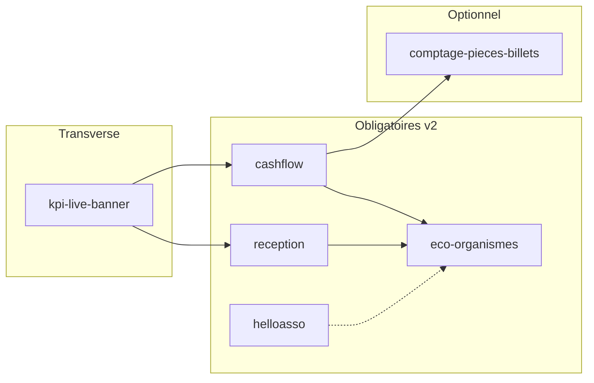

# 05 — Registre `module_key` (liste blanche)

**Statut :** brouillon normatif du pack `references/protocole-modules-recyclique/`  
**Date :** 2026-05-20  
**Audience :** architecte, agents BMAD, backend, Peintre — lecture autonome  
**Prérequis pack :** [`02-MOD-taxonomie-types-de-modules.md`](02-MOD-taxonomie-types-de-modules.md) (brouillon normatif livré) · [`07-MOD-adr-reconciliation-v01-v02.md`](07-MOD-adr-reconciliation-v01-v02.md) · [`references/config-modules-site-id/`](../config-modules-site-id/)

**Règle `refs_first` :** ce document **cite** les sources de vérité (PRD, epics, stories, contrats) ; il **ne remplace pas** `_bmad-output/planning-artifacts/` ni `contracts/openapi/recyclique-api.yaml` tant que la fusion post-HITL n’est pas faite.

---

## 1. Objet

Ce registre est la **liste blanche** des identifiants `module_key` acceptés par l’API de configuration par site (ADR-001). Pour chaque clé il fixe :

- le **statut produit** (pilote, obligatoire v2, optionnel, post-v2) ;
- le **type** de brique modulaire (slice transverse, domaine parcours, workflow step, connecteur, etc.) ;
- les **dépendances** (autres clés, epics, contrats) ;
- le **schéma JSON** (`schema_version` + fichier sous `config-modules-site-id/schemas/`) le cas échéant ;
- les **opérations OpenAPI** (données métier + config générique).

**Hors périmètre de ce registre :** les `page_key` CREOS (`cashflow-nominal`, `reception-nominal`, …) — adressage UI distinct, mais **alignés** sur les mêmes domaines métier (voir §5).

---

## 2. Conventions du registre

### 2.1 Format `module_key`

| Règle | Valeur |
|-------|--------|
| Pattern URL (brouillon OpenAPI) | `^[a-z0-9]+(-[a-z0-9]+)*$` |
| Longueur max | 128 caractères |
| Casse | **kebab-case** minuscules ; normalisation serveur **NFKC** recommandée (ADR-001, livrable QA2) |
| Unicité | Une clé = un **document de config** par `site_id` (pas de synonymes silencieux) |

Source : [`references/config-modules-site-id/openapi-module-config.yaml`](../config-modules-site-id/openapi-module-config.yaml) — paramètre `ModuleKey`.

### 2.2 États registre serveur (cycle de vie clé)

| État | Signification | Effet HTTP typique |
|------|---------------|-------------------|
| **actif** | Clé reconnue et whitelistée ; lecture/écriture `module-config` selon authz | `200` / `422` selon payload |
| **réservé** | Clé documentée dans ce registre ; **non** whitelistée en code — pas de `GET`/`PATCH` `module-config` tant que non promue **actif** | **404** (ou **403** homogène si politique anti-énumération) |
| **déprécié** | Encore lisible ; écriture réservée migration ; remplacée par **alias** ou nouvelle version | `200` + en-tête ou champ `deprecated` (à figer à l’impl.) |
| **alias_de** | Redirection vers clé **canonique** (ex. renommage) | Réponse canonique ou `301` métier documenté |

Toute clé **absente** du registre → **404** (ou **403** homogène si politique anti-énumération — livrable normatif §3.3).

### 2.3 Statuts produit (colonnes du tableau §3)

| Statut | Signification |
|--------|----------------|
| **pilote** | Chaîne modulaire **prouvée** ou en cours de preuve ; référence pour les autres modules |
| **obligatoire v2** | Exigé pour un package v2 **vendable** (PRD §7) |
| **optionnel** | Activable par site ; skip gracieux si désactivé |
| **post-v2** | Hors sprint v2 ; interface réservée sans impl. complète |

### 2.4 Types de brique (alignement taxonomie)

Types alignés sur [`02-MOD-taxonomie-types-de-modules.md`](02-MOD-taxonomie-types-de-modules.md) ; colonne **Type** du tableau §3 :

| Type | Description | Exemple dans ce registre |
|------|-------------|---------------------------|
| **slice-transverse** | Widget / bandeau injecté dans plusieurs parcours (header, slot transverse) | `kpi-live-banner` |
| **domaine-parcours** | Ensemble de pages CREOS + API domaine (caisse, réception) | `cashflow`, `reception` (réservés) |
| **workflow-step** | Étape dans un flow Peintre + persistance métier dédiée | `comptage-pieces-billets` |
| **module-metier** | Domaine complet (déclarations, mappings, exports) | `eco-organismes` |
| **connecteur** | Intégration externe complémentaire, non bloquante | `helloasso` |
| **transverse-compta** | Sync Paheko, outbox, lots session — **pas** de document JSON `module-config` classique | `synchronisation-paheko` |
| **config-plateforme** | Panneau admin / activation modules (Story **9.6**) — merge manifests + PG P2 + JSON ADR-001 | `config-admin-simple` |

**Pont taxonomie ↔ registre :** tableau complet dans [`02-MOD-taxonomie-types-de-modules.md`](02-MOD-taxonomie-types-de-modules.md) §6.1.1.

### 2.5 Placeholders PRD §7 (lignes **réservées**)

Les capacités **Adhérents**, **Synchronisation Paheko** et **Config admin simple** (PRD §7.1) ont des lignes **`réservées`** dans le tableau §3 (`adherents`, `synchronisation-paheko`, `config-admin-simple`) — **documentation pack**, pas whitelist code tant que HITL n'a pas figé le modèle d'activation par `site_id`.

| `module_key` placeholder | Particularité |
|------------------------|---------------|
| `adherents` | Domaine métier + CREOS ; schéma JSON à définir |
| `synchronisation-paheko` | **Transverse** — contrat sync/outbox ([`03-MOD-protocole-backend.md`](03-MOD-protocole-backend.md) §7), pas de god-namespace JSON |
| `config-admin-simple` | Story **9.6** — merge manifest + JSON ADR-001 + PG P2 (T-MOD-4) |

---

## 3. Tableau synthèse — liste blanche

| `module_key` | Statut produit | Type | Registre serveur | Schéma JSON config | Ops OpenAPI config (générique) | Ops OpenAPI données (principales) | Epic / story pivot |
|--------------|----------------|------|------------------|-------------------|-------------------------------|-----------------------------------|-------------------|
| **`kpi-live-banner`** | **pilote** (+ obligatoire v2 bandeau) | slice-transverse | **actif** (handler + tests 2026-05-20) | `1.0.0` → [`kpi-live-banner.v1.json`](../config-modules-site-id/schemas/kpi-live-banner.v1.json) | `recyclique_moduleConfig_getSiteModuleConfig`, `recyclique_moduleConfig_patchSiteModuleConfig` | `recyclique_exploitation_getLiveSnapshot` ; transitoire `recyclique_exploitation_patchBandeauLiveSlice` | Epic 4 · `4-1`…`4-6b` · Epic 9.6 (cible) |
| **`cashflow`** | **obligatoire v2** | domaine-parcours | **réservé** | *À définir* (ex. `1.0.0`) | idem générique (post-fusion) | Famille `recyclique_cashSessions_*`, `POST /v1/sales/`, etc. | Epic 6 · PRD §7 |
| **`reception`** | **obligatoire v2** | domaine-parcours | **réservé** | *À définir* | idem | Famille `recyclique_reception_*` sous `/v1/reception/` | Epic 7 · PRD §7 |
| **`comptage-pieces-billets`** | **optionnel** (pilote #2 protocole) | workflow-step | **réservé** | *À définir* — **données métier en tables**, pas god-namespace JSON | idem | Clôture caisse + outbox Paheko (pas d’op unique figée) | Epic 6 clôture · T-MET-1 · [`08-MOD-exemple-pilote-comptage-pieces-billets.md`](08-MOD-exemple-pilote-comptage-pieces-billets.md) |
| **`helloasso`** | **obligatoire v2** (connecteur) | connecteur | **réservé** | *À définir* (secrets **hors** payload JSON générique) | idem | Étude / spec migration Paheko ; pas d’`operationId` unique dans ce registre | Epic 9 · Story 9.4 · PRD §7.1 |
| **`eco-organismes`** | **obligatoire v2** | module-metier | **réservé** | *À définir* (mappings super-admin ≠ tout le métier) | idem | Module déclarations (à stabiliser dans OpenAPI) | Epic 9 · PRD §9.5 · **après** preuve bandeau |
| **`adherents`** | **obligatoire v2** | module-metier | **réservé** | *À définir* — vie associative minimale (FR60) | idem | API adhérents / vie asso (à stabiliser) | Epic 9 · PRD §7.1 |
| **`synchronisation-paheko`** | **obligatoire v2** | transverse-compta | **réservé** | *N/A* — **pas** de god-namespace JSON ; contrat sync + outbox | — (hors `module-config` nominal) | Chaîne outbox / lots session ; ADR sync | Epics 8.x, 22.x · PRD §7.1 |
| **`config-admin-simple`** | **obligatoire v2** | config-plateforme | **réservé** | *À définir* — merge PG P2 + manifests build (Story **9.6**) | idem | Panneau SuperAdmin modules / blocs ; traçabilité | Story **9.6** · PRD §7.1 |

**Lecture PRD :** modules obligatoires v2 dans `_bmad-output/planning-artifacts/prd.md` §7.1 — tableau ci-dessus (placeholders **réservés**). Seul **`kpi-live-banner`** possède aujourd’hui un schéma config **publié** dans `config-modules-site-id/schemas/`. **`synchronisation-paheko`** : capacité transverse (contrats sync), pas un document JSON `module_key` classique.

### 3.1 Whitelist serveur vs registre documentaire (lacune **L-05**)

| Couche | État 2026-05-20 | Règle |
|--------|-----------------|-------|
| **Ce registre (`05`)** | Tableau §3 = **vérité produit** pour agents et revue | Toute nouvelle clé : §9 + mise à jour [`schemas/README.md`](../config-modules-site-id/schemas/README.md) |
| **Contrat OpenAPI canon** | Routes fusionnees ; exemple liste blanche **`kpi-live-banner`** dans la description du param `module_key` ; `operationId` **`recyclique_moduleConfig_*`** | API tag **`ModuleConfig`** = **interne** jusqu'a Story **9.6** stable (reco 06 F1) |
| **Code backend (handler)** | **Impl. pilote** (2026-05-20) — `recyclic_api/modules/module_config/` ; whitelist **`kpi-live-banner`** ; tests `test_module_config_site.py` ; toggle Epic **4.5** encore actif (migration UI → 9.6) | **T-MOD-5** : etendre whitelist + schemas par cle **actif** |
| **CREOS / Peintre** | `widget_type` ≠ `module_key` — pas de whitelist parallelle cote JSON manifests | Activation long terme : **serveur** + registre ; pas de packaging UI sans politique equivalente (livrable §2.2) |

**L-05 pilote clos (2026-05-20) :** handler rejette les cles inconnues (**404**) ; tests IDOR + cle inconnue dans `recyclique/api/tests/test_module_config_site.py`. **L-05 complet** = chaque nouvelle cle **actif** du §3 ajoutee au registry + schema + tests.

**Story 9.6 :** seed [`9-6-config-admin-simple-modules.md`](../../_bmad-output/implementation-artifacts/9-6-config-admin-simple-modules.md) — UI admin + bascule lecture bandeau depuis `module-config` (au lieu du seul toggle `sites.configuration`).

### 3.2 Schémas JSON — publiés vs réservés (lacune **L-06**)

| `module_key` | Fichier `schemas/` | Validation PATCH (après T-MOD-3) |
|--------------|-------------------|--------------------------------|
| `kpi-live-banner` | [`kpi-live-banner.v1.json`](../config-modules-site-id/schemas/kpi-live-banner.v1.json) | **Oui** (seul schéma publié) |
| `config-admin-simple` | [`config-admin-simple.v1.json`](../config-modules-site-id/schemas/config-admin-simple.v1.json) | **Placeholder** P1 (Story 9.6 — payload minimal) |
| `cashflow`, `reception`, `helloasso`, `eco-organismes`, `adherents` | *Absent* — ligne **réservée** §3 | **Non** tant que HITL + fichier schema |
| `comptage-pieces-billets` | *Absent* — stub minimal attendu (Q-HITL-12) | Métier en **tables** ; JSON config étroit si actif |
| `synchronisation-paheko` | **N/A** | Hors `module-config` nominal |

**Crosswalk grep / fusion OpenAPI :** [`18-MOD-config-modules-crosswalk.md`](18-MOD-config-modules-crosswalk.md) §7 — ne pas promouvoir une clé **actif** sans **(a)** schéma publié ou **(b)** HITL « config vide v1 ».

---

## 4. API générique — configuration par `module_key`

**Source normative :** [`contracts/openapi/recyclique-api.yaml`](../../contracts/openapi/recyclique-api.yaml) — ops `recyclique_moduleConfig_*` (T-MOD-3 **livré** 2026-05-20). Standalone [`openapi-module-config.yaml`](../config-modules-site-id/openapi-module-config.yaml) = **DEPRECATED**.

| Méthode | Chemin | `operationId` | Rôle |
|---------|--------|---------------|------|
| `GET` | `/v1/sites/{site_id}/module-config/{module_key}` | `recyclique_moduleConfig_getSiteModuleConfig` | Lire `ModuleConfigDocument` (`schema_version`, `payload`, `version` optionnel) |
| `PATCH` | `/v1/sites/{site_id}/module-config/{module_key}` | `recyclique_moduleConfig_patchSiteModuleConfig` | Mettre à jour ; **ETag** / **If-Match** → **409** si conflit |

**Enveloppe commune** (`ModuleConfigDocument`) :

- `schema_version` — SemVer du schéma **du module** ;
- `payload` — objet validé par le fichier JSON Schema du module ;
- `version` (optionnel) — entier aligné ETag si le produit l’expose dans le corps.

**Garde-fous** (non optionnels pour impl. conforme) : voir [`livrable-normatif-architecture.md`](../config-modules-site-id/livrable-normatif-architecture.md) — reject-early, membership `site_id`, matrice rôle × `module_key`, pas de `$ref` HTTP en validation, audit append-only.

**Story produit :** `_bmad-output/planning-artifacts/epics.md` — **Story 9.6** (config admin simple, ADR P2 PostgreSQL, merge déterministe sur défauts manifest build, traçabilité auteur/horodate/motif).

---

## 5. Fiches par `module_key`

### 5.0 Précédence DEC-03 (`module_key` JSON fait foi)

> **Source normative :** [`references/artefacts/2026-05-20_04_reponse-architecte-bouclage-modules-v2.md`](../artefacts/2026-05-20_04_reponse-architecte-bouclage-modules-v2.md) §C (DEC-03). Détail : [`03-MOD-protocole-backend.md`](03-MOD-protocole-backend.md) §D.3.5.

En cas de divergence **`sites.configuration`** vs document **JSON `module_key`** scopé `site_id`, **le JSON gagne** ; `sites.configuration` ne réactive jamais un module désactivé au rang 1. Story **9.6** édite le JSON (rang 1) et déprécie le toggle transitoire `bandeau_live_slice_enabled` — pas une autorité concurrente.

### 5.1 `kpi-live-banner` — bandeau KPI live (pilote #1)

| Champ | Valeur |
|-------|--------|
| **Statut produit** | **Pilote** (preuve chaîne Epic 4) · bandeau = **obligatoire v2** (PRD §7) |
| **Type** | slice-transverse |
| **Registre serveur** | **actif** (documentaire) |
| **Widget CREOS** | `bandeau-live` · catalogues `contracts/creos/manifests/widgets-catalog-bandeau-live.json` |
| **Remplacement transitoire** | `sites.configuration.bandeau_live_slice_enabled` + `PATCH /v2/exploitation/bandeau-live-slice` → **à migrer** vers ce `module_key` (Story 9.6) |

#### Dépendances

| Dépendance | Nature |
|------------|--------|
| **OpenAPI / signaux** | Artefact [`2026-04-02_07_signaux-exploitation-bandeau-live-premiers-slices.md`](../artefacts/2026-04-02_07_signaux-exploitation-bandeau-live-premiers-slices.md) (F1–F6, KPIs jour §1 bis) |
| **Backend snapshot** | Story **2.7** — `GET /v2/exploitation/live-snapshot` |
| **CREOS / Peintre** | Stories **4-1** → **4-6b** — manifests, widget, polling, fallbacks, app servie |
| **Contexte** | `ContextEnvelope` — pas de recalcul périmètre côté client (gouvernance 1.4) |
| **Config admin** | Story **9.6** absorbe toggle 4.5 et panneau « Gestion des modules » |

#### Schéma JSON config (`schema_version` = `1.0.0`)

Fichier : [`references/config-modules-site-id/schemas/kpi-live-banner.v1.json`](../config-modules-site-id/schemas/kpi-live-banner.v1.json)

| Propriété `payload` | Type | Description |
|---------------------|------|-------------|
| `show_on_caisse` | boolean | Afficher le bandeau sur le flux caisse kiosque |
| `show_on_reception` | boolean | Afficher le bandeau sur le flux réception |
| `refresh_interval_seconds` | integer | Période minimale entre rafraîchissements (15–3600 s) |

**Mapping front :** snake_case API → camelCase Peintre **explicite** (README schemas).

#### Opérations OpenAPI — données (hors config générique)

| `operationId` | Méthode / chemin | Rôle |
|---------------|------------------|------|
| **`recyclique_exploitation_getLiveSnapshot`** | `GET /v2/exploitation/live-snapshot` | Snapshot live : `daily_kpis_aggregate`, familles F1–F6 optionnelles, `bandeau_live_slice_enabled` (transitoire) |
| **`recyclique_exploitation_patchBandeauLiveSlice`** | `PATCH /v2/exploitation/bandeau-live-slice` | **Transitoire Story 4.5** — activation admin bornée ; **ne pas** renommer l’`operationId` du GET (règle B4) |

**Contrat CREOS :** `data_contract.operation_id` = **`recyclique_exploitation_getLiveSnapshot`** (identique caractère pour caractère à l’OpenAPI).

#### Traçabilité stories Epic 4

| Story | Apport pour ce `module_key` |
|-------|----------------------------|
| **4-1** | Manifests reviewables + ancrage OpenAPI ↔ CREOS |
| **4-2** | Widget `bandeau-live` dans registre Peintre |
| **4-3** | Source backend réelle, polling, `X-Correlation-ID` |
| **4-4** | Fallbacks visibles (`BANDEAU_LIVE_*`) |
| **4-5** | Toggle admin transitoire (à généraliser 9.6) |
| **4-6** | Preuve E2E chaîne complète |
| **4-6b** | Raccordement app Peintre réellement servie |

Sources : `_bmad-output/implementation-artifacts/4-1-*.md` … `4-6b-*.md`.

---

### 5.2 `cashflow` — domaine caisse (placeholder registre)

| Champ | Valeur |
|-------|--------|
| **Statut produit** | **Obligatoire v2** |
| **Type** | domaine-parcours |
| **Registre serveur** | **réservé** — clé proposée pour future config site (activation sous-parcours, préférences d’affichage) |
| **CREOS (existant, hors `module_key`)** | `page_key` : `cashflow-nominal`, `cashflow-close`, `cashflow-refund`, … · manifests `contracts/creos/manifests/page-cashflow-*.json` |

#### Dépendances

| Dépendance | Nature |
|------------|--------|
| **Epic 6** | Caisse v2 exploitable — sessions, vente, clôture, remboursement |
| **Multi-contexte** | `site`, `caisse`, `session` (FR11, FR41) |
| **Paheko** | Clôture session → outbox (Epic 8) — **données métier**, pas JSON config générique |
| **Bandeau** | Consommation optionnelle de `kpi-live-banner` sur parcours caisse (`show_on_caisse`) |

#### Schéma JSON config

**Schéma config :** *à définir* (clé **réservée** — validation HITL avant fichier `schemas/`). Pistes v1 : flags d’activation de variantes (réel / virtuel / différé), préférences dashboard — **sans** y stocker tickets, sessions ou totaux de clôture.

#### Opérations OpenAPI — données (famille, non exhaustif)

| Domaine | Exemples `operationId` / préfixes |
|---------|-----------------------------------|
| Sessions caisse | `recyclique_cashSessions_*` — ouverture, `current`, clôture |
| Ventes | `POST /v1/sales/` et opérations associées (held, finalisation) |
| Admin / rapports | Exports bulk sessions (classe B, step-up) |

**Règle :** tant que le registre est **réservé**, l’activation du domaine repose sur **permissions** + manifests CREOS, pas sur `GET/PATCH module-config/cashflow`.

---

### 5.3 `reception` — domaine réception (placeholder registre)

| Champ | Valeur |
|-------|--------|
| **Statut produit** | **Obligatoire v2** |
| **Type** | domaine-parcours |
| **Registre serveur** | **réservé** |
| **CREOS** | `page_key` `reception-nominal` · `widgets-catalog-reception-nominal.json` · permission `reception.access` |

#### Dépendances

| Dépendance | Nature |
|------------|--------|
| **Epic 7** | Reception flow v2 dans la chaîne Peintre |
| **Flux matière** | Lien FR29/FR30 — catégories, pesée, tickets dépôt |
| **Bandeau** | `kpi-live-banner.show_on_reception` |
| **Stats live** | Agrégats admin / réception (`/v1/stats/reception/*`, évolution vers stats unifiées) |

#### Schéma JSON config

**Schéma config :** *à définir* (clé **réservée** — validation HITL). Pistes : activation par site, options d’affichage poste — **pas** les lignes de ticket ou pesées.

#### Opérations OpenAPI — données (famille)

| Exemple | Référence CREOS catalogue |
|---------|---------------------------|
| `recyclique_reception_openPoste` | `POST /v1/reception/postes/open` |
| `recyclique_reception_createTicket` | `POST /v1/reception/tickets` |
| *…* | Voir `widgets-catalog-reception-nominal.json` |

Source epics : **FR56**, Epic 7.

---

### 5.4 `comptage-pieces-billets` — clôture caisse (pilote #2 protocole)

| Champ | Valeur |
|-------|--------|
| **Statut produit** | **Optionnel** par site (feature module) |
| **Type** | workflow-step (+ tables métier) |
| **Registre serveur** | **réservé** |
| **Distinction critique** | **Ne pas** modéliser le comptage uniquement dans `payload` JSON générique — volumétrie, contraintes, audit Paheko → **tables dédiées** (ADR-001 § god-namespace) |

#### Dépendances

| Dépendance | Nature |
|------------|--------|
| **`cashflow`** | Étape dans le flow **clôture** (Epic 6, ex. `page-cashflow-close`) |
| **Paheko** | Écritures batch / sous-écritures — chaîne **outbox** obligatoire (dossier architecte ch. 04) |
| **Parité legacy** | T-MET-1 — [`07-ARCH-todos-et-questions-architecte.md`](../dossier-architecte-externe-v2/07-ARCH-todos-et-questions-architecte.md) |
| **Protocole** | Fiche détaillée : [`08-MOD-exemple-pilote-comptage-pieces-billets.md`](08-MOD-exemple-pilote-comptage-pieces-billets.md) |

#### Schéma JSON config

**À définir** — périmètre attendu **étroit** : ex. `{ "enabled": true, "skip_allowed": false }` — les **montants et dénominations** restent côté API métier / BDD.

#### Opérations OpenAPI — données

Pas d’`operationId` unique figé dans ce registre (story d’implémentation à créer). Alignement attendu : extension du parcours **`recyclique_cashSessions_closeSession`** ou ressources dédiées **sous contrôle step-up** si sensible.

#### Skip gracieux

Si `module_key` désactivé pour le site : l’étape comptage est **absente** du flow ou affiche un message explicite — **sans** bloquer la clôture si le produit l’autorise (à trancher HITL).

---

### 5.5 `helloasso` — connecteur adhésions (placeholder)

| Champ | Valeur |
|-------|--------|
| **Statut produit** | **Obligatoire v2** (connecteur **complémentaire**) |
| **Type** | connecteur |
| **Registre serveur** | **réservé** |
| **Contrainte produit** | **Non bloquant** pour l’exploitation locale nominale (AR10, epics Story HelloAsso) |

#### Dépendances

| Dépendance | Nature |
|------------|--------|
| **Adhérents** | Module minimal associé (FR60) |
| **Paheko** | Voie API directe et/ou plugin Paheko — arbitrage documenté |
| **Specs** | [`references/migration-paheko/2026-04-12_specification-integration-helloasso-recyclique-paheko.md`](../migration-paheko/2026-04-12_specification-integration-helloasso-recyclique-paheko.md) |
| **Story** | Epic 9 — **9.4** (étude / arbitrage) |

#### Schéma JSON config

**À définir.** **Secrets OAuth / clés API** : champs dédiés chiffrés, ACL réduite — **jamais** en clair dans `GET module-config` (livrable §3.5).

#### Opérations OpenAPI

Non centralisées dans ce registre — dépendent de l’arbitrage API v5 vs plugin Paheko (PRD §7.1, livrable d’arbitrage 2026-04-12).

---

### 5.6 `eco-organismes` — déclarations eco-organismes (placeholder)

| Champ | Valeur |
|-------|--------|
| **Statut produit** | **Obligatoire v2** — **premier grand module métier** |
| **Type** | module-metier |
| **Registre serveur** | **réservé** |
| **Séquence PRD** | **Après** preuve chaîne sur bandeau live (§10 PRD — ne pas étendre si la chaîne est cassée) |

#### Dépendances

| Dépendance | Nature |
|------------|--------|
| **Flux financier + matière** | FR30, FR59 — mappings configurables super-admin |
| **`cashflow` / `reception`** | Croisement des flux pour déclarations |
| **Classifications** | Catégories internes → catégories officielles par éco-organisme |
| **Paheko** | Exports / écritures selon périmètre légal (hors JSON config générique) |

#### Schéma JSON config

**À définir** — distinguer :

- **config UI** (activation module, périodes affichées par défaut) → `module_key` + JSON Schema ;
- **mappings et historique** → tables + API admin dédiées (NFR22, historisation super-admin).

#### Opérations OpenAPI

À stabiliser dans `recyclique-api.yaml` lors du découpage Epic 9 — **pas** de second contrat HTTP parallèle (AR39).

---

## 6. Mécanismes transitoires et migration vers le registre

### 6.1 Tableau de migration (L-05, L-06, L-08)

| Mécanisme actuel | Cible `module_key` | Lacune | Action |
|------------------|-------------------|--------|--------|
| `sites.configuration.bandeau_live_slice_enabled` | `kpi-live-banner` (`payload` v1) | **L-08** | Story **9.6** : persistance JSONB / merge PG ; précédence → [`03-MOD-protocole-backend.md`](03-MOD-protocole-backend.md) §7.1 |
| `PATCH /v2/exploitation/bandeau-live-slice` (`recyclique_exploitation_patchBandeauLiveSlice`) | `patchSiteModuleConfig` + `module_key=kpi-live-banner` | **L-04**, **L-08** | Déprécier après T-MOD-3 + 9.6 ([`18-MOD-config-modules-crosswalk.md`](18-MOD-config-modules-crosswalk.md) T3.6) |
| Préférences bandeau en `localStorage` / bundle KPI (transcript `0c9a9709`) | `GET/PATCH module-config` | **L-06**, **L-08** | Migration idempotente (livrable §3.10) ; serveur **prime** post-sync |
| Registre **documentaire** seul (`05` §3) | Whitelist **code** alignée | **L-05** | T-MOD-5 : impl. liste blanche = tableau §3 états **actif** |

### 6.2 Règles pendant la double piste (Epic 4.5 → 9.6)

- **Écriture toggle :** le chemin **canon** reste `PATCH …/bandeau-live-slice` jusqu’à dépréciation — **ne pas** ajouter un second PATCH ad hoc par champ pour les modules suivants.
- **Lecture snapshot :** `GET …/live-snapshot` continue d’exposer `bandeau_live_slice_enabled` — le widget **ne change pas** l’`operationId` du poll (Stories **4-5**, **4-6**).
- **Préférences UI** (`show_on_caisse`, `refresh_interval_seconds`) : **non** dans le snapshot ; cible = schéma [`kpi-live-banner.v1.json`](../config-modules-site-id/schemas/kpi-live-banner.v1.json) après fusion OpenAPI (**L-04**).
- **Front :** signal « module off » **backend-autoritaire** — pas de contournement `localStorage` comme vérité métier ([`04-MOD-protocole-front-creos.md`](04-MOD-protocole-front-creos.md) §9).

**Clôture L-08 :** une seule source d’écriture activation + merge documenté (Q-HITL-03) — pas fermeture par ce registre seul.

---

## 7. Matrice dépendances entre clés (résumé)

| Clé | Dépend de | Commentaire |
|-----|-----------|-------------|
| `kpi-live-banner` | Contexte site, Epic 2.7 | Indépendant des autres `module_key` pour la preuve Epic 4 |
| `cashflow` | Epic 1–2 socle | Pas de dépendance `module_key` |
| `reception` | Epic 1–2 socle | Idem |
| `comptage-pieces-billets` | `cashflow` (clôture) | Workflow step |
| `eco-organismes` | `cashflow`, `reception` (données) | Grand module — après chaîne bandeau |
| `helloasso` | Adhérents (métier) | Complémentaire, dégradation gracieuse |

---

## 8. Alignement CREOS ↔ `module_key`

| Concept CREOS | Lien avec `module_key` |
|---------------|------------------------|
| `widget_type` / `type` | Adressage composant (ex. `bandeau-live`) — **pas** égal à `module_key` |
| `page_key` | Parcours (ex. `cashflow-nominal`) — peut regrouper plusieurs widgets |
| `data_contract.operation_id` | Données **métier** — reste stable (B4) quand la config module migre |
| Activation UI long terme | **Registre serveur** + JSON config ; manifests = structure build-time (Story 9.6, AR45) |

**Publication CREOS ↔ activation :** pas de déploiement UI sans politique serveur équivalente sur le `module_key` (livrable §2.2).

---

## 9. Critères d’entrée d’une nouvelle clé dans ce registre

1. **Décision écrite** dans ce fichier (ou PR post-HITL) : statut produit, type, dépendances.
2. **Fichier JSON Schema** dans `references/config-modules-site-id/schemas/` si la clé porte de la **config UI**.
3. **Entrée** dans la liste blanche code backend (alignée CREOS).
4. **Tests négatifs** : clé inconnue, IDOR `site_id`, rôle interdit.
5. **Pas de secret** en clair dans le schéma config générique.
6. **Mise à jour** de [`config-modules-site-id/schemas/README.md`](../config-modules-site-id/schemas/README.md) et de ce registre.

Pour un **workflow step** ou un **module métier** : en plus, spec OpenAPI métier + règle **tables vs JSON** (§5.4, ADR-001).

---

## 10. Lacunes et TODO (liens projet)

| ID | Sujet | Où suivre |
|----|--------|-----------|
| T-MOD-3 | Fusion OpenAPI `module-config/{module_key}` dans `contracts/` | `openapi-module-config.yaml` |
| T-MOD-5 | Registre commun | **ce document** — à promouvoir post-HITL |
| T-MOD-4 | Story 9.6 — généralisation admin | `_bmad-output/planning-artifacts/epics.md` |
| T-MET-1 | Pilote comptage | [`08-MOD-exemple-pilote-comptage-pieces-billets.md`](08-MOD-exemple-pilote-comptage-pieces-billets.md) |
| Précédence config (DEC-03) | JSON `module_key` > `sites.configuration` | [`03-MOD-protocole-backend.md`](03-MOD-protocole-backend.md) §D.3.5 · **L-07 OK** doc (2026-05-20) |
| Crosswalk OpenAPI / schémas | L-04, L-06, L-08 | [`18-MOD-config-modules-crosswalk.md`](18-MOD-config-modules-crosswalk.md) |

---

## 11. Références `refs_first` (inventaire)

| Zone | Chemins |
|------|---------|
| Config modules | [`references/config-modules-site-id/`](../config-modules-site-id/) — ADR-001, livrable normatif, OpenAPI brouillon, schémas |
| Signaux bandeau | [`references/artefacts/2026-04-02_07_signaux-exploitation-bandeau-live-premiers-slices.md`](../artefacts/2026-04-02_07_signaux-exploitation-bandeau-live-premiers-slices.md) |
| OpenAPI canon | [`contracts/openapi/recyclique-api.yaml`](../../contracts/openapi/recyclique-api.yaml) |
| CREOS manifests | [`contracts/creos/manifests/`](../../contracts/creos/manifests/) |
| Stories Epic 4 | `_bmad-output/implementation-artifacts/4-1-*.md` … `4-6b-*.md` |
| PRD / epics | `_bmad-output/planning-artifacts/prd.md` §7 · `epics.md` Epic 4, 6, 7, 9 (Story 9.6) |
| Pack protocole | [`01-MOD-matrice-choix-modularite.md`](01-MOD-matrice-choix-modularite.md), [`07-MOD-adr-reconciliation-v01-v02.md`](07-MOD-adr-reconciliation-v01-v02.md), [`00-MOD-cadrage-chantier.md`](00-MOD-cadrage-chantier.md) |
| Architecte | [`dossier-architecte-externe-v2/07-ARCH-todos-et-questions-architecte.md`](../dossier-architecte-externe-v2/07-ARCH-todos-et-questions-architecte.md) |

---

*Registre liste blanche — une seule source normative pack pour les `module_key` tant qu’aucune fusion `contracts/` ne le remplace. Dernière révision : 2026-05-20.*
