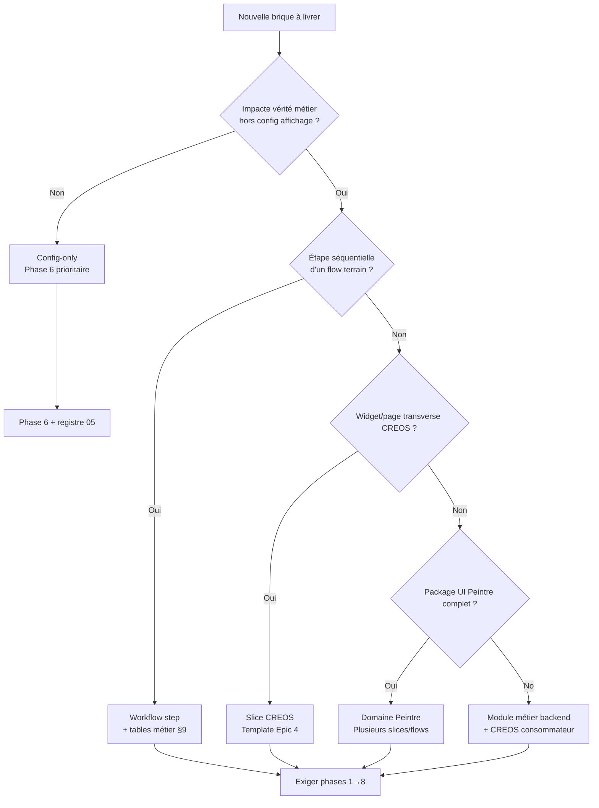
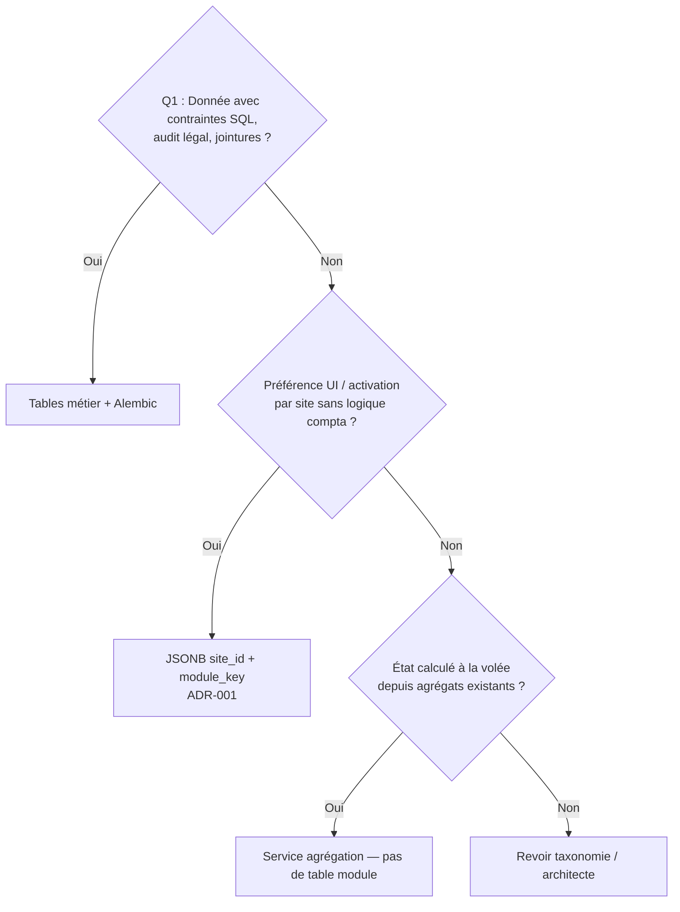
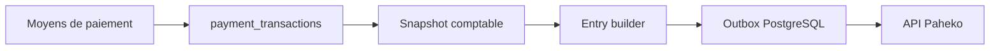

# 06 — Cookbook — nouveau module optionnel (back + front + contrats + `site_id`)

**Statut :** brouillon normatif du pack `references/protocole-modules-recyclique/`  
**Date :** 2026-05-20  
**Audience :** développeurs, agents Cursor/BMAD — **livrable principal** du pack  
**Objectif :** un **seul** pas à pas pour ajouter ou étendre un module optionnel v2 : contrats, backend, CREOS, Peintre, activation par `site_id`, recette. Un lecteur en dérive une **checklist exécutable** sans parcourir `03`–`05` en entier (ces protocoles restent la référence détaillée par couche).

**Modèle de découpage :** Epic 4 — stories **4-1** → **4-6b** (pilote bandeau live / `kpi-live-banner`).  
**Format procédural :** inspiré de [`references/operations-speciales-recyclique/2026-04-18_prompt-ultra-operationnel-operations-speciales-recyclique_v1-1.md`](../operations-speciales-recyclique/2026-04-18_prompt-ultra-operationnel-operations-speciales-recyclique_v1-1.md) (phases ordonnées, tables, gates — **sans** le contenu métier opérations spéciales).

**Règle `refs_first` :** PRD §4.2, epics et stories sous `_bmad-output/` font foi pour le « pourquoi » ; ce cookbook dit **dans quel ordre** et **quels fichiers** toucher. Promotion `contracts/` ou ADR BMAD canonique : **post-HITL** (Strophe).

**Architecte externe (2026-05-20) — avant Phase 0 :** lire [`../artefacts/2026-05-20_05_notes-architecte-loup-de-mer-modules-v2.md`](../artefacts/2026-05-20_05_notes-architecte-loup-de-mer-modules-v2.md) (**primordial**) puis [`../artefacts/2026-05-20_04_reponse-architecte-bouclage-modules-v2.md`](../artefacts/2026-05-20_04_reponse-architecte-bouclage-modules-v2.md) (B.1 convention back, B.2 patron slice/workflow, C précédence `module_key`). B.1 **collé** dans [`03-MOD-protocole-backend.md`](03-MOD-protocole-backend.md) §6 C.4 ; B.2 dans [`04-MOD-protocole-front-creos.md`](04-MOD-protocole-front-creos.md) §8.0 (sources artefact 04). HITL **Q-HITL-06** avant promotion BMAD.

---

## 0. Comment utiliser ce document

### 0.0 Hub pack enrichissement (`10`–`22`) — lecture transversale

**Règle :** ce hub **ne remplace pas** les phases **0→8** ci-dessous (pas à pas module). Il oriente vers la cartographie, les ponts HITL/BMAD et les owners de lacunes **sans** recopier la procédure.

| # | Fichier | Quand l'ouvrir (après quelle phase cookbook) |
|---|---------|-----------------------------------------------|
| **10** | [`10-MOD-cartographie-sources-modules.md`](10-MOD-cartographie-sources-modules.md) | **Phase 0** — sources PRD, BMAD, `contracts/`, config |
| **11** | [`11-MOD-synthese-recherches-modularite.md`](11-MOD-synthese-recherches-modularite.md) | **Phase 0** — contexte recherche / v0.1 vs v2 |
| **12** | [`12-MOD-index-transcripts-modularite.md`](12-MOD-index-transcripts-modularite.md) | **Phase 0** — décisions terrain (transcripts Cursor) |
| **13** | [`13-MOD-idees-kanban-modules-liens.md`](13-MOD-idees-kanban-modules-liens.md) | Hors livraison immédiate — plugins / post-v2 |
| **14** | [`14-MOD-marketplace-post-v2-fiche-citation.md`](14-MOD-marketplace-post-v2-fiche-citation.md) | **Hors scope v2** — ne pas figer APIs config |
| **15** | [`15-MOD-matrice-gaps-bmad-story-9-6.md`](15-MOD-matrice-gaps-bmad-story-9-6.md) | **Phase 6** · backlog **9.6** — lacunes L-03…L-15 ↔ stories |
| **16** | [`16-MOD-lien-operations-speciales-pattern.md`](16-MOD-lien-operations-speciales-pattern.md) | Modèle phases / gates (pas le métier ops spéciales) |
| **17** | [`17-MOD-outillage-cursor-modules-2026-05-20.md`](17-MOD-outillage-cursor-modules-2026-05-20.md) | Session agent Cursor / BMAD |
| **18** | [`18-MOD-config-modules-crosswalk.md`](18-MOD-config-modules-crosswalk.md) | **Phase 6** — crosswalk ADR-001, grep L-04/L-06, plan T-MOD-3 |
| **19** | [`19-MOD-checklist-v0-1-vs-pack.md`](19-MOD-checklist-v0-1-vs-pack.md) | **Phase 0** — anti-régression TOML / `ModuleBase` |
| **20** | [`20-MOD-peintre-code-refs-bandeau-live.md`](20-MOD-peintre-code-refs-bandeau-live.md) | **Phases 4–8** — pilote #1 `kpi-live-banner` (code `refs_first`) |
| **21** | [`21-MOD-gouvernance-contrats-modules.md`](21-MOD-gouvernance-contrats-modules.md) | **Phase 1** — merge `contracts/` (L-11) |
| **22** | [`22-MOD-dossier-architecte-pont-t-mod.md`](22-MOD-dossier-architecte-pont-t-mod.md) | **HITL / priorisation** — T-MOD-1…5, T-MET-1, **T-PEINT-1** → action BMAD (pas pas-à-pas) |

**Gardien du seuil (phases 4–8 front) :** toute insertion widget/flow doit **brancher** le réceptacle décrit dans [`04`](04-MOD-protocole-front-creos.md) §17 (**L-16**) — bypass autorisé en v2, hooks obligatoires.

**Pont exécutable unique (dossier architecte) :** [`22-MOD-dossier-architecte-pont-t-mod.md`](22-MOD-dossier-architecte-pont-t-mod.md) — tableau T-MOD/T-MET ; lacunes détaillées : [`09-MOD-lacunes-et-questions-ouvertes.md`](09-MOD-lacunes-et-questions-ouvertes.md) §3.

| Usage | Action |
|-------|--------|
| **Checklist projet** | Copier la [§12 — Checklist maître](#12-checklist-maître-dérivable-un-seul-tableau) ; cocher phase par phase. |
| **Story BMAD** | Mapper chaque phase aux stories Epic 4 (§13) ou créer des stories calquées sur le même découpage. |
| **Agent** | Exécuter les phases **dans l’ordre** ; ne pas passer à la phase suivante sans gate §0.3. |
| **Approfondissement** | Après une phase, ouvrir le protocole couche : [`03-MOD-protocole-backend.md`](03-MOD-protocole-backend.md), [`04-MOD-protocole-front-creos.md`](04-MOD-protocole-front-creos.md), [`05-MOD-registre-module-key.md`](05-MOD-registre-module-key.md). |

**Prérequis lecture (avant Phase 0) :**

| Doc | Rôle |
|-----|------|
| [`02-MOD-taxonomie-types-de-modules.md`](02-MOD-taxonomie-types-de-modules.md) | Classifier slice / workflow step / config-only |
| [`05-MOD-registre-module-key.md`](05-MOD-registre-module-key.md) | **Primordial** — `module_key`, whitelist, DEC-03 (§5.0), ops config |
| [`01-MOD-matrice-choix-modularite.md`](01-MOD-matrice-choix-modularite.md) · [`07-MOD-adr-reconciliation-v01-v02.md`](07-MOD-adr-reconciliation-v01-v02.md) | v0.1 ↔ v2 — **pas** de `module.toml` / `ModuleBase` |
| [`21-MOD-gouvernance-contrats-modules.md`](21-MOD-gouvernance-contrats-modules.md) | Checklist merge `contracts/` (L-11) — **avant** Phase 1 |
| [`references/config-modules-site-id/index.md`](../config-modules-site-id/index.md) | ADR-001, garde-fous prod |

**Critère « module prêt » (résumé) :** chaîne PRD §4.2 complète + activation **backend-gouvernée** + manifests **reviewables** sous `contracts/creos/manifests/` + preuve app **servie** (pas jsdom seul).

---

## 0.1 Règles impératives (toutes phases)

1. **Ne pas** réintroduire loader `module.toml`, `ModuleBase`, `config.toml [modules] enabled`, ni EventBus Redis générique comme norme v2.
2. **Vérifier** le dépôt réel (`recyclique/api`, `peintre-nano`, `contracts/`) avant d’ajouter des routes ou manifests parallèles.
3. **`operationId` OpenAPI** = **`data_contract.operation_id`** CREOS (caractère pour caractère — gouvernance B4).
4. **Vérité métier** côté **serveur** ; le front filtre et affiche (AR39) — pas de permissions ni règles F1–F6 recalculées dans le widget.
5. **Activation module** : signal **autoritaire backend** (snapshot, `module-config`, ou fusion serveur) — **pas** `localStorage` comme vérité.
6. **Persistance** : arbre §0.2 — **tables métier** pour workflow/compta ; **JSON `module_key`** pour préférences UI seulement.
7. **Paheko** : si impact compta → chaîne **outbox** (§9) ; sinon documenter explicitement **hors outbox**.
8. **Contradiction PRD ↔ dépôt** : signaler l’écart ; aligner sur PRD sauf impossibilité technique **démontrée** (NEEDS_HITL).
9. **Mock** toléré en construction ; **interdit** comme état final d’un module **obligatoire v2**.
10. Après chaque phase livrable : **fichiers modifiés**, **tests exécutés**, **écarts ouverts** (discipline Story Runner).

---

## 0.2 Arbre de décision — avant d’écrire du code

### A. Quel type de module ?



**Règle rapide :** doute slice vs workflow step → l’opérateur suit-il un **flow** avec persistance d’étape (clôture, comptage) ? Oui → **workflow step** — lire [`08-MOD-exemple-pilote-comptage-pieces-billets.md`](08-MOD-exemple-pilote-comptage-pieces-billets.md) (**livré**, annexe pilote #2). Non → **slice** (pilote #1).

### B. Où persister quoi ?



### C. Impact Paheko ?

| Réponse | Phases obligatoires |
|---------|---------------------|
| **Non** (ex. bandeau live lecture seule) | Phases 1–8 ; §9 = case « hors outbox » |
| **Oui** (clôture, remboursement, écritures) | Phases 1–8 **+** §9 intégral |

---

## 0.3 Gates entre phases

| Gate | Condition |
|------|-----------|
| **G0 → G1** | `module_key` proposé dans [`05-MOD-registre-module-key.md`](05-MOD-registre-module-key.md) (ou PR HITL) ; type taxonomique choisi ; audit repo §Phase 0 produit |
| **G1 → G2** | OpenAPI + signaux métier reviewables ; `operationId` unique ; codegen si YAML modifié |
| **G2 → G3** | Tests pytest routes/service **verts** (nominal + 401/403 + dégradation) |
| **G3 → G4** | Manifests CREOS sous `contracts/creos/manifests/` ; tests contract `creos-*` **verts** |
| **G4 → G5** | `registerWidget` + allowlist synchronisée |
| **G5 → G6** | Client HTTP + widget branché ; `X-Correlation-ID` si live/polling |
| **G6 → G7** | Activation site testée (toggle transitoire ou `module-config`) |
| **G7 → G8** | Fallbacks DOM + `reportRuntimeFallback` testés |
| **G8 → DONE** | App servie + preuve réseau ; checklist §12 **100 %** ou écarts dans `09-lacunes` |

---

## Phase 0 — Cadrage et audit repo-aware

**Objectif :** nommer le module, éviter les doublons brownfield, fixer le périmètre avant contrats.

### 0.1 Livrables de phase

| Livrable | Format |
|----------|--------|
| Fiche module (1 page) | `module_key`, type taxonomique, statut produit (pilote / optionnel / obligatoire v2), dépendances |
| Table **PRD / existe / manque / adapter** | Par capacité (API, UI, permissions, config site, Paheko) |
| Liste **fichiers probables** | Voir §11 — colonne « inspecter en premier » |

### 0.2 Checklist

| ID | Action | Référence |
|----|--------|-----------|
| **0.1** | Choisir `module_key` **kebab-case** ; vérifier absence dans [`05-registre`](05-MOD-registre-module-key.md) §3 | Pattern `^[a-z0-9]+(-[a-z0-9]+)*$` |
| **0.2** | Si config UI : créer `references/config-modules-site-id/schemas/<module_key>.v1.json` + MAJ [`schemas/README.md`](../config-modules-site-id/schemas/README.md) | Ex. [`kpi-live-banner.v1.json`](../config-modules-site-id/schemas/kpi-live-banner.v1.json) |
| **0.3** | Lire story/epic cible dans `_bmad-output/planning-artifacts/epics.md` | Epic 4 = gabarit slice |
| **0.4** | Grep dépôt : routes, widgets, `module_key`, permissions existantes | `recyclique/api`, `peintre-nano`, `contracts/` |
| **0.5** | Documenter **hors scope** explicite (dashboard, admin transverse, marketplace) | Story 4-1 AC2 |
| **0.6** | Arbitrages bloquants → **NEEDS_HITL** (Strophe), pas d’hypothèse silencieuse | [`09-lacunes`](09-MOD-lacunes-et-questions-ouvertes.md) |

### 0.3 Table modèle — audit synthétique

| Capacité | Prévu produit | Existe dépôt | Action |
|----------|---------------|--------------|--------|
| Contrat OpenAPI | … | … | créer / étendre / réutiliser |
| Manifests CREOS | … | … | créer sous `contracts/creos/manifests/` |
| Service + routes | … | … | `api_v2` ou `api_v1` |
| Persistance | … | … | table / JSON / agrégation seule |
| Widget Peintre | … | … | `registerWidget` |
| Permission keys | … | … | aligner ContextEnvelope |
| Activation `site_id` | … | … | transitoire / ADR-001 |
| Outbox Paheko | … | … | oui / non documenté |

**Gate G0 :** fiche + table remplies ; `module_key` validé ou proposé au registre.

---

## Phase 1 — Contrat métier et OpenAPI (story **4-1**)

**Objectif :** ancrage **reviewable** avant logique lourde — sans `operationId`, pas de branchement CREOS propre.

### 1.1 Fichiers à créer ou modifier

| Action | Chemin type | Pilote bandeau live |
|--------|-------------|---------------------|
| **Créer / étendre** | `references/artefacts/YYYY-MM-DD_*_signaux-<domaine>.md` | [`2026-04-02_07_signaux-exploitation-bandeau-live-premiers-slices.md`](../artefacts/2026-04-02_07_signaux-exploitation-bandeau-live-premiers-slices.md) |
| **Modifier** | `contracts/openapi/recyclique-api.yaml` | `recyclique_exploitation_getLiveSnapshot`, erreurs `RecycliqueApiError` |
| **Générer** | `contracts/openapi/generated/recyclique-api.ts` | `cd contracts/openapi && npm run generate` |
| **Créer** | `contracts/creos/manifests/widgets-catalog-<slice>.json` | `widgets-catalog-bandeau-live.json` |
| **Créer** | `contracts/creos/manifests/page-<page_key>.json` | `page-bandeau-live-sandbox.json` |
| **Créer** | `contracts/creos/manifests/navigation-<slice>.json` | `navigation-bandeau-live-slice.json` |
| **Créer** | `peintre-nano/tests/contract/creos-<slice>-manifests-4-1.test.ts` | `creos-bandeau-live-manifests-4-1.test.ts` |

### 1.2 Checklist contrat

| ID | Critère |
|----|---------|
| **1.1** | Champs, null/dégradation, cas nominal/échec documentés (pas happy path seul) |
| **1.2** | Backend **calcule** les états métier (UX-DR15) — spec signaux |
| **1.3** | Périmètre **borné** au slice (pas d’absorption admin/dashboard) |
| **1.4** | `operationId` unique — convention `recyclique_<domaine>_<verbe>` |
| **1.5** | Réponses **401 / 403 / 503** (et pertinentes) documentées |
| **1.6** | `X-Correlation-ID` (ou équivalent) sur flux live/polling |
| **1.7** | Catalogue : `data_contract.operation_id` **==** `operationId` YAML |
| **1.8** | `endpoint_hint` + tag OpenAPI cohérents |
| **1.9** | MAJ [`contracts/README.md`](../../contracts/README.md) si nouveau lot manifests |

**Gate G1 :** tests contract manifests **verts** ; revue humaine contrats.

**Story :** `_bmad-output/implementation-artifacts/4-1-publier-le-contrat-et-les-manifests-minimaux-du-module-bandeau-live.md`

---

## Phase 2 — Backend : service, routes, persistance (stories **4-3**, **4-5**)

**Objectif :** récepteur FastAPI autoritaire — handler mince, service domaine, zéro fuite de contexte.

### 2.1 Fichiers à créer ou modifier

| Action | Chemin type | Pilote |
|--------|-------------|--------|
| **Créer** | `recyclique/api/src/recyclic_api/schemas/<domaine>_<ressource>.py` | `exploitation_live_snapshot.py` |
| **Créer** | `recyclique/api/src/recyclic_api/services/<domaine>_*_service.py` | `exploitation_live_snapshot_service.py` |
| **Créer** | `recyclique/api/src/recyclic_api/api/api_v2/endpoints/<domaine>.py` | `exploitation.py` |
| **Modifier** | `recyclique/api/src/recyclic_api/api/api_v2/api.py` | `include_router` |
| **Vérifier** | `recyclique/api/src/recyclic_api/main.py` | préfixe `/v2` |
| **Créer** | `recyclique/api/tests/test_<domaine>_*.py` | `test_exploitation_live_snapshot.py` |
| **Optionnel** | `recyclique/api/migrations/versions/*.py` | si nouvelles tables (workflow step) |
| **Transitoire** | `sites.configuration` ou champ snapshot | `bandeau_live_slice_enabled` (**4-5**) |

**Choix surface API :** préférer `/v2/<domaine>/...` pour nouveaux slices ; `/v1` seulement si extension brownfield imposée ([`03-protocole-backend`](03-MOD-protocole-backend.md) §6).

### 2.2 Checklist backend

| ID | Critère |
|----|---------|
| **2.1** | Logique dans **service**, pas route « grasse » |
| **2.2** | `site_id` / contexte résolus **serveur** — pas de confiance au client seul |
| **2.3** | Membership + permissions **reject-early** |
| **2.4** | États métier complets (ex. `delayed_open`, `unknown`) si domaine l’exige |
| **2.5** | Dégradation : **503** stable, pas de 200 trompeur |
| **2.6** | `openapi_extra.operationId` sur chaque route |
| **2.7** | Tests : nominal, dégradé, 401/403, IDOR, corrélation |
| **2.8** | Si toggle : PATCH borné ADMIN/SUPER_ADMIN + log structuré (**4-5**) |

**Gate G2 :** pytest ciblés **verts**.

**Stories :** `4-3-brancher-la-source-backend-reelle-et-les-cas-douverture-decalee.md`, `4-5-ajouter-un-toggle-admin-minimal-borne-au-module-bandeau-live.md`

---

## Phase 3 — Manifests CREOS reviewables (complément **4-1**)

**Objectif :** vérité UI versionnée sous `contracts/` — pas seulement `peintre-nano/public/manifests/`.

### 3.1 Fichiers (rappel + slots)

| Artefact | Fichier | Schéma |
|----------|---------|--------|
| Catalogue widget | `widgets-catalog-<slice>.json` | `contracts/creos/schemas/widget-declaration.schema.json` |
| Page | `page-<page_key>.json` | ingest `parsePageManifestJson` |
| Navigation | `navigation-<slice>.json` | ingest navigation |

### 3.2 Checklist CREOS

| ID | Critère |
|----|---------|
| **3.1** | `page_key` stable ; entrée nav → même `page_key` |
| **3.2** | `required_permission_keys` alignées backend |
| **3.3** | `slots[]` : `slot_id`, `widget_type`, `widget_props` (JSON sérialisable) |
| **3.4** | Chaque `widget_type` ∈ catalogue reviewable |
| **3.5** | `data_contract` : `source`, `operation_id`, `refresh`, `polling_interval_s` si polling |
| **3.6** | Props démo documentées **non normatives** si présentes |

**Gate G3 :** tests `peintre-nano/tests/contract/creos-*` **verts**.

---

## Phase 4 — Registre widget Peintre (story **4-2**)

**Objectif :** composant React + CSS Module ADR P1 — pipeline `PageRenderer` unique.

### 4.1 Fichiers à créer ou modifier

| Action | Chemin type | Pilote |
|--------|-------------|--------|
| **Créer** | `peintre-nano/src/domains/<domaine>/<Widget>.tsx` | `domains/exploitation/BandeauLive.tsx` |
| **Créer** | `peintre-nano/src/domains/<domaine>/<Widget>.module.css` | tokens `var(--pn-…)` |
| **Créer** | `peintre-nano/src/registry/register-<domaine>-widgets.ts` | side-effect `registerWidget` |
| **Modifier** | `peintre-nano/src/registry/index.ts` | import enregistrement |
| **Créer** | `peintre-nano/tests/unit/<domaine>-*.test.tsx` | rendu + props |
| **Créer** | `peintre-nano/src/domains/<domaine>/README.md` | liens manifests + stories |

### 4.2 Checklist registre

| ID | Critère |
|----|---------|
| **4.1** | `registerWidget('<type>', Composant)` — `<type>` = catalogue CREOS |
| **4.2** | Types métier depuis `contracts/openapi/generated/recyclique-api.ts` |
| **4.3** | `allowed-widget-types.ts` = `getRegisteredWidgetTypeSet()` — **une** liste |
| **4.4** | Widget inconnu → fallback `degraded`, pas crash |
| **4.5** | Pas de Mantine/Tailwind dans `widget_props` JSON |

**Gate G4 :** tests unit widget **verts**.

**Stories :** `3-3-implementer-le-registre-minimal-de-widgets-slots-et-rendu-declaratif.md`, `4-2-implementer-le-widget-bandeau-live-dans-le-registre-peintre-nano.md`

---

## Phase 5 — Branchement API client (story **4-3**)

**Objectif :** fetch réel, états `DATA_*`, corrélation opérateur ↔ logs.

### 5.1 Fichiers

| Action | Chemin type |
|--------|-------------|
| **Créer** | `peintre-nano/src/api/<operation>-client.ts` |
| **Modifier** | widget domaine — hooks fetch, mapping snake_case → camelCase si config |

### 5.2 Checklist API client

| ID | Critère |
|----|---------|
| **5.1** | Appels via `operationId` typé — pas de schéma OpenAPI dupliqué |
| **5.2** | `X-Correlation-ID` (UUID) sur flux live documentés |
| **5.3** | Respect `refresh` / `polling_interval_s` du catalogue |
| **5.4** | Codes `DATA_LOADING` / `DATA_OK` / `DATA_DEGRADED` / `DATA_ERROR` / `DATA_STALE` |
| **5.5** | `critical: true` seulement si blocage actions sensibles requis |

**Gate G5 :** test unit/integration client ; onglet réseau prêt pour Phase 8.

---

## Phase 6 — Activation par `site_id` et `module_key` (stories **4-5** → **9.6**)

**Objectif :** couper/activer le module **sans** faux état local — une politique serveur par site.

### 6.1 Mécanismes (choisir un ou deux, documenter dette)

| Mécanisme | Statut | Usage front |
|-----------|--------|-------------|
| Champ snapshot / `sites.configuration` | **Transitoire** Epic 4 | Branche widget avant poll inutile |
| `GET/PATCH /v1/sites/{site_id}/module-config/{module_key}` | **Cible** ADR-001 | Lecture payload versionné |
| Fusion manifest build + surcharge PostgreSQL | **Cible** Story 9.6 | Admin SuperAdmin |

OpenAPI canonique : [`contracts/openapi/recyclique-api.yaml`](../../contracts/openapi/recyclique-api.yaml) — ops `recyclique_moduleConfig_*` (**T-MOD-3 livré** 2026-05-20). Standalone [`openapi-module-config.yaml`](../config-modules-site-id/openapi-module-config.yaml) = **DEPRECATED**.

### 6.2 Fichiers

| Action | Chemin |
|--------|--------|
| **Créer** | `references/config-modules-site-id/schemas/<module_key>.v1.json` |
| **Modifier** | [`05-MOD-registre-module-key.md`](05-MOD-registre-module-key.md) §3 et fiche §5.x |
| **Implémenter** | handler `module-config` (post-fusion OpenAPI) |
| **Transitoire** | route PATCH slice dédiée — **ne pas** généraliser comme modèle |

### 6.3 Checklist activation

| ID | Critère |
|----|---------|
| **6.1** | Signal « off » **autoritaire** (backend ou fusion serveur) |
| **6.2** | Copy opérateur + code stable (`<DOMAINE>_MODULE_DISABLED`) |
| **6.3** | `reportRuntimeFallback` — pas de silence |
| **6.4** | `data_contract.operation_id` **inchangé** quand module off |
| **6.5** | Audit : qui, quand, site (back) — vérifier en intégration |
| **6.6** | Commentaire dette → Story **9.6** si transitoire |

**Gate G6 :** e2e compose : module off → état DOM explicite.

**Story :** `4-5-ajouter-un-toggle-admin-minimal-borne-au-module-bandeau-live.md`

---

## Phase 7 — Fallbacks et rejets (stories **3-6**, **4-4**)

**Objectif :** la preuve modulaire inclut l’**échec** observable (UX-DR10, FR61/FR62).

### 7.1 Fichiers / API runtime

| Élément | Chemin |
|---------|--------|
| `reportRuntimeFallback` | `peintre-nano/src/runtime/report-runtime-fallback.ts` |
| Doc sévérités | `peintre-nano/src/runtime/README.md` |
| Tests compose | `peintre-nano/tests/e2e/*-compose.e2e.test.tsx` |

### 7.2 Checklist fallbacks

| ID | Critère |
|----|---------|
| **7.1** | `data-runtime-severity`, `data-runtime-code`, attributs domaine (`data-bandeau-state`, …) |
| **7.2** | Préfixe codes erreur par domaine (`BANDEAU_LIVE_*`, …) |
| **7.3** | `data-correlation-id` testable sur erreur fetch |
| **7.4** | Échec non critique : autres widgets de la page **intacts** |
| **7.5** | Variantes échec en **fixtures test** — pas dans JSON reviewables canoniques |
| **7.6** | Manifest invalide → `blocked` ; type inconnu → `degraded` slot |

**Gate G7 :** tests e2e/compose **verts**.

**Story :** `4-4-rendre-visibles-les-fallbacks-et-rejets-du-slice-bandeau-live.md`

---

## Phase 8 — Application servie et recette chaîne (stories **4-6b**, **4-6**)

**Objectif :** même artefact que la CI — preuve humaine hors jsdom seul.

### 8.1 Checklist intégration

| ID | Critère |
|----|---------|
| **8.1** | `App.tsx` / shell charge manifests Epic 4 (fetch ou bundle sync) |
| **8.2** | URL documentée → `page_key` attendu (ex. `/bandeau-live-sandbox`) |
| **8.3** | Permissions démo/live **documentées** — pas de hack opaque |
| **8.4** | Réseau : `GET` opération module + **`X-Correlation-ID`** |
| **8.5** | Polling conforme catalogue si activé |
| **8.6** | Cohabitation démo Epic 3 **claire** (pas suppression brutale) |
| **8.7** | Gate **4-6** : nominal + au moins un cas d’échec en conditions réelles |

### 8.2 Commandes de vérification (minimum)

```bash
# Contrats manifests (depuis racine repo)
cd peintre-nano && npm test -- tests/contract/creos-<slice>-manifests-4-1.test.ts

# OpenAPI drift
cd contracts/openapi && npm run generate

# Backend (exemple)
cd recyclique/api && pytest tests/test_<domaine>_*.py -q

# Front unit + compose
cd peintre-nano && npm test -- tests/unit/<domaine>-*.test.tsx
cd peintre-nano && npm test -- tests/e2e/*<slice>*.e2e.test.tsx
```

**Gate G8 / DONE :** checklist §12 complète ; écarts listés pour HITL.

**Stories :** `4-6b-raccorder-le-slice-bandeau-live-dans-lapplication-peintre-nano-reellement-servie.md`, `4-6-valider-la-chaine-complete-backend-contrat-manifest-runtime-rendu-fallback.md`

---

## Phase 9 — Extension Paheko (workflow step / compta uniquement)

**Objectif :** modules à impact compta — **pas** d’appel Paheko depuis Peintre.

### 9.1 Chaîne obligatoire



| ID | Critère |
|----|---------|
| **9.1** | Terrain d’abord en Recyclique ; sync **async** |
| **9.2** | Outbox **idempotent** ; processor relançable |
| **9.3** | Mapping Paheko **obligatoire** avant succès outbox |
| **9.4** | Statut sync visible admin (`/v1/admin/paheko-outbox/*`) |
| **9.5** | **409** `PAHEKO_SYNC_FINAL_ACTION_REFUSED` si mapping absent (politique produit) |
| **9.6** | Tables métier dédiées — JSON `module_key` pour flags UI **étroits** seulement |

**Si hors compta :** case à cocher « §9 N/A — hors outbox » sur la fiche module Phase 0.

**Références :** [`03-protocole-backend`](03-MOD-protocole-backend.md) §10 ; [`dossier-architecte-externe-v2/04-ARCH-integration-paheko-compta-sync.md`](../dossier-architecte-externe-v2/04-ARCH-integration-paheko-compta-sync.md)

---

## 10. Variante — workflow step (pilote #2)

Quand Phase 0 classe **workflow step** (ex. `comptage-pieces-billets`) :

| Étape | Spécificité vs slice Epic 4 |
|-------|----------------------------|
| Phase 1 | OpenAPI sous parcours caisse existant (`/v1/cash-sessions/...`) — éviter prolifération `/v2` sans raison |
| Phase 2 | **Tables** dédiées (dénominations, lien `cash_session_id`) |
| Phase 3–4 | Extension `PageManifest` clôture ou slot dans flow — pas page nav orpheline |
| Phase 8 | `FlowRenderer` : ordre étape, garde, sortie documentés |
| Phase 9 | **Obligatoire** — clôture → snapshot → outbox |

**Ne pas** : tout mettre dans `payload` JSON générique ([`05-registre`](05-MOD-registre-module-key.md) §5.4).

**Suite pack :** [`08-MOD-exemple-pilote-comptage-pieces-billets.md`](08-MOD-exemple-pilote-comptage-pieces-billets.md).

---

## 11. Matrice consolidée — fichiers à créer / modifier

Légende : **C** = créer · **M** = modifier · **V** = vérifier · **—** = N/A

| Zone | Fichier / zone | Ph | Slice | Workflow step | Config-only |
|------|----------------|----|-------|---------------|-------------|
| **Spec** | `references/artefacts/*_signaux-*.md` | 1 | C | C | — |
| **OpenAPI** | `contracts/openapi/recyclique-api.yaml` | 1 | M | M | M |
| **Codegen** | `contracts/openapi/generated/recyclique-api.ts` | 1 | M | M | — |
| **CREOS** | `contracts/creos/manifests/widgets-catalog-*.json` | 1,3 | C | C/M | — |
| **CREOS** | `contracts/creos/manifests/page-*.json` | 1,3 | C | M | — |
| **CREOS** | `contracts/creos/manifests/navigation-*.json` | 1,3 | C | —/M | — |
| **Schema config** | `references/config-modules-site-id/schemas/*.v1.json` | 0,6 | C | C | C |
| **Registre pack** | `05-MOD-registre-module-key.md` | 0,6 | M | M | M |
| **API schemas** | `recyclic_api/schemas/*.py` | 2 | C | C | — |
| **API services** | `recyclic_api/services/*_service.py` | 2 | C | C | — |
| **API routes** | `recyclic_api/api/api_v2/endpoints/*.py` | 2 | C | M | — |
| **API router** | `recyclic_api/api/api_v2/api.py` | 2 | M | M | — |
| **Migrations** | `recyclique/api/migrations/versions/*.py` | 2 | — | C | — |
| **Tests API** | `recyclique/api/tests/test_*.py` | 2 | C | C | C |
| **Widget** | `peintre-nano/src/domains/**` | 4 | C | C | — |
| **Registre** | `peintre-nano/src/registry/register-*.ts` | 4 | C | C | — |
| **Client HTTP** | `peintre-nano/src/api/*-client.ts` | 5 | C | C | — |
| **Tests contract** | `peintre-nano/tests/contract/creos-*.test.ts` | 1,3 | C | C | — |
| **Tests unit/e2e** | `peintre-nano/tests/unit|e2e/**` | 4–8 | C | C | C |
| **Module-config API** | impl. `getSiteModuleConfig` / `patchSiteModuleConfig` | 6 | V | V | **C** |
| **Outbox** | `PahekoOutboxItem` + processor | 9 | — | M | — |

---

## 12. Checklist maître dérivable (un seul tableau)

Cocher **dans l’ordre** ; colonne **Phase** = section ci-dessus.

| ☐ | Phase | Brique PRD §4.2 | Critère court | Story modèle |
|---|-------|-----------------|---------------|--------------|
| ☐ | 0 | — | `module_key` + type + audit repo | — |
| ☐ | 1 | Contrat métier | Signaux + champs dégradation | 4-1 |
| ☐ | 1 | Contrat métier | OpenAPI `operationId` + erreurs | 4-1 |
| ☐ | 1 | Contrat UI | Manifests sous `contracts/creos/manifests/` | 4-1 |
| ☐ | 1 | Contrat UI | `operation_id` CREOS = OpenAPI | 4-1 |
| ☐ | 2 | Récepteur backend | Service + schémas Pydantic | 4-3 |
| ☐ | 2 | Récepteur backend | Routes v2 + tests pytest | 4-3 |
| ☐ | 2 | Récepteur backend | Authz site + IDOR | 4-3 |
| ☐ | 3 | Contrat UI | PageManifest slots cohérents | 4-1 |
| ☐ | 3 | Contrat UI | Navigation + permissions | 4-1 |
| ☐ | 4 | Runtime | `registerWidget` + CSS Module | 4-2, 3-3 |
| ☐ | 4 | Runtime | Allowlist = registre | 3-3 |
| ☐ | 5 | Runtime | Client API + corrélation | 4-3 |
| ☐ | 5 | Runtime | États `DATA_*` | 4-3 |
| ☐ | 6 | Permissions / activation | Signal backend module on/off | 4-5 |
| ☐ | 6 | Permissions / activation | Schéma JSON config si applicable | 9.6 |
| ☐ | 7 | Fallback / audit | `reportRuntimeFallback` + DOM | 4-4, 3-6 |
| ☐ | 7 | Fallback / audit | Échec non critique isolé | 4-4 |
| ☐ | 8 | Rendu | App servie + URL + réseau | 4-6b |
| ☐ | 8 | Rendu | Recette chaîne complète | 4-6 |
| ☐ | 9 | *(si compta)* | Outbox + mapping Paheko | Epic 8, 25 |
| ☐ | — | Gouvernance | `contracts/README` / CHANGELOG si lot neuf | 1-4 |

**Definition of done module :** toutes les lignes applicables cochées **ou** écart documenté dans [`09-MOD-lacunes-et-questions-ouvertes.md`](09-MOD-lacunes-et-questions-ouvertes.md) avec HITL.

---

## 13. Traçabilité Epic 4 — phases ↔ stories ↔ fichiers pilote

| Story | Titre (abrégé) | Phases cookbook | Fichier story (`refs_first`) |
|-------|----------------|-----------------|------------------------------|
| **4-1** | Contrats + manifests minimaux | 0, 1, 3 | `_bmad-output/implementation-artifacts/4-1-publier-le-contrat-et-les-manifests-minimaux-du-module-bandeau-live.md` |
| **4-2** | Widget bandeau live registre | 4 | `4-2-implementer-le-widget-bandeau-live-dans-le-registre-peintre-nano.md` |
| **4-3** | Source backend réelle + ouvertures décalées | 2, 5 | `4-3-brancher-la-source-backend-reelle-et-les-cas-douverture-decalee.md` |
| **4-4** | Fallbacks visibles slice | 7 | `4-4-rendre-visibles-les-fallbacks-et-rejets-du-slice-bandeau-live.md` |
| **4-5** | Toggle admin minimal | 6 | `4-5-ajouter-un-toggle-admin-minimal-borne-au-module-bandeau-live.md` |
| **4-6** | Valider chaîne complète | 8 | `4-6-valider-la-chaine-complete-backend-contrat-manifest-runtime-rendu-fallback.md` |
| **4-6b** | Raccorder app réellement servie | 8 | `4-6b-raccorder-le-slice-bandeau-live-dans-lapplication-peintre-nano-reellement-servie.md` |

**Socle prérequis :** **3-3** (registre/slots), **3-6** (fallbacks runtime), **1-4** (gouvernance B4), **2.7** (snapshot exploitation).

**Planning :** `_bmad-output/planning-artifacts/prd.md` §4.2 · `epics.md` Epic 4, Story 9.6.

---

## 14. Fiche récap — pilote #1 `kpi-live-banner` (copier-coller gabarit)

| Élément | Valeur retenue |
|---------|----------------|
| **`module_key`** | `kpi-live-banner` |
| **`widget_type` CREOS** | `bandeau-live` |
| **Type taxonomique** | slice-transverse |
| **OpenAPI lecture** | `GET /v2/exploitation/live-snapshot` — `recyclique_exploitation_getLiveSnapshot` |
| **OpenAPI toggle transitoire** | `PATCH /v2/exploitation/bandeau-live-slice` — `recyclique_exploitation_patchBandeauLiveSlice` |
| **Config cible** | `show_on_caisse`, `show_on_reception`, `refresh_interval_seconds` |
| **Service** | `exploitation_live_snapshot_service.build_exploitation_live_snapshot` |
| **Outbox** | **Non** |
| **Manifests** | `widgets-catalog-bandeau-live.json`, `page-bandeau-live-sandbox.json`, `navigation-bandeau-live-slice.json` |

**Code `refs_first` :** `recyclic_api/api/api_v2/endpoints/exploitation.py`, `services/exploitation_live_snapshot_service.py`, `tests/test_exploitation_live_snapshot.py`, `peintre-nano/src/domains/exploitation/`, `contracts/creos/manifests/*bandeau*`.

---

## 15. Anti-patterns (rejeter en revue)

| Anti-pattern | Phase où bloquer |
|--------------|------------------|
| `module.toml` + loader boot | 0 |
| Widget importé direct dans `App.tsx` | 4, 8 |
| Deux listes `widget_type` | 4 |
| `operation_id` sans OpenAPI | 1 |
| Toggle `localStorage` seul | 6 |
| Règles métier dans le widget | 2, 5 |
| PATCH par champ de config | 6 |
| Compta dans JSON `module_key` | 0, 9 |
| Paheko depuis navigateur | 9 |
| Démo `public/manifests/` seule comme preuve | 8 |
| EventBus Redis « au cas où » | 2, 9 |

---

## 16. Après livraison — promotion et maintenance

| Action | Responsable | Référence |
|--------|-------------|-----------|
| Mettre à jour [`05-MOD-registre-module-key.md`](05-MOD-registre-module-key.md) | Dev + revue | §9 critères entrée clé |
| Pointer écarts / HITL | Strophe | [`09-lacunes`](09-MOD-lacunes-et-questions-ouvertes.md) |
| Fusion OpenAPI `module-config` | **Fait** 2026-05-20 | T-MOD-3 **clos** · canon = `recyclique-api.yaml` |
| Story 9.6 généralisation admin | Backlog | `epics.md` |
| MAJ [`references/index.md`](../index.md) | Si nouveau pointeur pack | Règle projet |

**Ne pas** copier ce cookbook dans `_bmad-output/` — **lier** depuis stories et PR.

---

## 17. Références `refs_first` (inventaire)

| Zone | Chemins |
|------|---------|
| **Pack** | [`index.md`](index.md), [`03-MOD-protocole-backend.md`](03-MOD-protocole-backend.md), [`04-MOD-protocole-front-creos.md`](04-MOD-protocole-front-creos.md), [`05-MOD-registre-module-key.md`](05-MOD-registre-module-key.md), [`02-MOD-taxonomie-types-de-modules.md`](02-MOD-taxonomie-types-de-modules.md) |
| **Config site** | [`references/config-modules-site-id/`](../config-modules-site-id/) |
| **BMAD** | `_bmad-output/planning-artifacts/prd.md`, `epics.md`, `implementation-artifacts/4-*.md`, `3-3-*.md`, `1-4-*.md` |
| **Contrats** | `contracts/openapi/recyclique-api.yaml`, `contracts/creos/manifests/`, [`contracts/README.md`](../../contracts/README.md) |
| **Gouvernance** | [`references/artefacts/2026-04-02_04_gouvernance-contractuelle-openapi-creos-contextenvelope.md`](../artefacts/2026-04-02_04_gouvernance-contractuelle-openapi-creos-contextenvelope.md) |
| **Architecte** | [`dossier-architecte-externe-v2/05-ARCH-frontend-peintre-creos-contrats.md`](../dossier-architecte-externe-v2/05-ARCH-frontend-peintre-creos-contrats.md), [`03-ARCH-backend-recyclique-api-donnees.md`](../dossier-architecte-externe-v2/03-ARCH-backend-recyclique-api-donnees.md), [`04-ARCH-integration-paheko-compta-sync.md`](../dossier-architecte-externe-v2/04-ARCH-integration-paheko-compta-sync.md) |
| **Modèle prompt** | [`operations-speciales-recyclique/2026-04-18_prompt-ultra-operationnel-operations-speciales-recyclique_v1-1.md`](../operations-speciales-recyclique/2026-04-18_prompt-ultra-operationnel-operations-speciales-recyclique_v1-1.md) |

---

_Cookbook modules Recyclique v2 — livrable principal du pack. Template Epic 4 (`4-1`→`4-6b`) ; dérivation checklist via §12 seule._

