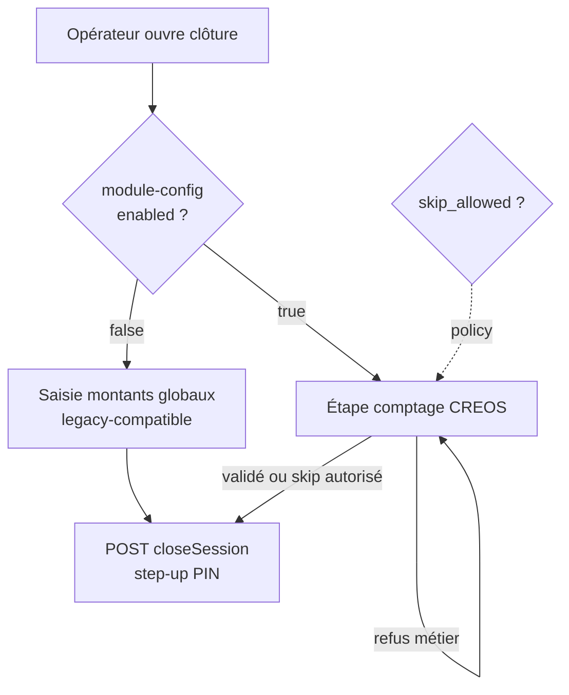
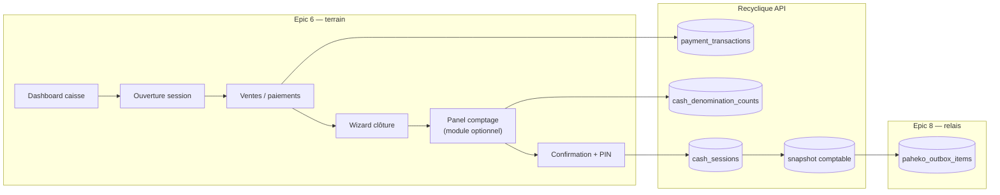
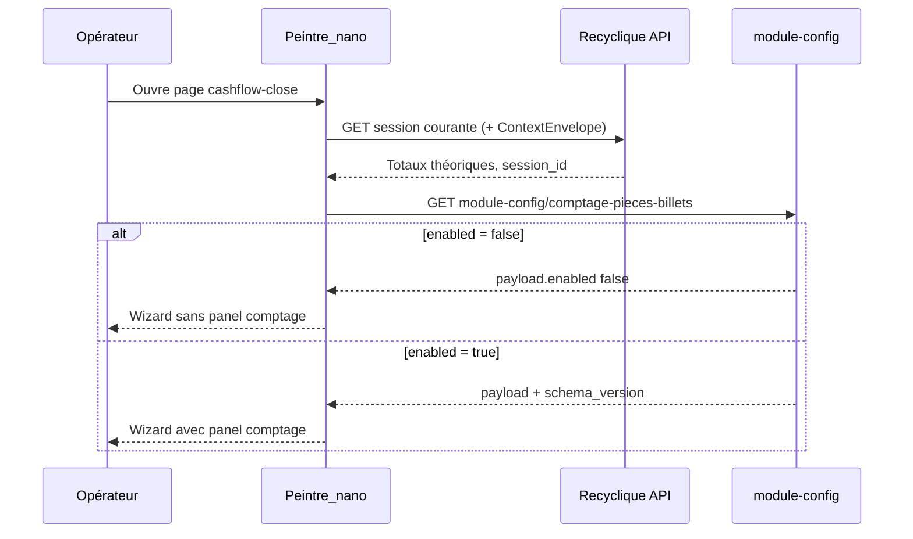
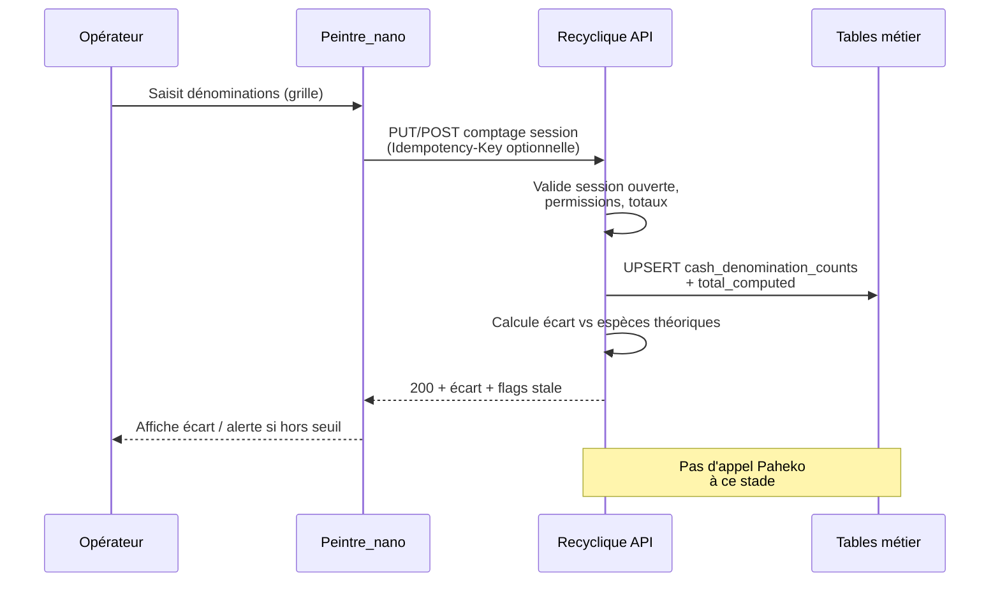
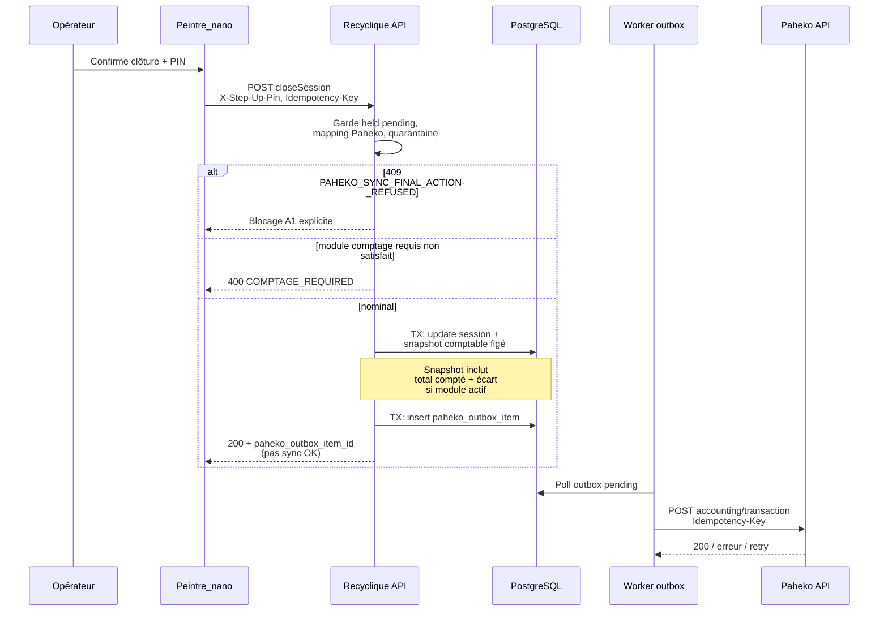
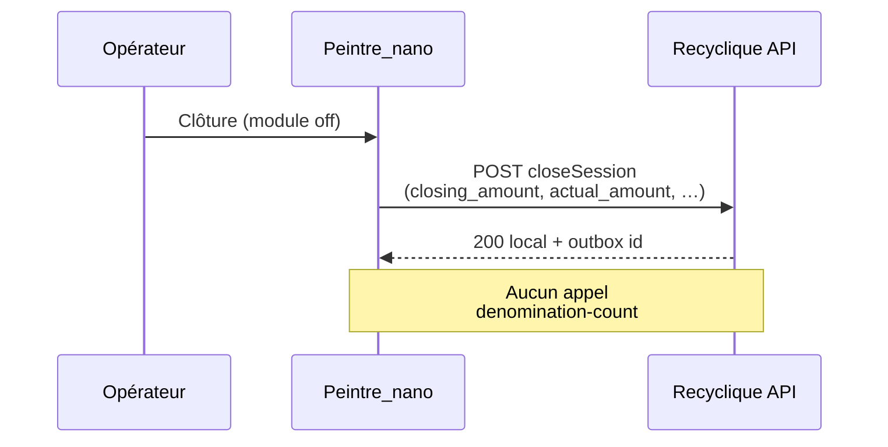

# 08 — Exemple pilote #2 : comptage pièces / billets (clôture caisse)

**Statut :** fiche normative du pack `references/protocole-modules-recyclique/` — **sans implémentation**  
**Date :** 2026-05-20  
**Audience :** architecte externe, agents BMAD, développeurs back/front — lecture autonome après le cookbook (`06`) et le registre (`05`)  
**Identifiant :** `module_key` = **`comptage-pieces-billets`** · type = **workflow-step** (pilote protocole #2)

**Prérequis pack :** [`05-MOD-registre-module-key.md`](05-MOD-registre-module-key.md) §5.4 · [`02-MOD-taxonomie-types-de-modules.md`](02-MOD-taxonomie-types-de-modules.md) §4.5 · [`03-MOD-protocole-backend.md`](03-MOD-protocole-backend.md) §13 · [`04-MOD-protocole-front-creos.md`](04-MOD-protocole-front-creos.md) §8.2 · [`06-MOD-cookbook-nouveau-module-optionnel.md`](06-MOD-cookbook-nouveau-module-optionnel.md) (brouillon normatif livré ; checklist §10 dérivée des protocoles 03/04)

**Question architecte :** T-MET-1 — [`references/dossier-architecte-externe-v2/07-ARCH-todos-et-questions-architecte.md`](../dossier-architecte-externe-v2/07-ARCH-todos-et-questions-architecte.md)

---

## 1. Objet de cette fiche

Cette fiche **valide le protocole modules** sur un cas réel distinct du pilote #1 (bandeau live / slice CREOS) :

| Dimension | Pilote #1 `kpi-live-banner` | Pilote #2 `comptage-pieces-billets` |
|-----------|----------------------------|-------------------------------------|
| Type taxonomique | Slice CREOS transverse | **Workflow step** dans le domaine caisse |
| Persistance métier | Agrégats lecture + JSON config UI | **Tables SQL** (dénominations, totaux) |
| Impact Paheko | Aucun (exploitation) | **Oui** — alimente snapshot / batch session |
| Epic pivot | Epic 4 | **Epic 6** (clôture) + relais **Epic 8** |
| Statut produit | Obligatoire v2 (bandeau) + preuve chaîne | **Optionnel par site** |

**Ce document décrit :**

1. Où insérer l’étape **comptage** dans le flow **clôture caisse** sans casser la parité legacy brownfield.  
2. Quoi persister dans **Recyclique** (tables vs JSON ADR-001).  
3. Comment la donnée rejoint la **chaîne comptable canonique** → outbox → Paheko.  
4. Une **checklist dérivée** du cookbook (phases unifiées back + front + contrats + activation).  

**Hors périmètre :** code, migrations Alembic, stories BMAD détaillées, schémas JSON publiés, fusion OpenAPI dans `contracts/` (post-HITL Strophe).

---

## 2. Règle `refs_first`

| Règle | Application |
|-------|-------------|
| **Vérité produit** | `_bmad-output/planning-artifacts/epics.md` (Epic 6 stories **6.7**, **6.9**, **6.10** ; FR57 ; UX-DR9) — **cité, non recopié**. |
| **Compta / sync** | [`references/dossier-architecte-externe-v2/04-ARCH-integration-paheko-compta-sync.md`](../dossier-architecte-externe-v2/04-ARCH-integration-paheko-compta-sync.md) ; [`references/migration-paheko/2026-04-15_prd-recyclique-caisse-compta-paheko.md`](../migration-paheko/2026-04-15_prd-recyclique-caisse-compta-paheko.md). |
| **Legacy caisse** | [`references/migration-paheko/audits/audit-caisse-recyclic-1.4.4.md`](../migration-paheko/audits/audit-caisse-recyclic-1.4.4.md) ; [`references/migration-paheko/audits/matrice-correspondance-caisse-poids.md`](../migration-paheko/audits/matrice-correspondance-caisse-poids.md). |
| **Contrats existants** | `contracts/openapi/recyclique-api.yaml` (`recyclique_cashSessions_closeSession`) ; `contracts/creos/manifests/page-cashflow-close.json`. |
| **Registre module** | [`05-MOD-registre-module-key.md`](05-MOD-registre-module-key.md) §5.4. |

Toute **promotion** (nouvelle story, extension OpenAPI, schéma `comptage-pieces-billets.v1.json`) reste **post-validation HITL** de cette fiche.

---

## 3. Intention métier et parité legacy

### 3.1 Besoin terrain

À la **fermeture de session caisse**, l’opérateur doit pouvoir :

- Saisir le **comptage physique** des espèces par **dénomination** (pièces et billets — référentiel national documenté côté association, cf. annexes réunion 2025-12-05).  
- Obtenir un **total compté** comparable aux agrégats **théoriques** issus de `payment_transactions` (espèces).  
- Documenter un **écart** (`variance`) et un commentaire si la politique locale l’exige.  
- **Clôturer localement** même si Paheko est indisponible (terrain d’abord) ; la sync compta reste **différée** via outbox (Epic 8).

Le module est **optionnel par site** : certaines ressourceries n’activent pas le détail pièces/billets et conservent une clôture « montant global » (parité minimale legacy 1.4.4).

### 3.2 Parité RecyClique 1.4.4 (brownfield)

L’audit legacy documente une clôture par **`POST /v1/cash-sessions/{id}/close`** avec `closing_amount`, `actual_amount`, `variance_comment` — **sans** API dédiée « grille de dénominations » dans le périmètre 1.4.4 listé.

| Capacité | Legacy 1.4.4 | Cible v2 avec module activé |
|----------|--------------|-----------------------------|
| Clôture session | Oui — montants globaux | Oui — **inchangé** comme action finale |
| Comptage par dénomination | Non documenté en API | **Extension** workflow step + tables |
| Sync Paheko session | Push plugin / batch (matrice) | Chaîne **snapshot → builder → outbox** (v2) |

**Règle de parité :** si `comptage-pieces-billets` est **désactivé** pour le `site_id`, le parcours doit rester **équivalent utilisateur** à la clôture legacy (montants globaux, pas d’étape fantôme bloquante). Si le module est **activé**, l’étape comptage s’insère **avant** la mutation `closeSession` ; l’équivalence legacy se lit sur le **résultat de clôture** (totaux + écart), pas sur l’écran intermédiaire.

### 3.3 Alignement Epic 6 (caisse v2)

| Story | Lien avec ce pilote |
|-------|---------------------|
| **6.7** | Clôture locale exploitable — **hôte** du flow ; le comptage **enrichit** la saisie, ne remplace pas la sémantique de clôture |
| **6.9** | Distinction **enregistrement local** / sync différée / blocage réel — l’UI du comptage ne doit pas afficher « compta OK » |
| **6.10** | Validation exploitabilité — scénarios avec module on/off |
| **6.3** | Tickets `held` → **400** `CASH_SESSION_CLOSE_HELD_PENDING` **avant** clôture (garde inchangée) |

**Frontière Epic 6 / Epic 8 :** Epic 6 porte l’**UX et la persistance locale** du comptage ; Epic 8 porte l’**articulation Paheko** (builder, outbox, quarantaine, 409 A1). Ce pilote **documente le raccord** sans dupliquer les stories 8.x.

---

## 4. Identité module et activation

### 4.1 `module_key` et registre

| Champ | Valeur |
|-------|--------|
| **`module_key`** | `comptage-pieces-billets` |
| **Type** | workflow-step |
| **Statut produit** | **optionnel** (pilote #2 protocole) |
| **Registre serveur** | **réservé** (liste blanche — [`05-MOD-registre-module-key.md`](05-MOD-registre-module-key.md)) |
| **Dépendance `module_key`** | Domaine **`cashflow`** implicite (session caisse ouverte) — pas de dépendance sur `kpi-live-banner` |

### 4.2 Config UI (ADR-001) — périmètre **étroit**

**Ne pas** stocker les lignes de comptage dans le `payload` JSON générique (`ModuleConfigDocument`).

| Propriété `payload` proposée (HITL) | Type | Rôle |
|-------------------------------------|------|------|
| `enabled` | boolean | Module actif pour le site |
| `skip_allowed` | boolean | Autoriser une clôture sans comptage détaillé (si politique locale) |
| `require_denomination_grid` | boolean | Forcer la grille complète vs saisie totale seule |

**Schéma cible :** `references/config-modules-site-id/schemas/comptage-pieces-billets.v1.json` *(à créer post-HITL)*.

**Lecture :** `GET/PATCH /v1/sites/{site_id}/module-config/comptage-pieces-billets` — brouillon [`openapi-module-config.yaml`](../config-modules-site-id/openapi-module-config.yaml).

### 4.3 Skip gracieux (feature module)

| État | Comportement attendu |
|------|---------------------|
| Module **off** | Flow clôture **sans** panel comptage ; parité 1.4.4 sur montants globaux |
| Module **on**, `skip_allowed: false` | Panel **obligatoire** ; backend refuse `close` sans enregistrement comptage |
| Module **on**, `skip_allowed: true` | Panel affiché ; action « passer » **tracée** (audit) |

**À trancher HITL :** le défaut produit (`skip_allowed` true/false) pour les sites pilotes terrain.

---

## 5. Insertion dans le flow clôture caisse (Peintre / CREOS)

### 5.1 Artefacts UI existants (instantané repo)

| Artefact | Rôle |
|----------|------|
| `page_key` **`cashflow-close`** | Page clôture — [`contracts/creos/manifests/page-cashflow-close.json`](../../contracts/creos/manifests/page-cashflow-close.json) |
| Widget **`cashflow-close-wizard`** | `FlowRenderer` multi-panels (Story 6.7) |
| Permission | `caisse.access` · `requires_site: true` |

**Décision d’insertion recommandée (brouillon) :** **étendre** le wizard `cashflow-close` avec un **panel dédié** `comptage-pieces-billets` — **pas** une nouvelle `page_key` — pour conserver une URL / alias runtime unique et éviter la fragmentation kiosque (Epic 6 : workflow continu).

### 5.2 Ordre des panels (proposition)

| # | Panel | Criticité | `operationId` (famille) |
|---|-------|-----------|-------------------------|
| 1 | Récap session / totaux théoriques | `critical: true` | `recyclique_cashSessions_getCurrent` (ou équivalent session) |
| 2 | **Comptage pièces/billets** *(si module on)* | `critical: true` | *À créer* — ex. `recyclique_cashSessions_upsertDenominationCount` |
| 3 | Écart / commentaire / confirmation | `critical: true` | Lecture écart calculée serveur |
| 4 | Step-up PIN + clôture | `critical: true` | **`recyclique_cashSessions_closeSession`** |

**Garde métier :** le panel 2 n’est monté que si le backend signale `module_enabled: true` (fusion manifeste ou champ session — **à figer** ; éviter la seule lecture `localStorage`).

### 5.3 Diagramme — flow opérateur (nominal)

---

## 6. Diagrammes de séquence

### 6.1 Lecture config + montage du flow

### 6.2 Saisie et persistance du comptage (brouillon contrat)

**Proposition d’`operationId` (non figé) :**

| Opération | Méthode / chemin (brouillon) | Rôle |
|-----------|------------------------------|------|
| `recyclique_cashSessions_getDenominationCount` | `GET /v1/cash-sessions/{id}/denomination-count` | Lire brouillon / final |
| `recyclique_cashSessions_upsertDenominationCount` | `PUT /v1/cash-sessions/{id}/denomination-count` | Enregistrer grille |
| `recyclique_cashSessions_validateDenominationCount` | `POST .../denomination-count/validate` | Verrouiller avant close *(optionnel HITL)* |

Alternative : **sous-ressource** unique + champ `status: draft|locked` — éviter la prolifération d’`operationId` (cf. [`03-MOD-protocole-backend.md`](03-MOD-protocole-backend.md) §13 P2.3).

### 6.3 Clôture locale et handoff outbox (existant + extension)

**Références contrat existant :** `recyclique_cashSessions_closeSession` — stories **8.1**, **8.5**, **8.6** dans `recyclique-api.yaml` (description inline).

### 6.4 Module désactivé — chemin parité legacy

---

## 7. Persistance Recyclique — tables métier vs JSON

### 7.1 Règle ADR-001 (rappel)

| Donnée | Stockage | Justification |
|--------|----------|---------------|
| Activation site, skip autorisé | JSON `module_key` | Config UI, faible cardinalité |
| Lignes dénomination × quantité | **Tables SQL** | Volume, contraintes, audit, jointures snapshot |
| Totaux de clôture officiels | `cash_sessions` + **snapshot** | Immuabilité post-clôture |
| Écritures Paheko | `paheko_outbox_items` + sous-écritures | Chaîne Epic 8 |

Source : [`07-MOD-adr-reconciliation-v01-v02.md`](07-MOD-adr-reconciliation-v01-v02.md) §7 ; tension **#2** dossier architecte ch. 07.

### 7.2 Modèle de données proposé (spec domaine — sans migration)

**Table `cash_denomination_counts` (nom indicatif)**

| Colonne | Type | Description |
|---------|------|-------------|
| `id` | UUID | Clé |
| `cash_session_id` | UUID FK | Session non clôturée |
| `site_id` | UUID | Garde membership |
| `denomination_code` | string | Référentiel national normalisé (ex. `EUR_2`, `EUR_500`) |
| `quantity` | integer | Nombre de pièces/billets |
| `unit_value_cents` | integer | Valeur faciale (évite float) |
| `recorded_at` | timestamptz | Horodatage saisie |
| `recorded_by_user_id` | UUID | Opérateur |

**Contraintes attendues :**

- Unicité `(cash_session_id, denomination_code)` en brouillon actif.  
- Refus d’écriture si `cash_sessions.status = closed`.  
- `quantity >= 0` ; plafond par dénomination *(à définir — anti-abus)*.

**Vue / agrégat :** `total_counted_cash_cents = SUM(quantity * unit_value_cents)` — calcul **serveur**, jamais seulement client.

**Lien écart :** comparer `total_counted_cash_cents` à l’agrégat espèces issu de `payment_transactions` pour la session — aligner les champs `actual_amount` / `variance` existants sur [`audit-caisse-recyclic-1.4.4.md`](../migration-paheko/audits/audit-caisse-recyclic-1.4.4.md).

### 7.3 Snapshot comptable (extension sémantique)

À la clôture, le **snapshot figé** (chaîne canonique ch. 04 dossier architecte) doit pouvoir porter :

| Champ snapshot (conceptuel) | Source |
|----------------------------|--------|
| `cash_counted_total_cents` | Agrégat comptage |
| `cash_theoretical_total_cents` | `payment_transactions` |
| `variance_cents` | Différence |
| `denomination_breakdown_revision` | Hash ou version grille |
| `accounting_config_revision_id` | Déjà requis v2 |

Le **builder Paheko** consomme le snapshot — **pas** une relecture ad hoc des tables de comptage après clôture.

---

## 8. Chaîne Paheko — écritures et idempotence

### 8.1 Principes (hérités migration-paheko)

| Principe | Application au comptage |
|----------|-------------------------|
| **Terrain d’abord** | Comptage + clôture **locaux** réussissent si Paheko down |
| **Granularité** | Comptabilisation **par session clôturée** (batch), pas par ligne de dénomination |
| **Pas de second rail** | Le comptage **enrichit** le snapshot ; il ne crée pas un export API parallèle |
| **Blocage A1** | Mapping clôture absent ou outbox quarantaine → **409** avant `close` (Story 8.6) |

### 8.2 Impact sur les sous-écritures batch

La stratégie **B** (jusqu’à trois sous-écritures par session — dossier architecte ch. 04 §4.3) reste valide :

| Sous-écriture | Contenu | Lien comptage |
|---------------|---------|---------------|
| 1 — Ventes + dons | ADVANCED multi-lignes par moyen de paiement | Montants espèces **débit** alignés sur total compté ou théorique selon politique d’écart |
| 2 — Remboursements N | REVENUE | Inchangé |
| 3 — Remboursements N-1 clos | REVENUE compte 672 | Inchangé |

**Point ouvert (T-MET-1 / architecte) :** en cas d’**écart espèces** non nul, la ventilation Paheko passe-t-elle par :

- **A)** un compte d’écart de caisse paramétré (`PahekoCashSessionCloseMapping`) ;  
- **B)** ajustement de la ligne espèces du bloc 1 uniquement ;  
- **C)** sous-écriture d’écart dédiée (4ᵉ POST) — **à rejeter** sauf validation expert-comptable (évite la prolifération).

**Idempotence :** réutiliser le batch session `idempotency_key` + sous-clés stables ; le comptage **ne crée pas** de message outbox séparé avant la clôture.

### 8.3 Référentiel dénominations

| Source | Usage |
|--------|-------|
| Document association / gouvernement | Liste normée nationale (cité CR 2025-12-05) |
| Recyclique | Table référentiel `denominations` *(à créer)* ou enum versionnée |
| Paheko | **Pas** de saisie pièces/billets côté plugin POS pour ce flux — Recyclique reste autorité terrain |

---

## 9. Contrats et gouvernance (CREOS / OpenAPI)

### 9.1 Règles B4 (non négociables)

| ID | Règle |
|----|-------|
| **B4.1** | Chaque panel critique du wizard expose un `data_contract.operation_id` **identique** à l’OpenAPI |
| **B4.2** | `recyclique_cashSessions_closeSession` **reste** l’`operationId` de clôture — pas de rename |
| **B4.3** | Pas de règle métier d’écart calculée uniquement dans Peintre |
| **B4.4** | Pas d’appel Paheko depuis le navigateur |

Source : [`references/artefacts/2026-04-02_04_gouvernance-contractuelle-openapi-creos-contextenvelope.md`](../artefacts/2026-04-02_04_gouvernance-contractuelle-openapi-creos-contextenvelope.md).

### 9.2 Extensions CREOS attendues (checklist contrats)

| Artefact | Action |
|----------|--------|
| `page-cashflow-close.json` | Documenter le panel comptage dans le widget `cashflow-close-wizard` *(props / flowId)* |
| Nouveau catalogue ou extension | `widgets-catalog-cashflow-close.json` *(si séparation)* |
| Tests contrat | `peintre-nano/tests/contract/creos-cashflow-close-*.test.ts` *(pattern 4-1)* |

### 9.3 Codes d’erreur proposés (domaine caisse)

| Code HTTP | `code` métier | Cas |
|-----------|---------------|-----|
| 400 | `COMPTAGE_DENOMINATION_REQUIRED` | Module on, skip interdit, grille vide |
| 400 | `CASH_SESSION_CLOSE_HELD_PENDING` | Existant — tickets en attente |
| 409 | `PAHEKO_SYNC_FINAL_ACTION_REFUSED` | Existant — politique A1 |
| 409 | `IDEMPOTENCY_KEY_CONFLICT` | Existant — close rejoué avec corps différent |
| 403 | — | Permission caisse / step-up manquant |

---

## 10. Checklist dérivée du cookbook (phases unifiées)

Le livrable [`06-MOD-cookbook-nouveau-module-optionnel.md`](06-MOD-cookbook-nouveau-module-optionnel.md) enchaîne les protocoles **03** (back) et **04** (front) — **livré** (brouillon normatif). Pour **`comptage-pieces-billets`**, la dérivation ci-dessous est **spécifique workflow-step + Paheko** — **annexe** du cookbook (pilote #2, sans implémentation dans ce pack).

### Phase 0 — Cadrage et registre

| # | Critère | Référence pack |
|---|---------|----------------|
| 0.1 | Décision écrite : type **workflow-step**, statut **optionnel** | Cette fiche §4 · `05` §5.4 |
| 0.2 | Entrée registre `module_key` + dépendance `cashflow` | `05` §3, §7 |
| 0.3 | Question HITL `skip_allowed` documentée | §4.3 · T-MET-1 |

### Phase A — Contrats métier et OpenAPI

| # | Critère | Référence |
|---|---------|-----------|
| A.1 | Spec signaux : dénominations, totaux, écart, nullabilité | §7 · artefact à créer post-HITL |
| A.2 | Nouveaux `operationId` sous `/v1/cash-sessions/` | §6.2 · `03` §13 P2.3 |
| A.3 | Extension description `closeSession` : précondition comptage | `recyclique-api.yaml` |
| A.4 | `npm run generate` + tests contrat | `contracts/README.md` |
| A.5 | CREOS : `operation_id` alignés caractère pour caractère | `04` §5 |

### Phase B — Backend service et persistance

| # | Critère | Référence |
|---|---------|-----------|
| B.1 | Tables métier + migrations Alembic | §7.2 · `03` §13 P2.1 |
| B.2 | Service : calcul écart, garde session ouverte | `03` §5 |
| B.3 | Membership `site_id` sur toutes les mutations | ADR-001 livrable normatif |
| B.4 | Participation snapshot → builder → outbox | §8 · `03` §13 P2.2 |
| B.5 | Step-up PIN sur `closeSession` (existant) — comptage selon sensibilité | `03` §13 P2.4 |
| B.6 | Tests pytest : module on/off, skip, held, 409 A1 | Epic 6.7 / 8.6 |

### Phase C — Front CREOS et FlowRenderer

| # | Critère | Référence |
|---|---------|-----------|
| C.1 | Panel dans `cashflow-close-wizard`, pas page orpheline | §5 · `04` §8.1 |
| C.2 | `data_contract.critical: true` sur totaux + comptage | Epic 6.1 AC |
| C.3 | Blocage paiement/clôture si `DATA_STALE` | `04` §7 · PRD §10 |
| C.4 | Copy : local enregistré ≠ sync Paheko OK | Story 6.9 |
| C.5 | Activation : `module-config` autoritaire, pas `localStorage` | `04` §9 |

### Phase D — Activation `site_id` / Story 9.6

| # | Critère | Référence |
|---|---------|-----------|
| D.1 | Schéma `comptage-pieces-billets.v1.json` publié | `config-modules-site-id/schemas/` |
| D.2 | Panneau SuperAdmin « Gestion des modules » | Epic Story **9.6** |
| D.3 | Merge manifest build + surcharge PostgreSQL (AR45) | ADR Peintre P1/P2 |
| D.4 | Audit : qui active/désactive le module | Livrable normatif §3 |

### Phase E — Recette et handoff

| # | Critère | Référence |
|---|---------|-----------|
| E.1 | Parité legacy avec module **off** (localhost:4445 + v2) | Epic 11 rule / guide pilotage |
| E.2 | Scénario module **on** : grille → écart → close → outbox pending | §6.3 |
| E.3 | Matrice erreurs visible (409 A1 vs 200 pending) | Story 6.9 |
| E.4 | Rapport gaps pour architecte (T-MET-1) | [`09-MOD-lacunes-et-questions-ouvertes.md`](09-MOD-lacunes-et-questions-ouvertes.md) |

### Phase E bis — Recette HITL **Q-HITL-09 à 12** (T-MET-1)

Matrice de **recette documentaire** avant stories BMAD — inventaire complet : [`09-MOD-lacunes-et-questions-ouvertes.md`](09-MOD-lacunes-et-questions-ouvertes.md) §5.3 · pont exécutable : [`22-MOD-dossier-architecte-pont-t-mod.md`](22-MOD-dossier-architecte-pont-t-mod.md) (**T-MET-1**).

| ID HITL | Objet à trancher | Critère de recette (fiche / démo) | Epic 6 (`epics.md`) | `migration-paheko/` / architecte |
|---------|------------------|-----------------------------------|---------------------|----------------------------------|
| **Q-HITL-09** | Insertion panel comptage dans **wizard clôture** sans casser parité legacy | Module **off** : wizard équivalent clôture 1.4.4 (montants globaux, pas d’étape fantôme) · Module **on** : panel dans `cashflow-close-wizard` **avant** `closeSession` (§5.1–5.2) | **6.7** (clôture locale exploitable) · **6.3** (garde `held` avant close) | [`audits/audit-caisse-recyclic-1.4.4.md`](../migration-paheko/audits/audit-caisse-recyclic-1.4.4.md) · [`audits/matrice-correspondance-caisse-poids.md`](../migration-paheko/audits/matrice-correspondance-caisse-poids.md) |
| **Q-HITL-10** | Écritures Paheko (batch session, écart espèces, idempotence) | Clôture locale **200** + `paheko_outbox_item_id` **sans** « compta OK » UI · snapshot enrichi si module actif (§7.3, §8) · pas de 4ᵉ POST d’écart sans validation expert-comptable (§8.2 C) | **6.7** hôte · relais **Epic 8** (builder, 409 A1) | [`2026-04-15_prd-recyclique-caisse-compta-paheko.md`](../migration-paheko/2026-04-15_prd-recyclique-caisse-compta-paheko.md) · ch. 04 dossier architecte |
| **Q-HITL-11** | Module **optionnel** : skip vs blocage | Parcours §4.3 (module off / on + `skip_allowed`) démontré en recette · audit si « passer » autorisé | **6.9** (local ≠ sync OK) · **6.10** (exploitabilité on/off) | — |
| **Q-HITL-12** | Schéma JSON config `comptage-pieces-billets` | Payload **étroit** : `enabled`, `skip_allowed`, `require_denomination_grid` (§4.2) — **pas** lignes dénomination en JSON (§7.1) | — (Story **9.6** pour panneau modules) | ADR-001 · stub : [`18-MOD-config-modules-crosswalk.md`](18-MOD-config-modules-crosswalk.md) |

**Gate BMAD :** ne pas `create-story` comptage dédié **avant** réponses **Q-HITL-09 à 11** (minimum) — cf. [`09`](09-MOD-lacunes-et-questions-ouvertes.md) §6 **T-MET-1** · Epic 6 **done** au sprint = socle caisse, **pas** ce module optionnel.

**Sources Epic 6 (lecture `refs_first`) :** [`_bmad-output/planning-artifacts/epics.md`](../../_bmad-output/planning-artifacts/epics.md) — Epic 6 intro, stories **6.7**, **6.9**, **6.10** ; FR57 · UX-DR9.

---

## 11. Comparaison avec le pilote #1 (bandeau live)

| Critère | Pilote #1 | Pilote #2 (cette fiche) |
|---------|-----------|-------------------------|
| Preuve chaîne §4.2 | Oui — Epic 4 complet | **Étend** la preuve aux **workflow steps** + tables + outbox |
| JSON ADR-001 seul suffisant ? | Oui (préférences) | **Non** — config seulement pour flags |
| Outbox Paheko | Non | **Oui** — via snapshot session |
| Mock final autorisé ? | Non (obligatoire v2) | Non pour sites avec module activé |
| Story template | `4-1` … `4-6b` | **6.7** + extension + **8.x** |

**Conclusion protocole :** le pilote #1 **ne suffit pas** comme seul template pour les modules métier à étape (dossier architecte ch. 07) — d’où cette fiche T-MET-1.

---

## 12. Questions ouvertes (HITL Strophe / architecte)

**Recette pack :** §10 **Phase E bis** (matrice **Q-HITL-09 à 12**) · inventaire global [`09-lacunes`](09-MOD-lacunes-et-questions-ouvertes.md) §5.3.

| ID | Question | Impact | Lien HITL pack |
|----|----------|--------|----------------|
| **Q1** | `skip_allowed` par défaut ? | Opérabilité terrain vs rigueur compta | **Q-HITL-11** |
| **Q2** | Ventilation Paheko des écarts espèces (§8.2 A/B/C) | Builder + mappings super-admin | **Q-HITL-10** |
| **Q3** | Verrouillage comptage (`draft` / `locked`) avant close ? | Nombre d’`operationId` | *(hors 09–12 — note fiche)* |
| **Q4** | Référentiel dénominations : table nationale fixe vs config site ? | DDL vs JSON partial | *(hors 09–12 — note fiche)* |
| **Q5** | Même protocole pour **ouverture** fond de caisse détaillé ? | Hors scope v1 — post-v2 ? | — |
| **Q6** | Signal `module_enabled` : snapshot, session GET, ou manifest fusion ? | UX latence | *(hors 09–12 — note fiche)* |

Réponses attendues dans la revue architecte ([`07-ARCH-todos-et-questions-architecte.md`](../dossier-architecte-externe-v2/07-ARCH-todos-et-questions-architecte.md) livrable #3) · pont [`22-MOD-dossier-architecte-pont-t-mod.md`](22-MOD-dossier-architecte-pont-t-mod.md) (**T-MET-1**).

---

## 13. Critères de succès de la fiche (chantier protocole)

| # | Critère |
|---|---------|
| 1 | Un lecteur comprend **où** l’étape vit dans `cashflow-close` sans lire quinze dossiers |
| 2 | La distinction **JSON config vs tables métier** est **non ambiguë** |
| 3 | Les séquences **ne contournent pas** `closeSession` ni la chaîne outbox |
| 4 | La checklist §10 est **actionnable** pour rédiger la story d’implémentation |
| 5 | Les questions §12 sont **explicites** pour arbitrage HITL |

---

## 14. Inventaire `refs_first`

### BMAD planning

| Document | Usage |
|----------|--------|
| [`_bmad-output/planning-artifacts/epics.md`](../../_bmad-output/planning-artifacts/epics.md) | Epic 6 (6.7, 6.9, 6.10), Epic 8 (relai), FR57 |
| [`_bmad-output/planning-artifacts/prd.md`](../../_bmad-output/planning-artifacts/prd.md) | §4.2 chaîne modulaire, §10 états widgets |

### Pack protocole modules

| Document | Usage |
|----------|--------|
| [`index.md`](index.md) | Pilotes #1 / #2 |
| [`02-MOD-taxonomie-types-de-modules.md`](02-MOD-taxonomie-types-de-modules.md) | §4.5 workflow step |
| [`03-MOD-protocole-backend.md`](03-MOD-protocole-backend.md) | §13 checklist additive |
| [`04-MOD-protocole-front-creos.md`](04-MOD-protocole-front-creos.md) | §8.2 workflow step |
| [`05-MOD-registre-module-key.md`](05-MOD-registre-module-key.md) | §5.4 |
| [`07-MOD-adr-reconciliation-v01-v02.md`](07-MOD-adr-reconciliation-v01-v02.md) | Config vs métier |

### Dossier architecte et migration Paheko

| Document | Usage |
|----------|--------|
| [`04-ARCH-integration-paheko-compta-sync.md`](../dossier-architecte-externe-v2/04-ARCH-integration-paheko-compta-sync.md) | Chaîne 5 étapes, outbox, 409 A1 |
| [`03-ARCH-backend-recyclique-api-donnees.md`](../dossier-architecte-externe-v2/03-ARCH-backend-recyclique-api-donnees.md) | Modèle session / snapshot |
| [`07-ARCH-todos-et-questions-architecte.md`](../dossier-architecte-externe-v2/07-ARCH-todos-et-questions-architecte.md) | T-MET-1, tensions #2–#5 |
| [`2026-04-15_prd-recyclique-caisse-compta-paheko.md`](../migration-paheko/2026-04-15_prd-recyclique-caisse-compta-paheko.md) | Outbox §8.4, limites périmètre |
| [`audits/audit-caisse-recyclic-1.4.4.md`](../migration-paheko/audits/audit-caisse-recyclic-1.4.4.md) | Parité clôture legacy |
| [`audits/matrice-correspondance-caisse-poids.md`](../migration-paheko/audits/matrice-correspondance-caisse-poids.md) | Session 1:1, clôture + comptage |

### Contrats repo

| Document | Usage |
|----------|--------|
| [`contracts/openapi/recyclique-api.yaml`](../../contracts/openapi/recyclique-api.yaml) | `recyclique_cashSessions_closeSession` |
| [`contracts/creos/manifests/page-cashflow-close.json`](../../contracts/creos/manifests/page-cashflow-close.json) | Page clôture |
| [`references/config-modules-site-id/ADR-001-*.md`](../config-modules-site-id/ADR-001-configuration-modules-json-par-site.md) | God-namespace |

---

## 15. Prochaine lecture

| Profil | Suite |
|--------|--------|
| Implémentation | Rédiger story BMAD à partir de §10 · puis `06-cookbook` |
| Architecte | Répondre §12 · mettre à jour `09-MOD-lacunes-et-questions-ouvertes.md` |
| Product | Prioriser module optionnel vs Story 9.6 |

---

_Fiche pilote #2 — protocole modules Recyclique. Sans implémentation ; promotion contrats et stories post-HITL. Dernière révision : 2026-05-20._
