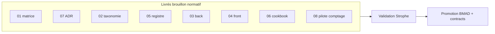

# 09 — Lacunes et questions ouvertes — protocole modules Recyclique

**Statut :** document de clôture chantier rédactionnel (Phase E)  
**Date :** 2026-05-20  
**Audience :** Strophe (HITL), architecte, agents Cursor, développeurs  
**Rôle :** inventaire des **lacunes résiduelles**, **questions à trancher humainement**, suivi **TODO T-MOD-*** / **T-MET-1** / **T-PEINT-1**, et **promotion BMAD différée** — sans recopier le PRD ni les stories.

**Prérequis :** parcours pack [`index.md`](index.md) ; ce fichier se lit **après** les brouillons `01`–`07` et **avant** toute promotion vers `_bmad-output/` ou `contracts/`.

**Stratégie `refs_first` :** les chemins `_bmad-output/planning-artifacts/` et `_bmad-output/implementation-artifacts/` sont des **sources de lecture** ; la norme exécutable n’est **pas** dupliquée ici.

---

## 1. Synthèse exécutive

| Constats (2026-05-20) | Implication |
|------------------------|-------------|
| **Chaîne modulaire prouvée** sur le pilote bandeau live (Epic 4 **done** — cf. [`ou-on-en-est.md`](../ou-on-en-est.md), dossier architecte ch. 06) | Le modèle v2 tient ; l’enjeu est **l’industrialisation**, pas la preuve conceptuelle. |
| **Pack protocole** : livrables `01`–`08`, `09`, `prompt-agent` en **brouillon normatif** (2026-05-20) | Checklist unifiée : [`06-cookbook`](06-MOD-cookbook-nouveau-module-optionnel.md) ; lacunes résiduelles = impl., HITL, promotion BMAD (§3). |
| **ADR-007** | **Accepted** HITL 2026-05-20 — voir [`2026-05-20_06_reco-hitl-post-bouclage-modules-v2.md`](../artefacts/2026-05-20_06_reco-hitl-post-bouclage-modules-v2.md) et miroir BMAD `architecture/2026-05-20-adr-007-…`. |
| **Registre `module_key`** pack (`05`) — une seule clé avec schéma JSON publié (`kpi-live-banner`) | T-MOD-3 **livré** (OpenAPI + handler) ; T-MOD-5 = autres clés + schémas JSON |
| **Cinq epics BMAD encore `backlog`** (9, 10, 12, 20, 21) | Story **9.6**, **Epic 10** (CI CREOS), et modules métier **bloquent** une partie des lacunes ci-dessous. |

**Décision attendue de Strophe :** valider ou corriger les tableaux §4–§6, puis déclencher la **promotion ordonnée** §8 (ou reporter explicitement des lignes).

---

## 2. État des livrables du pack

**Vérité à cette date (2026-05-20) :** tous les livrables du pack sont **Livrés (brouillon normatif)** — voir [`index.md`](index.md) § ordre de lecture.

| Fichier | Statut réel | Lacune résiduelle |
|---------|-------------|-------------------|
| `index.md`, `00-MOD-cadrage-chantier.md` | Livrés | — |
| `00-MOD-plan-redaction-modules.md` | **Meta** (planificateur) | Hors statut livrable consommateur |
| `01-MOD-matrice-choix-modularite.md` | Livré (brouillon) | Promotion BMAD ; cohérence formelle avec ADR-007 |
| `07-MOD-adr-reconciliation-v01-v02.md` | Livré (**Accepted** 2026-05-20) | Q-HITL-07 annexe E si besoin |
| `02-MOD-taxonomie-types-de-modules.md` | Livré | — |
| `05-MOD-registre-module-key.md` | Livré | Schémas JSON manquants pour clés **réservées** (§3 + placeholders PRD §7) |
| `03-MOD-protocole-backend.md`, `04-MOD-protocole-front-creos.md` | Livrés | Précédence config multi-magasins (TODO explicite §8 `03`) |
| `06-MOD-cookbook-nouveau-module-optionnel.md` | **Livré** | Validation HITL ; recette agent optionnelle |
| `08-MOD-exemple-pilote-comptage-pieces-billets.md` | **Livré** | Implémentation et stories Epic 6 **post-HITL** |
| `09-MOD-lacunes-et-questions-ouvertes.md` | **Ce document** | — |
| `prompt-agent-chantier-modules.md` | Livré (optionnel) | — |

---

## 3. Lacunes résiduelles — tableau priorité

Priorité : **P0** = bloque agents / industrialisation ; **P1** = dette produit courte ; **P2** = post-v2 ou dépend d’un epic backlog.

**Pont exécutable (pack v2) :** lacunes **L-03…L-13** → [`22-MOD-dossier-architecte-pont-t-mod.md`](22-MOD-dossier-architecte-pont-t-mod.md) · [`15-MOD-matrice-gaps-bmad-story-9-6.md`](15-MOD-matrice-gaps-bmad-story-9-6.md). **Crosswalk config livré :** [`18-MOD-config-modules-crosswalk.md`](18-MOD-config-modules-crosswalk.md) — **L-04**, **L-06**, **L-08**.

| ID | Priorité | Lacune | Impact | Cible / owner documentaire | Pont `22` / pack v2 |
|----|----------|--------|--------|----------------------------|---------------------|
| ~~**L-01**~~ | — | ~~Absence `06-cookbook`~~ | **Clôturé** (2026-05-20) — livrable présent | [`06-MOD-cookbook-nouveau-module-optionnel.md`](06-MOD-cookbook-nouveau-module-optionnel.md) | — |
| ~~**L-02**~~ | — | ~~Absence `08-exemple-pilote`~~ | **Clôturé** (2026-05-20) — fiche rédigée ; impl. et HITL restent | [`08-MOD-exemple-pilote-comptage-pieces-billets.md`](08-MOD-exemple-pilote-comptage-pieces-billets.md) | — |
| **L-03** | — | ADR-007 **Accepted** 2026-05-20 ; crosswalk **livré** (`19`) | — | Clos HITL + promotion BMAD | [`22`](22-MOD-dossier-architecte-pont-t-mod.md) **T-MOD-2** |
| **L-04** | — | API `module-config` **fusionnée** dans `recyclique-api.yaml` (2026-05-20) ; codegen OK | — | Clos T-MOD-3 — standalone **DEPRECATED** | [`22`](22-MOD-dossier-architecte-pont-t-mod.md) **T-MOD-3** |
| **L-05** | — | Whitelist **`kpi-live-banner`** en code (`modules/module_config/registry.py`) + registre `05` ; tests `test_module_config_site.py` | — | Clos pilote ; etendre whitelist = **T-MOD-5** | [`22`](22-MOD-dossier-architecte-pont-t-mod.md) **T-MOD-5** |
| **L-06** | **P1** | Schémas JSON config absents (clés **réservées** + placeholders PRD §7 : `cashflow`, `reception`, `comptage-pieces-billets`, `helloasso`, `eco-organismes`, `adherents`, `synchronisation-paheko`, `config-admin-simple`) | Validation payload impossible | `config-modules-site-id/schemas/` · [`18`](18-MOD-config-modules-crosswalk.md) §7 | [`22`](22-MOD-dossier-architecte-pont-t-mod.md) **T-MOD-3** / **T-MOD-5** |
| **L-07** | **P1** | ~~**Précédence** `sites.configuration` vs JSON `module_key`~~ | **OK** doc — DEC-03 : JSON fait foi ([`03`](03-MOD-protocole-backend.md) §D.3.5, artefact 04 §C) | Clôture doc 2026-05-20 ; impl. merge UI = Story **9.6** | [`22`](22-MOD-dossier-architecte-pont-t-mod.md) **T-MOD-4** |
| **L-08** | **P1** | Toggle transitoire `bandeau_live_slice_enabled` + `PATCH bandeau-live-slice` | Deux chemins activation ; dette Epic 4.5 — **Gap (planifié)** | Story **9.6** (T-MOD-4) · [`18`](18-MOD-config-modules-crosswalk.md) §4 | [`22`](22-MOD-dossier-architecte-pont-t-mod.md) **T-MOD-4** |
| **L-09** | **P1** | ~~**Convention unique** enregistrement routes/services « module optionnel »~~ | **OK** doc — [`03`](03-MOD-protocole-backend.md) §6 C.4 (artefact 04 §B.1) | Clôture doc 2026-05-20 ; HITL **Q-HITL-06** avant promotion BMAD | [`22`](22-MOD-dossier-architecte-pont-t-mod.md) **T-MOD-1** |
| **L-10** | **P1** | **Slice header** vs **workflow step** : protocoles partiellement séparés (`04` §9 vs `02` §4.5) | Risque de modéliser clôture comme simple widget | [`08`](08-MOD-exemple-pilote-comptage-pieces-billets.md) · [`06`](06-MOD-cookbook-nouveau-module-optionnel.md) §10 | [`22`](22-MOD-dossier-architecte-pont-t-mod.md) **T-MET-1** |
| **L-11** | **P1** | **CI CREOS** (validation schémas manifests) — Epic 10 backlog | Règles + checklist merge : [`21-MOD-gouvernance-contrats-modules.md`](21-MOD-gouvernance-contrats-modules.md) §7–§8 ; **pipeline CI bloquant** = Epic 10 | Epic 10 ; `04` § CI ; [`21`](21-MOD-gouvernance-contrats-modules.md) **livré** | [`22`](22-MOD-dossier-architecte-pont-t-mod.md) — Epic **10** |
| **L-12** | **P2** | **Outbox SQL vs Redis Streams** pour transport Paheko (note PRD / ADR-007) | Libellé protocole `03` §7 ambigu sans ADR sync | `references/migration-paheko/` ; ADR archi hors pack | — (Q-HITL-04) |
| **L-13** | **P2** | **Tests interactions inter-modules** (bus, ordre activation) | Qualité long terme | Stories dédiées post-socle · [`06`](06-MOD-cookbook-nouveau-module-optionnel.md) | — ; post **9.6** |
| **L-14** | **P2** | **Marketplace / modules tiers** | Hors v2 ; interfaces à ne pas figer trop tôt | **Clôturé doc** (2026-05-20) — [`14-MOD-marketplace-post-v2-fiche-citation.md`](14-MOD-marketplace-post-v2-fiche-citation.md) ; source BMAD `post-v2-hypothesis-marketplace-modules.md` | — doc **clôturée** v2 |
| **L-15** | **P2** | **Framework plugins** Paheko + Recyclique (bundles) | Aucune solution retenue | Idée kanban — §10 | — ; lié **T-MOD-2** via **L-03** |
| **L-16** | **P1** | **Gardien du seuil** — conscience d'affichage Peintre (agent IA, validation ergonomie avant rendu dynamique) | Insertions widget/flow sans gate UX ; refactor coûteux si hooks tardifs | **T-PEINT-1** · idée Kanban · [`04`](04-MOD-protocole-front-creos.md) §17 · [`05-ARCH`](../dossier-architecte-externe-v2/05-ARCH-frontend-peintre-creos-contrats.md) §7.4 | [`22`](22-MOD-dossier-architecte-pont-t-mod.md) **T-PEINT-1** |

---

## 4. Tensions architecturales à trancher (reprise dossier architecte)

Aligné [`dossier-architecte-externe-v2/07-ARCH-todos-et-questions-architecte.md`](../dossier-architecte-externe-v2/07-ARCH-todos-et-questions-architecte.md) et consolidé par le pack.

| # | Tension | Options / état pack | Décision HITL attendue |
|---|---------|---------------------|-------------------------|
| **T-1** | **Double récit** v0.1 (TOML, `ModuleBase`, EventBus) vs v2 (CREOS, JSON, build-time) | Matrice `01` + ADR-007 : TOML UI **abandonné** ; principe async **conservé** | Valider ADR-007 **Accepted** ou lister exceptions |
| **T-2** | **Config UI** (JSON ADR-001) vs **données métier** (tables SQL) | `02` §6.3, `05` §5.4, ADR-007 §7 | Confirmer règle : comptage clôture **≠** god-namespace JSON |
| **T-3** | **Slice** dans header autre module vs **étape** de flow (clôture) | Deux protocoles : `04` (slice) + `08` livré (step) ; **pas-à-pas unifié** dans [`06-cookbook`](06-MOD-cookbook-nouveau-module-optionnel.md) : Phase 0 (arbre §0.2) → phases 1–8 **slice** ; [§10 cookbook](06-MOD-cookbook-nouveau-module-optionnel.md) + Phase 9 **workflow step** / Paheko — **ne pas** modéliser la clôture comme widget header seul | Valider **deux branches** cookbook (slice Epic 4 vs step pilote #2) — HITL **Q-HITL-09**–**11** · [`22`](22-MOD-dossier-architecte-pont-t-mod.md) **T-MET-1** |
| **T-4** | **Backend module optionnel** : convention routes / prefix OpenAPI / feature flag | `03` §6 checklist package ; pas de loader TOML | Valider pattern `api_v2` + registre `module_key` comme standard |
| **T-5** | **Paheko** : tout module à impact compta → **chaîne outbox** | `03` §7 ; dossier architecte ch. 04 | Liste modules v2 soumis à outbox (eco-org, clôture, HelloAsso, …) |
| **T-6** | **Couche « plateforme modules »** explicite vs séparation Recyclique / Peintre / CREOS / Paheko | Pack = protocole opérationnel, pas nouvelle couche runtime | Suffisant pour 5 ans ou epic plateforme dédié ? |
| **T-7** | **Registre central `module_key`** distinct des manifests CREOS | `05` = registre pack ; CREOS = structure UI | Un seul registre serveur + doc CREOS alignée — valider |

---

## 5. Questions HITL — Strophe

### 5.1 Plateforme et gouvernance

| ID | Question | Priorité | Références `refs_first` |
|----|----------|----------|-------------------------|
| **Q-HITL-01** | La séparation Recyclique / Peintre / CREOS / Paheko suffit-elle pour **5 ans d’extensions**, ou faut-il une couche « plateforme modules » explicite (catalogue, dépendances, version) ? | P1 | Dossier architecte ch. 07 ; `post-v2-hypothesis-marketplace-modules.md` |
| **Q-HITL-02** | Faut-il un **registre central** des `module_key` (statut, dépendances, version) **distinct** des manifests CREOS ? | P1 | `05-MOD-registre-module-key.md` ; Story 9.6 |
| **Q-HITL-03** | **Précédence** config — **clos** (DEC-03, HITL 2026-05-20) : JSON `module_key` fait foi | — | `03` §D.3.5 ; artefact `04` §C ; reco `06` |
| **Q-HITL-04** | **Outbox SQL** vs **Redis Streams** comme transport nominal Paheko — quel libellé imposer dans les protocoles `03` et la doc migration ? | P2 | PRD §5.1 ; ADR-007 ; `ou-on-en-est` (outbox hardening 2026-04-18) |

### 5.2 Modularité et protocole

| ID | Question | Priorité | Références `refs_first` |
|----|----------|----------|-------------------------|
| **Q-HITL-05** | Le pilote Epic 4 (bandeau) est-il un **template suffisant** pour les grands modules (eco-organismes), ou manque-t-il des briques (workflow step, tables métier) ? | **P0** | `02` §7 ; réponse pack : **oui pour slices**, **non pour workflow steps** — confirmer |
| **Q-HITL-06** | **Protocole unique** validé pour : créer module → activer par site → brancher UI + API + BDD + sync Paheko ? | **P0** | [`06-cookbook`](06-MOD-cookbook-nouveau-module-optionnel.md) — **validation HITL** ; T-MOD-1 quasi-clos |
| **Q-HITL-07** | **TOML backend-only** (métadonnées package Python) : autorisé ou **interdit** aussi ? | P1 | `01` §3.1 ; ADR-007 annexe A |
| **Q-HITL-08** | **Marketplace post-v2** : faut-il **isoler dès maintenant** des interfaces (états `listed` / `licensed`) dans les APIs config ? | P2 | `post-v2-hypothesis-marketplace-modules.md` §5 |

### 5.3 Cas fil rouge — comptage pièces/billets (T-MET-1)

| ID | Question | Priorité | Références `refs_first` |
|----|----------|----------|-------------------------|
| **Q-HITL-09** | Où placer l’étape dans le flow **clôture caisse** (Epic 6) sans casser la **parité legacy** ? | **P0** | [`08-exemple-pilote`](08-MOD-exemple-pilote-comptage-pieces-billets.md) ; `page-cashflow-close` CREOS ; Epic 6 `epics.md` |
| **Q-HITL-10** | Quelles **écritures Paheko** (batch session, sous-écritures) et quelle **idempotence** ? | **P0** | Dossier architecte ch. 04 ; `migration-paheko/` |
| **Q-HITL-11** | Module **optionnel** : `module_key` désactivé → **skip gracieux** de l’étape ou **blocage** clôture ? | **P0** | `05` §5.4 ; T-MET-1 |
| **Q-HITL-12** | Schéma JSON config pour `comptage-pieces-billets` : uniquement `{ enabled, skip_allowed }` ou plus ? | P1 | ADR-001 god-namespace |

### 5.4 Industrialisation et priorisation

| ID | Question | Priorité | Références `refs_first` |
|----|----------|----------|-------------------------|
| **Q-HITL-13** | Prioriser **Story 9.6** (config admin) vs **Epic 10** (CI CREOS) vs **acceptation ADR-007** ? | **P0** | `ou-on-en-est` (epics backlog 9, 10) ; T-MOD-2, T-MOD-4 |
| **Q-HITL-14** | **QA2** formelle du pack (modèle `config-modules-site-id/livrable-normatif-architecture.md`) — cycles 1–3 faits ; cycle 4 v2 **97 % GO** ; correctifs doc résiduels ? | P1 | [`qa2-rapport-final-v2.md`](qa2-rapport-final-v2.md) (cycle 4) · [`qa2-rapport-final.md`](qa2-rapport-final.md) (cycles 1–3) ; `00-cadrage` §9.3 |
| **Q-HITL-15** | Promotion **`05-registre`** vers contrat d’interface public (OpenAPI `tags: ModuleConfig`) : timing par rapport à T-MOD-3 ? | P1 | T-MOD-3, T-MOD-5 |
| **Q-HITL-16** | **Gardien du seuil** : quels hooks runtime v2 (bypass par défaut) et quels **outils agent** pour corriger slot/props/flow/manifest ? | P1 | **L-16** · **T-PEINT-1** · idée Kanban 2026-05-20 |

---

## 6. TODO projet — T-MOD-*, T-MET-1 et T-PEINT-1

Extrait initial dossier architecte ch. 07 — **enrichi** avec statut pack et priorisation.

**Tableau exécutable (pack v2) :** [`22-MOD-dossier-architecte-pont-t-mod.md`](22-MOD-dossier-architecte-pont-t-mod.md) — une ligne par **T-MOD-1…5**, **T-MET-1** et **T-PEINT-1** (fichier pack, statut doc, lacune L-*, prochaine action HITL/BMAD, owner). Ce §6 conserve les **critères de clôture** ; le §3 recoupe les **L-03…L-16** vers `22` et `15`.

| ID | Sujet | Statut pack (2026-05-20) | Priorité | Destination post-HITL |
|----|--------|--------------------------|----------|------------------------|
| **T-MOD-1** | Protocole modules unifié | **Clos documentaire** (2026-05-20) : `03`+`04`+`05`+`06` livrés ; validation HITL §5 | **P1** | Promotion BMAD post-relecture cookbook |
| **T-MOD-2** | ADR réconciliation v0.1 ↔ v2 | **Accepted** : `07-MOD-adr-reconciliation-v01-v02.md` | — | Miroir BMAD `2026-05-20-adr-007-…` |
| **T-MOD-3** | Fusion OpenAPI `module-config/{module_key}` | **Livré** (2026-05-20) : `recyclique-api.yaml` + handler + tests | — | Standalone **DEPRECATED** | — |
| **T-MOD-4** | Story **9.6** config admin généralisée | **Backlog** epic 9 (`sprint-status.yaml` — vérifier fraîcheur) | **P1** | `_bmad-output/implementation-artifacts/` story 9.6 ; remplace toggle 4.5 |
| **T-MOD-5** | Registre `module_key` commun | **Brouillon pack** : `05-MOD-registre-module-key.md` | **P1** | Impl. whitelist backend + sync CREOS ; promotion contrats si besoin |
| **T-MET-1** | Module comptage pièces/billets (fermeture caisse) | **Fiche livrée** (`08`) ; impl. et HITL Q-HITL-09–11 en attente | **P1** | Stories Epic 6 **après** validation architecte sur `08` |
| **T-PEINT-1** | Gardien du seuil — conscience d'affichage | **À cadrer** (2026-05-20) — réceptacles v2, bypass, outils agent TBD | **P1** | Hooks `peintre-nano/src/runtime/` · feature flag · **Q-HITL-16** · pas de story BMAD avant cadrage |

### 6.1 Détail par T-MOD (critères de clôture)

**T-MOD-1 — Protocole unifié**

- [x] `06-cookbook` rédigé : ordre des commits, fichiers touchés, activation `site_id`, choix JSON vs tables, renvoi Paheko.
- [ ] Un dev/agent exécute le cookbook sur un **module fictif** ou le bandeau sans ambiguïté (recette interne).
- [x] Pointeur stable dans [`references/index.md`](../index.md) et [`ou-on-en-est.md`](../ou-on-en-est.md).

**T-MOD-2 — ADR réconciliation**

- [x] Statut ADR-007 → **Accepted** (HITL 2026-05-20).
- [ ] `01-matrice` alignée ligne à ligne avec ADR-007 (pas de contradiction statut abandonné/remplacé).
- [ ] Stories v2 vérifiées : aucun AC ne exige `module.toml` / `ModuleBase`.

**T-MOD-3 — Fusion OpenAPI module-config** — **clos 2026-05-20**

- [x] Crosswalk écarts documenté : [`18-MOD-config-modules-crosswalk.md`](18-MOD-config-modules-crosswalk.md).
- [x] `recyclique_moduleConfig_getSiteModuleConfig` / `recyclique_moduleConfig_patchSiteModuleConfig` dans `recyclique-api.yaml`.
- [x] `npm run generate` ; handler `module_config` + migration `site_module_configs`.
- [x] Tests pytest `test_module_config_site.py` (5) — IDOR GET, 409, happy path ; [ ] etendre PATCH IDOR / 401 / 422 (story 9.6).
- [ ] Dépréciation documentée de `recyclique_exploitation_patchBandeauLiveSlice` (après migration 9.6).

**T-MOD-4 — Story 9.6**

**Prep P1 (2026-05-20)**

- [x] Story seed [`9-6-config-admin-simple-modules.md`](../../_bmad-output/implementation-artifacts/9-6-config-admin-simple-modules.md) (AC epics + reco 06 + DEC-03 + lots back/front/PG).
- [x] Stub schema [`config-admin-simple.v1.json`](../config-modules-site-id/schemas/config-admin-simple.v1.json) + README `schemas/`.
- [x] Index transcript [`12-MOD-index-transcripts-modularite.md`](12-MOD-index-transcripts-modularite.md) UUID `c8a645ab` (export TEMP integre puis supprime).

**Implementation**

- [ ] Panneau SuperAdmin « Gestion des modules » (périmètre **simple** PRD §7.1).
- [ ] Merge déterministe manifest build + PG P2 + JSON ADR-001 (ordre validé par Q-HITL-03).
- [ ] Traçabilité auteur / date / motif sur changements.

**T-MOD-5 — Registre commun**

- [x] Whitelist **`kpi-live-banner`** — registre `05` + handler `module_config` + tests (2026-05-20) — **L-05 clos pilote**.
- [ ] Whitelist code = tableau `05` §3 (toutes cles **actif**).
- [ ] Schémas JSON pour chaque clé **réservée** activée produit.
- [ ] Tests : clé inconnue → 404/403 ; NFKC ; pas de secret en clair dans GET config.

**T-MET-1 — Pilote comptage**

- [x] Fiche `08` : flow, tables, ops OpenAPI, lot Paheko, skip si module off.
- [ ] Validation architecte externe (ch. 07) ou note d’écart.
- [ ] Création stories BMAD **après** HITL sur Q-HITL-09 à 11 (pas avant).

**T-PEINT-1 — Gardien du seuil**

- [ ] Points d'accroche listés (manifest résolu, pre-render widget, flow step) et **bypass** documenté.
- [ ] Interface réceptacle (événement ou callback) implantée dans le runtime Peintre — même si no-op en prod initiale.
- [ ] Catalogue d'**outils agent** minimal proposé (HITL **Q-HITL-16**).
- [ ] Lien explicite module optionnel : tout `PageManifest` / flow patch passe par le réceptacle (cf. [`04`](04-MOD-protocole-front-creos.md) §17).

---

## 7. Promotion BMAD différée — règles et ordre

### 7.1 Ce qui ne doit **pas** être promu avant HITL

| Zone | Interdit avant validation |
|------|---------------------------|
| `_bmad-output/planning-artifacts/prd.md` | Addendum §4.2 copié depuis le pack |
| `_bmad-output/planning-artifacts/epics.md` | Réécriture stories 9.6 / nouvelles clés sans décision |
| `_bmad-output/planning-artifacts/architecture/` | ADR-007 **Accepted** sans relecture Strophe |
| `contracts/openapi/recyclique-api.yaml` | Fusion module-config si précédence Q-HITL-03 non tranchée |
| `contracts/creos/manifests/` | Nouveaux lots sans gouvernance B4 (story 1.4) |
| Déplacement stories | Les stories restent sous `implementation-artifacts/` — le pack vit dans `references/` |

### 7.2 Ordre de promotion suggéré (post-HITL)

Aligné [`00-MOD-cadrage-chantier.md`](00-MOD-cadrage-chantier.md) §7 et plan chantier :

| Étape | Action | Dépend de |
|-------|--------|-----------|
| **1** | HITL : réponses §5 + validation ADR-007 | Strophe |
| **2** | Relecture HITL **`06-cookbook`** et **`08-exemple-pilote`** (déjà livrés) | Étapes 1, Q-HITL-05/06/09–11 |
| **3** | Promouvoir **ADR-007** → `_bmad-output/planning-artifacts/architecture/` | Étape 1 |
| **4** | Correct-course ou **addendum PRD §4.2** (lien vers pack protocole) | Étape 3 |
| **5** | **Create-story** / prioriser **9.6** dans epic 9 | Q-HITL-03, T-MOD-4 |
| **6** | Fusion **T-MOD-3** → `contracts/` + codegen | Étapes 3–5 |
| **7** | MAJ **`references/index.md`**, **`ou-on-en-est.md`** (pointeur pack, pas déplacement stories) | Livrables 06/08 stables |
| **8** | Epic **10** (CI CREOS) quand manifests stabilisés | L-11 |

### 7.3 Correct Course — quand l’utiliser

Si en cours de promotion une décision remet en cause le périmètre (ex. tout le comptage en JSON config, retour loader TOML), déclencher le workflow **Correct Course** BMAD (`sprint-change-proposal`, mise à jour `epics.md` / `sprint-status.yaml`) **après** note dans ce fichier §3 (nouvelle lacune datée).

---

## 8. Backlog BMAD connexe (hors pack, lecture seule)

Instantané cité dans [`ou-on-en-est.md`](../ou-on-en-est.md) (**2026-04-23** — recouper `sprint-status.yaml` avant exécution) :

| Epic | Lien modules | Impact sur lacunes |
|------|--------------|-------------------|
| **9** | Story **9.6**, HelloAsso **9.4**, eco-organismes | T-MOD-4, schémas `helloasso`, `eco-organismes` |
| **10** | CI CREOS, validation manifests | L-11 |
| **12** | *(selon `epics.md` — vérifier périmètre)* | Peut toucher gouvernance contrats |
| **20**, **21** | Admin / transverse | Config admin, permissions `module_key` |

**Règle :** le pack **documente** ; l’exécution reste **create-story → dev-story** sur la branche epic choisie par Strophe.

---

## 9. Idées Kanban et post-v2 (citation uniquement)

Conformément [`index.md`](index.md) hors-scope : **pas de duplication** du contenu des fiches.

| Idée | Statut | Lien pack |
|------|--------|-----------|
| **Plugin framework Recyclic** (Paheko + Recyclique, bundles, Pluggy/stevedore) | `a-creuser` — recherche 2026-02-24, design v0.1 partiellement obsolète | [`2026-02-24_plugin-framework-recyclic.md`](../idees-kanban/a-creuser/2026-02-24_plugin-framework-recyclic.md) — **hors chantier immédiat** ; décision v2 = CREOS + registre, pas framework TOML |
| **Module store** | Kanban | Post-v2 marketplace |
| **IA/LLM modules intelligents** | Kanban | Hors protocole modules v2 |

**Synthèse pour agents :** ne pas démarrer d’implémentation « plugin framework » tant que T-MOD-1/2/6 ne sont pas clos et ADR-007 accepté.

---

## 10. Risques résiduels (revue QA2 ciblée)

Modèle : [`config-modules-site-id/livrable-normatif-architecture.md`](../config-modules-site-id/livrable-normatif-architecture.md).

| Risque | Sévérité | Mitigation documentée | Lacune si non fait |
|--------|----------|----------------------|-------------------|
| IDOR sur `site_id` / `module_key` | Critique | ADR-001, `03` §B.2, livrable QA2 | Impl. + tests avant prod multi-sites |
| God-namespace JSON (métier en `payload`) | Élevé | `05` §5.4, ADR-007 §7 | HITL Q-HITL-12 |
| Drift `operationId` CREOS ↔ OpenAPI | Élevé | B4, `04` §5.3 | Epic 10 CI |
| Double activation (toggle + JSON + PG) | Moyen | Q-HITL-03, §6 migration `05` | Story 9.6 |
| Réintroduction loader TOML par agent | Moyen | ADR-007 annexe C | HITL T-MOD-2 |
| Module optionnel qui bloque clôture | Métier | Q-HITL-11 | `08` |
| Manifests uniquement dans `peintre-nano/public/` | Moyen | `04` §2.2 | Promotion `contracts/creos/` |

---

## 11. Livrables attendus de la revue (Strophe / architecte)

Reprise dossier architecte ch. 07 — **mapping pack** :

| # | Livrable attendu | État 2026-05-20 |
|---|------------------|-----------------|
| 1 | Recommandation protocole modules (1–2 pages) | **Fait** : synthèse opérationnelle dans [`06-cookbook`](06-MOD-cookbook-nouveau-module-optionnel.md) — validation HITL |
| 2 | Arbitrage v0.1 vs v2 (tableau décisions) | **Fait** : `01` + `07-adr` — **à accepter** HITL |
| 3 | Fiche module pièces/billets validée | **Rédigée** : [`08`](08-MOD-exemple-pilote-comptage-pieces-billets.md) — **validation** architecte / HITL |
| 4 | Priorisation T-MOD-* / T-MET-* | **Ce document** §3 et §6 — **à valider** |

---

## 12. Prochaines actions ordonnées

| Ordre | Action | Responsable |
|-------|--------|-------------|
| 1 | Relecture HITL : §4 tensions, §5 questions, validation priorités §3 | **Strophe** |
| 2 | Accepter ou corriger **ADR-007** ; trancher **Q-HITL-03** (précédence config) | **Strophe** |
| 3 | Relecture HITL **`06-cookbook`** et **`08-exemple-pilote`** | Strophe / architecte |
| 4 | ~~MAJ `index.md` statuts~~ | **Fait** (sync-statuts-pack 2026-05-20) |
| 5 | Décider epic backlog suivant (**9** vs **10**) selon Q-HITL-13 | **Strophe** + pilotage BMAD |
| 6 | Lancer promotion §7.2 étapes 3–6 | Après étapes 1–2 |
| 7 | Optionnel : `prompt-agent-chantier-modules.md` | Si exécution multi-agents |

---

## 13. Index des sources (`refs_first`)

| Zone | Chemins |
|------|---------|
| Pack protocole | `references/protocole-modules-recyclique/` (`01`–`09`, `10`–`22`, ce fichier) |
| Pont T-MOD / lacunes | [`22-MOD-dossier-architecte-pont-t-mod.md`](22-MOD-dossier-architecte-pont-t-mod.md) · [`15-MOD-matrice-gaps-bmad-story-9-6.md`](15-MOD-matrice-gaps-bmad-story-9-6.md) |
| Crosswalk config | [`18-MOD-config-modules-crosswalk.md`](18-MOD-config-modules-crosswalk.md) |
| Transcripts | [`12-MOD-index-transcripts-modularite.md`](12-MOD-index-transcripts-modularite.md) |
| QA2 pack | [`qa2-rapport-final-v2.md`](qa2-rapport-final-v2.md) (cycle 4, **97 %** GO) · [`qa2-rapport-final.md`](qa2-rapport-final.md) (cycles 1–3 ; résidus P2 → E.8–E.9 prompt) |
| Plan enrichissement v2 | [`00-MOD-plan-enrichissement-v2-2026-05-20.md`](00-MOD-plan-enrichissement-v2-2026-05-20.md) |
| Architecte externe | [`dossier-architecte-externe-v2/07-ARCH-todos-et-questions-architecte.md`](../dossier-architecte-externe-v2/07-ARCH-todos-et-questions-architecte.md) |
| État projet | [`references/ou-on-en-est.md`](../ou-on-en-est.md) |
| Config modules | [`references/config-modules-site-id/`](../config-modules-site-id/) |
| Design v0.1 | [`references/artefacts/2026-02-24_07_design-systeme-modules.md`](../artefacts/2026-02-24_07_design-systeme-modules.md) |
| Idée plugin framework | [`references/idees-kanban/a-creuser/2026-02-24_plugin-framework-recyclic.md`](../idees-kanban/a-creuser/2026-02-24_plugin-framework-recyclic.md) |
| PRD / epics / sprint | `_bmad-output/planning-artifacts/prd.md`, `epics.md`, `implementation-artifacts/sprint-status.yaml` |
| Post-v2 marketplace | `_bmad-output/planning-artifacts/architecture/post-v2-hypothesis-marketplace-modules.md` |
| Plan chantier | [`.cursor/plans/chantier_protocole_modules_fe3bc68e.plan.md`](../../.cursor/plans/chantier_protocole_modules_fe3bc68e.plan.md) |

---

_Retour pack : [`index.md`](index.md) — Document de clôture Phase E. Promotion BMAD et fusion `contracts/` **uniquement après** validation des tableaux §4–§6 par Strophe._
