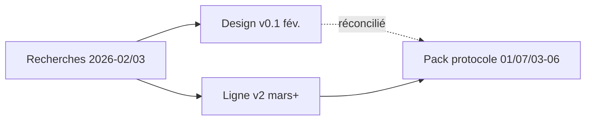
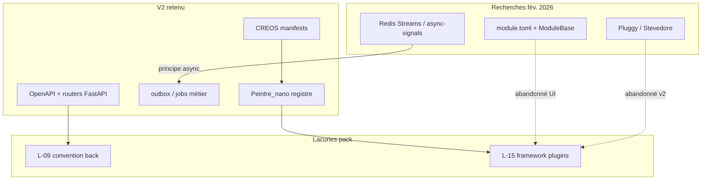

# 11 — Synthèse des recherches — modularité (distillat readonly)

**Statut :** proposition → **Phase 3** (enrichissement pack)  
**Date :** 2026-05-20  
**Nature :** distillat **readonly** — ne remplace pas [`01-MOD-matrice-choix-modularite.md`](01-MOD-matrice-choix-modularite.md), [`07-MOD-adr-reconciliation-v01-v02.md`](07-MOD-adr-reconciliation-v01-v02.md) ni le cookbook [`06-MOD-cookbook-nouveau-module-optionnel.md`](06-MOD-cookbook-nouveau-module-optionnel.md).  
**Sources :** recherches Perplexity / BMAD fév.–mars 2026 (voir §5).

---

## 1. Rôle de ce document

Les recherches externes (fév.–mars 2026) ont comparé frameworks Python, hooks inter-modules, extension points front et trajectoires SDUI. Le design v0.1 (`2026-02-24_07_design-systeme-modules.md`) et la ligne v2 (mars 2026) ne convergent pas sur les **mêmes artefacts** (TOML / `ModuleBase` / `EventBus` vs CREOS / ADR-001 / outbox).

Ce distillat **condense** les conclusions des recherches et les **aligne** sur la matrice `01` et l’ADR-007. Les procédures d’implémentation restent dans `03`–`06` ; la promotion normative BMAD reste **post-HITL**.

---

## 2. Backend Python — découverte, packaging, hooks

### 2.1 Panorama comparatif (recherche)

| Approche | Rôle typique | Forces (recherche) | Limites pour Recyclique |
|----------|--------------|------------------|-------------------------|
| **Entry points** (`importlib.metadata`) | Découverte de packages installés | Stdlib, simple, écosystème pip | Pas de lifecycle ; dépendances inter-modules à coder ; lourd pour modules **internes** monorepo |
| **Stevedore** | Managers au-dessus des entry points | Mature OpenStack, patterns préfabriqués | Packaging pip par module ; peu d’exemples apps métier hors OpenStack |
| **Pluggy** | Hooks formels `@hookspec` / `@hookimpl` | Contrats, ordre (`tryfirst`/`trylast`), wrappers | Conçu outils CLI/test ; **sync** ; pas de lifecycle module ; intégration FastAPI à structurer soi-même |
| **Manifeste YAML + import** | Modules internes monorepo | Zéro dépendance, contrôle total | Pas de standard tiers sans conventions |
| **Scan répertoire** | Chargement ad hoc | Très simple | Fragile en production (ordre, deps) |

Les réponses Perplexity du **2026-02-24** divergent sur la reco initiale (entry points seuls *vs* hybride manifeste + entry points + Pluggy « si besoin »), mais convergent sur : **éviter Stevedore** en phase solo/monorepo, **ne pas** partir sur un scan pur, **coupler** découverte et lifecycle FastAPI (`lifespan`) manuellement.

### 2.2 Hooks / événements inter-modules

Recherche dédiée **Pluggy vs alternatives** (même date) :

| Option | Async FastAPI | Durabilité multi-worker | Contrat formel | Verdict recherche |
|--------|---------------|------------------------|----------------|-------------------|
| **Blinker** | Bolt-on async (1.6+) | In-process | Non | Inadapté backend async 2026 |
| **async-signals** | Natif | In-process uniquement | Duck-typing | Bon pour monolithe **un** process |
| **Pluggy** | Non (sync) | In-process | Oui | Overkill ~5–10 événements ; mauvais mariage async |
| **EventBus maison** | Possible | À coder | Non | Risque réinvention si async-signals suffit |
| **Redis Pub/Sub** | Oui | Non (fire-and-forget) | Non | Exclu pour hooks métier critiques |
| **Redis Streams** | Oui | Oui (ack, replay) | Non | Pertinent **si** workers séparés et perte inacceptable |

**Complément Redis (reponse-2-redis) :** Redis sert déjà au cache ; pour hooks **critiques** (ex. clôture caisse → Paheko), Streams > Pub/Sub ; pour un backend **monolithique modulaire** au démarrage, **async-signals in-process** suffit — migrer vers Streams quand Gunicorn multi-workers ou workers dédiés imposent durabilité hors process.

### 2.3 Décision v2 retenue (alignement `01` / ADR-007)

| Recommandation recherche (2026-02) | Statut v2 | Décision retenue |
|-----------------------------------|-----------|------------------|
| Entry points / Stevedore comme socle | **Post-v2** (tiers) / **Abandonné** v2 interne | Monorepo brownfield ; pas de pip par module métier |
| Pluggy systématique | **Abandonné** v2 | Pas d’API `@hookspec` normative ; événements **métier nommés** + consumers |
| Manifeste TOML + loader `ModuleBase` | **Abandonné** (UI) | CREOS + routers FastAPI par domaine |
| Redis Streams `EventBus` générique | **Remplacé** (périmètre) | **Principe** async multi-workers **conservé** ; **implémentation** = outbox Paheko, jobs, pipelines nommés — pas `bus.emit` universel |
| async-signals / Blinker / Pub/Sub | **Abandonné** v2 documenté | Même motif : multi-workers + alignement PRD outbox |
| Pattern Paheko (dossiers + snippets) | **Conservé** (esprit) | Slots CREOS ; activation serveur ; pas de copie Brindille |

**Lecture unifiée :** la recherche recommandait souvent une **brique technique** (Pluggy, Streams, entry points). La v2 retient les **besoins** (découverte contrôlée, side-effects async résilients, points d’extension nommés) mais les porte par la **chaîne modulaire PRD §4.2** (OpenAPI, CREOS, registre, ADR-001), pas par un framework plugin unique.

---

## 3. Frontend — extension points Peintre, JSON UI, SDUI

### 3.1 Recherche affichage dynamique (2026-02-25, BMAD)

Objectif : réserver en v1.0 des **stubs** pour (a) écrans configurables v2+, (b) service **Peintre** (JARVOS Mini), sans implémenter tout de suite.

| Piste | Retenu en recherche | Alignement v2 |
|-------|---------------------|---------------|
| **React-Grid-Layout** + persistance (localStorage ou API) | v2+ layout configurable | **Post-v2** (prefs UI) ; CREOS structure d’abord |
| **ModuleSlot** / slots React | Base existante design modules | **Conservé** → `slot_id` dans `PageManifest` |
| **Interfaces + factory** (`LayoutConfigService`, `VisualProvider`) | Stub-first, bootstrap | **Conservé** (intention) → Peintre_nano + contrats CREOS |
| **Backstage-style** extension points | Pattern de référence | **Conservé** (patron) → registre widgets |
| **Gateway / BFF** pour Peintre | Sécurité, cache | **Conservé** ; choix BFF vs direct = HITL |
| **MSW / Mirage** pour mocks | Tests | **Conservé** en construction |

**v1.0 recherche :** interfaces TS + stubs au bootstrap ; **pas** de persistance layout ni d’appel Peintre réel.

### 3.2 Brique nano Peintre / modularité JSON (2026-03-31)

Compare Piral, Open edX FPF, Module Federation, DivKit, SDUI, `react-jsonschema-form`.

| Option recherche | Verdict recherche | Statut v2 (`01` §3.5) |
|------------------|-------------------|------------------------|
| **Piral** (pilets, feed) | Bon modèle, surdimensionné phase nano | **Post-v2** |
| **FPF Open edX** (`PluginSlot` + config) | Inspiration concrète slots + manifest | **Conservé** → Peintre_nano + CREOS |
| **Micro-framework maison** (registre + `Slot` + manifest JSON) | **Recommandation** option C | **Conservé** — Peintre_nano |
| **Module Federation** | Plomberie, pas registre | **Abandonné** v2 |
| **DivKit / SDUI pur** | Aligné vision Peintre-agent | **Post-v2** (agent) ; v2 = CREOS profil minimal |
| **Manifest JSON module** (routes, slots, widgets, `propsSchema`) | Contrat évolutif vers Peintre | **Remplacé** par schémas **CREOS** reviewables |

**Trajectoire recherche (phases 0→3) :** stabiliser registre + slots + manifests → vocabulaire widgets (`type` stable) → mini-DSL JSON interne → ouverture Peintre-agent / SDUI externe. La v2 **tronque** la trajectoire au socle CREOS + `data_contract.operation_id` obligatoire ; SDUI agent = **après** preuve bandeau live et flows critiques.

### 3.3 UI « par module » (complément frameworks-python reponse-2-complement)

- **Backend :** chaque module peut exposer routes + static sous préfixe `/api/modules/{key}` — compatible v2 via routers OpenAPI tagués, pas via `register_ui_extensions()` Python.
- **Frontend :** routes lazy `/modules/{key}/*` — compatible **domaine Peintre** ; pas de registry React alimenté depuis Python.
- **Paheko :** `module.ini`, snippets HTML, table `module_data_*` — **inspiration** permissions déclaratives et injection UI ; **pas** de reprise du runtime PHP.

---

## 4. Tableau — recherche → décision v2

| Source (résumé) | Proposition recherche | Décision v2 | Statut |
|-----------------|----------------------|-------------|--------|
| Frameworks Python r1 | Entry points seuls pour démarrer | Découverte interne monorepo ; entry points **post-v2** tiers | Conservé / Post-v2 |
| Frameworks Python r2 | Hybride YAML + EP ; Pluggy si hooks | Pas de loader YAML central ; hooks **métier** sans Pluggy | Remplacé |
| Frameworks Python r2 compl. | Slots React + `module.toml` + pattern Paheko | CREOS + ADR-001 ; TOML UI **abandonné** | Remplacé |
| Pluggy vs hooks r1 | **async-signals** pour 5–10 événements | Outbox + workers ; pas bus documenté | Remplacé |
| Pluggy vs hooks r1 | Pluggy si >20 hooks | Non retenu v2 | Abandonné |
| Pluggy vs hooks r2-redis | Streams si multi-workers / perte critique | Principe **conservé** ; nom **outbox** / pipeline Paheko | Conservé / Remplacé |
| Pluggy vs hooks r2-redis | Pub/Sub pour temps réel non critique | Hors hooks métier | Abandonné (hooks) |
| Affichage dynamique BMAD | Stubs `LayoutConfigService` / `VisualProvider` v1 | Peintre_nano + CREOS ; stubs → registre build-time | Conservé (intention) |
| Affichage dynamique BMAD | React-Grid-Layout v2+ | Post-v2 prefs | Post-v2 |
| Brique nano 2026-03-31 | Micro-framework `@jarvos/modularity` | **Peintre_nano** + `contracts/creos/` | Conservé |
| Brique nano 2026-03-31 | Piral / Federation dès maintenant | Refus chargement dynamique tiers hors build (AR38) | Post-v2 / Abandonné v2 |
| Brique nano 2026-03-31 | DivKit / SDUI agent | Après CREOS stable | Post-v2 |
| Design v0.1 (artefact 07) | `ModuleBase`, Redis Streams, `module.toml` | Réconcilié ADR-007 — ne pas réimplémenter | Abandonné (artefacts) |

**Règle de lecture :** une ligne **Abandonné** signifie « ne pas traiter la reco recherche comme norme d’implémentation v2 » ; **Conservé** signifie « le besoin sous-jacent reste dans la matrice / PRD ».

---

## 5. Liens vers les fichiers recherche complets

| Fichier | Sujet |
|---------|--------|
| [`references/recherche/2026-02-24_frameworks-modules-python_perplexity_prompt.md`](../recherche/2026-02-24_frameworks-modules-python_perplexity_prompt.md) | Prompt — comparatif frameworks modules Python |
| [`references/recherche/2026-02-24_frameworks-modules-python_perplexity_reponse-1.md`](../recherche/2026-02-24_frameworks-modules-python_perplexity_reponse-1.md) | Réponse 1 — Pluggy, Stevedore, entry points |
| [`references/recherche/2026-02-24_frameworks-modules-python_perplexity_reponse-2.md`](../recherche/2026-02-24_frameworks-modules-python_perplexity_reponse-2.md) | Réponse 2 — tableau ; hybride manifeste + Pluggy |
| [`references/recherche/2026-02-24_frameworks-modules-python_perplexity_reponse-2-complement.md`](../recherche/2026-02-24_frameworks-modules-python_perplexity_reponse-2-complement.md) | Complément — UI module, plugins Paheko, slots |
| [`references/recherche/2026-02-24_pluggy-vs-alternatives-hooks_perplexity_prompt.md`](../recherche/2026-02-24_pluggy-vs-alternatives-hooks_perplexity_prompt.md) | Prompt — hooks inter-modules |
| [`references/recherche/2026-02-24_pluggy-vs-alternatives-hooks_perplexity_reponse-1.md`](../recherche/2026-02-24_pluggy-vs-alternatives-hooks_perplexity_reponse-1.md) | Réponse 1 — async-signals, Pluggy, EventBus |
| [`references/recherche/2026-02-24_pluggy-vs-alternatives-hooks_perplexity_reponse-2-redis.md`](../recherche/2026-02-24_pluggy-vs-alternatives-hooks_perplexity_reponse-2-redis.md) | Réponse 2 — Redis Streams vs in-process |
| [`references/recherche/2026-02-25_affichage-dynamique-peintre-extension-points_bmad_recherche.md`](../recherche/2026-02-25_affichage-dynamique-peintre-extension-points_bmad_recherche.md) | Rapport BMAD — stubs & extension points v1 |
| [`references/recherche/2026-03-31_brique-nano-peintre-modularite-json-ui_perplexity_reponse.md`](../recherche/2026-03-31_brique-nano-peintre-modularite-json-ui_perplexity_reponse.md) | Brique nano — Peintre, CREOS, SDUI, trajectoire |
| [`references/recherche/index.md`](../recherche/index.md) | Index du dossier recherche |
| [`references/artefacts/2026-02-24_07_design-systeme-modules.md`](../artefacts/2026-02-24_07_design-systeme-modules.md) | Design v0.1 (contrepoint historique) |

**Alignement pack (normatif proposé Phase 3) :** [`01-MOD-matrice-choix-modularite.md`](01-MOD-matrice-choix-modularite.md), [`07-MOD-adr-reconciliation-v01-v02.md`](07-MOD-adr-reconciliation-v01-v02.md).

---

## 6. Implications lacunes **L-09** et **L-15**

### 6.1 L-09 — Convention unique routes / services « module optionnel »

| Apport de la recherche | Implication L-09 |
|------------------------|------------------|
| Pluggy / Stevedore imposent chacun un **pattern d’enregistrement** (PM, entry points) | La v2 ne retient **aucun** de ces frameworks ; la lacune L-09 reste **ouverte** : il faut une convention **maison** documentée dans `03` (et renvoi cookbook § back, sans recopier `06`) |
| Recommandations FastAPI : `APIRouter` + `lifespan`, inclusion explicite | **Proposition Phase 3 :** prefix stable `api_v2` / tags OpenAPI alignés `module_key` ; feature flag ou whitelist serveur ; **pas** de `register_routes(app)` générique hérité de `ModuleBase` |
| Pattern Paheko : préfixe `/m/{module}/` | Équivalent v2 : navigation CREOS + routes API nommées ; une seule table de correspondance `module_key` ↔ routers ↔ manifests |
| Redis Streams : consumers **dédiés** par pipeline | Les « services module » async = workers outbox / jobs **nommés**, pas subscription générique à un bus |

**Critère de clôture L-09 (indicatif) :** une story Epic 4+ ou protocole `03` §6 cite **un** exemple complet (bandeau live) : chemin package, router, tag OpenAPI, lien `module_key`, sans second pattern parallèle.

### 6.2 L-15 — Framework plugins Paheko + Recyclique (bundles)

| Apport de la recherche | Implication L-15 |
|------------------------|------------------|
| Comparatif Pluggy / Stevedore / entry points | Idée kanban « plugin framework » **partiellement obsolète** : la v2 = **CREOS + registre + ADR-001**, pas framework TOML unique |
| Complément UI + module.toml | **Ne pas** relancer un design `module.toml` transverse ; relire l’idée kanban sous l’angle **marketplace post-v2** + entry points signés |
| Brique nano : micro-framework inspiré Piral/FPF | **Réponse L-15 :** le « framework » v2 est **Peintre_nano** (registre widgets, slots CREOS), pas une lib Python Pluggy parallèle |
| Paheko modules (dossiers, snippets) | Pont **documentation** uniquement : correspondance conceptuelle Paheko ↔ CREOS ; pas convergence runtime PHP/Python |
| Trajectoire SDUI / Peintre-agent (phase 3 recherche) | L-15 reste **P2** : bundles tiers + agent JSON = **après** chaîne modulaire prouvée (pilote #1) |

**Proposition Phase 3 :** dans `09-lacunes` §10 / futur `13-idees-kanban-modules-liens`, statuer : idée **plugin-framework-recyclic** → **horizon post-v2** ou **archivée** si redondante avec ADR-007 ; liens explicites vers ce distillat et `01` §3.1.

### 6.3 Synthèse croisée L-09 × L-15

---

## 7. Écarts recherche ↔ pack (à traiter Phase 3)

| Écart | Action proposée Phase 3 |
|-------|-------------------------|
| Recherche pousse **Pluggy** ou **async-signals** ; v2 documente **outbox** | Harmoniser libellé `03` §7 (L-12) ; ne pas réintroduire Pluggy dans stories |
| Recherche **EventBus Redis** = décision v0.1 | Citer ce distillat dans `07-adr` annexe ; pas de nouveau bus dans pilotes |
| Stubs `VisualProvider` v1 vs Peintre_nano build-time | `04-protocole-front-creos` : préciser que les stubs recherche = **registre + fallbacks** Epic 4 |
| Précédence config (L-07) non tranchée en recherche | Hors périmètre distillat ; rester dans `09` / ADR complémentaire |

---

## 8. Prochaine étape (Phase 3)

| Livrable pack | Usage de ce distillat |
|---------------|----------------------|
| `03-MOD-protocole-backend.md` | § convention L-09 (routes, workers) — **sans** dupliquer `06` |
| `09-MOD-lacunes-et-questions-ouvertes.md` | Pont L-15 ↔ décisions recherche |
| `13-MOD-idees-kanban-modules-liens.md` | Statut idée plugin-framework |
| `15-MOD-matrice-gaps-bmad-story-9-6.md` | Ligne L-09 / L-15 avec critère clôture |

**Non-objectif :** ce fichier ne décrit pas les phases du cookbook, les checklists Epic 4, ni les patches de code — voir [`06-MOD-cookbook-nouveau-module-optionnel.md`](06-MOD-cookbook-nouveau-module-optionnel.md).

---

_Distillat readonly — pack `references/protocole-modules-recyclique/`. Dernière consolidation : recherches indexées 2026-02-24 → 2026-03-31, matrice `01` et ADR-007 2026-05-20._
