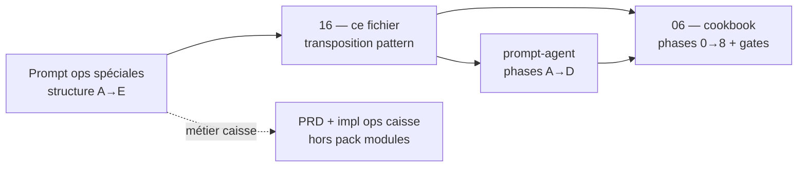

# 16 — Lien opérations spéciales × pattern procédural modules

**Statut :** brouillon normatif du pack `references/protocole-modules-recyclique/`  
**Date :** 2026-05-20  
**Audience :** agents Cursor/BMAD, rédacteurs du pack, architecte — **méta-procédure**, pas exécution pas à pas  
**Objectif :** formaliser le **même squelette procédural** que le prompt ultra-opérationnel opérations spéciales, **transposé** au chantier modules v2, sans recopier le métier caisse ni les phases détaillées du cookbook.

**Sources structurelles (format uniquement) :** [`references/operations-speciales-recyclique/2026-04-18_prompt-ultra-operationnel-operations-speciales-recyclique_v1-1.md`](../operations-speciales-recyclique/2026-04-18_prompt-ultra-operationnel-operations-speciales-recyclique_v1-1.md) — phases ordonnées A→E, règles impératives, tables d’audit, découpage P0→P3, discipline Story Runner.

**Exécution module (pas à pas) :** [`06-MOD-cookbook-nouveau-module-optionnel.md`](06-MOD-cookbook-nouveau-module-optionnel.md) — **seul** livrable à suivre pour implémenter. Ce fichier **16** explique *pourquoi* le cookbook a cette forme et *comment* mapper une mission agent.

**Prompt agent modules :** [`prompt-agent-chantier-modules.md`](prompt-agent-chantier-modules.md) — phases A→D = exécution condensée ; s’appuie sur ce lien + `06`.

---

## 1. Objet et hors-périmètre

| Ce document fait | Ce document ne fait pas |
|------------------|-------------------------|
| Isomorphisme **ops spéciales (caisse)** ↔ **modules v2** (procédure) | Décrire annulation, remboursement, décaissement, tags métier |
| Tables **modèles** réutilisables (audit, permissions, priorités) | Remplacer [`06`](06-MOD-cookbook-nouveau-module-optionnel.md) Phase 0→8 ni ses checklists |
| Règles de **transposition** des garde-fous | Promouvoir PRD/epics dans `references/` |
| Indiquer **quel fichier ouvrir** selon la mission | Implémenter un `module_key` sans ouvrir `06` |

**Règle anti-duplication :** toute case « action concrète / fichier / gate G0…G8 » → **renvoi `06`**. Toute case « annulation / remboursement / hub ops » → dossier [`operations-speciales-recyclique/`](../operations-speciales-recyclique/) + son PRD caisse.

---

## 2. Carte des documents (qui fait quoi)

| Mission utilisateur | Document **unique** d’exécution | Lecture support |
|---------------------|--------------------------------|-----------------|
| Créer / étendre un **module optionnel** v2 | **`06-cookbook`** | `16` (5 min) → `02`, `05`, `03`/`04` selon couche |
| Coller un **prompt agent** session module | **`prompt-agent-chantier-modules`** | `16` + `06` référencés dans le prompt |
| Livrer **opérations spéciales caisse** | Prompt + PRD **ops spéciales** | `16` **non** requis (sauf comparaison méthodo) |
| Rédiger / enrichir le **pack** protocole | Plans `00-plan-*`, `09-lacunes` | `16` = justification format `06` |

---

## 3. Isomorphisme des phases

Le prompt ops impose un ordre **strict** : audit → découpage livrable → doc → fichiers formels → implémentation par priorité. Le pack modules **reproduit** ce squelette en le **spécialisant** sur la chaîne PRD §4.2 (7 briques) et la taxonomie `02`.

### 3.1 Table de correspondance

| Phase prompt **ops spéciales** | Intention générique | Équivalent **pack modules** | Exécution détaillée |
|--------------------------------|---------------------|-----------------------------|---------------------|
| **A** — Audit repo-aware | État réel vs cible produit ; tables écart | **Phase 0** cookbook + Phase A `prompt-agent` | [`06` § Phase 0](06-MOD-cookbook-nouveau-module-optionnel.md) · fiche `references/artefacts/*_cadrage-module.md` |
| **B** — Découpage BMAD / stories | P0→P3 ordonné ; DoD par story | Stories Epic **4** (slice) ou **6** / **9** (workflow, admin) — **citation** `_bmad-output/` | [`15-MOD-matrice-gaps-bmad-story-9-6.md`](15-MOD-matrice-gaps-bmad-story-9-6.md) · pas de stories inventées dans `16` |
| **C** — Production documentaire | Specs, matrices, machine d’états | Protocoles `03`/`04`, registre `05`, pilotes `08`, gouvernance `21` | Lecture ciblée ; écriture limitée au handoff Phase A |
| **D** — Livrables formels obligatoires | Fichiers sur disque, pas chat seul | Contrats `contracts/`, schémas `config-modules-site-id/schemas/` | **Phase 1–3** cookbook · gate **G1–G3** |
| **E** — Implémentation P0→P3 | Une priorité à la fois ; retour d’état | Phases **2–8** cookbook + recette **4-6b** | **`06` § Phases 2–8** · checklist §12 |

### 3.2 Phases prompt-agent (A→D) ↔ cookbook

Le [`prompt-agent-chantier-modules.md`](prompt-agent-chantier-modules.md) compresse le cookbook en **quatre** blocs agent — alignés sur ops **A + D + E**, pas sur la rédaction pack :

| Prompt-agent | ≈ Ops | ≈ Cookbook `06` |
|--------------|-------|-----------------|
| **Phase A** | A (cadrage) | Phase **0** |
| **Phase B** | D (contrats) | Phases **1**, **3** |
| **Phase C** | E (back, P0 métier) | Phases **2**, **9** (Paheko) |
| **Phase D** | E (front, preuve) | Phases **4**–**8** |

**Gate unique agent :** ne pas enchaîner B→C→D sans **table d’état** (modifié / validé / ouvert / tests / fichiers) — même discipline que ops § « Après chaque story ».

---

## 4. Transposition des garde-fous

Les **11 règles impératives** du prompt ops spéciales ont des **échos normatifs** dans le chantier modules. Ce tableau sert à **aligner** un agent qui connaît déjà le prompt caisse ; le détail opérationnel reste dans [`06` §0.1](06-MOD-cookbook-nouveau-module-optionnel.md).

| # | Garde-fou ops spéciales (source) | Transposition **modules v2** | Ancrage pack |
|---|----------------------------------|------------------------------|--------------|
| 1 | Pas d’architecture parallèle | Pas de `module.toml`, `ModuleBase`, bus Redis générique | `07-adr`, `06` §0.1 règle 1 |
| 2 | Vérifier API, UI, permissions, Paheko existants | Grep `recyclique/api`, `peintre-nano`, `contracts/` avant nouveau route/manifest | `06` Phase 0 · `03` |
| 3 | PRD ferme vs dépôt → signaler écart | `refs_first` : `_bmad-output/` fait foi ; écart → `09-lacunes` ou NEEDS_HITL | `00-cadrage`, `prompt-agent` |
| 4 | Comptes paramétrables, pas figés | Comptes Paheko via mapping / param expert — pas hardcodés dans module | `03` § Paheko · pilote `08` |
| 5 | Ventilation remboursement par moyen | **N/A modules** — réservé ops caisse | dossier ops spéciales |
| 6 | Parcours expert PIN + justification | Step-up / permissions module : `ContextEnvelope`, pas PIN caisse recopié | `04` · stories permissions |
| 7 | Gratuités via **tags ticket**, pas gros parcours | Tags métier = **domaine caisse** ; module = slice/workflow/config | ops PRD · hors `06` |
| 8 | N3 : initiateur ≠ validateur | Si module expose validation : champs initiateur/validateur côté **API** | `03` modèles · ops pour sémantique N3 |
| 9 | Preuve textuelle si pas de PJ | Preuve / corrélation : `X-Correlation-ID`, logs structurés, champs audit module | `06` Phase 1 · `04` |
| 10 | Échange = sous-flux vente/remboursement | **N/A** — réutiliser endpoints existants si module **touche** échange (extension, pas refonte) | ops · `03` brownfield |
| 11 | État sync Paheko **visible** | Module à impact compta : statut sync sur entités concernées | `06` §9 · `08` § Paheko |

**Synthèse :** règles **5–7–10** restent **métier caisse** ; le pack modules reprend surtout **1–2–3–4–8–9–11** sous forme CREOS + OpenAPI + outbox.

---

## 5. Tables procédurales modèles (format ops → modules)

Reprendre **la forme** des livrables ops Phase A / B sans en copier les lignes métier.

### 5.1 Audit repo-aware (Phase A / cookbook Phase 0)

| Capacité | Prévu produit (`refs_first`) | Existe dépôt | Action module |
|----------|------------------------------|--------------|---------------|
| `module_key` + registre | [`05-registre`](05-MOD-registre-module-key.md) §3 | grep clé | créer entrée / HITL |
| Contrat OpenAPI | PRD §4.2 · story cible | `recyclique-api.yaml` | étendre / réutiliser |
| Manifests CREOS | Epic 4 template | `contracts/creos/manifests/` | créer lot reviewable |
| Service + routes | `03` §6 | `api_v2/endpoints/` | router + service |
| Persistance | `02` taxonomie | tables / JSON / agrégat | arbre `06` §0.2 |
| Widget + slots | `04` | `peintre-nano/src/domains/` | `registerWidget` |
| Permissions | ContextEnvelope | clés existantes | aligner manifest + API |
| Activation `site_id` | ADR-001 · Story 9.6 | toggle transitoire / absent | JSON / module-config |
| Outbox Paheko | Epic 8 chain | builders / outbox | oui / **hors outbox** documenté |

**Gate :** table remplie + type taxonomique (`02`) + gate **G0** [`06` §0.3](06-MOD-cookbook-nouveau-module-optionnel.md).

### 5.2 Permission / acteur / preuve (adaptation ops)

Pour un **module** (pas une opération N3 caisse), la matrice utile est :

| Dimension | Question | Où trancher |
|-----------|----------|-------------|
| **Acteur** | Qui peut activer le module / voir le slice / valider l’étape workflow ? | OpenAPI + `required_permission_keys` manifest |
| **Preuve** | Audit minimal (corrélation, motif, snapshot) ? | `03` modèles · exigences story |
| **Initiateur / validateur** | Deux rôles distincts requis ? | Uniquement si produit l’exige — sinon une permission suffit |
| **Step-up** | PIN / re-auth ? | Parité ops **si** même risque financier ; sinon permissions standard |
| **Sync Paheko** | Visible opérateur / admin ? | Champ statut + politique retry (Epic 8) |

### 5.3 Priorisation P0→P3 (ops) → profondeur module

Le prompt ops ordonne **P0 hub + remboursements** avant **P2 tags**. Pour les **modules**, la priorité n’est pas « hub ops » mais **profondeur de chaîne** et **risque métier** :

| Priorité | Profondeur module (analogue P0→P3) | Exemple pack | Cookbook |
|----------|-----------------------------------|--------------|----------|
| **P0** | Contrats + activation + back minimal + preuve chaîne sur **un** `module_key` | Pilote #1 `kpi-live-banner` (Epic 4 **done**) | Phases **0→2** + gate G2 |
| **P1** | CREOS reviewables + widget + fallbacks | Suite Epic 4 **4-2**…**4-4** | Phases **3–5** |
| **P2** | Activation `site_id` stable + admin (Story **9.6**) | Migration toggle 4.5 → `module-config` | Phase **6** · [`15`](15-MOD-matrice-gaps-bmad-story-9-6.md) |
| **P3** | Workflow step + tables + Paheko | Pilote #2 `comptage-pieces-billets` | [`08`](08-MOD-exemple-pilote-comptage-pieces-billets.md) + `06` §9 |

**Règle ops reprise :** ne pas ouvrir **P1** (CREOS complet) si **P0** (contrat + back) n’a pas de retour d’état clair — cf. `06` gates **G0→G1→G2**.

---

## 6. Livrables formels (Phase D ops → modules)

Le prompt ops exige des **fichiers** (audit, matrices, machine d’états, plan de tests). Équivalent **modules** — sans imposer de nouveaux types de doc dans `16` :

| Livrable ops (nominal) | Équivalent module | Emplacement type |
|------------------------|-------------------|------------------|
| Audit repo-aware synthétique | Table §5.1 + fiche cadrage | `references/artefacts/YYYY-MM-DD_<module_key>_cadrage-module.md` |
| Stories ordonnées P0→P3 | Stories `_bmad-output/implementation-artifacts/` | Calquer Epic **4-1**…**4-6b** ou epic métier |
| Matrice PRD ↔ dépôt | Lignes **L-03…L-15** si écart pack | [`15-matrice-gaps`](15-MOD-matrice-gaps-bmad-story-9-6.md), [`09-lacunes`](09-MOD-lacunes-et-questions-ouvertes.md) |
| Matrice permissions / preuve | §5.2 + story permissions | Artefact court ou AC story |
| Machine d’états opérationnelle | États métier **API** (ex. `delayed_open`) | Spec signaux + OpenAPI enums |
| Plan de tests | pytest + contract CREOS + e2e | `recyclique/api/tests/`, `peintre-nano/tests/` |
| Stratégie Paheko / outbox | §9 cookbook ou fiche `08` | Architecture [`cash-accounting-paheko-canonical-chain`](../../_bmad-output/planning-artifacts/architecture/cash-accounting-paheko-canonical-chain.md) *(citation)* |

**Interdit :** livrer uniquement un résumé chat — règle ops **reprise** dans `prompt-agent` règle 12 et `06` §0.1 règle 10.

---

## 7. Discipline Story Runner (après chaque phase / story)

Format **identique** au prompt ops § E — appliqué à chaque gate cookbook ou story BMAD :

| Champ | Contenu attendu |
|-------|-----------------|
| Modifié | Liste chemins repo (relatifs racine) |
| Validé | Tests passés, revue contrat, HITL obtenu |
| Ouvert | Écarts, NEEDS_HITL, entrée `09-lacunes` |
| Tests | `pytest …`, `npm test`, e2e, contract `creos-*` |
| Fichiers | Diff conceptuel (pas copie intégrale PRD) |

**Blocage :** arbitrage non résolu → **formuler** dans `09` ou artefact handoff — **ne pas supposer** (reprise ops « Important »).

---

## 8. Cas d’usage : module **dans** le périmètre ops spéciales

Certains modules ou extensions **touchent** la caisse sans être le prompt ops :

| Besoin | Module / extension | Procédure |
|--------|-------------------|-----------|
| Hub « opérations spéciales » UI | Slice ou page CREOS dédiée | **`06`** depuis Phase 0 ; permissions alignées PRD ops |
| Tags gratuité / don sur ticket | **Pas** un module optionnel monolithique | PRD ops règle 7 — tags sur ticket standard |
| Remboursement + sync Paheko | Endpoints caisse existants | Étendre via **`03`** brownfield ; pas nouveau bus |
| Comptage clôture | `comptage-pieces-billets` | **`08`** + **`06`** §9 |

**Ordre recommandé si les deux chantiers se croisent :** (1) audit ops (dossier ops spéciales), (2) cadrage `module_key` Phase 0 `06`, (3) implémentation par story — **une** source produit fait foi par sujet (ops PRD vs PRD modules §4.2).

---

## 9. Checklist « ai-je le bon document ? »

| # | Question | Si oui → |
|---|----------|----------|
| 1 | Je dois **coder** un module optionnel | Ouvrir **`06-cookbook`** |
| 2 | Je veux comprendre **pourquoi** le cookbook est en phases + gates | Lire **ce fichier `16`** (5–10 min) |
| 3 | Je lance une **session agent** module | Coller **`prompt-agent-chantier-modules`** |
| 4 | Je livre **remboursement / annulation / échange** | Dossier **`operations-speciales-recyclique/`** — pas `16` |
| 5 | Je priorise **Story 9.6** / lacunes L-xx | [`15-MOD-matrice-gaps-bmad-story-9-6.md`](15-MOD-matrice-gaps-bmad-story-9-6.md) |
| 6 | Je cherche un **pas à pas Phase 3 manifest CREOS** | **`06` Phase 3** — pas `16` |

---

## 10. Références croisées

| Document | Lien |
|----------|------|
| Cookbook exécution | [`06-MOD-cookbook-nouveau-module-optionnel.md`](06-MOD-cookbook-nouveau-module-optionnel.md) |
| Prompt agent | [`prompt-agent-chantier-modules.md`](prompt-agent-chantier-modules.md) |
| Source format ops | [`2026-04-18_prompt-ultra-operationnel-operations-speciales-recyclique_v1-1.md`](../operations-speciales-recyclique/2026-04-18_prompt-ultra-operationnel-operations-speciales-recyclique_v1-1.md) |
| Pilote workflow + Paheko | [`08-MOD-exemple-pilote-comptage-pieces-billets.md`](08-MOD-exemple-pilote-comptage-pieces-billets.md) |
| Cartographie sources | [`10-MOD-cartographie-sources-modules.md`](10-MOD-cartographie-sources-modules.md) |
| Index pack | [`index.md`](index.md) |

---

_Pont procédural — pattern ops spéciales appliqué aux modules. Exécution : **`06-cookbook`** uniquement._
