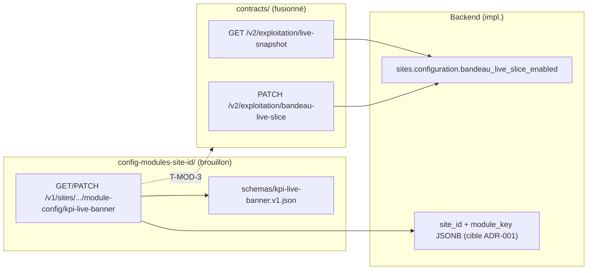

# 18 — Crosswalk configuration modules (`site_id` / `module_key`)

**Statut :** brouillon normatif du pack `references/protocole-modules-recyclique/`  
**Date :** 2026-05-20  
**Owner lacunes :** **L-04** (OpenAPI `module-config` absent du canon) · **L-06** (schémas JSON config incomplets)  
**Audience :** architecte, agents BMAD, backend, revue contrats — lecture autonome  
**Ne pas dupliquer :** procédure pas à pas → [`06-MOD-cookbook-nouveau-module-optionnel.md`](06-MOD-cookbook-nouveau-module-optionnel.md) (Phase 6 activation, fichiers à toucher). Ce fichier = **cartographie et écarts**, pas cookbook.

---

## 1. Objet

Document **pont** entre quatre couches :

| Couche | Rôle |
|--------|------|
| **Pack protocole** | Registre `module_key`, protocole back, dette transitoire Epic 4 |
| **ADR-001** | Décision persistance JSON scopée `site_id`, liste blanche, ETag/409 |
| **Brouillon OpenAPI** | Transport HTTP générique `GET`/`PATCH` `module-config` |
| **`contracts/`** | Contrat reviewable + codegen (`recyclique-api.yaml`) |

**Règle `refs_first` :** les vérités produit restent dans `_bmad-output/` et `contracts/` ; ce crosswalk **documente les écarts** et le plan **T-MOD-3** sans les masquer.

**Prérequis pack :** [`05-MOD-registre-module-key.md`](05-MOD-registre-module-key.md) · [`03-MOD-protocole-backend.md`](03-MOD-protocole-backend.md) §8 (feature flags) · [`09-MOD-lacunes-et-questions-ouvertes.md`](09-MOD-lacunes-et-questions-ouvertes.md) §3 (L-04, L-06, L-08).

**Dossier normatif config :** [`references/config-modules-site-id/`](../config-modules-site-id/index.md).

---

## 2. Preuve grep — état canon `contracts/` (2026-05-20)

Commandes de référence (à rejouer après fusion T-MOD-3) :

```powershell
rg "module-config|module_config|ModuleConfig" "contracts/"
rg "module-config|bandeau-live-slice" "contracts/openapi/recyclique-api.yaml"
```

### 2.1 L-04 — API `module-config` dans OpenAPI canonique

| Requête | Résultat |
|---------|----------|
| `module-config` / `ModuleConfig` / `module_config` sous `contracts/` | **0 occurrence** |
| Routes `/v1/sites/{site_id}/module-config/{module_key}` dans `recyclique-api.yaml` | **Absentes** |
| `operationId` `getSiteModuleConfig` / `patchSiteModuleConfig` | **Absents** |

**Conclusion L-04 :** le contrat générique ADR-001 n’existe que dans le **brouillon** [`openapi-module-config.yaml`](../config-modules-site-id/openapi-module-config.yaml). Aucune promotion dans le YAML canonique à ce jour.

### 2.2 L-06 — Schémas JSON config + route transitoire bandeau

| Requête | Résultat |
|---------|----------|
| Fichiers `schemas/*.json` (hors README) | **1** : `kpi-live-banner.v1.json` |
| Stubs / schémas clés PRD §7 (`cashflow`, `reception`, …) | **Absents** (placeholders registre `05` §3 uniquement) |
| `bandeau-live-slice` dans `recyclique-api.yaml` | **1** route : `PATCH /v2/exploitation/bandeau-live-slice` (`recyclique_exploitation_patchBandeauLiveSlice`) |

**Conclusion L-06 :** validation payload `module-config` possible **uniquement** pour `kpi-live-banner` / `schema_version` `1.0.0`. Les autres `module_key` du registre sont **réservés** sans schéma publié.

**Lien L-08 (hors owner principal de ce doc) :** le toggle Epic **4-5** reste **transitoire** ; la cible ADR-001 (`module_key=kpi-live-banner`) est **fusionnée** dans `recyclique-api.yaml` (L-04 **clos**) — **double chemin activation** (toggle + `module-config` + localStorage Peintre) jusqu'à story **9.6** (§4).

---

## 3. Tableau crosswalk — artefact × chemin × fusion × écart

| Artefact | Chemin | Statut fusion | Écart |
|----------|--------|---------------|-------|
| **Index dossier config** | [`references/config-modules-site-id/index.md`](../config-modules-site-id/index.md) | **Référence** (hors `contracts/`) | Lien retour vers ce `18` (2026-05-20) |
| **ADR-001** | [`ADR-001-configuration-modules-json-par-site.md`](../config-modules-site-id/ADR-001-configuration-modules-json-par-site.md) | **Décision** — statut *Proposée* | Non promue `_bmad-output/planning-artifacts/architecture/` ; précédence vs `sites.configuration` non ADR-isée (**L-07**, Q-HITL-03) |
| **Livrable normatif QA2** | [`livrable-normatif-architecture.md`](../config-modules-site-id/livrable-normatif-architecture.md) | **Référence** exigences (reject-early, ACL, cache, 409) | Routes reviewables via canon (L-04 **clos**) ; réserves impl. (Cache-Control, If-Match malformé) → story **9.6** |
| **OpenAPI standalone module-config** | [`openapi-module-config.yaml`](../config-modules-site-id/openapi-module-config.yaml) | **DEPRECATED** | Fusion **faite** dans `recyclique-api.yaml` ; ops `recyclique_moduleConfig_*` ; ne pas générer de client sur le standalone |
| **Schéma pilote kpi-live-banner** | [`schemas/kpi-live-banner.v1.json`](../config-modules-site-id/schemas/kpi-live-banner.v1.json) | **Publié** (doc) — pas référencé OpenAPI canon | Pas de `$ref` depuis `components/schemas` du YAML canon ; codegen TS ne voit pas le payload |
| **Convention schémas** | [`schemas/README.md`](../config-modules-site-id/schemas/README.md) | **Référence** | Tableau **1 ligne** ; 8+ clés registre `05` §3 sans fichier |
| **Redirection QA2 historique** | [`artefacts/qa2-livrable-architecture-config-modules-json-site-id.md`](../artefacts/qa2-livrable-architecture-config-modules-json-site-id.md) | **Stub** (liens cassés évités) | Contenu fusionné dans dossier config ; ce crosswalk remplace la fonction « écarts OpenAPI » du stub |
| **Registre pack `module_key`** | [`05-MOD-registre-module-key.md`](05-MOD-registre-module-key.md) | **Aligné** + ADR-001 | Ops `module-config` **exécutables** (L-04 **clos**) ; clés **réservées** sans schéma (L-06) |
| **Protocole backend** | [`03-MOD-protocole-backend.md`](03-MOD-protocole-backend.md) | **Aligné** pilote bandeau | §8 D : dette toggle **L-08** jusqu'à 9.6 ; §C.4 convention back **promue** |
| **OpenAPI canonique** | [`contracts/openapi/recyclique-api.yaml`](../../contracts/openapi/recyclique-api.yaml) | **Canon prod / CI** | `recyclique_moduleConfig_getSiteModuleConfig` / `patchSiteModuleConfig` présents |
| **Codegen TS** | [`contracts/openapi/generated/recyclique-api.ts`](../../contracts/openapi/generated/recyclique-api.ts) | **Dérivé** YAML canon | Types module-config **générés** (post `npm run generate` 2026-05-20) |
| **Gouvernance contrats** | [`contracts/README.md`](../../contracts/README.md) | **Référence** | Documente bandeau `live-snapshot` ; pas `module-config` (→ [`21-MOD-gouvernance-contrats-modules.md`](21-MOD-gouvernance-contrats-modules.md) prévu) |
| **Données métier bandeau (pilote)** | `GET /v2/exploitation/live-snapshot` · `recyclique_exploitation_getLiveSnapshot` | **Fusionné** | Orthogonal à `module-config` — lecture KPI, pas préférences UI versionnées |
| **Toggle transitoire bandeau** | `PATCH /v2/exploitation/bandeau-live-slice` · `recyclique_exploitation_patchBandeauLiveSlice` | **Fusionné** (dette) | Écrit `sites.configuration.bandeau_live_slice_enabled` ; **remplacement** par `patchSiteModuleConfig` + Story **9.6** (L-08, T-MOD-4) |
| **CREOS widget bandeau** | [`contracts/creos/manifests/widgets-catalog-bandeau-live.json`](../../contracts/creos/manifests/widgets-catalog-bandeau-live.json) | **Fusionné** Epic 4.1 | `data_contract.operation_id` → snapshot ; pas vers `module-config` |
| **Signaux métier bandeau** | [`artefacts/2026-04-02_07_signaux-exploitation-bandeau-live-premiers-slices.md`](../artefacts/2026-04-02_07_signaux-exploitation-bandeau-live-premiers-slices.md) | **Référence** sémantique | Champs snapshot ≠ payload `kpi-live-banner.v1.json` (`show_on_caisse`, `refresh_interval_seconds`, …) |

**Lecture fusion :**

- **Fusionné** = présent dans `contracts/openapi/recyclique-api.yaml` (ou manifests CREOS reviewables) avec `operationId` stable.
- **Brouillon** = normatif pour agents, **non** codegen / CI canon.
- **Référence** = décision ou exigences sans chemin HTTP reviewable.
- **Stub** = redirection historique uniquement.

---

## 4. Pont sémantique — trois chemins pour le pilote `kpi-live-banner`



| Besoin produit | Chemin actuel (canon) | Chemin cible (ADR-001 + brouillon) | Écart |
|----------------|----------------------|-----------------------------------|-------|
| KPIs jour bandeau | `recyclique_exploitation_getLiveSnapshot` | Inchangé (données métier / agrégats) | Aucun — ne pas confondre avec config UI |
| Activer/couper slice | `recyclique_exploitation_patchBandeauLiveSlice` | `patchSiteModuleConfig` + payload schéma v1 | L-04 + L-08 |
| Afficher caisse/réception, intervalle refresh | *Non exposé* OpenAPI canon | `payload` `kpi-live-banner.v1.json` | L-04 + L-06 (schéma doc seul) |
| Liste blanche clé | Registre pack `05` (documentaire) | Registre serveur + CREOS | L-05 (whitelist code) |

**Renvoi procédure :** ordre commits, fichiers `schemas/<module_key>.v1.json`, gate activation → **Phase 6** du [`06-cookbook`](06-MOD-cookbook-nouveau-module-optionnel.md) uniquement.

---

## 5. Alignement ADR-001 ↔ brouillon ↔ registre `05`

| Exigence ADR-001 | Brouillon `openapi-module-config.yaml` | Registre `05` | Canon `recyclique-api.yaml` |
|------------------|----------------------------------------|---------------|----------------------------|
| REST générique par `site_id` + `module_key` | `GET`/`PATCH` `/v1/sites/{site_id}/module-config/{module_key}` | Tableau §3 + §4 | **Absent** |
| Liste blanche `module_key` | Param `ModuleKey` (pattern kebab) | États actif / réservé / déprécié | N/A |
| ETag / 409 concurrence | Headers + réponse 409 PATCH | Cité §4 | N/A |
| Schéma par module versionné | `ModuleConfigDocument` + `schemas/` | Colonne schéma JSON §3 | N/A |
| Reject-early taille/profondeur | Description PATCH + renvoi livrable §3.1 | Renvoi livrable | N/A |
| Pas de god-namespace métier | ADR + livrable §2.3 | `synchronisation-paheko` hors JSON classique | Outbox / sync (autres ops) |

**Écart transversal :** ADR-001 §5.5 prévoit fusion « après revue Epic 1.4 » — état **2026-05-20** : revue bandeau Epic 4 **done**, fusion module-config **non démarrée** (T-MOD-3).

---

## 6. Plan fusion **T-MOD-3** (OpenAPI canonique)

**Destination :** [`contracts/openapi/recyclique-api.yaml`](../../contracts/openapi/recyclique-api.yaml)  
**Source :** [`openapi-module-config.yaml`](../config-modules-site-id/openapi-module-config.yaml)  
**Critères de clôture :** [`09-lacunes`](09-MOD-lacunes-et-questions-ouvertes.md) §6.1 T-MOD-3 · CS-05 du [`00-MOD-plan-enrichissement-modules.md`](00-MOD-plan-enrichissement-modules.md).

### 6.1 Prérequis HITL / gouvernance (bloquants ou parallèles)

| # | Action | Owner / doc |
|---|--------|-------------|
| 0 | Confirmer **préfixe API** : conserver `/v1/sites/...` du brouillon ou aligner politique versioning globale (`/v2` ?) | Q-HITL-03 · gouvernance [`2026-04-02_04`](../artefacts/2026-04-02_04_gouvernance-contractuelle-openapi-creos-contextenvelope.md) |
| 1 | Renommer `operationId` → `recyclique_sites_getModuleConfig` / `recyclique_sites_patchModuleConfig` (ou schéma B4 validé) | Story **1-4** · `contracts/README.md` journal renommages |
| 2 | Réutiliser `components` existants : `RecycliqueApiError`, sécurité `bearerOrCookie`, paramètre `site_id` si déjà défini | Éviter doublons dans YAML |
| 3 | Ajouter tag **`ModuleConfig`** (ou tag existant sites/admin validé) | Registre `05` §4 · Q-HITL-15 |

### 6.2 Séquence technique (PR unique recommandée)

| Étape | Livrable | Vérification |
|-------|----------|--------------|
| **T3.1** | Copier `paths` + `components.schemas.ModuleConfigDocument` + paramètres `ModuleKey` depuis brouillon vers `recyclique-api.yaml` | `rg "module-config" contracts/openapi/recyclique-api.yaml` ≥ 2 lignes path |
| **T3.2** | Documenter dans `description` : membership `site_id`, liste blanche, lien ADR-001 et registre `05` | Revue humaine + lien vers ce `18` |
| **T3.3** | Option : référencer payload pilote — commentaire ou `example` pointant vers `kpi-live-banner.v1.json` (pas de `$ref` HTTP) | L-06 partiellement clos pour pilote |
| **T3.4** | `cd contracts/openapi && npm run generate` | Diff `generated/recyclique-api.ts` reviewable |
| **T3.5** | Tests contractuels : 401/403/404 IDOR, 409 If-Match, 422 hors schéma | Backend ou tests OpenAPI mock |
| **T3.6** | Marquer `recyclique_exploitation_patchBandeauLiveSlice` **deprecated** + date cible retrait post Story **9.6** | L-08 → clôture progressive |
| **T3.7** | Mettre à jour ce `18` §2 (grep), tableau §3 statut fusion, [`config-modules-site-id/index.md`](../config-modules-site-id/index.md) | CS-05 enrichissement |

### 6.3 Hors scope T-MOD-3 (stories séparées)

| Sujet | TODO | Raison |
|-------|------|--------|
| Implémentation handlers FastAPI JSONB | Backend epic dédié | OpenAPI ≠ code |
| Story **9.6** panneau SuperAdmin + merge manifests | **T-MOD-4** | Remplace toggle 4.5 |
| Stubs `schemas/*.json` clés réservées | **L-06** / registre | Peut avancer **en parallèle** du YAML |
| Whitelist serveur = tableau `05` §3 | **T-MOD-5** | Code + registre |

---

## 7. Matrice L-06 — `module_key` × schéma JSON

Aligné [`05-MOD-registre-module-key.md`](05-MOD-registre-module-key.md) §3 et PRD §7.1 (citation, pas copie).

| `module_key` | Fichier `schemas/` attendu | Statut 2026-05-20 | Bloquant validation PATCH |
|--------------|---------------------------|-------------------|---------------------------|
| `kpi-live-banner` | `kpi-live-banner.v1.json` | **Publié** | Non (après T-MOD-3 + impl.) |
| `cashflow` | `cashflow.v1.json` (nom indicatif) | **Absent** | Oui si promu actif |
| `reception` | `reception.v1.json` | **Absent** | Oui |
| `comptage-pieces-billets` | stub minimal `{ enabled, skip_allowed }` ? (Q-HITL-12) | **Absent** | Oui — métier surtout en tables |
| `helloasso` | *À définir* — secrets hors payload | **Absent** | Oui |
| `eco-organismes` | *À définir* | **Absent** | Oui |
| `adherents` | *À définir* | **Absent** | Oui |
| `synchronisation-paheko` | **N/A** (pas JSON classique) | **N/A** | — |
| `config-admin-simple` | *À définir* (merge 9.6) | **Absent** | Oui (Story 9.6) |

**Politique recommandée (documentaire) :** ne promouvoir une clé **actif** dans le registre serveur qu’avec **(a)** schéma JSON publié ou **(b)** décision HITL explicite « config vide autorisée » pour la v1.

---

## 8. Renvois — qui lit quoi

| Besoin | Document |
|--------|----------|
| Liste blanche complète, fiches par clé | [`05-MOD-registre-module-key.md`](05-MOD-registre-module-key.md) |
| Checklist back feature flag / JSONB / outbox | [`03-MOD-protocole-backend.md`](03-MOD-protocole-backend.md) |
| Créer un module de bout en bout | [`06-MOD-cookbook-nouveau-module-optionnel.md`](06-MOD-cookbook-nouveau-module-optionnel.md) |
| Lacunes L-04…L-08, critères T-MOD-3 | [`09-MOD-lacunes-et-questions-ouvertes.md`](09-MOD-lacunes-et-questions-ouvertes.md) |
| Cartographie sources globale | [`10-MOD-cartographie-sources-modules.md`](10-MOD-cartographie-sources-modules.md) |
| Promotion contrats (sans re-grep L-04) | `21-MOD-gouvernance-contrats-modules.md` (prévu) |
| TODO architecte | [`dossier-architecte-externe-v2/07-ARCH-todos-et-questions-architecte.md`](../dossier-architecte-externe-v2/07-ARCH-todos-et-questions-architecte.md) |

---

## 9. Historique de vérification

| Date | Vérification | Résultat |
|------|--------------|----------|
| 2026-05-20 | `rg module-config` sous `contracts/` | **0** — L-04 confirmée |
| 2026-05-20 | `rg bandeau-live-slice` dans `recyclique-api.yaml` | **1** route PATCH — L-08 liée, canon partiel pilote |
| 2026-05-20 | Inventaire `config-modules-site-id/schemas/*.json` | **1** schéma — L-06 confirmée |

_Rejouer §2 et mettre à jour §9 après merge PR T-MOD-3._
