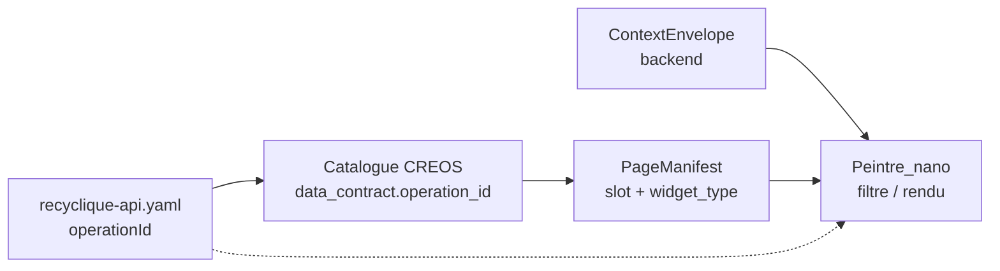

# 21 — Gouvernance contrats pour modules optionnels

**Statut :** brouillon normatif du pack `references/protocole-modules-recyclique/`  
**Date :** 2026-05-20  
**Owner lacune :** **L-11** (CI CREOS / exigences avant merge manifests)  
**Audience :** dev, agents Cursor, relecteur PR — **après** [`04-MOD-protocole-front-creos.md`](04-MOD-protocole-front-creos.md) §2.1 ; **avant** ou en parallèle de [`06-MOD-cookbook-nouveau-module-optionnel.md`](06-MOD-cookbook-nouveau-module-optionnel.md) Phase 1  
**Objectif :** synthèse **opérationnelle** de la gouvernance OpenAPI / CREOS / ContextEnvelope **vue modules** : quoi est normatif, quoi vérifier avant merge, où est la vérité — **sans** recopier le pivot BMAD ni le pas à pas du cookbook.

**Règle `refs_first` :** la norme complète vit dans l’artefact Story **1.4** ; ce fichier en extrait les règles **utiles au pack modules** et les relie à Epic **10** (CI backlog).

---

## 1. Documents normatifs (ne pas dupliquer ici)

| Rôle | Chemin | Usage pack |
|------|--------|------------|
| **Pivot gouvernance** (AR39, HITL, drift, reviewable vs démo) | [`references/artefacts/2026-04-02_04_gouvernance-contractuelle-openapi-creos-contextenvelope.md`](../artefacts/2026-04-02_04_gouvernance-contractuelle-openapi-creos-contextenvelope.md) | Référence unique pour toute question « qui fait foi » |
| **Story fermée** | [`_bmad-output/implementation-artifacts/1-4-fermer-la-gouvernance-contractuelle-openapi-creos-contextenvelope.md`](../../_bmad-output/implementation-artifacts/1-4-fermer-la-gouvernance-contractuelle-openapi-creos-contextenvelope.md) | AC, traçabilité, livrables |
| **Index dépôt contrats** | [`contracts/README.md`](../../contracts/README.md) | Zones `openapi/`, `creos/`, semver draft, journal `operationId` (B4) |
| **Schémas CREOS** | [`contracts/creos/schemas/README.md`](../../contracts/creos/schemas/README.md) | `widget-declaration.schema.json`, distinction déclaration vs slot |
| **Spec contexte / permissions** (amont 1.4) | [`references/artefacts/2026-04-02_03_spec-multi-contextes-invariants-autorisation-v2.md`](../artefacts/2026-04-02_03_spec-multi-contextes-invariants-autorisation-v2.md) | ContextEnvelope, clés permission — **backend** fait foi |
| **Écarts OpenAPI `module-config`** (L-04) | [`18-MOD-config-modules-crosswalk.md`](18-MOD-config-modules-crosswalk.md) *(prévu)* | Fusion brouillon → `recyclique-api.yaml` — **pas** re-documenté ici |

**Procédure d’implémentation module (fichiers, gates G1) :** uniquement [`06-MOD-cookbook-nouveau-module-optionnel.md`](06-MOD-cookbook-nouveau-module-optionnel.md) **Phase 1** — ce document ne reprend **pas** la checklist 1.1–1.9 du cookbook.

---

## 2. Hiérarchie AR39 — lecture modules

Ordre d’interprétation pour tout slice / workflow step / domaine Peintre :

```text
OpenAPI  >  ContextEnvelope  >  NavigationManifest  >  PageManifest  >  UserRuntimePrefs
```

| Niveau | Ce que le module consomme | Règle pack |
|--------|---------------------------|------------|
| **OpenAPI** | `operationId`, schémas réponses, erreurs HTTP | Writer **Recyclique** ; fichier canonique `contracts/openapi/recyclique-api.yaml` |
| **ContextEnvelope** | Site, caisse, droits effectifs, signaux fraîcheur | **Normatif serveur** ; UI = projection (pas de réécriture sécurité) |
| **Navigation / Page manifests** | Routes exposées, slots, `widget_type` | **Normatif** sous `contracts/creos/manifests/` une fois promu ; sinon démo `peintre-nano/` |
| **UserRuntimePrefs** | Densité, thème, choix UI non métier | **Dernier** — ne contredit jamais l’amont ; **pas** activation `module_key` |

**Règle d’or modules :** un manifest ou un widget **ne crée pas** de route métier, permission ou page absente des contrats amont (confirmé Story 1.4 / Peintre_nano borné).

Alignement détaillé front : [`04-MOD-protocole-front-creos.md`](04-MOD-protocole-front-creos.md) §2.1–2.2.

---

## 3. Deux zones de vérité (reviewable vs démo)

Synthèse du pivot **§2.3** — indispensable avant toute PR module.

| Zone | Emplacement | `data_contract.operation_id` |
|------|-------------|------------------------------|
| **Reviewable / commanditaire** | `contracts/openapi/`, `contracts/creos/manifests/`, `contracts/creos/schemas/` | **Obligatoire** : id présent dans `recyclique-api.yaml` (caractère pour caractère) |
| **Démo / mock / Vitest** | `peintre-nano/public/manifests/`, `peintre-nano/src/fixtures/` | Peut référencer une op **pas encore** dans le YAML **si** explicitement **non normatif** |
| **Code généré** | `contracts/openapi/generated/`, `peintre-nano/src/generated/openapi/` | **Copies dérivées** — corrections via YAML puis `npm run generate` |

**Promotion (§1 bis pivot) :** dès qu’un slice est **partagé** ou **officiel** (Epic 4+, second consommateur, prod) → publier sous `contracts/creos/manifests/` et **compléter le YAML** dans la **même** série de commits. Les seuls fichiers Epic 3 sous `peintre-nano/` ne sont **pas** migrés rétroactivement sans besoin produit.

---

## 4. Chaîne contrat module (vue pack)

Alignée PRD §4.2 et pilote Epic 4 — **points de contrôle gouvernance** uniquement :



| Maillon | Levier gouvernance | Anti-pattern |
|---------|-------------------|--------------|
| OpenAPI | `operationId` stable, convention `recyclique_<domaine>_<verbe>` | Renommage sans B4 (refs + CHANGELOG ou co-PR) |
| CREOS catalogue | `widget-declaration.schema.json`, `source` ↔ tags OpenAPI | `operation_id` fantôme sur lot reviewable |
| Page / navigation | JSON Schema ingest 3.2 | Second manifest pour alias déjà couvert par runtime |
| ContextEnvelope | Réponses API Epic 2.x | Permission recalculée dans le widget |
| Runtime | Registre 3.3, fallbacks 3.6 | Routes/pages inventées hors manifest commanditaire |

---

## 5. `operationId` et `data_contract` (politique B4)

| Situation | Exigence |
|-----------|----------|
| Nouvelle opération module | Ajouter dans `recyclique-api.yaml` **avant** ou **avec** le catalogue CREOS reviewable |
| Référence CREOS reviewable | `data_contract.operation_id` **==** `operationId` OpenAPI |
| Phase draft `0.x` | Renommage **autorisé** si **même PR** met à jour refs, tests contract, doc **ou** ligne journal [`contracts/README.md`](../../contracts/README.md) |
| Post-stabilisation | Dépréciation documentée ou semver **major** |
| Codegen | `cd contracts/openapi && npm run generate` après tout changement YAML reviewable |

**Revue PR `contracts/` :** Strophe tant qu’équipe réduite ; réviser à l’ouverture du dépôt (pivot §0).

---

## 6. ContextEnvelope et modules

- **Propriétaire :** Recyclique (calcul, persistance, exposition API).
- **Contrat :** schémas / réponses dans OpenAPI (pas de second fichier source parallèle).
- **UI module :** consomme la projection pour **filtrer** navigation, masquer widgets, respecter step-up — **sans** devenir source de vérité sécurité (cohérent spec **1.3**).
- **Activation `module_key` :** signal **backend** (snapshot, `module-config`, fusion serveur) — **pas** `UserRuntimePrefs` ni `localStorage` comme vérité (Story 4.5, registre `05`).

Détail écarts API config : fichier **`18-config-modules-crosswalk`** (L-04), pas ce document.

---

## 7. Avant merge — checklist pack (owner L-11)

À appliquer sur **toute PR** touchant un **lot reviewable** module (`contracts/` + manifests promus). Complète la gate **G1** du cookbook **sans** la remplacer.

### 7.1 Contrats reviewables

| # | Critère | Vérification |
|---|---------|--------------|
| G1 | Chaque `data_contract.operation_id` du lot reviewable existe dans `recyclique-api.yaml` | Test contract slice (`creos-*-manifests-*.test.ts`) ou `recyclique-openapi-governance.test.ts` |
| G2 | Aucun `operationId` dupliqué dans le YAML | `recyclique-openapi-governance.test.ts` |
| G3 | Si YAML modifié : `contracts/openapi/generated/recyclique-api.ts` régénéré et versionné | `npm run generate` dans `contracts/openapi/` |
| G4 | Manifests JSON valident `widget-declaration.schema.json` (et schémas page/nav si applicable) | Vitest contract du slice |
| G5 | Pas de secret / PII réelle dans les exemples | Pivot §7 |
| G6 | Renommage `operationId` : politique **B4** respectée | Journal ou co-mise à jour refs |
| G7 | `contracts/README.md` mis à jour si nouveau lot sous `creos/manifests/` | Tableau manifests du README |
| G8 | Pas d’édition manuelle de fichiers `generated/` pour « corriger » le contrat | Drift interdit |

### 7.2 Cohérence module (hors duplication cookbook)

| # | Critère | Renvoi |
|---|---------|--------|
| G9 | Spec signaux métier datée si slice avec états UX (bandeau, KPIs, etc.) | Artefact type `2026-04-02_07_*` ; cookbook §1.1 |
| G10 | `module_key` dans registre `05` si activation par site | [`05-MOD-registre-module-key.md`](05-MOD-registre-module-key.md) |
| G11 | Pas de deuxième vérité composition (fixtures + `contracts/` pour le même slice officiel) | §3 ci-dessus |

### 7.3 Revue humaine

| # | Critère |
|---|---------|
| G12 | Relecteur confirme : lot **reviewable** (pas présenté comme démo) |
| G13 | Écarts AR39 ou ops fantômes listés dans [`09-MOD-lacunes-et-questions-ouvertes.md`](09-MOD-lacunes-et-questions-ouvertes.md) si non résolus |

---

## 8. État aujourd’hui vs Epic 10 (CI)

| Couche | Aujourd’hui (hors Epic 10) | Cible Epic 10 (backlog) |
|--------|----------------------------|-------------------------|
| **Règles** | Story **1.4** done ; pivot + ce fichier | Stories **10.1**–**10.3** : CI minimale, chaîne OpenAPI→généré→front, validation CREOS |
| **Tests locaux** | `peintre-nano/tests/contract/` — `recyclique-openapi-governance.test.ts`, `creos-bandeau-live-manifests-4-1.test.ts`, README contract | Étendre à tous manifests reviewables ; Spectral / drift si documenté |
| **Merge bloquant** | **Discipline manuelle** + Vitest en local / PR | **Bloquer merge** sur dérive `contracts/` et `operation_id` reviewables (pivot §3, Story **10.3** AC) |
| **`module-config` OpenAPI** | Brouillon `config-modules-site-id/` — **pas** dans YAML canonique (L-04) | Fusion T-MOD-3 → voir `18-crosswalk` |

**Ce que le pack exige déjà (avant CI Epic 10) :** exécuter les tests contract pertinents (`npm run test` dans `peintre-nano/` incluant `tests/contract/`) sur toute PR `contracts/` ; traiter un échec Vitest comme **bloquant** pour le merge, même sans pipeline GitHub.

**Ce que Epic 10 ajoutera :** automatisation des mêmes règles (NFR28, AR18, AR20, FR73) — pas de nouvelle sémantique AR39.

Références planning : [`_bmad-output/planning-artifacts/epics.md`](../../_bmad-output/planning-artifacts/epics.md) Epic 10, stories **10.1**–**10.3**.

---

## 9. Peintre_nano — rappel borné (modules)

**Autorisé :** valider, fusionner, filtrer, rejeter, rendre, fallbacks documentés.  
**Interdit :** routes métier, permissions, pages **absentes** des contrats commanditaires.  
**Types / fixtures :** dérivés ou mocks jusqu’à **Convergence 1** (branchement client réel + codegen).

Détail checklist runtime : [`04-MOD-protocole-front-creos.md`](04-MOD-protocole-front-creos.md) §6–§12 — pas de recopie ici.

---

## 10. Extensions futures (cadre minimal)

Multi-déploiement, modules tiers, admin centralisé : **mêmes** règles — aucune injection route/permission/page sans contrats reviewables. Arbitrages futurs → artefact daté `references/artefacts/` ou ADR, pas élargissement implicite du pivot (pivot §8).

Post-v2 marketplace : citation uniquement — [`_bmad-output/planning-artifacts/architecture/post-v2-hypothesis-marketplace-modules.md`](../../_bmad-output/planning-artifacts/architecture/post-v2-hypothesis-marketplace-modules.md).

---

## 11. Anti-patterns (revue PR module)

| Anti-pattern | Impact |
|--------------|--------|
| `operation_id` CREOS reviewable sans `operationId` YAML | Casse AR39 ; échec CI future **10.3** |
| Manifest officiel uniquement sous `peintre-nano/fixtures/` | Pas de vérité versionnée équipe |
| Édition manuelle `generated/*.ts` | Drift |
| Toggle module via `localStorage` seul | Violation hiérarchie / activation backend |
| Copier sections du pivot ou du cookbook dans le pack | Utiliser liens `refs_first` |

Liste front élargie : [`04-MOD-protocole-front-creos.md`](04-MOD-protocole-front-creos.md) §13.

---

## 12. Traçabilité

| Source | Sections pack |
|--------|---------------|
| Story **1.4** | §1, §2, §5, §8 |
| Pivot `2026-04-02_04_*` | §2–§6, §10 |
| `contracts/README.md` | §5, §7.1 G7 |
| [`04-MOD-protocole-front-creos.md`](04-MOD-protocole-front-creos.md) | §2, §9 |
| [`06-cookbook`](06-MOD-cookbook-nouveau-module-optionnel.md) Phase 1 | §1, §7 (renvoi uniquement) |
| Epic **10** (`epics.md`) | §8 |
| Lacune **L-11** | §7, §8 — clôture partielle (règles + checklist ; CI = Epic 10) |

---

## 13. Liens rapides

| Besoin | Fichier |
|--------|---------|
| Norme complète AR39 / HITL | [Pivot gouvernance](../artefacts/2026-04-02_04_gouvernance-contractuelle-openapi-creos-contextenvelope.md) |
| Pas à pas nouveau module | [06-cookbook Phase 1](06-MOD-cookbook-nouveau-module-optionnel.md#phase-1--contrat-métier-et-openapi-story-4-1) |
| Checklist front slice | [04-protocole-front-creos](04-MOD-protocole-front-creos.md) |
| Écarts `module-config` / OpenAPI | `18-config-modules-crosswalk` *(prévu)* |
| Tests contract locaux | [`peintre-nano/tests/contract/README.md`](../../peintre-nano/tests/contract/README.md) |
| Lacunes résiduelles | [09-lacunes](09-MOD-lacunes-et-questions-ouvertes.md) §3 (**L-11**) |

---

_Gouvernance contrats — pack protocole modules. Synthèse L-11 ; pivot Story 1.4 inchangé. Ne pas confondre avec le cookbook Phase 1 ni avec la promotion BMAD post-HITL._
