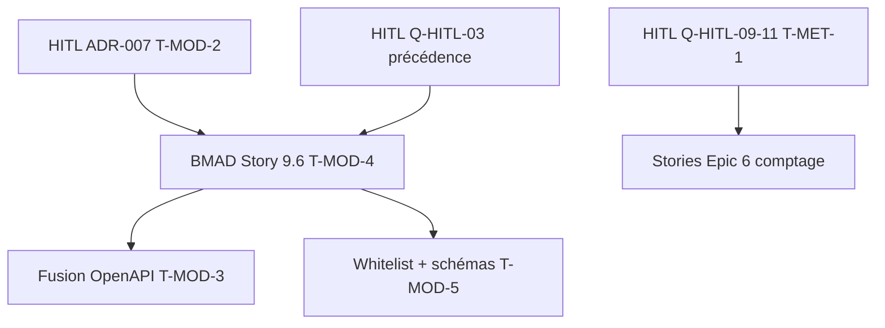

# 22 — Pont exécutable dossier architecte ↔ pack modules

**Date :** 2026-05-20  
**Audience :** architecte externe, Strophe (HITL), agents Cursor, développeurs  
**Rôle :** tableau **exécutable** des TODO **T-MOD-1…5**, **T-MET-1** et **T-PEINT-1** (définis dans [`references/dossier-architecte-externe-v2/07-ARCH-todos-et-questions-architecte.md`](../dossier-architecte-externe-v2/07-ARCH-todos-et-questions-architecte.md)) → fichiers pack, statut documentaire, prochaine action **HITL** ou **BMAD**, owner humain.

**Hors périmètre :** procédure pas à pas « créer un module » → [`06-MOD-cookbook-nouveau-module-optionnel.md`](06-MOD-cookbook-nouveau-module-optionnel.md) uniquement.

**Stratégie `refs_first` :** les chemins `_bmad-output/planning-artifacts/` et `_bmad-output/implementation-artifacts/` sont des **sources de lecture** (sprint, epics, stories) ; ce fichier **ne promouvoit pas** vers BMAD ni `contracts/`. Matrice lacunes ↔ stories : [`15-MOD-matrice-gaps-bmad-story-9-6.md`](15-MOD-matrice-gaps-bmad-story-9-6.md) · inventaire HITL : [`09-MOD-lacunes-et-questions-ouvertes.md`](09-MOD-lacunes-et-questions-ouvertes.md).

**Bouclage architecte (2026-05-20) :** [`references/artefacts/2026-05-20_04_reponse-architecte-bouclage-modules-v2.md`](../artefacts/2026-05-20_04_reponse-architecte-bouclage-modules-v2.md) (normatif) · [`2026-05-20_05_notes-architecte-loup-de-mer-modules-v2.md`](../artefacts/2026-05-20_05_notes-architecte-loup-de-mer-modules-v2.md) (primordial agents). Recoupe état impl. : [`../dossier-architecte-externe-v2/06-ARCH-etat-implementation-et-backlog.md`](../dossier-architecte-externe-v2/06-ARCH-etat-implementation-et-backlog.md) (`06_reco`).

**Instantané sprint (recoupe obligatoire) :** [`_bmad-output/implementation-artifacts/sprint-status.yaml`](../../_bmad-output/implementation-artifacts/sprint-status.yaml) — clé racine **`last_updated` : 2026-04-23** (vérifier avant exécution BMAD).

---

## Tableau exécutable T-MOD / T-MET

| ID | Sujet (dossier archi ch. 07) | Fichier(s) pack — norme doc | Statut doc pack | Lacune pack | Prochaine action | Owner humain |
|----|------------------------------|----------------------------|-----------------|-------------|------------------|--------------|
| **T-MOD-1** | Protocole modules unifié | [`03-MOD-protocole-backend.md`](03-MOD-protocole-backend.md) §6 C.4 · [`04-MOD-protocole-front-creos.md`](04-MOD-protocole-front-creos.md) §8.0 · [`05`](05-MOD-registre-module-key.md) · [`06`](06-MOD-cookbook-nouveau-module-optionnel.md) | **Livré** — convention back **rédigée** (bouclage 04 B.1) | **L-09 OK** doc | **HITL** : valider protocole unique (**Q-HITL-06**) ; promotion addendum PRD §4.2 post-relecture | **Strophe** |
| **T-MOD-2** | ADR réconciliation v0.1 ↔ v2 | [`07-MOD-adr-reconciliation-v01-v02.md`](07-MOD-adr-reconciliation-v01-v02.md) · BMAD [`2026-05-20-adr-007-…`](../../_bmad-output/planning-artifacts/architecture/2026-05-20-adr-007-reconciliation-modularite-v01-v2.md) | **Livré** — ADR **Accepted** 2026-05-20 | **L-03** clos | — | **Strophe** |
| **T-MOD-3** | Fusion OpenAPI `module-config/{module_key}` | [`recyclique-api.yaml`](../../contracts/openapi/recyclique-api.yaml) · [`18-MOD`](18-MOD-config-modules-crosswalk.md) | **Livré** — fusion 2026-05-20 ; standalone **DEPRECATED** | **L-04** clos | Tests contractuels IDOR/409 ; déprécier route toggle après **9.6** | **Dev API** |
| **T-MOD-4** | Story **9.6** config admin | Seed [`9-6-config-admin-simple-modules.md`](../../_bmad-output/implementation-artifacts/9-6-config-admin-simple-modules.md) | **Seed livré** ; impl. Peintre **backlog** | **L-08** | **dev-story** 9.6 : UI `/admin/modules`, merge PG, bascule bandeau → `module-config` | **Dev full-stack** |
| **T-MOD-5** | Registre `module_key` commun | [`05-MOD-registre-module-key.md`](05-MOD-registre-module-key.md) | **Livré** — pilote `kpi-live-banner` en code + schema | **L-06** (autres cles) | Promouvoir cles **actif** + schemas JSON ; aligner `registry.py` | **Dev API** |
| **T-MET-1** | Module comptage pièces/billets (clôture caisse) | [`08-MOD-exemple-pilote-comptage-pieces-billets.md`](08-MOD-exemple-pilote-comptage-pieces-billets.md) · [`02-MOD-taxonomie-types-de-modules.md`](02-MOD-taxonomie-types-de-modules.md) §4.5 · [`04-MOD-protocole-front-creos.md`](04-MOD-protocole-front-creos.md) §9 | **Fiche livrée** (brouillon) ; impl. **non lancée** | **L-10** | **HITL** : **Q-HITL-09**–**11** (flow clôture, Paheko, skip si module off) ; **Architecte** : valider ou noter écart sur `08` ; **BMAD** : stories Epic 6 comptage **après** HITL — pas de `create-story` avant ; Epic 6 **done** = socle caisse, pas ce module | **Architecte externe** · **Strophe** |
| **T-PEINT-1** | Gardien du seuil — conscience d'affichage Peintre | [`04-MOD-protocole-front-creos.md`](04-MOD-protocole-front-creos.md) §17 · [`05-ARCH-frontend-peintre-creos-contrats.md`](../dossier-architecte-externe-v2/05-ARCH-frontend-peintre-creos-contrats.md) §7.4 · idée Kanban 2026-05-20 | **À cadrer** — hooks + bypass v2 | **L-16** | **HITL** : **Q-HITL-16** (hooks, outils agent) ; **impl.** réceptacles `peintre-nano` avant activation gardien ; pas de story BMAD avant cadrage | **Strophe** · **Architecte** |

---

## Exécution agent / dev — renvoi unique

| Besoin | Aller à |
|--------|---------|
| Créer, activer, brancher un module optionnel (fichiers, ordre commits, JSON vs tables, Paheko) | [`06-MOD-cookbook-nouveau-module-optionnel.md`](06-MOD-cookbook-nouveau-module-optionnel.md) |
| Choisir slice vs workflow step vs domaine Peintre | [`01-MOD-matrice-choix-modularite.md`](01-MOD-matrice-choix-modularite.md) · [`02-MOD-taxonomie-types-de-modules.md`](02-MOD-taxonomie-types-de-modules.md) |
| Pilote bandeau (preuve chaîne) | Epic **4** **done** — [`20-MOD-peintre-code-refs-bandeau-live.md`](20-MOD-peintre-code-refs-bandeau-live.md) · stories `4-1`…`4-6b` dans `sprint-status.yaml` |
| Questions ouvertes, promotion BMAD | [`09-MOD-lacunes-et-questions-ouvertes.md`](09-MOD-lacunes-et-questions-ouvertes.md) |

---

## Chaîne de dépendances (lecture rapide)

**Ordre suggéré (bouclage 04 §D, DEC-CREOS) :** (1) **T-MOD-2** ADR-007 → Accepted (HITL) · (2) **T-MOD-3** fusion OpenAPI (**bloque 2e module**) · (3) **T-MOD-1** validation HITL convention (doc livré) · (4) **T-MOD-5** / **T-MOD-4** (9.6) · (5) **T-MET-1** après HITL `08`.

---

## Références `refs_first` (ne pas promouvoir depuis ce fichier)

| Document BMAD / repo | Usage |
|----------------------|--------|
| [`_bmad-output/implementation-artifacts/sprint-status.yaml`](../../_bmad-output/implementation-artifacts/sprint-status.yaml) | `epic-4` **done** · `epic-9` **backlog** · `9-6` **backlog** |
| [`_bmad-output/planning-artifacts/epics.md`](../../_bmad-output/planning-artifacts/epics.md) | AC Story **9.6** · Epic **6** clôture |
| [`references/dossier-architecte-externe-v2/06-ARCH-etat-implementation-et-backlog.md`](../dossier-architecte-externe-v2/06-ARCH-etat-implementation-et-backlog.md) | Synthèse epics pour revue architecte |
| [`references/dossier-architecte-externe-v2/05-ARCH-frontend-peintre-creos-contrats.md`](../dossier-architecte-externe-v2/05-ARCH-frontend-peintre-creos-contrats.md) | Pipeline CREOS / AR39 |
| [`references/ou-on-en-est.md`](../ou-on-en-est.md) | Fraîcheur pivot produit |

---

_Retour pack : [index.md](index.md) · Retour dossier architecte : [07-ARCH-todos-et-questions-architecte.md](../dossier-architecte-externe-v2/07-ARCH-todos-et-questions-architecte.md)_
