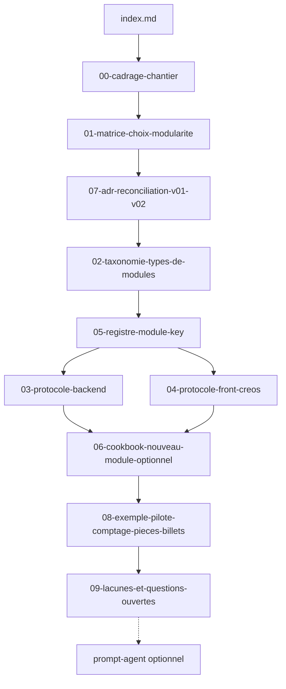

# Index — pack protocole modules Recyclique

**Date :** 2026-05-20  
**Audience :** développeurs, agents Cursor, architecte — **après** lecture du dossier architecte (ch. 05–07 minimum).  
**Rôle :** porte d'entrée du pack `references/protocole-modules-recyclique/` — protocole opérationnel « créer / brancher / activer un module optionnel » v2, sans réécrire le PRD ni les stories BMAD.

**Convention de nommage :** après le numéro d'ordre, le code **`MOD`** = chapitre de ce pack (protocole / modules). Le dossier plateforme utilise **`ARCH`** — voir [`../dossier-architecte-externe-v2/`](../dossier-architecte-externe-v2/index.md). Ex. `06-MOD-cookbook-nouveau-module-optionnel.md`. Fichiers sans préfixe numérique (`index.md`, `qa2-*.md`, `prompt-agent-*.md`) : pas de code.

**Meta planificateur (hors ordre consommateur) :** [00-MOD-plan-redaction-modules.md](00-MOD-plan-redaction-modules.md) (rédaction clos) · [00-MOD-plan-enrichissement-modules.md](00-MOD-plan-enrichissement-modules.md) (enrichissement v1 clos) · [00-MOD-plan-enrichissement-v2-2026-05-20.md](00-MOD-plan-enrichissement-v2-2026-05-20.md) (cohérence v2) · [qa2-plan-enrichissement.md](qa2-plan-enrichissement.md) · [qa2-rapport-final-v2.md](qa2-rapport-final-v2.md) (**GO** QA2 **97 %**, cycle 4 v2) · [qa2-rapport-final.md](qa2-rapport-final.md) (historique cycles 1–3).

---

## Abstract

Recyclique v2 compose l'UI via **Peintre_nano** + manifests **CREOS**, expose l'API via **OpenAPI**, persiste l'activation par site via **JSON `site_id` / `module_key`** ([`references/config-modules-site-id/`](../config-modules-site-id/)), et synchronise la compta via la **chaîne outbox Paheko**. Un récit **v0.1** (fév. 2026 : `module.toml`, `ModuleBase`, EventBus Redis) coexiste encore dans les artefacts ; ce pack **réconcilie** v0.1 ↔ v2 et donne des **checklists** back + front + un **cookbook** pas à pas.

**Critère de succès (chantier rédactionnel) :** un lecteur ouvre ce fichier → enchaîne jusqu'au [06-MOD-cookbook-nouveau-module-optionnel.md](06-MOD-cookbook-nouveau-module-optionnel.md) et sait quels fichiers créer (back, front, contrats), comment activer par `site_id`, quand JSON config vs tables métier, comment insérer une **étape de workflow** Peintre — **sans** parcourir quinze dossiers dispersés. Les **vérités produit** restent dans `_bmad-output/` (citation `refs_first`, pas copie).

**État du pack (2026-05-20, post-HITL) :** **GO architecture** — ADR-007 **Accepted** ; OpenAPI + handler `module-config` (**T-MOD-3** clos) ; convention back + patron CREOS promus. Reco : [`../artefacts/2026-05-20_06_reco-hitl-post-bouclage-modules-v2.md`](../artefacts/2026-05-20_06_reco-hitl-post-bouclage-modules-v2.md). **QA2 global :** [`qa2-rapport-global-chantier-modules-2026-05-20.md`](qa2-rapport-global-chantier-modules-2026-05-20.md) (**96 % GO**). **P1 :** Story **9.6**, registre schémas (`T-MOD-5`), durcissement code (404 membership, If-Match, tests). Lacunes : [`09-MOD-lacunes-et-questions-ouvertes.md`](09-MOD-lacunes-et-questions-ouvertes.md).

**Prérequis lecture externe :**

- [Dossier architecte externe v2](../dossier-architecte-externe-v2/index.md) — surtout [05-ARCH](../dossier-architecte-externe-v2/05-ARCH-frontend-peintre-creos-contrats.md), [07-ARCH](../dossier-architecte-externe-v2/07-ARCH-todos-et-questions-architecte.md) (T-MOD-*).
- **Réponses architecte + exécution (2026-05-20) :** [03 revue 1](../artefacts/2026-05-20_03_reponse-architecte-branchements-modules-v2.md) (GO sous réserves) → [04 bouclage](../artefacts/2026-05-20_04_reponse-architecte-bouclage-modules-v2.md) (**GO final**) → **[05 loup de mer](../artefacts/2026-05-20_05_notes-architecte-loup-de-mer-modules-v2.md) (primordial dev/agents)**.
- [Ou on en est](../ou-on-en-est.md) — pivot BMAD 2026-03-31, Epic 4 (preuve modulaire bandeau live), backlog epics 9–21.

---

## Glossaire minimal

| Terme | Rôle dans le protocole modules |
|-------|--------------------------------|
| **Recyclique** | API + données métier terrain ; enregistrement routes/services, events, sync Paheko. |
| **Paheko** | Source comptable officielle ; tout module à impact compta emprunte la **chaîne outbox** (cf. dossier architecte ch. 04). |
| **Peintre_nano** | Moteur de composition UI agnostique métier ; registre widgets/slots, rendu déclaratif. |
| **CREOS** | Grammaire des manifests UI (Command, Rule, Event, Object, State) — slots, widgets, flows, workflow steps. Définition complète : [dossier architecte ch. 01 §6](../dossier-architecte-externe-v2/01-ARCH-contexte-metier-et-vision-v2.md). |
| **`module_key`** | Identifiant stable d'un module optionnel (liste blanche, registre pack `05-MOD-registre-module-key.md`). |
| **`site_id`** | Instance ressourcerie ; clé d'activation JSON (ADR-001 config-modules-site-id). |
| **Slice CREOS** | Brique UI transverse (ex. bandeau live) — pilote #1 Epic 4. |
| **Workflow step** | Étape dans un flow Peintre (ex. comptage pièces/billets à la clôture) — pilote #2. |
| **Chaîne 7 briques (PRD §4.2)** | Enchaînement normatif back → contrat → manifest → runtime → rendu → activation → fallback (stories `4-1`…`4-6b`). |
| **AR39** | Hiérarchie de vérité contractuelle : OpenAPI > ContextEnvelope > manifests > prefs — [dossier architecte ch. 02 §4](../dossier-architecte-externe-v2/02-ARCH-architecture-globale-et-frontieres.md). |
| **v0.1 (legacy design)** | `module.toml`, `ModuleBase`, loader `config.toml`, EventBus Redis — **à réconcilier**, pas fil conducteur v2. |

---

## Ordre de lecture (consommateur)

Parcours **linéaire** pour comprendre puis exécuter ; le **livrable d'exécution** est le cookbook (`06`). Les numéros = ordre du [plan §1](00-MOD-plan-redaction-modules.md).

| # | Fichier | Objectif (1 ligne) | Statut |
|---|---------|-------------------|--------|
| **1** | [index.md](index.md) | Porte d'entrée (ce document). | **Livré** |
| **2** | [00-MOD-cadrage-chantier.md](00-MOD-cadrage-chantier.md) | Périmètre, hors-scope, flux recherche/artefacts → pack, critères de succès. | **Livré** |
| **3** | [01-MOD-matrice-choix-modularite.md](01-MOD-matrice-choix-modularite.md) | Tableau v0.1 / v2 / abandonné / post-v2 par brique (manifeste, activation, hooks, UI). | **Livré** |
| **4** | [07-MOD-adr-reconciliation-v01-v02.md](07-MOD-adr-reconciliation-v01-v02.md) | ADR-007 : TOML/`ModuleBase` vs CREOS + JSON serveur + build-time. | **Accepted** (HITL 2026-05-20) |
| **5** | [02-MOD-taxonomie-types-de-modules.md](02-MOD-taxonomie-types-de-modules.md) | Types (slice, domaine Peintre, module métier back, config-only, workflow step…). | **Livré** |
| **6** | [05-MOD-registre-module-key.md](05-MOD-registre-module-key.md) | Liste blanche `module_key` : statut, dépendances, schéma JSON, ops OpenAPI. | **Livré** (2026-05-20) |
| **7** | [03-MOD-protocole-backend.md](03-MOD-protocole-backend.md) | Checklist back : routes, BDD, events, sync Paheko, feature flags, package. | **Livré** |
| **8** | [04-MOD-protocole-front-creos.md](04-MOD-protocole-front-creos.md) | Checklist front : manifests, slots, flows, `data_contract.operation_id`, fallbacks. | **Livré** |
| **9** | [06-MOD-cookbook-nouveau-module-optionnel.md](06-MOD-cookbook-nouveau-module-optionnel.md) | **Livrable principal** — pas à pas unifié back + front + contrats + `site_id`. | **Livré** |
| **10** | [08-MOD-exemple-pilote-comptage-pieces-billets.md](08-MOD-exemple-pilote-comptage-pieces-billets.md) | Fiche pilote #2 : flow clôture → comptage → Paheko (sans impl). | **Livré** (2026-05-20) |
| **11** | [09-MOD-lacunes-et-questions-ouvertes.md](09-MOD-lacunes-et-questions-ouvertes.md) | Lacunes, HITL Strophe, TODO T-MOD-* / promotion BMAD différée. | **Livré** (2026-05-20) |
| **11b** | [13-MOD-idees-kanban-modules-liens.md](13-MOD-idees-kanban-modules-liens.md) | Pont 5 idées Kanban → statut v2/post-v2, pack, L-ID (sans duplication fiches). | **Livré** (2026-05-20) |
| **12** | [prompt-agent-chantier-modules.md](prompt-agent-chantier-modules.md) | Prompt ultra-opérationnel phases A→D pour agents (cadrage → contrats → back → front). | **Livré** (2026-05-20) |

## Lecture enrichie (`10`–`22`)

**Placement :** après protocoles `01`–`05` (+ `07-adr`), **avant** le cookbook [`06`](06-MOD-cookbook-nouveau-module-optionnel.md) — synthèses et ponts **readonly** ; pas de pas à pas (→ `06`).

| Fichier | Objectif (1 ligne) | Statut |
|---------|-------------------|--------|
| [10-MOD-cartographie-sources-modules.md](10-MOD-cartographie-sources-modules.md) | Tableau unique source → pack → couverture ; hub **L-03…L-15**. | **Livré** |
| [11-MOD-synthese-recherches-modularite.md](11-MOD-synthese-recherches-modularite.md) | Distillat recherche Perplexity/BMAD → matrice `01` / ADR (readonly). | **Livré** |
| [12-MOD-index-transcripts-modularite.md](12-MOD-index-transcripts-modularite.md) | Index 5 UUID transcripts Cursor (modules imbriqués, config, etc.). | **Livré** |
| [13-MOD-idees-kanban-modules-liens.md](13-MOD-idees-kanban-modules-liens.md) | Pont 5 idées Kanban → statut v2/post-v2, pack, **L-15**. | **Livré** |
| [14-MOD-marketplace-post-v2-fiche-citation.md](14-MOD-marketplace-post-v2-fiche-citation.md) | Citation post-v2 **L-14** — interfaces à ne pas figer ; hors procédure v2. | **Livré** |
| [15-MOD-matrice-gaps-bmad-story-9-6.md](15-MOD-matrice-gaps-bmad-story-9-6.md) | Matrice **L-03…L-15** × story/epic × sprint — hub Story **9.6** / T-MOD-4. | **Livré** |
| [16-MOD-lien-operations-speciales-pattern.md](16-MOD-lien-operations-speciales-pattern.md) | Pattern prompt ops spéciales (A→E) ↔ modules ; **exécution = `06` uniquement**. | **Livré** |
| [17-MOD-outillage-cursor-modules-2026-05-20.md](17-MOD-outillage-cursor-modules-2026-05-20.md) | Outillage Cursor/BMAD mai 2026 — phases A→D, limites agents. | **Livré** |
| [18-MOD-config-modules-crosswalk.md](18-MOD-config-modules-crosswalk.md) | Crosswalk config-modules ↔ OpenAPI canonique — owners **L-04**, **L-06**. | **Livré** |
| [19-MOD-checklist-v0-1-vs-pack.md](19-MOD-checklist-v0-1-vs-pack.md) | Crosswalk checklist design v0.1 → statuts pack ; **L-03** clos (ADR **Accepted**). | **Livré** |
| [20-MOD-peintre-code-refs-bandeau-live.md](20-MOD-peintre-code-refs-bandeau-live.md) | Liens **code** reviewables pilote #1 (bandeau live) — stories 4-x. | **Livré** |
| [21-MOD-gouvernance-contrats-modules.md](21-MOD-gouvernance-contrats-modules.md) | Owner **L-11** — checklist merge manifests / OpenAPI ; pivot Story **1.4**. | **Livré** |
| [22-MOD-dossier-architecte-pont-t-mod.md](22-MOD-dossier-architecte-pont-t-mod.md) | Tableau exécutable **T-MOD-1…5** / **T-MET-1** → pack, HITL, BMAD. | **Livré** |

**Lecture rapide par profil :**

| Profil | Parcours minimal |
|--------|------------------|
| **Dev / agent implémentation** | `06` ← `03` + `04` + `05-registre` ; hub `10` ; pilotes `08` / `20` si slice ou workflow step. |
| **Architecte / réconciliation** | `01` → `07-adr` (**Accepted**) → `19` → `22` (T-MOD) → `09`. |
| **Product / priorisation** | `00-cadrage` → `10-cartographie` → `09` → `15-matrice` ; alignement [07-todos architecte](../dossier-architecte-externe-v2/07-ARCH-todos-et-questions-architecte.md) via [`22`](22-MOD-dossier-architecte-pont-t-mod.md). |

**Durée indicative :** 1,5–3 h pour le pack complet (brouillon normatif livré) ; ~20 min pour ce `index.md` + cadrage + cookbook seul.

---

## Epic 4 — preuve modulaire bandeau live (sprint)

**Statut sprint (instantané pack) :** `epic-4` **done** — recouper [`sprint-status.yaml`](../../_bmad-output/implementation-artifacts/sprint-status.yaml) et [`ou-on-en-est.md`](../ou-on-en-est.md) — **`last_updated` : 2026-04-23**.

| Story | Statut sprint | Fichier `_bmad-output/implementation-artifacts/` |
|-------|---------------|--------------------------------------------------|
| **4-1** publier contrat + manifests bandeau live | **done** | [`4-1-publier-le-contrat-et-les-manifests-minimaux-du-module-bandeau-live.md`](../../_bmad-output/implementation-artifacts/4-1-publier-le-contrat-et-les-manifests-minimaux-du-module-bandeau-live.md) |
| **4-2** widget bandeau live dans registre Peintre | **done** | [`4-2-implementer-le-widget-bandeau-live-dans-le-registre-peintre-nano.md`](../../_bmad-output/implementation-artifacts/4-2-implementer-le-widget-bandeau-live-dans-le-registre-peintre-nano.md) |
| **4-3** source backend réelle + ouverture décalée | **done** | [`4-3-brancher-la-source-backend-reelle-et-les-cas-douverture-decalee.md`](../../_bmad-output/implementation-artifacts/4-3-brancher-la-source-backend-reelle-et-les-cas-douverture-decalee.md) |
| **4-4** fallbacks et rejets slice bandeau live | **done** | [`4-4-rendre-visibles-les-fallbacks-et-rejets-du-slice-bandeau-live.md`](../../_bmad-output/implementation-artifacts/4-4-rendre-visibles-les-fallbacks-et-rejets-du-slice-bandeau-live.md) |
| **4-5** toggle admin minimal bandeau live | **done** | [`4-5-ajouter-un-toggle-admin-minimal-borne-au-module-bandeau-live.md`](../../_bmad-output/implementation-artifacts/4-5-ajouter-un-toggle-admin-minimal-borne-au-module-bandeau-live.md) |
| **4-6** chaîne complète back → contrat → manifest → runtime → rendu → fallback | **done** | [`4-6-valider-la-chaine-complete-backend-contrat-manifest-runtime-rendu-fallback.md`](../../_bmad-output/implementation-artifacts/4-6-valider-la-chaine-complete-backend-contrat-manifest-runtime-rendu-fallback.md) |
| **4-6b** slice bandeau live dans app Peintre servie | **done** | [`4-6b-raccorder-le-slice-bandeau-live-dans-lapplication-peintre-nano-reellement-servie.md`](../../_bmad-output/implementation-artifacts/4-6b-raccorder-le-slice-bandeau-live-dans-lapplication-peintre-nano-reellement-servie.md) |

---

## Pilotes de référence

| Pilote | Rôle | Trace impl / spec (`refs_first`) |
|--------|------|----------------------------------|
| **#1 Bandeau live** | Template **chaîne complète** Epic 4 (slice transverse) | Stories `_bmad-output/implementation-artifacts/4-1-*.md` … `4-6b-*.md` ; **index code reviewable** [`20-MOD-peintre-code-refs-bandeau-live.md`](20-MOD-peintre-code-refs-bandeau-live.md) ; [signaux bandeau live](../artefacts/2026-04-02_07_signaux-exploitation-bandeau-live-premiers-slices.md) ; schéma [`config-modules-site-id/schemas/kpi-live-banner.v1.json`](../config-modules-site-id/schemas/kpi-live-banner.v1.json). |
| **#2 Comptage pièces/billets** | Validation **workflow step** + tables métier + Paheko | Fiche `08-exemple-pilote-*` ; Epic 6 dans `_bmad-output/planning-artifacts/epics.md` ; question [T-MET-1](../dossier-architecte-externe-v2/07-ARCH-todos-et-questions-architecte.md). |

Distinction taxonomique attendue dans `02-taxonomie` : pilote #1 ≠ pilote #2 (slice/widget vs étape de flow + persistance métier).

---

## Stratégie `refs_first` — `_bmad-output/` en source, pas en destination

| Règle | Application dans ce pack |
|-------|---------------------------|
| **Citer, ne pas promouvoir** | Chemins relatifs vers `_bmad-output/planning-artifacts/` et `_bmad-output/implementation-artifacts/` ; **aucune** copie intégrale PRD / epics / stories. |
| **Alignement, pas réécriture normative** | PRD §4.2, epics (Epic 3, 4, Story 9.6), stories `1-4`, `3-3`, `4-1`…`4-6b` = contrôle de cohérence des protocoles. |
| **Promotion post-HITL** | **Fait** : (1) ADR-007 Accepted + miroir BMAD, (2) fusion OpenAPI T-MOD-3, (3) handler `module-config`, (4) seed story 9.6. **Reste** : addendum PRD §4.2, impl. 9.6 Peintre, schémas CREOS par clé (T-MOD-5). |
| **État projet** | Pointeur dans [`references/ou-on-en-est.md`](../ou-on-en-est.md) et [`references/index.md`](../index.md) — **pas** de déplacement des stories vers `references/`. |
| **Contrats reviewables** | [`contracts/openapi/recyclique-api.yaml`](../../contracts/openapi/recyclique-api.yaml) (canonique) ; standalone module-config = **DEPRECATED**. |

### BMAD planning — extraits à lire (ne pas recopier)

| Document | Usage pack |
|----------|------------|
| [`_bmad-output/planning-artifacts/prd.md`](../../_bmad-output/planning-artifacts/prd.md) | §4.2 chaîne 7 briques ; §7 modules obligatoires v2 ; glossaire `ModuleManifest`. |
| [`_bmad-output/planning-artifacts/epics.md`](../../_bmad-output/planning-artifacts/epics.md) | Epic 3 (socle Peintre), Epic 4 (preuve modulaire), Story 9.6 (config admin), AR45/AR46. |
| [`_bmad-output/planning-artifacts/architecture/post-v2-hypothesis-marketplace-modules.md`](../../_bmad-output/planning-artifacts/architecture/post-v2-hypothesis-marketplace-modules.md) | §2–4 séparation domaines ; **citation post-v2 uniquement** — pas de procédure marketplace dans ce pack. |
| [`_bmad-output/implementation-artifacts/sprint-status.yaml`](../../_bmad-output/implementation-artifacts/sprint-status.yaml) | Grain fin statuts stories (instantané : voir [ou-on-en-est](../ou-on-en-est.md)). |

### Stories impl — inventaire minimal

| Story | Fichier (pattern sous `_bmad-output/implementation-artifacts/`) | Usage pack |
|-------|-------------------------------------------------------------------|------------|
| 1-4 | `1-4-fermer-la-gouvernance-contractuelle-openapi-creos-contextenvelope.md` | Gouvernance `operationId`, promotion manifests. |
| 3-3 | `3-3-implementer-le-registre-minimal-de-widgets-slots-et-rendu-declaratif.md` | Registre widgets / slots. |
| 4-1 … 4-6b | `4-1-publier-le-contrat-et-les-manifests-minimaux-du-module-bandeau-live.md` … `4-6b-raccorder-le-slice-bandeau-live-dans-lapplication-peintre-nano-reellement-servie.md` | Chaîne pilote #1 complète. |

## Liens hors pack (canoniques et voisins)

### Dossiers voisins — ne pas fusionner dans ce pack

| Zone | Chemin | Rôle |
|------|--------|------|
| Config modules par site | [`references/config-modules-site-id/`](../config-modules-site-id/) | Persistance JSON `site_id` + `module_key`, ADR-001, schémas, OpenAPI module-config. |
| Contrats reviewables repo | [`contracts/`](../../contracts/) | OpenAPI Recyclique, manifests CREOS **après** HITL — pas brouillon normatif du pack. |
| Recherche externe | [`references/recherche/`](../recherche/) | Nouvelles enquêtes Perplexity / IA uniquement ici. |
| Idées immatures | [`references/idees-kanban/`](../idees-kanban/) | Citation (ex. plugin-framework) — pas duplication dans `09-lacunes`. |
| Opérations spéciales (modèle prompt) | [`references/operations-speciales-recyclique/`](../operations-speciales-recyclique/) | Structure prompt ultra-opérationnel, pas contenu métier modules. |

### Réconciliation v0.1 ↔ v2 (aperçu — détail dans `01` + `07-adr`)

| Dimension | v0.1 (fév. 2026) | v2 (fil conducteur) | Traitement attendu pack |
|-----------|------------------|---------------------|-------------------------|
| Manifeste | `module.toml` (TOML) | Manifests **CREOS** JSON, build-time → `contracts/creos/` | TOML **abandonné** pour UI |
| Contrat code | `ModuleBase`, loader `config.toml` | FastAPI + feature flag / registre | Lifecycle → patterns API |
| Hooks | Redis Streams / EventBus (design `07`) | Events métier + outbox Paheko | Canal réel nommé dans `03-protocole` |
| Activation | `config.toml` par instance | Transitoire `bandeau_live_slice_enabled` → Story **9.6** + JSON ADR-001 | Une source de vérité par `site_id` |
| UI | Slots React monorepo | Peintre_nano + `data_contract.operation_id` | Template = Epic 4 |

**Sources de réconciliation obligatoires :** [`references/artefacts/2026-02-24_07_design-systeme-modules.md`](../artefacts/2026-02-24_07_design-systeme-modules.md), [`config-modules-site-id/ADR-001-configuration-modules-json-par-site.md`](../config-modules-site-id/ADR-001-configuration-modules-json-par-site.md), PRD §4.2 (lien ci-dessus).

### Artefacts et gouvernance (références)

| Document | Lien |
|----------|------|
| Design système modules v0.1 | [artefacts/2026-02-24_07_design-systeme-modules.md](../artefacts/2026-02-24_07_design-systeme-modules.md) |
| Gouvernance OpenAPI / CREOS / ContextEnvelope | [artefacts/2026-04-02_04_gouvernance-contractuelle-openapi-creos-contextenvelope.md](../artefacts/2026-04-02_04_gouvernance-contractuelle-openapi-creos-contextenvelope.md) |
| ADR stack CSS / config admin Peintre | [peintre/2026-04-01_adr-p1-p2-stack-css-et-config-admin.md](../peintre/2026-04-01_adr-p1-p2-stack-css-et-config-admin.md) |
| Décision directrice v2 | [vision-projet/2026-03-31_decision-directrice-v2.md](../vision-projet/2026-03-31_decision-directrice-v2.md) |
| Recherche modularité (échantillon) | [recherche/2026-02-24_frameworks-modules-python_perplexity_prompt.md](../recherche/2026-02-24_frameworks-modules-python_perplexity_prompt.md), [recherche/2026-02-24_frameworks-modules-python_perplexity_reponse-1.md](../recherche/2026-02-24_frameworks-modules-python_perplexity_reponse-1.md), [recherche/2026-02-24_frameworks-modules-python_perplexity_reponse-2.md](../recherche/2026-02-24_frameworks-modules-python_perplexity_reponse-2.md), [recherche/2026-02-24_frameworks-modules-python_perplexity_reponse-2-complement.md](../recherche/2026-02-24_frameworks-modules-python_perplexity_reponse-2-complement.md), [recherche/2026-03-31_brique-nano-peintre-modularite-json-ui_perplexity_reponse.md](../recherche/2026-03-31_brique-nano-peintre-modularite-json-ui_perplexity_reponse.md) |

### Bibliographie modules — Epic 6, Paheko, compta

| Sujet | Lien |
|-------|------|
| **Epic 6** (clôture caisse, pilote #2) | [`_bmad-output/planning-artifacts/epics.md`](../../_bmad-output/planning-artifacts/epics.md) — Epic 6 ; fiche pack [`08-MOD-exemple-pilote-comptage-pieces-billets.md`](08-MOD-exemple-pilote-comptage-pieces-billets.md) |
| **Migration Paheko** (intégration, specs tiers) | [`references/migration-paheko/`](../migration-paheko/index.md) |
| **Chaîne compta canonique** (snapshot → outbox → Paheko) | [`_bmad-output/planning-artifacts/architecture/cash-accounting-paheko-canonical-chain.md`](../../_bmad-output/planning-artifacts/architecture/cash-accounting-paheko-canonical-chain.md) |
| **PRD caisse × Paheko** | [`references/migration-paheko/2026-04-15_prd-recyclique-caisse-compta-paheko.md`](../migration-paheko/2026-04-15_prd-recyclique-caisse-compta-paheko.md) |

### Chantier parent et suivi TODO

| Élément | Lien |
|---------|------|
| Plan Cursor chantier | [`.cursor/plans/chantier_protocole_modules_fe3bc68e.plan.md`](../../.cursor/plans/chantier_protocole_modules_fe3bc68e.plan.md) |
| TODO architecte T-MOD-* | [dossier-architecte-externe-v2/07-ARCH-todos-et-questions-architecte.md](../dossier-architecte-externe-v2/07-ARCH-todos-et-questions-architecte.md) (T-MOD-1 → ce pack ; T-MOD-2 ADR ; T-MOD-3 fusion OpenAPI ; T-MOD-4 Story 9.6 ; T-MOD-5 registre `module_key`) |
| État impl / backlog | [dossier-architecte-externe-v2/06-ARCH-etat-implementation-et-backlog.md](../dossier-architecte-externe-v2/06-ARCH-etat-implementation-et-backlog.md) |

---

## Hors-scope explicite (ce pack)

- **Marketplace / modules tiers post-v2** — lire uniquement pour citer : `_bmad-output/planning-artifacts/architecture/post-v2-hypothesis-marketplace-modules.md`.
- **Implémentation** du module comptage (fiche + checklist dans `08`, pas de code).
- **Réécriture** `recyclique-1.4.4` ou loader TOML legacy sans décision ADR `07-adr`.
- **Publication** `doc/` (communication externe).
- **Promotion BMAD** (PRD, epics, ADR archi canonique, fusion `contracts/`) — **après validation HITL** Strophe.

---

## Registre `module_key`

Liste blanche normative : **[05-MOD-registre-module-key.md](05-MOD-registre-module-key.md)** — `kpi-live-banner` (pilote, schéma `1.0.0`), placeholders `cashflow`, `reception`, `comptage-pieces-billets`, `helloasso`, `eco-organismes` ; API générique `getSiteModuleConfig` / `patchSiteModuleConfig` ; ops données bandeau `recyclique_exploitation_getLiveSnapshot`.

---

## Ordre de rédaction (rédacteurs / agents — meta)

Aligné [plan §2](00-MOD-plan-redaction-modules.md) : Phase 0 (`index`, `00-cadrage`) → A (`01`, `07-adr`) → B (`02`, `05-registre`) → C (`03`, `04`) → D (`06`, `08`) → E (`09`, prompt optionnel, MAJ pointeurs `references/index.md`).

---

_Pack protocole modules — porte d'entrée. Ne pas confondre avec les livrables BMAD ni avec le planificateur `00-MOD-plan-redaction-modules.md`._
